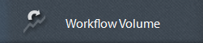

# Report predefiniti in Process Reporting {#pre-defined-reports-in-process-reporting}

 AEM Forms Process Reporting viene fornito con i seguenti report *out-of-the-box*:

* **[Processi](/help/forms/using/process-reporting/pre-defined-reports-in-process-reporting.md#p-long-running-processes-p)** Di Lunga Durata: Report di tutti  processi AEM Forms che richiedono più di un tempo specificato per il completamento

* **[Grafico](/help/forms/using/process-reporting/pre-defined-reports-in-process-reporting.md#p-process-duration-report-br-p)** durata processo: Report di un processo AEM Forms  specificato per durata

* **[Volume](/help/forms/using/process-reporting/pre-defined-reports-in-process-reporting.md#p-workflow-volume-report-p)** flusso di lavoro: Report delle istanze in esecuzione e completate del processo specificato per data

## Processi a lunga esecuzione {#long-running-processes}

Il rapporto Processi in esecuzione prolungati visualizza i  processi AEM Forms che hanno richiesto più di un tempo specificato per il completamento.

### Per eseguire un report sul processo di lunga durata {#to-execute-a-long-running-process-report-br}

1. Per visualizzare l&#39;elenco dei report predefiniti in Process Reporting, nella struttura **Process Reporting** fare clic sul nodo **Reports**.
1. Fare clic sul nodo del report **Processi in esecuzione prolungata**.

   

   Quando selezionate un rapporto, il pannello **Parametri rapporto** viene visualizzato a destra della vista ad albero.

   

   Parametri:

   * **Durata** (*obbligatorio*): Specificate una durata e un’unità di tempo. Visualizza tutti  processi AEM Forms eseguiti per più della durata specificata.
   * **Avviato dopo**  (*facoltativo*): Selezionare una data. Filtrare il rapporto per visualizzare le istanze del processo iniziate dopo la data specificata.
   * **Avviato prima**  (*facoltativo*): Selezionare una data. Filtrare il rapporto per visualizzare le istanze del processo iniziate prima della data specificata.

1. Fare clic su **Go** per eseguire il rapporto.

   Il rapporto viene visualizzato nel pannello **Report** a destra della finestra **Process Reporting**.

   

   Utilizzate le opzioni nell&#39;angolo superiore destro del pannello **Report** per eseguire le seguenti operazioni sul report.

   * **Aggiorna**: Aggiorna il report con i dati più recenti presenti nello storage
   * **Cambia colore** legenda: Seleziona e modifica il colore della legenda del rapporto
   * **Esporta in CSV**: Esportare e scaricare i dati dal rapporto in un file separato da virgole

## Rapporto sulla durata del processo {#process-duration-report-br}

Il rapporto Durata processo visualizza il numero di istanze di un processo Forms per numero di giorni in cui ciascuna istanza è stata eseguita.

### Per eseguire un report Durata processo {#to-execute-a-process-duration-report-br}

1. Per visualizzare i report predefiniti in Process Reporting, nella struttura ad albero **Process Reporting** fare clic sul nodo **Reports**.
1. Fare clic sul nodo del rapporto **Durata processi**.

   

   Quando selezionate un rapporto, il pannello **Parametri rapporto** viene visualizzato a destra della vista ad albero.

   

   Parametri:

   * **Seleziona processo**  (*obbligatorio*): Selezionate un processo AEM Forms .

1. Fare clic su **Go** per eseguire il rapporto.

   Il rapporto viene visualizzato nel pannello **Report** a destra della finestra Report processo.

   

   Utilizzate le opzioni nell&#39;angolo superiore destro del pannello **Report** per eseguire le seguenti operazioni sul report.

   * **Aggiorna**: Aggiorna il report con i dati più recenti presenti nello storage
   * **Cambia colore** legenda: Seleziona e modifica il colore della legenda del rapporto
   * **Esporta in CSV**: Esportare e scaricare i dati dal rapporto in un file separato da virgole

## Report volume flusso di lavoro {#workflow-volume-report}

Il rapporto Volume flusso di lavoro visualizza il numero di istanze attualmente in esecuzione e completate di un processo AEM Forms  per giorno di calendario.

### Per eseguire un report sul volume del flusso di lavoro {#to-execute-a-workflow-volume-report-br}

1. Per visualizzare i report predefiniti in Process Reporting, nella struttura ad albero **Process Reporting** fare clic sul nodo **Reports**.
1. Fare clic sul nodo del rapporto **Volume flusso di lavoro**.

   

   Quando selezionate un rapporto, il pannello **Parametri rapporto** viene visualizzato a destra della vista ad albero.

   

   Parametri:

   * **Seleziona processo** (*obbligatorio*): Selezionate un processo AEM Forms .
   * **Avviato dopo**  (*facoltativo*): Selezionare una data. Filtra il rapporto per visualizzare le istanze del processo iniziate dopo la data specificata.
   * **Avviato prima**  (*facoltativo*): Selezionare una data. Filtra il rapporto per visualizzare le istanze del processo iniziate prima della data specificata.

1. Fare clic su **Go** per eseguire il rapporto.

   Il rapporto viene visualizzato nel pannello **Report** a destra della finestra **Process Reporting**.

   

   Utilizzate le opzioni nell&#39;angolo superiore destro del pannello **Report** per eseguire le seguenti operazioni sul report.

   * **Aggiorna**: Aggiorna il report con i dati più recenti presenti nello storage
   * **Cambia colore** legenda: Seleziona e modifica il colore della legenda del rapporto
   * **Esporta in CSV**: Esportare e scaricare i dati dal rapporto in un file separato da virgole

