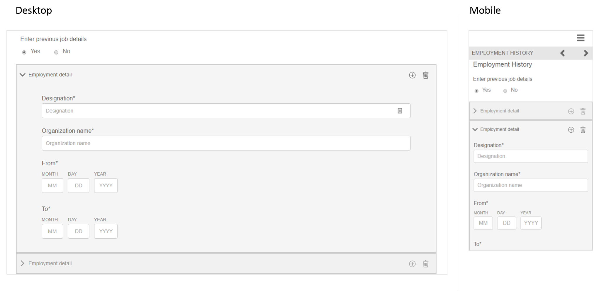

# Riferimento a frammenti di modulo adattivo {#reference-adaptive-form-fragments}

[Un frammento](/help/forms/using/adaptive-form-fragments.md) di modulo adattivo è un gruppo di campi o un pannello contenente un gruppo di campi che è possibile utilizzare per creare un modulo. Consente di creare un modulo in modo semplice e rapido. È possibile trascinare un frammento di modulo adattivo in un modulo utilizzando il browser Risorse nella barra laterale e modificarlo nell&#39;editor del modulo.

Per gli autori di moduli adattivi, i frammenti di riferimento sono forniti nel pacchetto AEM Forms [AEM-FORMS-6.3-REFERENCE-FRAGMENTS](https://www.adobeaemcloud.com/content/marketplace/marketplaceProxy.html?packagePath=/content/companies/public/adobe/packages/cq630/fd/AEM-FORMS-6.3-REFERENCE-FRAGMENTS). Include i seguenti frammenti:

* Indirizzo
* Informazioni di contatto
* Informazioni sulla carta di credito
* Occupazione corrente
* Informazioni sui dipendenti
* Cronologia occupazione
* Entrate e spese
* Nome
* Termini e condizioni
* Termini e condizioni con scarabocchio

Quando installate il pacchetto, in Moduli e documenti viene creata una cartella di frammenti di riferimento contenente frammenti di riferimento. Per installare un pacchetto, consultate [Come utilizzare i pacchetti](/help/sites-administering/package-manager.md).

## Indirizzo {#address}

Include i campi per specificare l&#39;indirizzo postale. I campi disponibili sono indirizzo, CAP, città, stato e paese. Include inoltre un servizio Web preconfigurato che popola la città e lo stato di un codice postale USA specificato.

[Fare clic per ingrandire](assets/address.png)

## Informazioni di contatto {#contact-information}

Include i campi per acquisire il numero di telefono e l&#39;indirizzo e-mail.

[Fare clic per ingrandire](assets/contact-info-1.png)

## Informazioni sulla carta di credito {#credit-card-information}

Include i campi per acquisire le informazioni sulla carta di credito che possono essere utilizzati per elaborare i pagamenti.
[ Frammento ](assets/cc-info-1.png)

## Occupazione corrente {#current-employment}

Include campi per acquisire i dettagli di lavoro correnti come lo stato di occupazione, il campo di occupazione, la designazione, l&#39;organizzazione e la data di partecipazione.

[Fare clic per ingrandire](assets/current-emp-1.png)

## Informazioni sui dipendenti {#dependents-information}

Include i campi per specificare informazioni su uno o più dipendenti, ad esempio nome, relazione ed età in formato tabulare.

[Fare clic per ingrandire](assets/dependents-info-1.png)

## Cronologia occupazione {#employment-history}

Include i campi per acquisire la cronologia del processo. Consente di aggiungere più organizzazioni.

[Fare clic per ingrandire](assets/emp-history-1.png)

## Entrate e spese {#income-expenditure}

Include i campi per acquisire il flusso di cassa mensile e le spese. I moduli che richiedono agli utenti di fornire informazioni finanziarie possono utilizzare questo frammento per acquisire entrate e spese.

[Fare clic per ingrandire](assets/income-1.png)

## Nome {#name}

Include i campi per specificare titolo, nome, secondo nome e cognome.

[Fare clic per ingrandire](assets/name-1.png)

## Termini e condizioni {#terms-conditions}

Specifica i termini e le condizioni che gli utenti possono accettare prima di inviare il modulo.

[Fare clic per ingrandire](assets/tnc-1.png)

## Termini e condizioni con scarabocchio {#terms-conditions-with-scribble}

Specifica i termini e le condizioni che gli utenti possono accettare e firmare prima di inviare il modulo.

[Fare clic per ingrandire](assets/tnc-scribble-1.png)