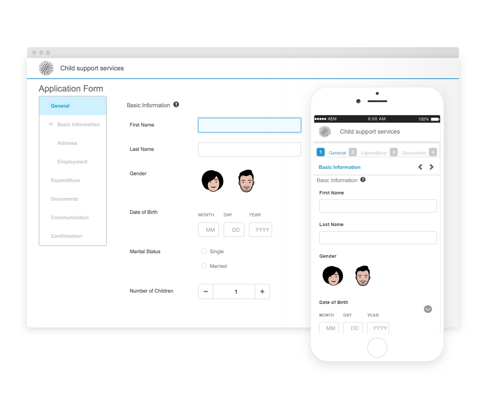
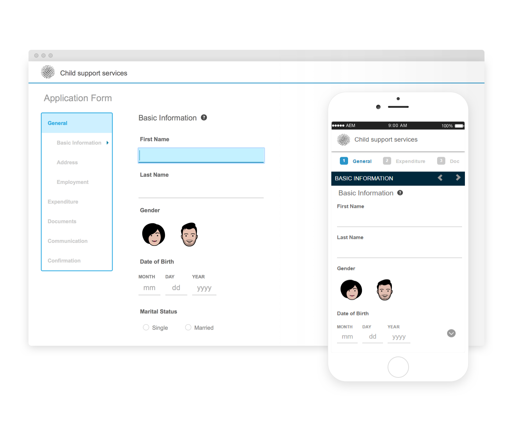

# Temi di riferimento {#reference-themes}

[I temi](/help/forms/using/themes.md) consentono di formattare i moduli senza conoscere a fondo i CSS. Oltre al tema predefinito, è possibile ottenere i seguenti temi installando il pacchetto [AEM-FORMS-6.3-REFERENCE-THEMES](https://www.adobeaemcloud.com/content/marketplace/marketplaceProxy.html?packagePath=/content/companies/public/adobe/packages/cq630/fd/AEM-FORMS-6.3-REFERENCE-THEMES) :

* Berile
* Exec
* Exec-Light
* Libertà
* Ultramarina
* Urbane
* Standard di web design degli Stati Uniti
* Tranquillo

Ciascun tema contiene uno stile esclusivo ed elegante che consente di creare deliziosi moduli adattivi per gli utenti. Contiene uno stile univoco per i selettori quali pannello, casella di testo, casella numerica, pulsante di scelta, tabella e switch. Gli stili in questi temi sono basati sui requisiti. Ad esempio, in uno scenario particolare è necessario un tema minimalista con font puliti. Il tema Liberty consente di ottenere questo look.

I temi inclusi in questo pacchetto sono reattivi e lo stile di questi temi è definito per i display per dispositivi mobili e desktop. La maggior parte dei browser moderni su una varietà di dispositivi può eseguire il rendering dei moduli applicati con uno di questi temi senza problemi.

Per ulteriori informazioni sull&#39;installazione del pacchetto, consultate [Come utilizzare i pacchetti](/help/sites-administering/package-manager.md).

## Berile {#beryl}

Il tema Beryl è utilizzato dal modulo [adattivo](/help/forms/using/gov-reference-site-walkthrough.md)We.Gov e enfatizza l&#39;uso dell&#39;immagine di sfondo, la trasparenza e le icone grandi e semplici. Nella schermata seguente, è possibile vedere l&#39;aspetto del tema Beryl e come può migliorare lo stile del modulo.
Beryl[Clicca per ingrandire](assets/beryl-1.png)

## Exec {#exec}

Il tema Exec evita riempimenti di sfondo pieni per enfatizzare i componenti del modulo. Selezionando e facendo clic sui componenti, i colori dei font vengono modificati. Rispetto al tema canvas predefinito, il colore del font del testo nella scheda selezionata diventa blu scuro. I pulsanti di navigazione e di invio sono diversi dal tema Beryl.

[Fare clic per ingrandire](assets/exec-1.png)

## Exec Light {#exec-light}

Il tema Exec Light utilizza lo spazio vuoto per creare un&#39;esperienza senza soluzione di continuità. I pulsanti Successivo e Invia consentono di ottenere un riempimento uniforme e un&#39;ombreggiatura 3D. Le schede selezionate a sinistra visualizzano una freccia invece dei doppi indicatori di spunta.

[Fare clic per ingrandire](assets/exec-light-1.png)

## Libertà {#liberty}

Il tema Liberty utilizza un approccio minimalista per evidenziare l&#39;importante. Ad esempio, il colore del font della scheda visitata diventa verde. È possibile visualizzare solo il contorno inferiore della casella di testo che emula l&#39;aspetto di un modulo basato su carta con righe. La casella di testo attiva presenta un contorno inferiore nero, mentre gli altri presentano un contorno inferiore grigio chiaro.

[Fare clic per ingrandire](assets/liberty-1.png)

## Tranquillo {#tranquil}

Il tema Tranquillo fornisce sfumature chiare e scure della combinazione di colori Tranquillo per evidenziare i diversi componenti di un modulo. Ad esempio, i pulsanti di scelta, i pannelli e le schede hanno un&#39;ombreggiatura di verde diversa.

[Fare clic per ingrandire](assets/tranquil-1.png)

## Ultramarina {#ultramarine}

Il tema ultramarino utilizza sfumature blu profonde per evidenziare componenti quali schede, pannelli, caselle di testo e pulsanti.

## Urbane {#urbane}

Il tema Urbane enfatizza un aspetto minimalista e funzionale per il modulo. Quando si applica il tema Urbane al modulo, è possibile vedere che i componenti sono piatti. I pannelli hanno contorni sottili per creare un aspetto moderno.

[Fare clic per ingrandire](assets/urbane-1.png)

## Standard di web design degli Stati Uniti {#u-s-web-design-standards}

Il tema Standard di Progettazione Web degli Stati Uniti, come suggerisce il nome, utilizza i tipi di carattere e gli stili descritti nel sito Web Microsoft Design Standards. Lo standard web è utilizzato dalle organizzazioni federali per creare esperienze Web coerenti tra i siti web delle amministrazioni federali.

[Fare clic per ingrandire](assets/usgov.png)