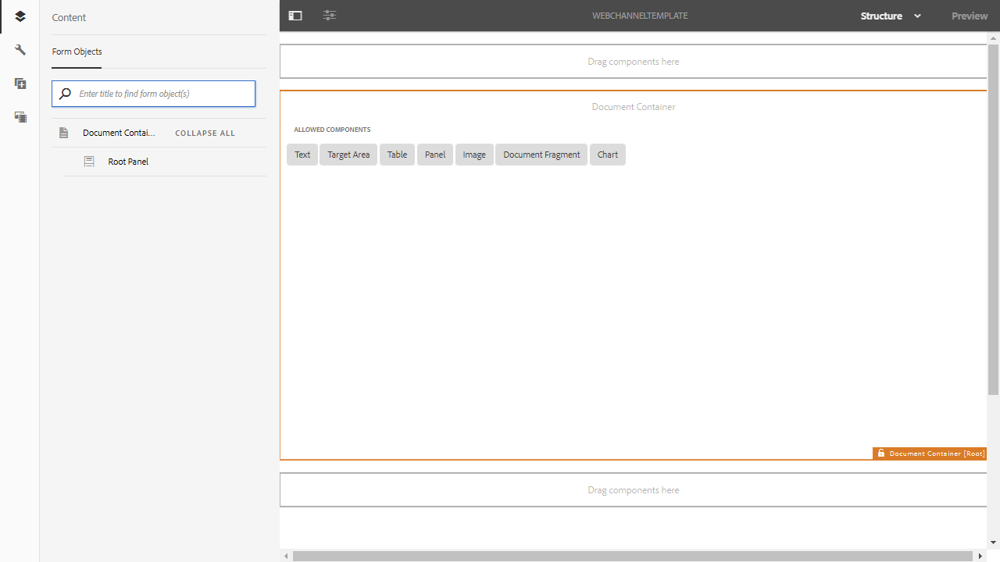

# Canale di stampa e canale web {#print-channel-and-web-channel}

Importazione di modelli per canali di stampa e creazione e abilitazione di modelli per canali Web

Le comunicazioni interattive possono essere distribuite attraverso due canali: stampa e Web. Il canale di stampa viene utilizzato per creare PDF e comunicazioni cartacee, ad esempio una lettera stampata come promemoria per il pagamento del premio assicurativo, mentre il canale Web viene utilizzato per distribuire esperienze online, ad esempio un estratto conto della carta di credito su un sito Web.

Gli autori delle comunicazioni interattive possono riutilizzare risorse quali frammenti di documento e immagini per creare versioni Web e per la stampa delle comunicazioni interattive.

Uno dei prerequisiti per la [Creazione di una comunicazione interattiva](/help/forms/using/create-interactive-communication.md) è la disponibilità sul server dei modelli per la stampa e/o per il canale Web. Mentre gli autori dei modelli creano AEM il modello per il canale Web, il modello per il canale di stampa XDP viene creato in  Forms Designer Adobe e caricato sul server.

## Canale di stampa {#printchannel}

Il canale di stampa di una comunicazione interattiva utilizza il modello di modulo XFA, XDP. Un XDP è progettato in Forms Designer  Adobe. Per ulteriori informazioni sulla creazione di modelli per canali di stampa, vedere [Layout Design](/help/forms/using/layout-design-details.md). Per utilizzare un modello per canali di stampa nella comunicazione interattiva, è necessario caricare il modello sul server AEM Forms .

### Carica modello canale di stampa comunicazione interattiva {#upload-interactive-communication-print-channel-template}

Per caricare il modello, è necessario essere membri del gruppo di utenti-moduli. Per caricare il modello per canali di stampa (XDP) in  AEM Forms, effettuate le seguenti operazioni:

1. Selezionare **[!UICONTROL Forms]** > **[!UICONTROL Forms &amp; Documents]**.

1. Toccate **[!UICONTROL Crea]** > **[!UICONTROL Caricamento file]**.

   Spostarsi e selezionare il modello di canale di stampa appropriato (XDP), quindi toccare **[!UICONTROL Apri]**.

## Canale Web {#web-channel}

Gli autori e gli amministratori dei modelli possono creare, modificare e abilitare i modelli Web. Per consentire ad altri utenti di creare modelli Web, dovete concedergli i diritti. Per ulteriori informazioni, consultate [Amministrazione di utenti, gruppi e diritti di accesso](/help/sites-administering/user-group-ac-admin.md).

### Creazione di un modello di canale Web {#authoring-web-channel-template}

Per creare un modello per canali Web, dovete innanzitutto creare una cartella Template (Modello). Dopo aver creato un modello Web all&#39;interno di una cartella di modelli, è necessario abilitare il modello per consentire agli utenti dei moduli di creare il canale Web di una comunicazione interattiva basata sul modello.

Per creare un modello di canale Web, completare i seguenti passaggi:

1. Se non disponete già di un modello, create una cartella Template per conservare i modelli Web di comunicazione interattiva. Per ulteriori informazioni, vedere Cartelle dei modelli in [Modelli di pagina - Modificabili](/help/sites-developing/page-templates-editable.md).

   1. Toccare **[!UICONTROL Strumenti]**  > **[!UICONTROL Browser di configurazione]**.
      * Per ulteriori informazioni, consultare la [documentazione del browser di configurazione](/help/sites-administering/configurations.md).
   1. Nella pagina del browser di configurazione, toccate **[!UICONTROL Crea]**.
   1. Nella finestra di dialogo Crea configurazione, specificate un titolo per la cartella, selezionate **[!UICONTROL Modelli modificabili]** e toccate **[!UICONTROL Crea]**.

      La cartella viene creata ed elencata nella pagina del browser di configurazione.

1. Passate alla cartella del modello appropriata e create un modello Web.

   1. Andate alla cartella del modello appropriata selezionando **[!UICONTROL Strumenti]** > **[!UICONTROL Modelli > Cartella]**.
   1. Toccate **[!UICONTROL Crea]**.
   1. Selezionare **[!UICONTROL Comunicazione interattiva - Canale Web]** e toccare **[!UICONTROL Avanti]**.
   1. Immettete un titolo e una descrizione del modello, quindi toccate **[!UICONTROL Crea]**.

      Il modello viene creato e viene visualizzata una finestra di dialogo.

   1. Toccate **[!UICONTROL Apri]** per aprire il modello creato nell&#39;editor modelli.

      Viene visualizzato l’Editor modelli.

      

      Quando create o modificate un modello, possono essere definiti da un autore di modelli diversi aspetti. La creazione o la modifica di un modello è simile all’authoring delle pagine. Per ulteriori informazioni, vedere Modifica di modelli - Autori di modelli in [Creazione di modelli di pagina](/help/sites-authoring/templates.md).

1. Per consentire l’utilizzo di questo modello per la creazione di comunicazioni interattive, abilitate il modello.

   1. Toccate **[!UICONTROL Strumenti]**  > **[!UICONTROL Modelli]**.
   1. Andate al modello appropriato, selezionatelo, quindi toccate **[!UICONTROL Enable]** e nel messaggio di avviso toccate **[!UICONTROL Enable]**.

      Il modello è abilitato e il suo stato viene visualizzato come Abilitato. Ora potete creare una comunicazione interattiva in cui usare il modello di canale Web appena creato.

### Canale di stampa come master per il canale Web {#print-channel-as-master-for-web-channel}

Durante la creazione di una comunicazione interattiva, gli autori possono selezionare questa opzione per creare il canale Web sincronizzato con il canale di stampa. L&#39;utilizzo del canale di stampa come master per il canale Web garantisce che il contenuto, l&#39;ereditarietà e il binding dei dati del canale Web siano derivati dal canale di stampa e che le modifiche apportate al canale di stampa possano riflettersi nel canale Web. Gli autori delle comunicazioni interattive possono tuttavia interrompere l’ereditarietà di componenti specifici nel canale Web, a seconda delle necessità.

