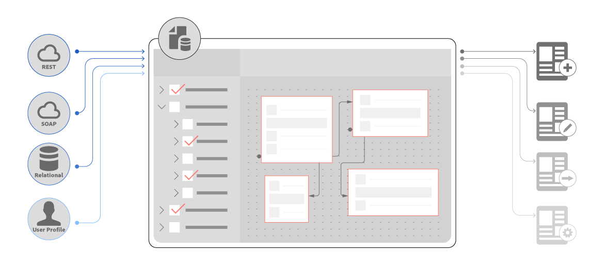

# Riepilogo delle nuove funzioni | AEM 6.4 Forms {#new-features-summary-aem-forms}

>[!CAUTION]
>
>AEM 6.4 ha raggiunto la fine del supporto esteso e questa documentazione non viene più aggiornata. Per maggiori dettagli, consulta la nostra [periodi di assistenza tecnica](https://helpx.adobe.com/it/support/programs/eol-matrix.html). Trova le versioni supportate [qui](https://experienceleague.adobe.com/docs/).

Riepilogo delle nuove funzioni e dei miglioramenti in Forms 6.4 AEM.

AEM Forms include diverse nuove funzioni e miglioramenti che semplificano ulteriormente la creazione, la gestione e l’esperienza utente con moduli adattivi e comunicazioni interattive.

Continua a leggere per un’introduzione rapida alle nuove funzioni e ai miglioramenti. Per informazioni dettagliate, consulta la documentazione relativa alle risorse . Vedi anche AEM 6.4 Forms [note sulla versione](/help/release-notes/forms.md). Per consultare la documentazione completa AEM 6.4 Forms, visita [Guida a Forms di AEM 6.4](/help/forms/home.md).

## Comunicazioni interattive {#interactive-communications}

Le comunicazioni interattive centralizzano e gestiscono la creazione, l&#39;assemblaggio e la distribuzione di corrispondenze sicure, personalizzate e interattive quali corrispondenza aziendale, lettere, documenti, dichiarazioni, note sui benefit, prospetto di gestione patrimoniale, e-mail di marketing, fatture e kit di benvenuto.

Le comunicazioni interattive utilizzano la stessa tecnologia, gli stessi processi e gli stessi componenti di base dei moduli adattivi, per creare comunicazioni multicanale reattive, come i moduli adattivi reattivi.

La comunicazione interattiva offre vantaggi significativi:

* Fornisce l’integrazione OOTB con Form Data Model per consentire un accesso semplice e semplificato ai database back-end e ad altri sistemi CRM come MS Dynamics
* Offre un&#39;interfaccia di authoring integrata per la stampa e i canali web
* Offre un’interfaccia di authoring basata su trascinamento, simile all’authoring di Forms adattivo, sia per i canali di stampa che per quelli web.

La comunicazione interattiva è l’approccio predefinito e consigliato per creare comunicazioni con i clienti. Per continuare a utilizzare le lettere di AEM 6.3 Forms e AEM 6.2 Forms, devi installare un pacchetto di compatibilità.

### Authoring di comunicazioni interattive multicanale {#multi-channel-interactive-communication-authoring}

Utilizzando la comunicazione interattiva, è possibile creare e modificare documenti web e di stampa da un singolo editor di documenti. Utilizzando gli stessi frammenti di documento per creare rappresentazioni di entrambi i canali, è possibile evitare duplicazioni.

Per ulteriori informazioni, consulta [Panoramica delle comunicazioni interattive](/help/forms/using/interactive-communications-overview.md).

### Editor documenti WYSIWYG {#wysiwyg-document-editor}

L&#39;editor di documenti con trascinamento WYSIWYG è semplice da usare. L’interfaccia intuitiva, la funzionalità di trascinamento della selezione, i componenti standard, i modelli di dati e l’archivio integrato per le risorse facilitano la creazione rapida e semplice di comunicazioni interattive.

Per creare una comunicazione interattiva o modificarne una esistente, gli utenti aziendali possono utilizzare i seguenti blocchi predefiniti: Canali, contenuto, proprietà, risorse, componenti e origini dati.

Per ulteriori informazioni, consulta [Introduzione alla creazione di comunicazioni interattive](/help/forms/using/introduction-interactive-communication-authoring.md).

### Generazione automatica della versione web dal contenuto stampato nella comunicazione interattiva {#auto-generate-web-version-from-print-content-in-interactive-communication}

Gli autori possono generare automaticamente contenuti di documenti web da documenti di stampa per creare, visualizzare in anteprima e modificare documenti di stampa e documenti web nello stesso editor. Gli autori di comunicazioni interattive possono creare una volta e pubblicare su tutti i canali. Gli autori di comunicazioni interattive possono utilizzare gli stessi frammenti di documento nel canale web e di stampa per evitare duplicazioni.

Per ulteriori informazioni, consulta [Canale di stampa e canale web](/help/forms/using/web-channel-print-channel.md).

### Utilizzare i temi per personalizzare lo stile del canale web della comunicazione interattiva {#use-themes-to-style-web-channel-of-interactive-communication}

La comunicazione interattiva supporta i temi. Puoi creare temi e applicarli alla comunicazione interattiva. Un tema contiene dettagli di stile per componenti e pannelli. È possibile riutilizzare un tema su diverse comunicazioni interattive per conferire loro un aspetto e un marchio comuni e coerenti.

AEM Forms include un tema preconfigurato per le comunicazioni interattive. Utilizzando un tema, puoi anche personalizzare l’aspetto di una comunicazione interattiva su un dispositivo.

Per ulteriori informazioni, consulta [Temi in AEM Forms](/help/forms/using/themes.md).

### Interfaccia dell’agente avanzato {#enhanced-agent-interface}

L&#39;interfaccia utente di Agent ora supporta la stampa e l&#39;anteprima Web della comunicazione interattiva. Dalla stessa interfaccia utente di Agent, è possibile scegliere di modificare il canale di stampa e visualizzare in anteprima il canale web della comunicazione interattiva multicanale. I campi, le variabili, gli elementi FDM e i frammenti di documento nel canale di stampa possono essere configurati per essere modificati dall’agente nell’interfaccia utente dell’agente. Il supporto del modello dati modulo consente di generare anteprime con dati di esempio precompilati.

Per ulteriori informazioni, consulta [Preparare e inviare comunicazioni interattive tramite l’interfaccia utente dell’agente](/help/forms/using/prepare-send-interactive-communication.md).

### Informazioni presenti nei grafici {#present-information-in-charts}

La comunicazione interattiva supporta grafici nel web e nel canale di stampa per comunicazioni più ricche. Utilizzando grafici come torta, ciambella, barra e colonna, è possibile condensare e presentare visivamente grandi quantità di informazioni per una facile interpretazione e analisi.

 

Per ulteriori informazioni, consulta [Utilizzo dei grafici nelle comunicazioni interattive](/help/forms/using/chart-component-interactive-communications.md).

### Connettori dati predefiniti per la precompilazione dei documenti {#out-of-the-box-data-connectors-to-prefill-documents}

La comunicazione interattiva fornisce l&#39;integrazione dei dati con gli strumenti aziendali per connettersi a più sistemi aziendali, inclusi i sistemi di gestione delle relazioni con i clienti, e personalizzare i dati nei documenti.

Per ulteriori informazioni, consulta [Utilizzare il modello dati del modulo](/help/forms/using/using-form-data-model.md).

### Editor frammento di documento migliorato {#enhanced-document-fragment-editor}

È ora possibile utilizzare elementi e regole FDM all’interno dei frammenti di documento della comunicazione interattiva.

* Supporto per gli elementi del modello dati modulo
* Mostrare o nascondere un frammento di risorsa/testo utilizzando le regole
* Convalida il valore di un elemento/variabile
* Esegui funzioni per calcolare il valore di un&#39;espressione matematica

Per ulteriori informazioni, consulta:

* [Testi nelle comunicazioni interattive](/help/forms/using/texts-interactive-communications.md)
* [Condizioni delle comunicazioni interattive](/help/forms/using/conditions-interactive-communications.md)

### Pacchetto di compatibilità per le risorse esistenti {#compatibility-package-for-existing-assets}

Per impostazione predefinita, le risorse delle lettere delle versioni precedenti di AEM Forms non sono supportate in questa versione. Se intendi continuare a utilizzare le lettere di AEM 6.3 Forms e AEM 6.2 Forms, devi installare il pacchetto Compatibilità.

## Integrazione dei dati {#data-integration}

[Integrazione dei dati di AEM Forms](/help/forms/using/data-integration.md) consente di configurare origini dati diverse; come database, servizi web basati su RESTful o SOAP e servizi OData; creare un modello dati modulo che sia possibile utilizzare per eseguire il binding dei dati, la precompilazione e l’invocazione di servizi nei moduli adattivi e nei documenti.

In questa versione sono disponibili diverse nuove funzioni e miglioramenti nell’integrazione dei dati.

### Creazione di un modello dati modulo senza origine dati {#create-form-data-model-without-data-source}

Gli utenti aziendali e gli autori di moduli possono ora creare un modello di dati modulo che ne include entità e proprietà senza configurare un’origine dati e può essere utilizzato per creare moduli e documenti adattivi. È possibile eseguire il binding del modello dati del modulo con origini dati in un secondo momento. Elimina le dipendenze dalle origini dati per creare moduli e documenti utilizzando il modello dati modulo.

Allo stesso modo, è possibile creare entità e proprietà secondarie in un modello di dati modulo esistente e associarle alle entità e proprietà corrispondenti in un secondo momento in un’origine dati.

Per ulteriori informazioni, consulta [Crea modello dati modulo](/help/forms/using/create-form-data-models.md).

### Creare proprietà calcolate {#create-computed-properties}

Gli autori e gli sviluppatori di Forms possono creare proprietà calcolate nel modello dati del modulo. Consentono di calcolare un valore per la proprietà creando regole o logiche sui dati disponibili nelle origini dati configurate. Una regola è un&#39;espressione che viene valutata quando i dati vengono caricati nel modello dati del modulo o i valori delle proprietà nella modifica dell&#39;espressione. Ad esempio, un immobile calcolato denominato Rate calcola l&#39;importo mensile da pagare per un prestito in base al tasso di interesse specificato nell&#39;origine dati e all&#39;importo e alla durata del prestito specificati dall&#39;utente nel modulo.

Una proprietà calcolata risiede localmente in un modello dati modulo e non esiste in un’origine dati. È possibile utilizzare proprietà calcolate nei moduli adattivi e nelle comunicazioni interattive.

Per ulteriori informazioni, consulta [Utilizzare il modello dati del modulo](/help/forms/using/work-with-form-data-model.md).

### Anteprima di moduli e documenti con dati di esempio {#preview-forms-and-documents-with-sample-data}

Il modello dati modulo consente di generare dati di esempio per le proprietà di tutte le entità in un modello dati modulo. I dati generati corrispondono ai tipi di dati configurati per le proprietà. Quando si visualizza l’anteprima di un modulo adattivo o di un documento associato al modello dati del modulo, viene eseguito il rendering con dati di esempio precompilati.

I dati di esempio sono un set di valori casuali che cambiano ogni volta che lo si genera. Tuttavia, puoi modificare e salvare i dati di esempio che persistono anche se li rigeneri. Ad esempio, se modifichi e salvi i dati di esempio per le proprietà Nome e Cognome e successivamente aggiungi un’altra proprietà o entità nel modello dati modulo e rigenera i dati di esempio, le proprietà Nome e Cognome mostreranno i valori salvati durante la rigenerazione dei valori per altre proprietà.

Per maggiori dettagli, vedi [Utilizzare il modello dati del modulo](/help/forms/using/using-form-data-model.md).

### Aggiorna le definizioni delle origini dati {#refresh-data-source-definitions}

Qualsiasi aggiornamento nelle entità o proprietà dell’origine dati non si riflette automaticamente nei modelli di dati modulo associati. Funzioni dell’editor dei modelli di dati per moduli  (Aggiorna definizioni origine dati) che invalida la cache del server e recupera lo schema aggiornato dall&#39;origine dati per riflettere immediatamente nel modello dati del modulo.

### Configurare le origini dati tramite l’interfaccia utente Touch {#configure-data-sources-using-touch-user-interface}

Con questa versione, la configurazione dei servizi cloud per le origini dati è disponibile nell’interfaccia utente Touch. Inoltre, la posizione in cui configurare i servizi cloud è stata modificata in **[!UICONTROL Strumenti > Cloud Services > Origini dati]**. Vedi [Configurare origini dati](/help/forms/using/configure-data-sources.md).

## Moduli adattivi {#adaptive-forms}

### Migliorare le prestazioni dei moduli adattivi con il caricamento lento migliorato {#improve-performance-of-adaptive-forms-with-enhanced-lazy-loading}

La funzionalità di caricamento lento nei moduli adattivi differisce l’inizializzazione dei frammenti di modulo fino a quando non sono necessari. Migliora le prestazioni dei moduli di grandi dimensioni riducendo al minimo il tempo necessario per eseguire il rendering di un modulo, consentendo un’esperienza utente migliore.

In questa versione sono stati apportati diversi miglioramenti alla funzione di caricamento lento:

* I componenti Allegati file e Termini e condizioni sono supportati nei frammenti di modulo con caricamento lento abilitato.
* I frammenti di modulo adattivo con caricamento lento abilitato sono supportati in pannelli ripetibili.
* I moduli adattivi con frammenti abilitati per il caricamento lento sono supportati nell’app AEM Forms.

## Flussi di lavoro AEM incentrati su Forms {#forms-centric-aem-workflows}

Grazie alla funzionalità Flussi di lavoro AEM incentrati su Forms, puoi creare e distribuire rapidamente flussi di lavoro per varie attività sullo stack OSGi. Non è più necessario installare la funzionalità Process Management disponibile sullo stack JEE, semplificando la distribuzione ed eliminando i costi di infrastruttura e server applicativi. Per ulteriori informazioni, consulta [Flussi di lavoro incentrati su Forms su OSGi](/help/forms/using/aem-forms-workflow.md).

Di seguito sono riportati i miglioramenti nei flussi di lavoro AEM incentrati su Forms: ・

* L’editor del modello di flusso di lavoro è disponibile nell’interfaccia utente Touch. Consente di ridurre il tempo necessario per creare flussi di lavoro AEM incentrati sui moduli.
* Passaggio del flusso di lavoro per inviare e-mail. Ad esempio, puoi utilizzare il passaggio e-mail per inviare un documento di record al completamento di un flusso di lavoro.
* Passaggio del flusso di lavoro per utilizzare i servizi del modello dati modulo in un modello di flusso di lavoro. Questo passaggio ti consente di invocare i servizi di integrazione dei dati senza scrivere codice personalizzato. Ad esempio, è possibile richiamare un servizio GET per ottenere i dettagli dei dipendenti dagli archivi di un database senza scrivere alcun codice personalizzato.

## App AEM Forms {#aem-forms-app}

L’app AEM Forms consente ai lavoratori del campo di sincronizzare i propri dispositivi mobili con un server AEM Forms e di lavorare sui propri moduli. L&#39;applicazione funziona perfettamente quando il dispositivo è offline, salvando i dati localmente sul dispositivo e sincronizzando i dati con il server quando il dispositivo è nuovamente online. Per ulteriori informazioni, consulta [app AEM Forms](/help/forms/using/aem-forms-app.md).

Di seguito sono riportati i miglioramenti nell’app AEM Forms:

* I moduli adattivi con frammenti abilitati per il caricamento lento sono supportati nell’app AEM Forms.
* I moduli adattivi con modello dati modulo sono supportati nell’app AEM Forms.

## Document Security {#document-security}

Utilizzando la protezione dei documenti, è possibile distribuire in modo sicuro tutte le informazioni salvate in un formato supportato. La sicurezza dei documenti garantisce che solo gli utenti autorizzati possano utilizzare i documenti. Di seguito sono riportate le principali modifiche apportate alla protezione dei documenti:

* La sicurezza dei documenti fornisce [Libreria di protezione portatile (PPL)](/help/forms/using/document-security-offerings.md) per proteggere un documento localmente, senza inviare il documento al server AEM Forms. Solo le credenziali di sicurezza e i dettagli dei criteri viaggiano sulla rete al server AEM Forms. AEM 6.4 Forms ha introdotto la Portable Protection Library (PPL) in un formato bundle OSGi. Ora è possibile installare direttamente la libreria PPL su un server AEM Forms e utilizzare le funzionalità di AEM e PPL in collaborazione tra loro.
* È possibile compilare la libreria C++ SDK e C++ PPL per la sicurezza dei documenti con Microsoft Visual Studio 2013. La versione supportata in precedenza era Microsoft Visual Studio 2010.

## Piattaforme supportate {#supported-platforms}

AEM Forms può essere configurato utilizzando qualsiasi combinazione di sistemi operativi, server di applicazioni, database, driver di database, JDK, server LDAP e server di posta elettronica supportati. Di seguito sono riportate le principali modifiche apportate alle piattaforme supportate:

<table> 
 <tbody> 
  <tr> 
   <td>Componente</td> 
   <td>Supporto aggiunto</td> 
   <td>Supporto rimosso</td> 
  </tr> 
  <tr> 
   <td>Sistemi operativi</td> 
   <td> 
    <ul> 
     <li>Microsoft Windows Server 2016</li> 
     <li>Oracle Linux 7 Aggiornamento 3</li> 
    </ul> </td> 
   <td> 
    <ul> 
     <li>IBM AIX 7.2 [1]  </li> 
     <li>Solaris 11 [1]</li> 
    </ul> </td> 
  </tr> 
  <tr> 
   <td>Server applicazioni  </td> 
   <td> 
    <ul> 
     <li>Red Hat JBoss EAP 7</li> 
    </ul> </td> 
   <td> 
    <ul> 
     <li>Weblogic IBM 12.1.3</li> 
     <li>IBM WebSphere 8.5.5</li> 
     <li>Red Hat JBoss EAP 6</li> 
    </ul> </td> 
  </tr> 
  <tr> 
   <td>Database</td> 
   <td> 
    <ul> 
     <li>Microsoft SQL Server 2016</li> 
     <li>MySQL 5.7.19 e versioni successive</li> 
     <li>IBM DB2 11.1</li> 
     <li>Architettura Oracle Multitenant</li> 
    </ul> </td> 
   <td> 
    <ul> 
     <li>Microsoft SQL Server 2012  </li> 
     <li>Microsoft SQL Server 2014</li> 
     <li>MySQL 5.5</li> 
     <li>IBM DB2 10.5  </li> 
    </ul> </td> 
  </tr> 
  <tr> 
   <td>Server LDAP</td> 
   <td> 
    <ul> 
     <li>Microsoft Active Directory 2016</li> 
     <li>IBM Tivoli Directory Server 6.4</li> 
    </ul> </td> 
   <td> 
    <ul> 
     <li>Microsoft Active Directory 2008</li> 
     <li>IBM Tivoli Directory Server 6.3</li> 
     <li>Oracle Directory Server Enterprise Edition 7.0</li> 
    </ul> </td> 
  </tr> 
  <tr> 
   <td>Server e-mail</td> 
   <td> 
    <ul> 
     <li>Microsoft Office 365</li> 
    </ul> </td> 
   <td> 
    <ul> 
     <li>Novell Groupwise 7</li> 
    </ul> </td> 
  </tr> 
  <tr> 
   <td>Connettori</td> 
   <td> 
    <ul> 
     <li>Connettore per Microsoft Sharepoint 2016</li> 
     <li>Connettore per EMC Documentum 7.3</li> 
    </ul> </td> 
   <td> 
    <ul> 
     <li>Connettore per Microsoft Sharepoint 2007</li> 
     <li>Connettore per Microsoft Sharepoint 2010</li> 
     <li>Connettore per IBM Filenet 5.0</li> 
     <li>Connettore per EMC Documentum 6.7</li> 
    </ul> </td> 
  </tr> 
  <tr> 
   <td>Browser</td> 
   <td> 
    <ul> 
     <li>Apple Safari 11.x su macOS</li> 
     <li>Apple Safari 11.x su iOS</li> 
    </ul> </td> 
   <td> 
    <ul> 
     <li>Browser Blackberry per dispositivi Blackberry Z30 e Q10</li> 
    </ul> </td> 
  </tr> 
  <tr> 
   <td>app AEM Forms  </td> 
   <td> 
    <ul> 
     <li>Android 4.4 o versione successiva</li> 
     <li>Apple iOS 10 o versione successiva</li> 
    </ul> </td> 
   <td> </td> 
  </tr> 
 </tbody> 
</table>

1. I sistemi operativi AIX e Solaris sono disponibili solo per i clienti che eseguono l&#39;aggiornamento.
