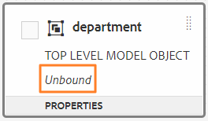
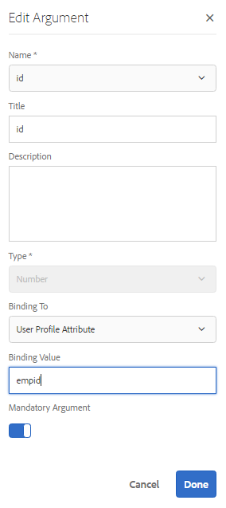
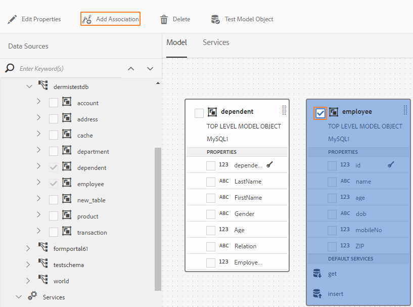
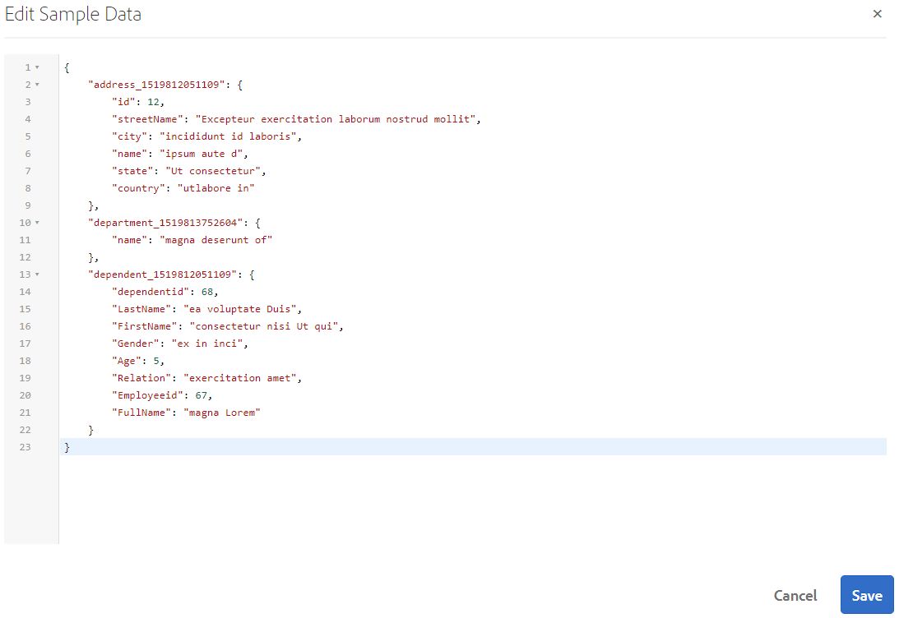

# Utilizzare il modello dati del modulo {#work-with-form-data-model}

>[!CAUTION]
>
>AEM 6.4 ha raggiunto la fine del supporto esteso e questa documentazione non viene più aggiornata. Per maggiori dettagli, consulta la nostra [periodi di assistenza tecnica](https://helpx.adobe.com/it/support/programs/eol-matrix.html). Trova le versioni supportate [qui](https://experienceleague.adobe.com/docs/).

L’integrazione dei dati fornisce all’editor dei modelli di dati modulo la possibilità di configurare e utilizzare i modelli di dati dei moduli.


L’editor dei modelli di dati per moduli offre un’interfaccia utente intuitiva e strumenti per la modifica e la configurazione di un modello di dati per moduli. Utilizzando l’editor, è possibile aggiungere e configurare oggetti modello dati, proprietà e servizi da origini dati associate nel modello dati del modulo. Inoltre, consente di creare oggetti e proprietà del modello dati senza origini dati e di eseguire successivamente il binding con i rispettivi oggetti e proprietà del modello dati. È inoltre possibile generare e modificare dati di esempio per le proprietà dell’oggetto modello dati che è possibile utilizzare per precompilare moduli adattivi e comunicazioni interattive durante l’anteprima. È possibile verificare gli oggetti e i servizi del modello dati configurati in un modello dati del modulo per garantirne la corretta integrazione con le origini dati.

Se si è nuovi utenti dell’integrazione dei dati Forms e non si è configurata un’origine dati o non è stato creato un modello di dati modulo, consultare i seguenti argomenti:

* [Integrazione dei dati di AEM Forms](/help/forms/using/data-integration.md)
* [Configurare origini dati](/help/forms/using/configure-data-sources.md)
* [Crea modello dati modulo](/help/forms/using/create-form-data-models.md)

Continua a leggere per i dettagli sulle varie attività e configurazioni che puoi eseguire utilizzando l’editor del modello dati del modulo.

>[!NOTE]
>
>Devi essere membro di entrambi **fdm-author** e **form-user** gruppi per poter creare e utilizzare il modello dati del modulo. Contatta il tuo amministratore AEM per diventare membro dei gruppi.

## Aggiungi oggetti e servizi del modello dati {#add-data-model-objects-and-services}

Se si è creato un modello dati modulo con origini dati, è possibile utilizzare l’editor del modello dati modulo per aggiungere oggetti e servizi del modello dati, configurarne le proprietà, creare associazioni tra oggetti modello dati e verificare il modello dati e i servizi del modulo.

È possibile aggiungere oggetti modello dati e servizi da origini dati disponibili nel modello dati del modulo. Mentre gli oggetti modello dati aggiunti vengono visualizzati nella scheda Modello , i servizi aggiunti vengono visualizzati nella scheda Servizi .

Per aggiungere oggetti e servizi del modello dati:

1. Accedi all&#39;istanza di authoring AEM, vai a **[!UICONTROL Forms > Integrazioni dati]**, quindi aprire il modello dati del modulo in cui si desidera aggiungere oggetti modello dati.
1. Nel riquadro Origini dati espandere le origini dati per visualizzare gli oggetti e i servizi del modello dati disponibili.
1. Selezionare gli oggetti del modello dati e i servizi che si desidera aggiungere al modello dati del modulo e toccare **[!UICONTROL Aggiungi selezionati]**.

   

   Nella scheda Modello viene visualizzata una rappresentazione grafica di tutti gli oggetti del modello dati e delle relative proprietà aggiunte al modello dati del modulo. Ciascun oggetto modello dati è rappresentato da una casella nel modello dati del modulo.

   

   >[!NOTE]
   >
   >È possibile tenere premuto e trascinare caselle degli oggetti del modello dati intorno per organizzarli nell’area contenuto. Tutti gli oggetti del modello dati aggiunti nel modello dati del modulo sono in grigio nel riquadro Origini dati.

   Nella scheda Servizi sono elencati i servizi aggiunti.

   

   >[!NOTE]
   >
   >Oltre agli oggetti e ai servizi del modello dati, il documento di metadati del servizio OData include proprietà di navigazione che definiscono l&#39;associazione tra due oggetti del modello dati. Per ulteriori informazioni, consulta [Utilizzo delle proprietà di navigazione dei servizi OData](#work-with-navigation-properties-of-odata-services).

1. Tocca **[!UICONTROL Salva]** per salvare l’oggetto modello di modulo.

   >[!NOTE]
   >
   >È possibile richiamare i servizi configurati nella scheda Servizi di un modello dati modulo utilizzando le regole del modulo adattivo. I servizi configurati sono disponibili nell&#39;azione Invoke services dell&#39;editor delle regole. Per ulteriori informazioni sull&#39;utilizzo di questi servizi nelle regole dei moduli adattivi, consulta Invoke Services and Set Value Of rules in [editor di regole](/help/forms/using/rule-editor.md).

## Creazione di oggetti modello dati e proprietà figlio {#create-data-model-objects-and-child-properties}

### Creazione di oggetti modello dati {#create-data-model-objects}

Mentre è possibile aggiungere oggetti modello dati da origini dati configurate, è anche possibile creare oggetti modello dati o entità senza origini dati. È utile soprattutto se non sono state configurate origini dati nel modello dati del modulo.

Per creare un oggetto modello dati senza origini dati:

1. Accedi all&#39;istanza di authoring AEM, vai a **[!UICONTROL Forms > Integrazioni dati]**, quindi aprire il modello dati del modulo in cui si desidera creare un oggetto o un&#39;entità del modello dati.
1. Tocca **[!UICONTROL Crea entità]**.
1. Nella finestra di dialogo Crea modello dati , specifica un nome per l’oggetto modello dati e tocca **[!UICONTROL Aggiungi]**. Un oggetto modello dati viene aggiunto al modello dati del modulo. L’oggetto modello dati appena aggiunto non è associato a un’origine dati e non dispone di proprietà come illustrato nell’immagine seguente.

   

Successivamente, è possibile aggiungere proprietà figlio negli oggetti modello dati non associati.

### Aggiungi proprietà figlio {#child-properties}

L’editor del modello dati modulo consente di creare proprietà figlio in un oggetto modello dati. La proprietà creata non è associata ad alcuna proprietà in un’origine dati. In seguito è possibile eseguire un binding della proprietà figlio con un’altra proprietà nell’oggetto modello dati contenitore.

Per creare una proprietà figlio:

1. In un modello dati modulo, selezionare un oggetto modello dati e toccare **[!UICONTROL Crea proprietà figlio]**.
1. In **[!UICONTROL Crea proprietà figlio]** specifica un nome e un tipo di dati per la proprietà nel **[!UICONTROL Nome]** e **[!UICONTROL Tipo]** rispettivamente. Facoltativamente, puoi specificare un titolo e una descrizione per la proprietà.
1. Abilita Computed se la proprietà è una proprietà calcolata. Il valore di una proprietà calcolata viene valutato in base a una regola o a un&#39;espressione. Per ulteriori informazioni, consulta [Modifica proprietà](#edit-properties).
1. Se l&#39;oggetto modello dati è associato a un&#39;origine dati, la proprietà figlio aggiunta viene automaticamente associata alla proprietà dell&#39;oggetto modello dati principale con lo stesso nome e tipo di dati.

   Per eseguire il binding manuale di una proprietà figlio con una proprietà dell’oggetto modello dati, tocca l’icona Sfoglia accanto a **[!UICONTROL Riferimento a un&#39;associazione]** campo . La **[!UICONTROL Seleziona oggetto]** elenca tutte le proprietà dell’oggetto modello dati principale. Seleziona una proprietà con cui eseguire il binding e tocca l’icona di spunta. È possibile selezionare solo una proprietà dello stesso tipo di dati della proprietà figlio.

1. Tocca **[!UICONTROL Fine]** per salvare la proprietà figlio e toccare **[!UICONTROL Salva]** per salvare il modello dati del modulo. La proprietà figlio viene ora aggiunta all&#39;oggetto modello dati.

Dopo aver creato oggetti e proprietà del modello dati, è possibile continuare a creare moduli adattivi e comunicazioni interattive basate sul modello dati del modulo. Successivamente, quando sono disponibili e configurate origini dati, è possibile eseguire il binding del modello dati del modulo con origini dati. Il binding viene aggiornato automaticamente nei moduli adattivi e nelle comunicazioni interattive associate. Per ulteriori informazioni sulla creazione di moduli adattivi e sulle comunicazioni interattive utilizzando il modello dati modulo, consulta [Utilizzare il modello dati del modulo](/help/forms/using/using-form-data-model.md).

### Oggetti e proprietà del modello dati di binding {#bind-data-model-objects-and-properties}

Quando sono disponibili le origini dati che si desidera integrare con il modello dati del modulo, è possibile aggiungerle al modello dati del modulo come descritto in [Aggiorna origini dati](/help/forms/using/create-form-data-models.md#update). Quindi, eseguire le operazioni seguenti per eseguire il binding degli oggetti e delle proprietà del modello dati non associato:

1. Nel modello dati modulo, selezionare l’origine dati non associata che si desidera associare a un’origine dati.
1. Tocca **[!UICONTROL Modifica proprietà]**.
1. In **[!UICONTROL Modifica proprietà]** tocca l’icona Sfoglia accanto a **[!UICONTROL Binding]** campo . Apre la **[!UICONTROL Seleziona oggetto]** finestra di dialogo in cui sono elencate le origini dati aggiunte nel modello dati del modulo.

   

1. Espandi la struttura ad albero delle origini dati e seleziona un oggetto del modello dati da associare, quindi tocca l’icona di spunta.
1. Tocca **[!UICONTROL Fine]** per salvare le proprietà, quindi tocca **[!UICONTROL Salva]** per salvare il modello dati del modulo. L&#39;oggetto modello dati è ora associato a un&#39;origine dati. Osserva che l’oggetto modello dati non è più contrassegnato come non associato.

   

## Configurare i servizi {#configure-services}

Per leggere e scrivere i dati di un oggetto modello dati, effettuare le seguenti operazioni per configurare i servizi di lettura e scrittura:

1. Seleziona la casella di controllo nella parte superiore di un oggetto modello dati per selezionarlo e tocca **[!UICONTROL Modifica proprietà]**.

   

   Modifica delle proprietà per configurare i servizi di lettura e scrittura per un oggetto modello dati

   Viene visualizzata la finestra di dialogo Modifica proprietà.

   

   Finestra di dialogo Modifica proprietà

   >[!NOTE]
   >
   >Oltre agli oggetti e ai servizi del modello dati, il documento di metadati del servizio OData include proprietà di navigazione che definiscono l&#39;associazione tra due oggetti del modello dati. Quando si aggiunge un&#39;origine dati del servizio OData a un modello dati modulo, è disponibile un servizio in Modello dati modulo per tutte le proprietà di navigazione in un oggetto modello dati. È possibile utilizzare questo servizio per leggere le proprietà di navigazione dell&#39;oggetto modello dati corrispondente.
   >
   >Per ulteriori informazioni sull’utilizzo del servizio, consulta [Utilizzo delle proprietà di navigazione dei servizi OData](#work-with-navigation-properties-of-odata-services).

1. Attiva/disattiva **[!UICONTROL Oggetto di primo livello]** per specificare se l&#39;oggetto modello dati è un oggetto modello di livello principale.

   Gli oggetti modello dati configurati in un modello dati modulo sono disponibili per l’uso nella scheda Oggetti modello dati del browser Contenuto di un modulo adattivo basato sul modello dati del modulo. Quando si aggiunge un&#39;associazione tra due oggetti modello dati, l&#39;oggetto modello dati a cui si sta associando viene nidificato sotto l&#39;oggetto modello dati a cui si sta associando nella scheda Oggetti modello dati. Se il modello dati nidificato è un oggetto di livello superiore, verrà visualizzato anche separatamente nella scheda Oggetti modello dati . Pertanto, saranno visualizzate due voci di esso, una all’interno e un’altra all’esterno della gerarchia nidificata, che potrebbero confondere gli autori di moduli. Per fare in modo che l&#39;oggetto del modello dati associato venga visualizzato solo nella gerarchia nidificata, disattivare la proprietà Oggetto di livello superiore.

1. Selezionare Servizi di lettura e scrittura per gli oggetti del modello dati selezionati. Vengono visualizzati gli argomenti relativi ai servizi.

   

   Servizi di lettura e scrittura configurati per l&#39;origine dati dipendente

1. Tocca  per l&#39;argomento del servizio di lettura per associare l&#39;argomento a un attributo di profilo utente, un attributo di richiesta o un valore letterale e specificare il valore di binding. Associa l&#39;argomento del servizio all&#39;attributo o al valore letterale di binding specificato, che viene passato al servizio come argomento per recuperare i dettagli associati al valore specificato dall&#39;origine dati.

   In questo esempio, la `id` l&#39;argomento assume il valore del `empid` attributo del profilo utente e passalo come argomento al servizio read. Leggerà e restituirà i valori delle proprietà associate dal `employee` oggetto modello dati per il `empid`. Quindi, se specifichi 00250 nel `empid` nel campo del modulo, il servizio di lettura leggerà i dettagli del dipendente con ID dipendente 00250.

   Inoltre, è possibile rendere un argomento obbligatorio o facoltativo.

   

   Binding dell’argomento id all’attributo empid di AEM profilo utente

1. Tocca **[!UICONTROL Fine]** per salvare l&#39;argomento, **[!UICONTROL Fine]** per salvare le proprietà, quindi **[!UICONTROL Salva]** per salvare il modello dati del modulo.

## Aggiungi associazioni {#add-associations}

In genere, esistono associazioni create tra gli oggetti del modello dati in un’origine dati. L&#39;associazione può essere uno a uno o uno a molti. Ad esempio, possono essere associati più dipendenti a un dipendente. È indicata come associazione uno-a-molti e rappresentata da `1:n` sulla linea che collega gli oggetti del modello dati associati. Tuttavia, se un&#39;associazione restituisce un nome dipendente univoco per un determinato ID dipendente, viene definita associazione uno-a-uno.

Quando si aggiungono oggetti del modello dati associati in un&#39;origine dati a un modello dati del modulo, le relative associazioni vengono mantenute e visualizzate come collegate da linee freccia. È possibile aggiungere associazioni tra oggetti del modello dati in diverse origini dati in un modello dati del modulo.

>[!NOTE]
>
>Le associazioni predefinite in un’origine dati JDBC non vengono mantenute nel modello dati del modulo. Devi crearli manualmente.

Per aggiungere un&#39;associazione:

1. Seleziona la casella di controllo nella parte superiore di un oggetto modello dati per selezionarlo e tocca **[!UICONTROL Aggiungi associazione]**. Viene visualizzata la finestra di dialogo Aggiungi associazione .

   

   >[!NOTE]
   >
   >Oltre agli oggetti e ai servizi del modello dati, il documento di metadati del servizio OData include proprietà di navigazione che definiscono l&#39;associazione tra due oggetti del modello dati. È possibile utilizzare queste proprietà di navigazione quando si aggiungono associazioni nel modello dati modulo. Per ulteriori informazioni, consulta [Utilizzo delle proprietà di navigazione dei servizi OData](#work-with-navigation-properties-of-odata-services).

   Viene visualizzata la finestra di dialogo Aggiungi associazione .

   

   Finestra di dialogo Aggiungi associazione

1. Nel riquadro Aggiungi associazione :

   * Specifica un titolo per l’associazione.
   * Seleziona il tipo di associazione — Da uno a uno o da uno a molti.
   * Selezionare l&#39;oggetto modello dati a cui associare.
   * Selezionare il servizio di lettura per leggere i dati dall&#39;oggetto modello selezionato. Viene visualizzato l&#39;argomento del servizio di lettura. Modificare l&#39;argomento, se necessario, e associarlo alla proprietà dell&#39;oggetto modello dati da associare.

   Nell&#39;esempio seguente, l&#39;argomento predefinito per il servizio di lettura dell&#39;oggetto modello dati Dependents è `dependentid`.

   

   L&#39;argomento predefinito per il servizio di lettura Dipendenti è dependentid

   Tuttavia, l&#39;argomento deve essere una proprietà comune tra l&#39;oggetto modello dati associato, che in questo esempio è `Employeeid`. Pertanto, `Employeeid` deve essere associato al `id` proprietà dell&#39;oggetto del modello dati dipendente per recuperare i dettagli dei dipendenti associati dall&#39;oggetto del modello dati Dependents.

   

   Argomento e binding aggiornati

   Tocca **[!UICONTROL Fine]** per salvare l&#39;argomento.

1. Tocca **[!UICONTROL Fine]** per salvare l&#39;associazione e quindi **[!UICONTROL Salva]** per salvare il modello dati del modulo.
1. Ripeti i passaggi per creare altre associazioni in base alle esigenze.

>[!NOTE]
>
>L’associazione aggiunta viene visualizzata nella casella dell’oggetto modello dati con il titolo specificato e una riga che collega gli oggetti del modello dati associati.
>
>Per modificare un’associazione, seleziona la casella di controllo corrispondente e tocca **[!UICONTROL Modifica associazione]**.


## Modifica delle proprietà {#properties}

È possibile modificare le proprietà degli oggetti modello dati, le relative proprietà e i servizi aggiunti nel modello dati del modulo.

Per modificare le proprietà:

1. Selezionare la casella di controllo accanto a un oggetto modello dati, a una proprietà o a un servizio nel modello dati modulo.
1. Tocca **[!UICONTROL Modifica proprietà]**. La **[!UICONTROL Modifica proprietà]** viene visualizzato il riquadro relativo all&#39;oggetto modello, alla proprietà o al servizio selezionato.

   * **Oggetto del modello dati**: Specificare i servizi di lettura e scrittura e gli argomenti di modifica.
   * **Proprietà**: Specifica il tipo, il sottotipo e il formato della proprietà. È inoltre possibile specificare se la proprietà selezionata è la chiave primaria per l’oggetto modello dati.
   * **Servizio**: Specificare l&#39;oggetto del modello di input, il tipo di output e gli argomenti per il servizio. Per un servizio Get, è possibile specificare se deve restituire una matrice.

   

   Finestra di dialogo Modifica proprietà per un servizio get

1. Tocca **[!UICONTROL Fine]** per salvare le proprietà e quindi **[!UICONTROL Salva]** per salvare il modello dati del modulo.

### Creare proprietà calcolate {#computed}

Una proprietà calcolata è quella il cui valore viene calcolato in base a una regola o a un&#39;espressione. Utilizzando una regola, è possibile impostare il valore di una proprietà calcolata su una stringa letterale, un numero, il risultato di un&#39;espressione matematica o il valore di un&#39;altra proprietà nel modello dati del modulo.

Ad esempio, è possibile creare una proprietà calcolata **FullName** il cui valore è il risultato della concatenazione del **Nome** e **LastName** proprietà. Per eseguire questa operazione:

1. Crea una nuova proprietà con il nome `FullName` il cui tipo di dati è String.
1. Abilita **[!UICONTROL Calcolato]** e toccare **[!UICONTROL Fine]** per creare la proprietà.

   

   Viene creata la proprietà calcolata FullName. Osserva l’icona accanto alla proprietà per rappresentare una proprietà calcolata.

   

1. Seleziona la proprietà FullName e tocca **[!UICONTROL Modifica regola]**. Viene visualizzata una finestra dell’editor di regole.
1. Nella finestra dell’editor delle regole, tocca **[!UICONTROL Crea]**. A **[!UICONTROL Imposta valore]** si apre la finestra della regola.

   Dal menu a discesa Seleziona opzione , seleziona **[!UICONTROL Espressione matematica]**. Altre opzioni disponibili sono **[!UICONTROL Oggetto modello dati modulo]** e **[!UICONTROL Stringa]**.

1. Nell’espressione matematica, seleziona **[!UICONTROL Nome]** e **[!UICONTROL LastName]** rispettivamente nel primo e nel secondo oggetto. Seleziona **[!UICONTROL plus]** come operatore.

   Tocca **[!UICONTROL Fine]** quindi tocca **[!UICONTROL Chiudi]** per chiudere la finestra dell’editor delle regole. La regola ha un aspetto simile al seguente.

   

1. Nel modello dati del modulo, tocca **[!UICONTROL Salva]**. La proprietà calcolata è configurata.

## Operazioni con le proprietà di navigazione dei servizi OData {#work-with-navigation-properties-of-odata-services}

Nei servizi OData, le proprietà di navigazione vengono utilizzate per definire le associazioni tra due oggetti modello dati. Queste proprietà sono definite in un tipo di entità o in un tipo complesso. Ad esempio, nel seguente estratto dal file di metadati del campione [TripPin](https://www.odata.org/blog/trippin-new-odata-v4-sample-service/) Servizi di esempio OData, l&#39;entità persona contiene tre proprietà di navigazione: Amici, BestFriend e Viaggi.

Per ulteriori informazioni sulle proprietà di navigazione, consulta [Documentazione OData](https://docs.oasis-open.org/odata/odata/v4.0/errata03/os/complete/part3-csdl/odata-v4.0-errata03-os-part3-csdl-complete.html#_Toc453752536).

```xml
<edmx:Edmx xmlns:edmx="https://docs.oasis-open.org/odata/ns/edmx" Version="4.0">
<script/>
<edmx:DataServices>
<Schema xmlns="https://docs.oasis-open.org/odata/ns/edm" Namespace="Microsoft.OData.Service.Sample.TrippinInMemory.Models">
<EntityType Name="Person">
<Key>
<PropertyRef Name="UserName"/>
</Key>
<Property Name="UserName" Type="Edm.String" Nullable="false"/>
<Property Name="FirstName" Type="Edm.String" Nullable="false"/>
<Property Name="LastName" Type="Edm.String"/>
<Property Name="MiddleName" Type="Edm.String"/>
<Property Name="Gender" Type="Microsoft.OData.Service.Sample.TrippinInMemory.Models.PersonGender" Nullable="false"/>
<Property Name="Age" Type="Edm.Int64"/>
<Property Name="Emails" Type="Collection(Edm.String)"/>
<Property Name="AddressInfo" Type="Collection(Microsoft.OData.Service.Sample.TrippinInMemory.Models.Location)"/>
<Property Name="HomeAddress" Type="Microsoft.OData.Service.Sample.TrippinInMemory.Models.Location"/>
<Property Name="FavoriteFeature" Type="Microsoft.OData.Service.Sample.TrippinInMemory.Models.Feature" Nullable="false"/>
<Property Name="Features" Type="Collection(Microsoft.OData.Service.Sample.TrippinInMemory.Models.Feature)" Nullable="false"/>
<NavigationProperty Name="Friends" Type="Collection(Microsoft.OData.Service.Sample.TrippinInMemory.Models.Person)"/>
<NavigationProperty Name="BestFriend" Type="Microsoft.OData.Service.Sample.TrippinInMemory.Models.Person"/>
<NavigationProperty Name="Trips" Type="Collection(Microsoft.OData.Service.Sample.TrippinInMemory.Models.Trip)"/>
</EntityType>
```

Quando si configura un servizio OData in un modello dati modulo, tutte le proprietà di navigazione in un contenitore entità sono rese disponibili tramite un servizio nel modello dati modulo. In questo esempio di servizio TripPin OData, le tre proprietà di navigazione nel `Person` il contenitore di entità può essere letto utilizzando un `GET LINK` nel modello dati del modulo.

Di seguito vengono evidenziati i `GET LINK of Person /People` nel modello dati modulo, un servizio combinato per le tre proprietà di navigazione nel `Person` entità del servizio TripPin OData.


Una volta aggiunto il `GET LINK` nella scheda Servizi del modello dati modulo è possibile modificare le proprietà per scegliere l&#39;oggetto modello di output e la proprietà di navigazione da utilizzare nel servizio. Ad esempio: `GET LINK of Person /People` nell&#39;esempio seguente viene utilizzato Trip come oggetto modello di output e la proprietà navigation come Trips.


>[!NOTE]
>
>I valori disponibili nel **[!UICONTROL Valore predefinito]** campo **NavigationPropertyName** l&#39;argomento dipende dallo stato del **[!UICONTROL Restituire l&#39;array?]** pulsante di attivazione/disattivazione. Quando è abilitato, mostra le proprietà di navigazione del tipo Raccolta.

In questo esempio, è inoltre possibile scegliere l&#39;oggetto modello di output come Persona e l&#39;argomento della proprietà di navigazione come Amici o BestFriend (a seconda se **[!UICONTROL Restituire l&#39;array?]** è attivato o disattivato).


Allo stesso modo, puoi scegliere un `GET LINK` il servizio e configurarne le proprietà di navigazione quando si aggiungono associazioni nel modello dati modulo. Tuttavia, per poter selezionare una proprietà di navigazione, assicurati che **[!UICONTROL Binding al campo]** è impostato su **[!UICONTROL Letterale]**.


## Generare e modificare dati di esempio {#sample}

L’editor del modello dati modulo consente di generare dati di esempio per tutte le proprietà degli oggetti del modello dati, incluse le proprietà calcolate, in un modello dati modulo. Si tratta di un insieme di valori casuali conformi al tipo di dati configurato per ciascuna proprietà. Puoi anche modificare e salvare i dati, che vengono conservati anche se rigeneri i dati di esempio.

Per generare e modificare i dati di esempio, procedi come segue:

1. Aprire un modello dati modulo e toccare **[!UICONTROL Modifica dati di esempio]**. Genera e visualizza i dati di esempio nella finestra Modifica dati campione.

   

1. In **[!UICONTROL Modifica dati di esempio]** finestra, modifica i dati in base alle esigenze e tocca **[!UICONTROL Salva]**.

Successivamente, è possibile utilizzare i dati di esempio per precompilare e testare le comunicazioni interattive in base al modello di dati del modulo. Per ulteriori informazioni, consulta [Utilizzare il modello dati del modulo](/help/forms/using/using-form-data-model.md).

## Test di oggetti e servizi del modello dati {#test-data-model-objects-and-services}

Il modello dati del modulo è configurato ma prima di metterlo in uso, può essere utile verificare se gli oggetti e i servizi del modello dati configurato funzionano come previsto. Per testare oggetti e servizi del modello dati:

1. Selezionare un oggetto modello dati o un servizio nel modello dati del modulo e toccare **[!UICONTROL Oggetto modello di test]** o **[!UICONTROL Servizio test]**, rispettivamente.

   Viene visualizzata la finestra Modello dati modulo di prova.

   

1. Nella finestra Modello dati modulo di prova, selezionare l’oggetto o il servizio del modello dati da verificare dal riquadro di input.

1. Specifica un valore di argomento nel codice di test e tocca **[!UICONTROL Test]**. Un test di successo restituisce l&#39;output nel riquadro Output.

   

Allo stesso modo, è possibile testare altri oggetti e servizi del modello dati del modulo.

## Passaggi successivi {#next-steps}

È ora disponibile un modello dati modulo di lavoro pronto per l’uso nei moduli adattivi e nei flussi di lavoro di comunicazione interattiva. Per ulteriori informazioni, consulta [Utilizzare il modello dati del modulo](/help/forms/using/using-form-data-model.md).
