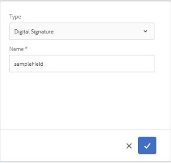

# Utilizzo di Adobe Sign in un modulo adattivo {#using-adobe-sign-in-an-adaptive-form}

Attiva i flussi di lavoro di firma elettronica (Adobe Sign) per un modulo adattivo per automatizzare i flussi di lavoro di firma, semplificare i processi di firma singola e multipla e per firmare elettronicamente i moduli dai dispositivi mobili.

Adobe Sign abilita i flussi di lavoro di firma elettronica per i moduli adattivi. Le firme elettroniche migliorano i flussi di lavoro per elaborare i documenti per aree legali, di vendita, di retribuzione, di gestione delle risorse umane e per altre aree.

In uno scenario tipico di Adobe Sign e moduli adattivi, un utente compila un modulo adattivo da richiedere per un servizio. Ad esempio, una domanda di mutuo e di carta di credito richiede firme legali da parte di tutti i mutuatari e co-richiedenti. Per abilitare i flussi di lavoro di firma elettronica per scenari simili, è possibile integrare Adobe Sign con AEM Forms. Altri esempi sono disponibili in Adobe Sign per:

* Chiudi le offerte da qualsiasi dispositivo con processi di proposta, preventivo e contratto completamente automatizzati.
* Completa più velocemente i processi delle risorse umane e dai ai tuoi dipendenti le esperienze digitali.
* Taglia i tempi del ciclo di contratto e accedi più rapidamente ai tuoi fornitori.
* Crea flussi di lavoro digitali per automatizzare i processi comuni.

L’integrazione di Adobe Sign con AEM Forms supporta:

* Flussi di lavoro di firma singoli e multipli
* Flussi di lavoro di firma sequenziali e simultanei
* Esperienze di firma in-form e out-of-form
* Firma dei moduli come utente anonimo o connesso
* Processi di firma dinamici (integrazione con il flusso di lavoro AEM Forms)
* Autenticazione tramite una knowledge base, un telefono e profili social

Scopri le [best practice per utilizzare Adobe Sign con moduli adattivi](https://medium.com/adobetech/using-adobe-sign-to-e-sign-an-adaptive-form-heres-the-best-way-to-do-it-dc3e15f9b684) per creare esperienze di firma migliori.

## Prerequisiti {#prerequisites}

Prima di utilizzare Adobe Sign in un modulo adattivo:

* Verifica che il servizio cloud AEM Forms sia configurato per l’utilizzo di Adobe Sign. Per informazioni dettagliate, consulta [Integrare Adobe Sign con AEM Forms](/help/forms/using/adobe-sign-integration-adaptive-forms.md).
* Prepara l’elenco dei firmatari. È necessario almeno un indirizzo e-mail per ogni firmatario.

## Configurare Adobe Sign per un modulo adattivo {#configure-adobe-sign-for-an-adaptive-form}

Esegui i seguenti passaggi per configurare Adobe Sign per un modulo adattivo:

1. [Modificare le proprietà del modulo adattivo per il simbolo di Adobe](#enableadobesign)
1. [Aggiungere campi Adobe Sign a un modulo adattivo](#addadobesignfieldstoanadaptiveform)
1. [Abilitare Adobe Sign per un modulo adattivo](#enableadobsignforanadaptiveform)
1. [Selezionare Adobe Sign Cloud Service per un modulo adattivo](#selectadobesigncloudserviceforanadaptiveform)

1. [Aggiungere firmatari di Adobe Sign a un modulo adattivo](#addsignerstoanadaptiveform)
1. [Selezionare Invia azione per un modulo adattivo](#selectsubmitactionforanadaptiveform)

### Modifica delle proprietà dei moduli adattivi per Adobe Sign {#enableadobesign}

Configura le proprietà del modulo adattivo per Adobe Sign per un modulo esistente o per un nuovo modulo adattivo.

[Creazione di un modulo adattivo, ad Adobe ](/help/forms/using/working-with-adobe-sign.md#create-an-adaptive-form-for-adobe-sign) Firma descrive i passaggi necessari per creare un modulo adattivo di base. Per altre opzioni disponibili durante la creazione di un modulo adattivo, consulta [Creazione di un modulo adattivo](/help/forms/using/creating-adaptive-form.md) .

#### Creare un modulo adattivo per Adobe Sign {#create-an-adaptive-form-for-adobe-sign}

Per creare un modulo adattivo per Adobe Sign, effettua le seguenti operazioni:

1. Passa a **[!UICONTROL Adobe Experience Manager]** > **[!UICONTROL Forms]** > **[!UICONTROL Forms &amp; Documents]**.
1. Tocca **[!UICONTROL Crea]** e seleziona **[!UICONTROL Modulo adattivo]**. Viene visualizzato un elenco di modelli. Seleziona il modello e tocca **[!UICONTROL Avanti]**.
1. Nella scheda **[!UICONTROL Base]** :

   1. Specifica il **Nome** e il **Titolo** per il modulo adattivo.
   1. Seleziona il [contenitore di configurazione](/help/forms/using/adobe-sign-integration-adaptive-forms.md#configure-adobe-sign-with-aem-forms) creato durante la configurazione di Adobe Sign con AEM Forms.

      >[!NOTE]
      >
      >L&#39;elenco a discesa **[!UICONTROL Cloud Service Adobe Sign]** visualizza i servizi cloud configurati nel contenitore di configurazione selezionato in questo campo. L’elenco a discesa **[!UICONTROL Cloud Service Adobe Sign]** è disponibile nella sezione **[!UICONTROL Firma elettronica]** delle proprietà del modulo adattivo quando si seleziona l’opzione **[!UICONTROL Abilita Adobe Sign]** .

1. Nella scheda **[!UICONTROL Modello di modulo]**, selezionare una delle opzioni seguenti:

   * Selezionare l&#39;opzione **[!UICONTROL Associa modello di modulo come modello di documento]** e selezionare un modello di documento di record. Se si utilizza un modulo adattivo basato su un modello di modulo, i documenti inviati per la firma visualizzano solo i campi basati sul modello di modulo associato. Non vengono visualizzati tutti i campi del modulo adattivo.
   * Selezionare l&#39;opzione **[!UICONTROL Genera documento di record]**. Se si utilizza un modulo adattivo abilitato per l’opzione Documento di record, il documento inviato per la firma visualizza tutti i campi del modulo adattivo.

1. Tocca **[!UICONTROL Crea.]** Viene creato un modulo adattivo abilitato per la firma, che può essere utilizzato per aggiungere campi Adobe Sign.

#### Modificare un modulo adattivo per Adobe Sign {#editafsign}

Per utilizzare Adobe Sign in un modulo adattivo esistente, effettua le seguenti operazioni:

1. Passa a **[!UICONTROL Adobe Experience Manager]** > **[!UICONTROL Forms]**> **[!UICONTROL Forms &amp; Documents]**.
1. Seleziona il modulo adattivo e tocca **[!UICONTROL Proprietà]**.
1. Nella scheda **[!UICONTROL Base]** , seleziona il [contenitore di configurazione](/help/forms/using/adobe-sign-integration-adaptive-forms.md#configure-adobe-sign-with-aem-forms) creato durante la configurazione di Adobe Sign con AEM Forms.
1. Nella scheda **[!UICONTROL Modello di modulo]**, selezionare una delle opzioni seguenti:

   * Selezionare l&#39;opzione **[!UICONTROL Associa modello di modulo come modello di documento]** e selezionare un modello di documento di record. Se si utilizza un modulo adattivo basato su un modello di modulo, i documenti inviati per la firma visualizzano solo i campi basati sul modello di modulo associato. Non vengono visualizzati tutti i campi del modulo adattivo.
   * Selezionare l&#39;opzione **[!UICONTROL Genera documento di record]**. Se si utilizza un modulo adattivo abilitato per l’opzione Documento di record, il documento inviato per la firma visualizza tutti i campi del modulo adattivo.

1. Tocca **[!UICONTROL Salva e chiudi]**. Il modulo adattivo è abilitato per Adobe Sign.

### Aggiungere campi Adobe Sign a un modulo adattivo {#addadobesignfieldstoanadaptiveform}

Adobe Sign dispone di vari campi che possono essere inseriti in un modulo adattivo. Questi campi accettano vari tipi di dati, ad esempio firme, iniziali, aziendali o titoli, e consentono di raccogliere ulteriori informazioni durante la firma, insieme alle firme. Puoi utilizzare il componente Blocco di Adobe Sign per posizionare i campi Adobe Sign in diverse posizioni in un modulo adattivo.

Per aggiungere campi a un modulo adattivo e personalizzare varie opzioni relative a tali campi, effettua le seguenti operazioni:

1. Trascina il componente **Blocco Adobe Sign** dal browser Componenti al modulo adattivo. Il componente Blocco Adobe Sign contiene tutti i campi Adobe Sign supportati. Per impostazione predefinita, aggiunge un campo **Signature** al modulo adattivo.

   

   Per impostazione predefinita, il blocco Adobe Sign non è visibile nel modulo adattivo pubblicato. È visibile solo nei documenti firmati. Puoi modificare la visibilità del blocco Adobe Sign dalle proprietà del componente Blocco Adobe Sign.

   >[!NOTE]
   >
   >* L’utilizzo del blocco Adobe Sign non è obbligatorio per utilizzare Adobe Sign in un modulo adattivo. Se non si utilizza il blocco Adobe Sign e si aggiungono campi per i firmatari, il campo firma predefinito viene visualizzato nella parte inferiore dei documenti di firma.
   >* Usa il blocco Adobe Sign solo per i moduli adattivi che generano automaticamente il documento di record. Se si utilizza un XDP personalizzato per la generazione di un modulo adattivo basato su un documento di record o su un modello di modulo, non è necessario un blocco Adobe Sign.

1. Seleziona il componente **Blocco Adobe Sign** e tocca l&#39;icona **Modifica**  . Visualizza le opzioni per aggiungere campi e formattare l’aspetto di un campo.

   

   **A.** Seleziona e aggiungi campi Adobe Sign. **B.** Espandi il blocco Adobe Sign alla visualizzazione a schermo intero

1. Tocca l’icona **Campo Adobe Sign**  . Visualizza le opzioni per selezionare e aggiungere campi Adobe Sign.

   Espandi il campo a discesa **Tipo** per selezionare un campo Adobe Sign e tocca l’icona Fine  per aggiungere il campo selezionato al blocco Adobe Sign. Il campo a discesa **Tipo** include i tipi di campo Firma, Informazioni firmatario e Dati. Integrazione di Adobe Sign con i campi di supporto di AEM Forms elencati solo nella casella a discesa Tipo . Per informazioni dettagliate sui campi Adobe Sign, consulta la [documentazione Adobe Sign](https://helpx.adobe.com/sign/help/field-types.html).

   

   È obbligatorio fornire un nome univoco per un campo. È inoltre possibile selezionare l’opzione richiesta per contrassegnare un campo obbligatorio. Oltre all’opzione **Nome** e **Richiesto**, alcuni campi Adobe Sign dispongono di più opzioni. Ad esempio, maschera e linea multipla. Inoltre, specifica un nome univoco per ciascun campo Adobe Sign se i campi si trovano negli stessi blocchi Adobe Sign o in blocchi diversi.

### Abilitare Adobe Sign per un modulo adattivo {#enableadobsignforanadaptiveform}

Con questa opzione, Adobe Sign non è abilitato per un modulo adattivo. Esegui i seguenti passaggi per abilitarlo:

1. Nel browser Contenuto, tocca **Contenitore modulo** e tocca l&#39;icona **Configura**  . Apre il browser delle proprietà e visualizza le proprietà del contenitore Modulo adattivo.
1. Nel browser delle proprietà, espandere il pannello a soffietto **Firma elettronica** e selezionare l&#39;opzione **Abilita Adobe Sign**. Abilita Adobe Sign per un modulo adattivo.

### Selezionare il Cloud Service Adobe Sign e l’ordine di firma {#selectadobesigncloudserviceforanadaptiveform}

Puoi configurare più servizi Adobe Sign per un’istanza di AEM Forms. È consigliabile disporre di un insieme separato di servizi per ciascuna funzione (risorse umane, finanze e altro ancora). Semplifica il tracciamento e il reporting dei documenti firmati. Ad esempio, una banca ha più reparti. Puoi disporre di una configurazione separata per ogni reparto per un migliore monitoraggio dei documenti.

Un documento può anche avere più firmatari. Ad esempio, una domanda con carta di credito può avere più candidati. Una banca richiede la firma di tutti i richiedenti prima di iniziare la domanda di elaborazione. Per scenari con più firmatari, è possibile selezionare per firmare il documento in ordine sequenziale o simultaneo.

Esegui i seguenti passaggi per selezionare un servizio cloud e l’ordine di firma:

1. Nel browser Contenuto, tocca **Contenitore modulo** e tocca l&#39;icona **Configura**  . Apre il browser delle proprietà e visualizza le proprietà del contenitore Modulo adattivo.
1. Nel browser delle proprietà, espandere il pannello a soffietto **Firma elettronica** e selezionare l&#39;opzione **Abilita Adobe Sign**. Abilita Adobe Sign per un modulo adattivo.
1. Seleziona un servizio cloud dall’elenco di Cloud Services Adobe Sign già configurati.

   Se l&#39;elenco **Cloud Service Adobe Sign** è vuoto, segui l&#39;articolo [Configura Adobe Sign con AEM Forms](/help/forms/using/adobe-sign-integration-adaptive-forms.md) per configurare il servizio.

   L’elenco a discesa elenca i servizi cloud presenti nella cartella `global` in Strumenti > **[!UICONTROL Cloud Services]** > **[!UICONTROL Adobe Sign]**. Inoltre, l’elenco a discesa elenca i servizi cloud presenti nella cartella selezionata nel campo **[!UICONTROL Contenitore di configurazione]** al momento della creazione di un modulo adattivo.

1. Selezionare l&#39;ordine di firma dalla finestra di dialogo **Firma dei firmatari**. I cantanti Adobe Sign possono firmare un modulo adattivo **sequenzialmente** - uno dopo l&#39;altro firmatario o **simultaneamente** - in qualsiasi ordine.

   In ordine sequenziale, un firmatario riceve il modulo per la firma, alla volta. Al termine della firma del documento da parte di un firmatario, il modulo viene inviato al firmatario successivo e così via.

   In ordine simultaneo, più firmatari possono firmare un modulo alla volta.

1. [Aggiungi i firmatari a un ](#addsignerstoanadaptiveform) modulo adattivo e tocca l’icona Fine per salvare le modifiche.

### Aggiungere firmatari a un modulo adattivo {#addsignerstoanadaptiveform}

Per un modulo adattivo è possibile avere un solo firmatario o più firmatari. Quando aggiungi un firmatario, puoi anche configurare i dettagli di autenticazione per il firmatario. È inoltre possibile selezionare se il compilatore e il cantante sono la stessa persona. Esegui i seguenti passaggi per aggiungere e fornire vari dettagli su un firmatario:

1. Nel browser Contenuto, tocca **Contenitore modulo** e tocca l&#39;icona **Configura**  . Apre il browser delle proprietà con le proprietà del contenitore Modulo adattivo.
1. Nel browser delle proprietà, espandere il pannello a soffietto **Firma elettronica** e selezionare l&#39;opzione **Abilita Adobe Sign**. Abilita Adobe Sign per un modulo adattivo.
1. Tocca **Aggiungi firmatario** in **Configurazione firmatario.** Aggiunge un firmatario al modulo adattivo. È possibile aggiungere più firmatari di Adobe Sign a un modulo adattivo.
1. 

   Fai clic sull&#39;icona **Modifica**  per specificare le seguenti informazioni sul firmatario:

   * **Titolo:** specifica un titolo per identificare in modo univoco un firmatario.
   * **Il firmatario e la persona che compila il modulo sono uguali?:** selezionare  **Sì**, se il compilatore e il primo firmatario sono la stessa persona. Se l’opzione è impostata su **No,**, non utilizzare il componente del passaggio firma nel modulo adattivo. Se il modulo contiene un componente Passaggio firma, il campo viene automaticamente impostato su Sì.
   * **Indirizzo e-mail del firmatario:** specifica l’indirizzo e-mail del firmatario. Il firmatario riceve documenti/moduli firmati all’indirizzo e-mail specificato. È possibile scegliere di utilizzare un indirizzo e-mail fornito in un campo modulo, AEM profilo utente dell’utente connesso oppure immettere manualmente un indirizzo e-mail. Si tratta di un passo obbligatorio. Inoltre, se hai configurato un solo firmatario, accertati che l’indirizzo e-mail del firmatario non sia identico all’account Adobe Sign utilizzato per configurare AEM Cloud Services.
   * **Metodo di autenticazione del firmatario:** specifica il metodo per l’autenticazione di un utente prima di aprire un modulo per la firma. È possibile scegliere tra telefono, knowledge base e autenticazione basata sull&#39;identità social.

   >[!NOTE]
   >
   >* Per impostazione predefinita, l’autenticazione basata sull’identità social fornisce un’opzione per l’autenticazione tramite Facebook, Google e LinkedIn. Puoi contattare il supporto Adobe Sign per abilitare altri provider di autenticazione social.

   * **Campi Adobe Sign da compilare o firmare:** seleziona i campi Adobe Sign per il firmatario. Un modulo adattivo può avere più campi Adobe Sign. Puoi scegliere di abilitare campi specifici per un firmatario. Nel campo vengono visualizzati tutti i blocchi Adobe Sign disponibili. Quando selezioni un blocco, vengono selezionati tutti i campi del blocco. Puoi usare l’icona X per deselezionare un campo.

   

   L’immagine di cui sopra ha due esempi di blocchi Adobe Sign: Informazioni personali e dettagli dell&#39;ufficio

   Tocca l’icona Fine  . Il firmatario viene aggiunto e configurato.

### Selezionare Invia azione per un modulo adattivo {#selectsubmitactionforanadaptiveform}

Dopo aver aggiunto i campi Adobe Sign a un modulo adattivo, aver abilitato Adobe Sign dal contenitore modulo, aver selezionato Cloud Service Adobe Sign e aver aggiunto i firmatari di Adobe Sign, selezionare un’azione di invio appropriata per il modulo adattivo. Per informazioni dettagliate sulle azioni di invio dei moduli adattivi, vedere [Configurazione dell&#39;azione di invio](/help/forms/using/configuring-submit-actions.md).

Inoltre, un modulo adattivo abilitato per Adobe Sign viene inviato solo dopo che tutti i firmatari hanno firmato il modulo. È possibile trovare il modulo firmato parzialmente nella sezione Firma in sospeso del portale dei moduli. Il servizio di configurazione Adobe Sign continua a eseguire il polling del server Adobe Sign a [intervalli regolari](/help/forms/using/adobe-sign-integration-adaptive-forms.md) per verificare lo stato delle firme. Se tutti i firmatari completano la firma del modulo, viene avviato il servizio di invio dell’azione e il modulo viene inviato. Se si utilizza un’azione di invio personalizzata e il modulo utilizza Adobe Sign, aggiornare l’azione di invio personalizzata per utilizzare il servizio di azione di invio.

>[!NOTE]
>
>I dati del modulo adattivo vengono temporaneamente memorizzati su Forms Portal. Si consiglia di utilizzare [l&#39;archiviazione personalizzata per Forms Portal](/help/forms/using/configuring-draft-submission-storage.md). In questo modo i dati PII (informazioni personali) non vengono memorizzati sui server AEM.

L’esperienza di firma del modulo è pronta. È possibile visualizzare un’anteprima del modulo per verificare l’esperienza di firma. Nel modulo pubblicato, i campi Blocco Adobe Sign vengono visualizzati quando un firmatario riceve il modulo per la firma tramite e-mail. Questa esperienza è nota anche come esperienza di firma fuori forma. È inoltre possibile configurare un’esperienza di firma all’interno del modulo per il primo firmatario. Per passaggi dettagliati, consulta [Creare un’esperienza di firma all’interno del modulo](/help/forms/using/working-with-adobe-sign.md#create-in-form-signing-experience).

## Configurare le firme cloud per un modulo adattivo {#configure-cloud-signatures-for-an-adaptive-form}

Le firme digitali o le firme remote basate su cloud sono una nuova generazione di firme digitali che funzionano su desktop, dispositivi mobili e web e soddisfano i più alti livelli di conformità e garanzia per l’autenticazione dei firmatari. È possibile firmare un modulo adattivo con firme digitali basate su cloud.

Dopo aver [modificato le proprietà dei moduli adattivi per Adobe sign](#enableadobesign), esegui i seguenti passaggi per aggiungere il campo firma cloud a un modulo adattivo:

1. Trascina il componente **Blocco Adobe Sign** dal browser Componenti al modulo adattivo. Il componente Blocco Adobe Sign contiene tutti i campi Adobe Sign supportati. Per impostazione predefinita, aggiunge un campo **Signature** al modulo adattivo.

   

1. Seleziona il componente **Blocco Adobe Sign** e tocca l&#39;icona **Modifica**  . Visualizza le opzioni per aggiungere campi e formattare l’aspetto di un campo.

   

   **A.** Seleziona e aggiungi campi Adobe Sign. **B.** Espandi il blocco Adobe Sign alla visualizzazione a schermo intero

1. Tocca l’icona **Campo Adobe Sign**  . Visualizza le opzioni per selezionare e aggiungere campi Adobe Sign.

   Espandi il campo a discesa **Tipo** per selezionare **Firma digitale** e tocca l’icona Fine  per aggiungere il campo selezionato al blocco Adobe Sign.

   

   È obbligatorio fornire un nome univoco per un campo.

   Applicare le firme digitali al modulo adattivo utilizzando:

   * Firme cloud: Accedi con un [ID digitale](https://helpx.adobe.com/sign/kb/digital-certificate-providers.html) ospitato da un provider di servizi attendibili.
   * Adobe Acrobat o Reader: Scarica e apri il documento con Adobe Acrobat o Reader per firmare utilizzando una smart card, un token USB o un ID digitale basato su file.

   Dopo aver aggiunto il campo firma cloud al modulo adattivo, esegui i seguenti passaggi per completare il processo di configurazione:

   * [Abilitare Adobe Sign per un modulo adattivo](#enableadobsignforanadaptiveform)
   * [Selezionare Adobe Sign Cloud Service per un modulo adattivo](#selectadobesigncloudserviceforanadaptiveform)
   * [Aggiungere firmatari di Adobe Sign a un modulo adattivo](#addsignerstoanadaptiveform)
   * [Selezionare Invia azione per un modulo adattivo](#selectsubmitactionforanadaptiveform)

## Creare un’esperienza di firma in-form {#create-in-form-signing-experience}

Un utente può inoltre firmare un modulo adattivo durante la compilazione del modulo. Questa esperienza è nota anche come esperienza di firma in-form. L’esperienza di firma in-form è disponibile solo per il primo firmatario in un ambiente con più firmatari. Per creare un’esperienza di firma all’interno del modulo adattivo, effettua le seguenti operazioni:

1. [Aggiungi e configura il componente](#add-and-configure-the-signature-step-component) Passaggio firma .
1. [Aggiungi il componente](#configure-the-thank-you-page-or-summary-step-component) Passaggio di riepilogo .

### Aggiungere e configurare il componente Passaggio firma {#add-and-configure-the-signature-step-component}

Utilizzare il componente Passaggio firma per fornire un’area per firmare elettronicamente il modulo compilato. Quando viene eseguito il rendering della sezione contenente il componente Passaggio firma, viene visualizzata una versione PDF segnalabile del modulo compilato. Il componente Passaggio firma occupa la larghezza completa disponibile per il modulo. Si consiglia di non avere alcun altro componente nella sezione contenente il componente Passaggio firma.

Esegui i seguenti passaggi per configurare il componente Passaggio firma:

1. Trascina il componente **Passaggio firma** dal browser Componenti al modulo.
1. Seleziona il componente del passaggio Firma appena aggiunto e tocca l’icona **Configura**  . Apre il browser delle proprietà e visualizza le proprietà del passaggio Firma. Configura le seguenti proprietà:

   * **Nome** elemento: Specifica il nome del componente.
   * **Titolo:** specifica il titolo univoco del componente.
   * **Messaggio modello:** specifica il messaggio da visualizzare durante il caricamento del PDF della firma. I servizi Adobe Sign richiedono del tempo per preparare e caricare il PDF della firma.
   * **Servizio di firma:** seleziona la  **firma dell’Adobe** .
   * **Utilizza il componente** E-sign legacy: Se utilizzi il rispettivo modulo adattivo in  [AEM Forms Workspace](/help/forms/using/introduction-html-workspace.md), nell’app AEM Forms o nel modulo adattivo sottostante è presente un componente di firma elettronica legacy, seleziona l’opzione  **Usa** componente di firma elettronica legacy.
   * **Configurazione**: Seleziona una configurazione (Cloud Service Adobe Sign). La casella a discesa è disponibile solo se l’opzione **Usa componente di firma elettronica legacy** è abilitata.

   Tocca l’icona Fine  per salvare le modifiche.

   

   >[!NOTE]
   >
   >* Quando si trascina il componente **[!UICONTROL Passaggio firma]** nel modulo, il firmatario e la persona che compila il modulo sono uguali?**** viene impostata automaticamente su  **Sì**. È necessario mantenere il funzionamento del modulo.
   >* I moduli adattivi abilitati per Adobe Sign non supportano l’uso del pulsante Invia nella sezione o nel pannello utilizzando il componente Passaggio firma . È possibile aggiungere un passaggio di riepilogo dopo che il passaggio Firma per l&#39;invio manuale o l&#39;invio automatico viene attivato dopo l&#39;intervallo impostato utilizzando il [Servizio di configurazione Adobe Sign](/help/forms/using/adobe-sign-integration-adaptive-forms.md#configure-adobe-sign-scheduler-to-sync-the-signing-status).

### Configura la pagina di ringraziamento o il componente del passaggio di riepilogo {#configure-the-thank-you-page-or-summary-step-component}

Il componente **Passo di riepilogo** invia automaticamente il modulo, compila le informazioni all’interno della pagina di riepilogo personalizzata e visualizza il riepilogo del modulo inviato. Ottiene anche le informazioni richieste nella mappa di ritorno. Il componente Passo di riepilogo occupa la larghezza completa disponibile per il modulo. Si consiglia di non avere nessun altro componente nella sezione contenente il componente Passaggio di riepilogo .

A questo punto, l’esperienza di firma in modulo è pronta. È possibile visualizzare un’anteprima del modulo per verificare l’esperienza di firma.

## Domande frequenti {#frequently-asked-questions}

**D: È possibile incorporare un modulo adattivo in un altro modulo adattivo. È possibile abilitare Adobe Sign per il modulo adattivo incorporato?**

**Ans:** No, AEM Forms non supporta l’uso di un modulo adattivo che incorpora un modulo adattivo abilitato per Adobe Sign per la firma.

**D: Quando creo un modulo adattivo utilizzando il modello avanzato e lo apro per la modifica, viene visualizzato un messaggio di errore &quot;Le firme elettroniche o i firmatari non sono configurati correttamente&quot;. appare. Come risolvere il messaggio di errore?**

**Ans:** il modulo adattivo creato utilizzando il modello avanzato è configurato per l’utilizzo di Adobe Sign. Per risolvere l’errore, crea e seleziona una configurazione cloud Adobe Sign e configura un firmatario Adobe Sign per il modulo adattivo.

**D: Posso usare i tag di testo di Adobe Sign in un componente di testo statico di un modulo adattivo?**

**Ans:** Sì, è possibile utilizzare i tag di testo in un componente di testo per aggiungere campi Adobe Sign a un modulo adattivo abilitato per  [Document of Record](/help/forms/using/generate-document-of-record-for-non-xfa-based-adaptive-forms.md)  (solo opzione per il documento di record generato automaticamente). Per informazioni sulla procedura e le regole per creare un tag di testo, consulta [Documentazione Adobe Sign](https://experienceleague.adobe.com/docs/document-cloud-learn/sign-learning-hub/admin-set-up/advanced-tasks-admins/adobe-sign-text-tagging.html). Inoltre, i moduli adattivi hanno un supporto limitato per i tag di testo. È possibile utilizzare i tag di testo per creare solo i campi supportati da Adobe Sign Block.

**D: AEM Forms fornisce sia componenti blocco Adobe Sign che componenti passo firma. Possono essere utilizzati simultaneamente in un modulo adattivo?**

**Ans:** è possibile utilizzare entrambi i componenti contemporaneamente in un modulo. Di seguito sono riportati alcuni consigli per l’utilizzo di questi componenti:

**Blocco Adobe Sign:** puoi utilizzare il blocco Adobe Sign per aggiungere campi Adobe Sign in qualsiasi punto del modulo adattivo. Consente inoltre di assegnare campi specifici ai firmatari. Quando un modulo adattivo viene visualizzato in anteprima o pubblicato, il blocco Adobe Sign non è visibile, per impostazione predefinita. Questi blocchi sono abilitati solo nel documento di firma. Nel documento di firma sono abilitati solo i campi assegnati a un firmatario. Il blocco Adobe Sign può essere utilizzato con il primo e il successivo firmatario.

**Componente Passaggio firma:** è possibile utilizzare il componente Passaggio firma per creare un’esperienza di firma all’interno del modulo. Consente la firma solo del primo firmatario durante la compilazione del modulo. Quando si esegue il rendering della sezione contenente il componente Passaggio firma, viene visualizzata una versione PDF del modulo segnalabile. Si tratta generalmente dell’ultima o della penultima sezione seguita dal componente di riepilogo di un modulo.
