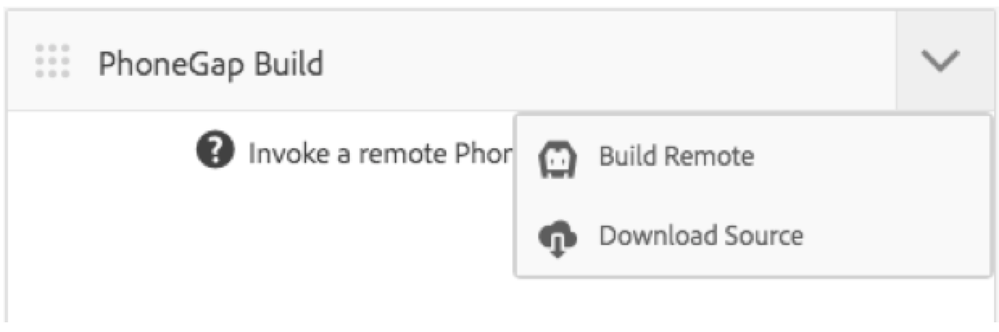

# Configurare il Cloud Service Adobe PhoneGap Build {#configure-your-adobe-phonegap-build-cloud-service}

>[!NOTE]
>
> Adobe consiglia di utilizzare SPA Editor per i progetti che richiedono il rendering lato client basato sul framework di applicazioni a pagina singola (ad es. React). [Per saperne di più](/help/sites-developing/spa-overview.md).

La sezione **PhoneGap Build** del dashboard dell&#39;applicazione consente di creare e distribuire l&#39;applicazione PhoneGap mobile tramite Adobe PhoneGap Build Service.

Tutte le piattaforme supportate definite all&#39;interno della sezione **Gestisci app** verranno create con PhoneGap Build quando si preme una build remota con la sezione **PhoneGap Build** .

È possibile inviare una build remota a [https://build.phonegap.com](https://build.phonegap.com) o scaricare l&#39;origine per creare localmente con l&#39;interfaccia CLI di [PhoneGap](https://docs.phonegap.com/references/phonegap-cli/).


## Configurazione del Cloud Service {#configuring-the-cloud-service}

Per sfruttare le PhoneGap Build è necessario configurare il Cloud Service di PhoneGap Build AEM con le informazioni del tuo account PhoneGap Build.

Se al momento non disponete di un account, andate a [https://build.phonegap.com](https://build.phonegap.com) e registratevi! Se disponete di un’iscrizione Adobe Creative Cloud, potreste avere il supporto per un massimo di 25 app private (app non open source).

Dopo aver verificato che l’account di PhoneGap Build sia attivo, accedi alla console di gestione AEM Cloud, in particolare all’Cloud Service [](http://localhost:4502/etc/cloudservices/phonegap-build.html) PhoneGap Build (http://localhost:4502/etc/cloudservices/phonegap-build.html).

Utilizzate la sezione **Gestisci Cloud Services** per configurare una nuova configurazione del servizio cloud.

### Utilizzo della sezione Gestisci Cloud Services {#using-manage-cloud-services-tile}

Prima di iniziare a creare l&#39;app utilizzando la sezione **PhoneGap Build** , è necessario configurare i servizi cloud, utilizzando la sezione **Gestisci Cloud Services** dal dashboard AEM Mobile .

Per configurare i servizi cloud per la tua app, procedi come segue:

1. Fate clic sull’angolo in alto a destra della sezione **Gestisci Cloud Services** .

   

1. Scegliete **PhoneGap Build** nella schermata **Aggiungi o Modifica Cloud Service** .

   Fai clic su **Avanti**.

   

1. Immettete le credenziali per creare una nuova configurazione cloud.

   Una volta verificato, fate clic su **Invia**. Questa configurazione cloud configurata ora viene visualizzata nella sezione **Gestisci Cloud Services** .

   

### Creazione dell&#39;applicazione con le PhoneGap Build {#building-your-application-with-phonegap-build}

Una volta configurati i servizi cloud, potete creare l&#39;applicazione con la sezione **PhoneGap Build** . Fate clic sull’angolo in alto a destra per scegliere tra le opzioni **Genera remoto** o **Scarica sorgente** .



Per richiamare una build remota con Adobe PhoneGap Build, fai clic su **Crea remoto**.

>[!NOTE]
>
>Se la build non riesce per qualsiasi motivo (l&#39;icona iOS rossa sotto indica che la piattaforma non è riuscita), potete passare il puntatore sull&#39;icona per visualizzare il messaggio di errore. In alternativa, puoi fare clic sul triplo punto, &#39;...&#39; nella parte inferiore della sezione per navigare direttamente su https://build.phonegap.com (è necessario eseguire l&#39;autenticazione) e guardare e gestire direttamente la build.

### Creazione dell&#39;applicazione con PhoneGap CLI {#building-your-application-with-phonegap-cli}

PhoneGap fornisce un&#39;interfaccia della riga di comando per creare l&#39;applicazione localmente.

Compilare l&#39;applicazione PhoneGap sul computer utilizzando l&#39;interfaccia CLI (PhoneGap Command Line Interface). Per includere il contenuto AEM nell&#39;applicazione, AEM crea un file ZIP che contiene il contenuto dell&#39;applicazione mobile, le configurazioni di sincronizzazione dei contenuti e altre risorse necessarie. Scaricate il file ZIP e includetelo nella build.

Per sfruttare l&#39;interfaccia della riga di comando di PhoneGap, è necessario configurare l&#39;ambiente locale in modo da includere:

1. SDK piattaforma (iOS, Android, WindowsPhone, ...) e
1. CLI PhoneGap

Puoi leggere di più [qui](https://docs.phonegap.com/references/phonegap-cli/).

Dopo aver installato i prerequisiti, esegui un semplice test creando un&#39;app semplice e facendola eseguire nel simulatore o meglio ancora sul dispositivo, da un terminale try:

```xml
phonegap create myApp
cd myApp
phonegap run ios (or android, ...)
```

>[!NOTE]
>
>add —emulate alla fine di questa riga se non desiderate eseguirla sul dispositivo collegato.

Una volta verificato che il funzionamento di cui sopra, utilizzate la sezione **PhoneGap Build** per **scaricare l&#39;origine**. Salvate e decomprimete il file nel sistema locale. Una volta fatto:

* passare al file salvato (cartella)
* esegui &#39;phonegap run ios&#39; (o android, ecc.)

### Risorse aggiuntive {#additional-resources}

Per informazioni su ruoli e responsabilità di un autore e sviluppatore, consulta le risorse seguenti:

* [Sviluppo per  Adobe PhoneGap Enterprise con AEM](/help/mobile/developing-in-phonegap.md)
* [Authoring per  Adobe PhoneGap Enterprise in AEM](/help/mobile/phonegap.md)
