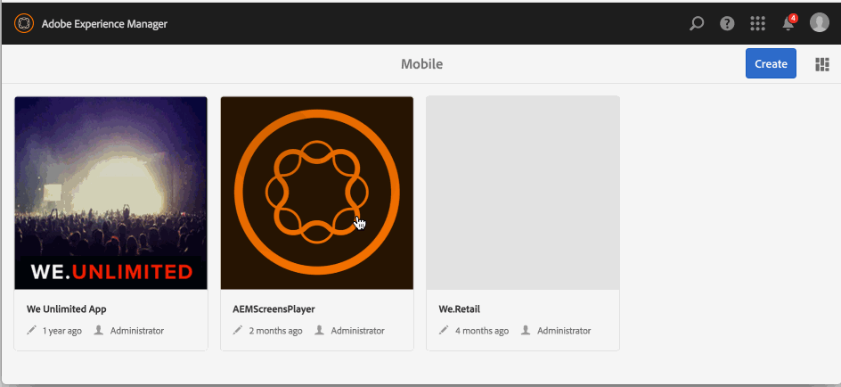

# Azioni di creazione e configurazione delle applicazioni{#application-create-and-configuration-actions}

>[!NOTE]
>
> Adobe consiglia di utilizzare SPA Editor per i progetti che richiedono il rendering lato client basato sul framework di applicazioni a pagina singola (ad es. React). [Per saperne di più](/help/sites-developing/spa-overview.md).

## Creazione di un&#39;applicazione on-demand {#creating-an-on-demand-application}

La creazione di un&#39;app è spesso il primo passo verso la creazione e la gestione  contenuto AEM Mobile On-Demand ed è spesso eseguita a livello di amministratore AEM. Rappresenta una shell di contenuto, visualizzabile su dispositivi mobili, pronta per visualizzare il contenuto creato dall&#39;autore come articoli, immagini, raccolte ecc.

I dettagli dell&#39;app possono essere visualizzati nel dashboard o  AEM Mobile Control Center.

>[!NOTE]
>
>Il dashboard è una serie di sezioni utili che forniscono una panoramica del contenuto, dei metadati e dello stato della connessione AEM Mobile On-Demand dell&#39;app .
>
>Consultate [AEM Mobile Application Dashboard](/help/mobile/mobile-apps-ondemand-application-dashboard.md) per i dettagli.

**Per creare un&#39;app on-demand:**

1. Selezionate **Mobile** dalla barra laterale.
1. Selezionate **App** dalla navigazione.
1. Fai clic su **Crea** e seleziona **App** dal menu a discesa.
1. Scegliete il modello di app per dispositivi mobili e fate clic su **Avanti**.
1. Immettete le proprietà dell&#39;app come **Titolo**, **Nome**, **Descrizione**.
1. Fai clic su **Avanti**.
1. Se noti, immettete i dettagli di configurazione cloud, altrimenti fate clic su **Crea**.
1. Fate clic su **Fine** per visualizzare la nuova app AEM Mobile  nel catalogo.

>[!NOTE]
>
>Questo processo consente di creare un&#39;istanza di app in AEM.

## Utilizzo dei modelli di app {#using-app-templates}

I modelli di app forniscono un modo semplice per sfruttare i progetti esistenti creati dagli sviluppatori, utilizzati per la creazione di nuove app all&#39;interno di AEM.

Che cos&#39;è un modello di app? Può essere considerato come una raccolta di modelli di pagina e componenti che rappresentano una linea di base o una base di un&#39;app.
Quando crei una nuova app basata sul modello di un&#39;altra app, riceverai un&#39;app con un punto di partenza rappresentativo dell&#39;app da cui è stata creata.

Per utilizzare questa funzione, è necessario disporre di un modello di app mobile esistente (o di un&#39;app installata con un modello di app).

### Passaggio successivo {#the-next-step}

Dopo aver creato un&#39;app on-demand dal dashboard dell&#39;applicazione, il passaggio successivo consiste nell&#39;associare l&#39;app alla configurazione cloud.

Per ulteriori informazioni, consultate [Associazione dell&#39;app alla configurazione](/help/mobile/mobile-on-demand-associating-an-on-demand-app-to-cloud-configuration.md) cloud.

### Come {#getting-ahead}

Una volta acquisita familiarità con la creazione di un&#39;applicazione on-demand e quindi con l&#39;associazione di tale app a una configurazione cloud, consultate Azioni [di gestione dei](/help/mobile/mobile-apps-ondemand-manage-content-ondemand.md)contenuti.

**Le azioni** di gestione dei contenuti comportano la creazione e la gestione dei seguenti contenuti:

* [Gestione degli articoli](/help/mobile/mobile-on-demand-managing-articles.md)
* [Gestione dei banner](/help/mobile/mobile-on-demand-managing-banners.md)
* [Gestione delle raccolte](/help/mobile/mobile-on-demand-managing-collections.md)
* [Caricamento delle risorse condivise](/help/mobile/mobile-on-demand-shared-resources.md)
* [Pubblica contenuto annullamento pubblicazione](/help/mobile/mobile-on-demand-publishing-unpublishing.md)

Per informazioni su ruoli e responsabilità di un amministratore e sviluppatore, consulta le risorse seguenti:

* [Sviluppo AEM contenuto per  AEM Mobile On-demand Services](/help/mobile/aem-mobile-on-demand.md)
* [Amministrazione di contenuti da utilizzare  AEM Mobile On-demand Services](/help/mobile/aem-mobile.md)
