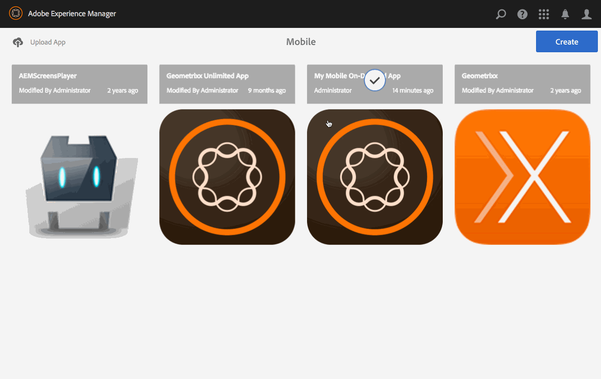

# Gestione degli articoli{#managing-articles}

>[!CAUTION]
>
>AEM 6.4 ha raggiunto la fine del supporto esteso e questa documentazione non viene più aggiornata. Per maggiori dettagli, consulta la nostra [periodi di assistenza tecnica](https://helpx.adobe.com/it/support/programs/eol-matrix.html). Trova le versioni supportate [qui](https://experienceleague.adobe.com/docs/).

>[!NOTE]
>
>Adobe consiglia di utilizzare l’editor di SPA per i progetti che richiedono il rendering lato client basato sul framework di un’applicazione a pagina singola (ad esempio, React). [Ulteriori informazioni](/help/sites-developing/spa-overview.md).

Le azioni di gestione dei contenuti sono gli elementi costitutivi che consentono di creare e gestire gli articoli all’interno di un’applicazione. Le azioni seguenti vengono eseguite sugli articoli all’interno dell’applicazione.

## Panoramica degli articoli {#articles-overview}

Gli articoli rappresentano il testo basato sull’arte per trasmettere le informazioni.

>[!NOTE]
>
>Consulta le seguenti risorse nella Guida in linea per scoprire i seguenti argomenti nelle app AEM Mobile:
>
>* [Considerazioni sulla progettazione](https://helpx.adobe.com/digital-publishing-solution/help/design-app.html)
>
>* [Gestione degli articoli](https://helpx.adobe.com/digital-publishing-solution/help/creating-articles.html)
>

## Creazione di un articolo {#creating-an-article}

Il flusso di lavoro generale per creare un articolo è il seguente:

1. Seleziona **Mobile** dalla barra laterale.
1. Da Mobile, scegli l’app Mobile On-Demand dal catalogo.
1. Fai clic sulla freccia giù nell’angolo in alto a destra del **Gestire gli articoli** piastrelle.
1. Scegli un modello di articolo e fai clic su **Successivo**.
1. Segui ogni passaggio della procedura guidata per continuare a creare il nuovo articolo.
1. Quando è pronto, fai clic su **Crea**.
1. Il nuovo articolo viene visualizzato nella sezione **Gestire gli articoli** piastrelle.

## Importazione di un nuovo articolo {#importing-a-new-article}

Il contenuto Mobile On-Demand esistente può essere scaricato (importato) da Mobile On-Demand a AEM. Consente la modifica e la visualizzazione dei contenuti locali.

>[!NOTE]
>
>L’importazione non include immagini.

Flusso di lavoro per importare un nuovo articolo

1. Da Mobile, scegli l’app mobile on-demand dal catalogo.
1. Fai clic sulla freccia giù nell’angolo in alto a destra del **Gestire gli articoli** e selezionare Importa articoli.
1. Fai clic su **Importa articoli** nella finestra di dialogo, quindi Chiudi.
1. Gli articoli on-demand per dispositivi mobili vengono ora visualizzati nella sezione **Gestire gli articoli** piastrelle.

>[!CAUTION]
>
>È innanzitutto necessario associare una connessione Mobile On-Demand.

## Modifica di un articolo {#editing-an-article}

Utilizza l’editor integrato AEM trascinamento per aggiungere o modificare un articolo. È possibile aggiungere o rimuovere componenti quali testo e immagini. È possibile inserire immagini da DAM Assets.

>[!CAUTION]
>
>Solo gli articoli creati in AEM possono essere aperti nell’editor.

Flusso di lavoro per modificare un articolo:

1. Da Mobile, scegli l’app Mobile On-Demand dal catalogo.
1. Seleziona un articolo di origine AEM dal **Gestire gli articoli** piastrelle.
1. Fai clic sull’articolo evidenziato nella vista a elenco per aprirlo nell’editor dei contenuti.
1. Utilizza l’editor dei contenuti per trascinare il contenuto dell’articolo (manoscritti, immagini, testo, ecc.).

### Visualizzazione e modifica dei metadati all’interno di un articolo {#viewing-and-editing-the-metadata-within-an-article}

Contenuti come articoli, banner, ecc hanno numerose proprietà come titoli, descrizioni, immagini. Questa azione viene utilizzata per visualizzare e modificare tali proprietà. Facoltativamente, queste modifiche possono essere caricate su Mobile On-Demand al momento del salvataggio.

Flusso di lavoro generale per visualizzare/modificare un articolo:

1. Da Mobile, scegli l’app Mobile On-Demand dal catalogo.
1. Scegli un articolo dalla **Gestire gli articoli** piastrelle.

1. Seleziona **Visualizza proprietà** dalla barra delle azioni.
1. Visualizza tutti i metadati disponibili per l&#39;articolo.
1. Modifica i metadati, se desiderato, e fai clic su **Salva** al termine.
1. Facoltativamente, carica immediatamente le modifiche su Mobile On-Demand.

## Caricamento di un articolo {#uploading-an-article}

L’azione di caricamento copia il contenuto selezionato e lo aggiunge a un progetto Mobile On-Demand. Il contenuto Mobile On-Demand già esistente viene sostituito dalla nuova versione.

Il flusso di lavoro generale per caricare un articolo:

1. Da **Mobile**, scegli l’app Mobile On-Demand dal catalogo.
1. In **Gestire gli articoli** seleziona un articolo da caricare su Mobile On-Demand.
1. Se necessario, aggiungete altri articoli dalla vista a elenco.
1. Seleziona **Carica** dalla barra delle azioni, fai clic su Carica nella finestra di dialogo.
1. Gli articoli sono ora caricati su Mobile On-Demand.

## Eliminazione di un articolo {#deleting-an-article}

Questa operazione elimina il contenuto selezionato da Mobile On-Demand ed eventualmente dall’istanza AEM locale.

Flusso di lavoro generale per eliminare un articolo:

1. Da Mobile, scegli l’app Mobile On-Demand dal catalogo.
1. Seleziona l’articolo da eliminare nella **Gestire gli articoli** piastrelle.
1. Accertati che sia selezionato nell’elenco (seleziona altri da eliminare in base alle esigenze).
1. Fai clic su **Elimina** dalla barra delle azioni.
1. Controlla se desideri eliminare da AEM e da Mobile On-Demand.
1. Fai clic su **Elimina**.
1. L’articolo viene ora rimosso dall’elenco.

### Passaggi successivi {#the-next-steps}

Una volta appresa la gestione degli articoli, consulta

* [Gestione dei banner](/help/mobile/mobile-on-demand-managing-banners.md)
* [Gestione delle raccolte](/help/mobile/mobile-on-demand-managing-collections.md)
* [Caricamento delle risorse condivise](/help/mobile/mobile-on-demand-shared-resources.md)
* [Pubblicazione/annullamento della pubblicazione del contenuto](/help/mobile/mobile-on-demand-publishing-unpublishing.md)
* [Anteprima con Preflight](/help/mobile/aem-mobile-manage-ondemand-services.md)
