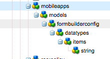

# Modelli nell’archivio{#models-in-repository}

>[!CAUTION]
>
>AEM 6.4 ha raggiunto la fine del supporto esteso e questa documentazione non viene più aggiornata. Per maggiori dettagli, consulta la nostra [periodi di assistenza tecnica](https://helpx.adobe.com/it/support/programs/eol-matrix.html). Trova le versioni supportate [qui](https://experienceleague.adobe.com/docs/).

>[!NOTE]
>
>Adobe consiglia di utilizzare l’editor di SPA per i progetti che richiedono il rendering lato client basato sul framework di un’applicazione a pagina singola (ad esempio, React). [Ulteriori informazioni](/help/sites-developing/spa-overview.md).

Un modello contiene un set di tipi di dati che definiscono le proprietà di cui verrà eseguito il rendering da parte dei servizi di contenuto. Un modello definisce anche le relazioni tra altri modelli al fine di applicare l’integrità dei dati.

In qualità di sviluppatore, devi avere familiarità con la struttura del modello nell’archivio. Puoi creare modelli ed entità personalizzati in base alle esigenze dell&#39;app.

## Creazione di tipi di modelli {#creating-model-types}

Esistono due tipi di modelli forniti dal sistema in */libs/settings/mobileapps/model-types*. Se si desidera ignorare i tipi di modello di sistema *mobileapps/model-types* sarà necessario creare il nodo sotto il nodo di configurazione in cui si desidera che si verifichi l&#39;override.

Ad esempio, se hai creato configurazioni in */conf/myconf1* e */conf/myconf2* e desidera ignorare i tipi di modelli di sistema in *conf1* solo per creare un *mobileapps/model-types* sotto le impostazioni di *conf1*.

Se si desidera consentire l&#39;aggiunta di tipi di dati a un modello, il tipo di modello deve avere un nodo figlio denominato &quot;scaffolding&quot; di tipo &quot;cq:Page&quot; e un tipo di risorsa di *wcm/scaffolding/components/scaffolding*.

La pagina di scaffolding deve includere anche un *dataTypesConfig* sul nodo PageContent che indica che i modelli dei tipi di dati creati da questo tipo saranno consentiti.

>[!NOTE]
>
>A **Scaffolding** è una pagina che definisce i tipi di dati che possono essere modificati da un’entità in base al modello. È inoltre possibile configurare ogni tipo di dati per definire la modalità di presentazione del campo nell’interfaccia utente e la persistenza del valore dei dati.

### Configurazione dei tipi di dati {#data-types-config}

Il nodo di configurazione dei tipi di dati contiene un elenco di elementi di tipo dati. Ogni elemento di tipo dati specifica come verrà visualizzato un tipo di dati nell’editor modelli e come deve essere mantenuto per l’eventuale rendering da parte di un’entità.

| **Nome proprietà** | **Descrizione** |
|---|---|
| fieldIcon | Classe dell&#39;icona CoralUI per rappresentare il tipo di dati |
| fieldPropResourceType | componente che eseguirà il rendering di tutte le proprietà per la configurazione del tipo di dati |
| fieldProperties | elenco multivalore dei componenti di proprietà utilizzati quando il campoPropResourceType è *mobileapps/caas/gui/components/models/editor/datatypes/field* |
| fieldResourceType | resourceType del nodo persistente per il tipo di dati (cioè, il componente che eseguirà il rendering della proprietà nell&#39;editor di entità) |
| fieldViewResourceType | componente da utilizzare per il rendering del tipo di dati nella visualizzazione dell&#39;editor modelli (se questa proprietà viene omessa, verrà utilizzato fieldResourceType) |
| fieldTitle | nome del tipo di dati che verrà visualizzato nell&#39;editor modelli |
| multiFieldResourceType | tipo di risorsa da utilizzare sul nodo persistente quando è selezionato più valori |
| renderType | indizio di rendering per il rendering lato client |

### Sovrapposizione configurazione tipi di dati {#data-types-config-overlay}

La proprietà &#39;dataTypesConfig&#39; supporta l&#39;unione delle risorse Sling. Ciò significa che i tipi di dati utilizzati dai tipi di modelli di sistema (o anche dai tipi di modelli personalizzati) possono essere personalizzati utilizzando i nodi di sovrapposizione.

Sovrapposizione di */libs/settings/mobileapps/models/formbuilderconfig/datatypes* dovrà essere creato e personalizzato come desiderato.

Ad esempio, è possibile aggiungere una sovrapposizione per il tipo di dati String per modificare il campoResourceType in un componente personalizzato.

Per ulteriori informazioni sull’unione delle risorse Sling, vedi [Utilizzo di Sling Resource Merger in AEM](/help/sites-developing/sling-resource-merger.md).

### Tipi di dati {#data-types}

Un tipo di dati modello è un componente modulo in grado di includere i dati da includere durante la pubblicazione di un modulo. Il componente del tipo di dati può essere complicato come desiderato. Un esempio di tipo di dati personalizzato può essere un blocco indirizzo per un particolare paese per evitare di doverlo ricreare continuamente utilizzando i tipi di dati primitivi.

Vedi &#39;/libs/mobileapps/caas/components/form/contentreference&#39; come esempio di un tipo di dati personalizzato.

Tutti i tipi di dati primitivi utilizzano i componenti modulo Granite esistenti. Vedi: [https://docs.adobe.com/docs/en/aem/6-3/develop/ref/granite-ui/api/jcr_root/libs/granite/ui/components/coral/foundation/form/index.html](https://docs.adobe.com/docs/en/aem/6-3/develop/ref/granite-ui/api/jcr_root/libs/granite/ui/components/coral/foundation/form/index.html)

Qualsiasi tipo di dati personalizzato può quindi essere aggiunto a una configurazione di tipo dati da utilizzare dall’editor modelli.

## Creazione di modelli {#creating-models}

Puoi iniziare a creare modelli una volta che tutti i tipi di modelli e i tipi di dati desiderati sono stati sviluppati. Gli autori utilizzeranno infine i modelli per creare entità da cui i servizi di contenuti utilizzano per eseguire il rendering dei propri dati.

La creazione di un modello consiste nel selezionare un tipo di modello consentito in base alla configurazione corrente e quindi fornire un titolo e una descrizione.

Per informazioni sulla creazione e la gestione di un modello dal dashboard, consulta [Creazione di un modello](/help/mobile/administer-mobile-apps.md) nella sezione authoring per le app mobile .

### Proprietà di un modello {#properties-of-a-model}

La tabella seguente mostra le proprietà definite per un modello:

| **Nome proprietà** | **Descrizione** |
|---|---|
| Titolo modello | nome del modello |
| Descrizione | descrizione del modello |
| Miniatura  | immagine miniatura del modello |
| Tipo di modello | tipo del modello (può essere una stringa semplice o un percorso di un componente effettivo) |
| Elementi figlio consentiti | percorso di un modello che può essere un elemento secondario di questo modello |
| Elementi padre consentiti | percorso di un modello che può essere un elemento padre di questo modello |

>[!NOTE]
>
>La *bambini ammessi* e *genitori ammessi* Le proprietà seguono le stesse regole dei modelli di pagina. Per ulteriori informazioni, consulta [Modelli di pagina](/help/sites-developing/page-templates-static.md).
>
>In riferimento a *Tipo di modello* tutti i modelli devono avere un super tipo di *mobileapps/caas/components/data/entity* ma può avere un sottotipo che consente di personalizzare la distribuzione dei contenuti. Assicurare che tutti i tipi di modello siano univoci può anche aiutare i client di content services a distinguere tra gli oggetti nei dati.

### Modifica di un modello {#editing-a-model}

La modifica di un modello comporta l’apertura del modulo di dialogo di scaffolding associato a un modello per la modifica. Generalmente lo scaffolding è un nodo figlio del modello, ma può essere situato al di fuori del modello se desiderato specificando il suo percorso utilizzando la proprietà &#39;cq:scaffolding&#39;. È utile se desideri condividere lo stesso scaffolding tra più modelli che devono avere proprietà diverse.

Quando l&#39;impalcatura per il modello si trova, l&#39;editor modelli eseguirà il rendering di tutto ciò che si trova in &#39;jcr:content/cq:dialog/content&#39;. Attualmente solo un layout fisso fino a 3 colonne è supportato dal motore di generazione dei moduli lato client. A destra della finestra di dialogo del modulo di cui è stato eseguito il rendering sarà visualizzato un elenco di tutti i tipi di dati specificati nella configurazione dei tipi di dati. È possibile modificare i tipi di dati facendo clic su di essi. La barra a destra passa quindi alla scheda delle proprietà per il tipo di dati selezionato. È possibile aggiungere nuovi tipi di dati trascinandoli nell’area di lavoro di anteprima. Facendo clic su Salva le modifiche vengono propagate al server. Facendo clic su Annulla viene chiuso l&#39;editor modelli.

>[!NOTE]
>
>Tutti i modelli sono Modelli, in modo che seguano tutte le regole AEM Templating. Ciò consente di utilizzare proprietà quali *allowedGenents* e *allowedChildren* proprietà. Sono efficaci durante la creazione di nuove entità basate su un modello. Le regole del modello garantiscono che le entità possano essere basate solo su determinati modelli a seconda della loro gerarchia.
>
>Per informazioni sulla modifica di un modello dal dashboard, consulta [Creazione di un modello](/help/mobile/administer-mobile-apps.md) nella sezione authoring per le app mobile .

### Modelli di sistema {#system-models}

Sono disponibili due tipi di modelli di sistema predefiniti per il semplice riutilizzo dei contenuti. Questi modelli non possono essere modificati.

**Modello Pagine** Il modello Pagine fornisce un metodo rapido per riutilizzare i contenuti esistenti da Sites e distribuirli da Content Services.

Il resourceType delle entità in base al modello Pages è: mobileapps/caas/components/data/pages

Percorso: Percorso di una pagina Sites . I contenuti di questo percorso (e dei relativi elementi secondari) saranno resi dai gestori dei servizi di contenuti.

**Modello Assets** Il modello Assets fornisce un metodo rapido per riutilizzare i contenuti esistenti da Assets e distribuirli da Content Services.

Il resourceType delle entità in base al modello Pages è: *mobileapps/caas/components/data/assets.*

Elenco risorse: Elenco di percorsi da Assets. Ogni risorsa verrà aggiunta come nodo di entità figlio con un resourceType di *wcm/foundation/components/image*.

>[!NOTE]
>
>Per ulteriori informazioni sull&#39;utilizzo di questi modelli per la creazione di modelli dal dashboard, consulta [Creazione di un modello](/help/mobile/administer-mobile-apps.md) nella sezione authoring per le app mobile .
