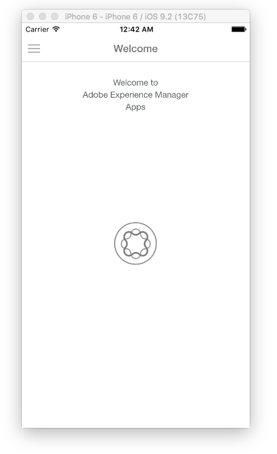

# La tua app ibrida è pronta per AEM Mobile?{#is-your-hybrid-app-ready-for-aem-mobile}

>[!CAUTION]
>
>AEM 6.4 ha raggiunto la fine del supporto esteso e questa documentazione non viene più aggiornata. Per maggiori dettagli, consulta la nostra [periodi di assistenza tecnica](https://helpx.adobe.com/it/support/programs/eol-matrix.html). Trova le versioni supportate [qui](https://experienceleague.adobe.com/docs/).

>[!NOTE]
>
>Adobe consiglia di utilizzare l’editor di SPA per i progetti che richiedono il rendering lato client basato sul framework di un’applicazione a pagina singola (ad esempio, React). [Ulteriori informazioni](/help/sites-developing/spa-overview.md).

Quindi hai importato la tua app Hybrid PhoneGap o Cordova in AEM, ora cosa? È probabile che desideri aggiungere all’app contenuti modificabili. Per eseguire questa attività, è necessario conoscere in modo generale la struttura di un’app AEM. Un’app in AEM è solitamente divisa in due parti. La shell e il contenuto. La &quot;shell&quot; comprende le parti statiche dell’app; come i file di configurazione di PhoneGap, il framework dell&#39;app e i controlli di navigazione. I contenuti dell’archivio importato vengono memorizzati come parte della shell. Nel contesto di questo documento, la shell è tutto il contenuto non AEM creato dell’app PhoneGap ibrida creata dallo sviluppatore dell’app.

Il termine &quot;contenuto&quot; si riferisce ai componenti, ai modelli e alle pagine create in AEM create dallo sviluppatore AEM. Il contenuto è classificato come contenuto per sviluppatori o come contenuto creato. I componenti, le progettazioni e i modelli di pagina sono considerati contenuti da sviluppo, in quanto sono generati da uno sviluppatore. per contenuto dell’autore si intendono le pagine create utilizzando i componenti e i modelli. Generalmente sono eseguite da un designer o da un addetto al marketing.

L’aggiunta di pagine AEM create all’app ibrida richiede il coordinamento tra lo sviluppatore dell’app e lo sviluppatore AEM. In qualsiasi punto dell’app in cui desideri aggiungere contenuti creati, lo sviluppatore dell’app deve organizzare queste pagine in una struttura che può essere sovrapposta in AEM. Lo sviluppatore dell’app deve essere in grado di fornire allo sviluppatore AEM i percorsi in cui aggiungere il contenuto creato AEM e quindi fornire nell’app ibrida una pagina segnaposto che verrà sostituita dopo che lo sviluppatore AEM avrà creato il contenuto della pagina.

Per rendere più facile la spiegazione, utilizzeremo il Marketing Cloud AEM: Riferimento ibrido di AEM Mobile per spiegare i concetti. L’app Riferimento ibrido è costituita da una pagina di benvenuto con un menu laterale.

In questo esempio verrà creata la pagina di benvenuto dell’applicazione. Dai un&#39;occhiata alla fonte [https://github.com/Adobe-Marketing-Cloud-Apps/aem-mobile-hybrid-reference/blob/master/hybrid-app/www/js/app.js#L75](https://github.com/Adobe-Marketing-Cloud-Apps/aem-mobile-hybrid-reference/blob/master/hybrid-app/www/js/app.js#L75). Lo sviluppatore dell’app ha definito una pagina di benvenuto e fornito un modello per la pagina di cui l’app esegue il rendering. È qui che lo sviluppatore dell’app e lo sviluppatore AEM devono coordinarsi. Il percorso del modello di pagina di benvenuto nell’app di riferimento ibrida è definito come &#39;&#39;content/mobileapps/hybrid-reference-app/en/welcome.template.html&#39;&#39;. Questo percorso è estremamente importante perché lo sviluppatore AEM creerà la pagina di benvenuto nell’archivio AEM utilizzando lo stesso percorso.

È importante che l’app ibrida e il contenuto AEM creato utilizzino lo stesso percorso perché ci affidiamo alla possibilità di sovrapporre il contenuto utilizzando Content Sync per aggiungere nuove pagine all’app ibrida. Quando l’app ibrida viene importata in AEM come parte del processo di importazione, vengono configurate le configurazioni di Content Sync.

Quando &quot;Scarica origine&quot; dal dashboard dell’app, questi script ContentSync vengono eseguiti per assemblare un archivio dell’app ibrida.

ContentSync richiama prima la &#39;shell&#39; dell&#39;app, che è dove viene memorizzato tutto il contenuto dell&#39;app ibrida sviluppata e poi richiama il &#39;contenuto&#39; dell&#39;app. Ora, se ci sono pagine nella &quot;shell&quot; che hanno lo stesso percorso di &quot;content&quot;, le pagine sotto &quot;shell&quot; saranno (sostituite) dalle pagine sotto &quot;content&quot;. In altre parole, nell’esempio di app di riferimento ibrida, se creiamo una pagina in AEM che ha lo stesso percorso di &#39;&#39;content/mobileapps/hybrid-reference-app/en/welcome.template.html&#39;&#39; quando viene eseguito da ContentSync, sovrapporrà la pagina che faceva parte dell’app di riferimento ibrido con qualsiasi cosa si trova in AEM in quella posizione. La sovrapposizione viene curata da ContentSync in modo che gli aggiornamenti all’app da parte di un utente che utilizza l’app con AEM contenuto creato appaiano senza soluzione di continuità e non richiedano una ricostruzione dell’app. Di conseguenza, quando esegui l’app, la pagina di benvenuto apparirà come segue:

