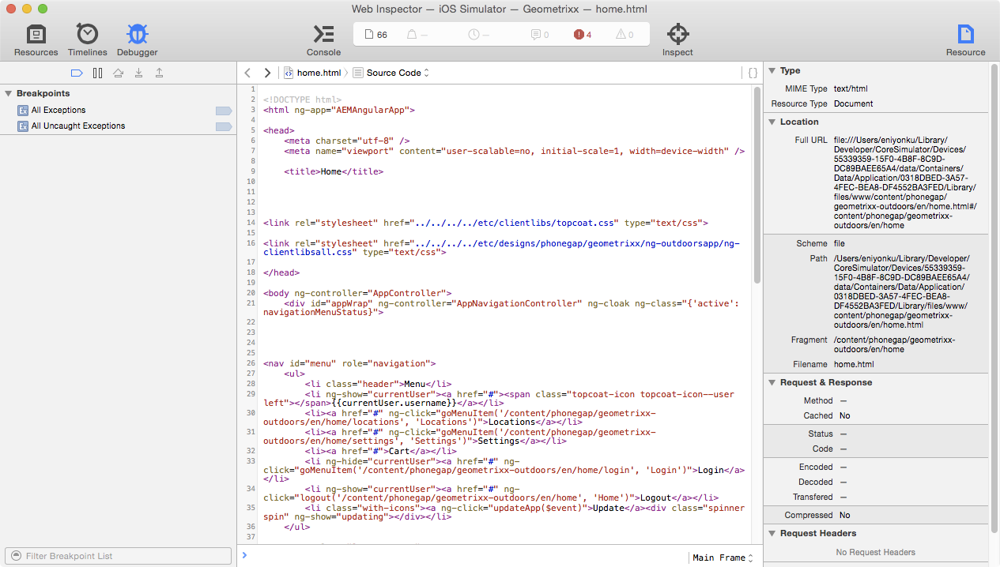

# Sviluppo di app con PhoneGap CLI{#developing-apps-with-phonegap-cli}

>[!NOTE]
>
>Adobe consiglia di utilizzare SPA Editor per i progetti che richiedono il rendering lato client basato sul framework dell&#39;applicazione a pagina singola (ad es. React). [Per saperne di più](/help/sites-developing/spa-overview.md).

In qualsiasi momento, come sviluppatore, puoi eseguire l&#39;app su un dispositivo o all&#39;interno di un emulatore, a condizione che sia stato configurato l&#39;ambiente di sviluppo.

Per eseguire gli esempi seguenti è necessario un sistema che esegue OSx (Mac) con Xcode, oppure un sistema Mac/Win/Linux con Android SDK installato.

## Avviate l&#39;ambiente di sviluppo {#bootstrap-your-development-environment}

[Configurazione CLI PhoneGap](https://docs.phonegap.com/en/4.0.0/guide_cli_index.md.html#The%20Command-Line%20Interface)

Per iOS: Per sviluppare per iPhone e iPad, è necessario l&#39;IDE Xcode di Apple.

* Scaricatelo gratuitamente [qui](https://developer.apple.com/xcode/downloads/).
* [Guida alla piattaforma iOS PhoneGap](https://docs.phonegap.com/en/4.0.0/guide_platforms_ios_index.md.html#iOS%20Platform%20Guide)

Per Android: Per sviluppare per iPhone e iPad, è necessario Google Android Stuido IDE.

* Scaricatelo gratuitamente [qui](https://developer.android.com/sdk/index.html).
* [Guida alla piattaforma PhoneGap Android](https://docs.phonegap.com/en/4.0.0/guide_platforms_android_index.md.html#Android%20Platform%20Guide)

## Scarica l&#39;origine {#download-the-source}

Dopo aver eseguito correttamente il boot dell&#39;ambiente di sviluppo, scaricate l&#39;origine dalla sezione AEM App Build:

* Fate clic sulla freccia a discesa della sezione PhoneGap Build.


* Fate clic su Scarica origine.
* Selezionate l’origine desiderata dal modale Scarica origine.


>[!NOTE]
>
>L&#39;origine di sviluppo contiene lo stato più recente dell&#39;app, incluse le modifiche non in fase. Utilizzate l&#39;origine di gestione temporanea per creare i candidati alla release da inviare ai fornitori dell&#39;app store.
>
>Se non preparate mai l&#39;app, selezionando Staging viene attivato il flusso di lavoro di verifica (suggerimento: questo verrà visualizzato come app per fasi nell’app visualizzatore PhoneGap Enterprise disponibile in AppStore e Google PlayStore).

* Fate clic su Scarica e salvate il file ZIP nel computer.
* Estrarre il file zip scaricato nella vostra area di lavoro.

## Creare e caricare l&#39;app (dalla sorgente) {#build-and-load-the-app-from-source}

L&#39;interfaccia CLI di PhoneGap può creare un progetto di piattaforma, compilare l&#39;origine e distribuire l&#39;app in un unico comando.

>[!NOTE]
>
>È possibile eseguire tutti questi passaggi separatamente, vedere i documenti CLI di [PhoneGap](https://phonegap.com/blog/2014/11/13/phonegap-cli-3-6-3/).

1. Accertatevi di aver installato l&#39;interfaccia CLI di PhoneGap, come descritto sopra.
1. In una finestra della console (o terminale), andate alla directory principale dell’origine estratta.
1. Digitate il comando seguente:

```xml
phonegap run android

// -- or -- //

phonegap run ios
```

>[!NOTE]
>
>In caso di problemi a questo punto, tornate alle basi per risolvere i problemi -
>
>1. Creare una nuova cartella (test mkdir)
>1. Accedete alla nuova cartella (test cd)
>1. Eseguire &#39;phonegap create helloWorld&#39;
>1. Passare a helloWorld (cd helloWorld)
>1. Eseguire &#39;phonegap run android (o sostituire android con iOS come sopra).
>1. L&#39;emulatore si aprirà eseguendo l&#39;app PhoneGap appena creata, dicendo &#39;Device Ready&#39; se è operativo il ponte JavaScript verso l&#39;app nativa.
>
>
Questo verifica che l&#39;ambiente di sviluppo CLI PhoneGap sia attivato e funzionante correttamente.

## Debug di Javascript con Safari e IOS debug {#debug-javascripts-with-safari-and-ios-debug}

Potete eseguire il debug degli JavaScript dell&#39;app utilizzando gli strumenti di sviluppo di Safari, esattamente come fareste con un&#39;applicazione Web.

## Abilita strumenti per sviluppatori Safari {#enable-safari-developer-tools}

Per attivare gli strumenti di sviluppo:

* Aprire le preferenze di Safari

   * Fate clic su Safari nella barra dei menu
   * Fate clic su Preferenze

* Fare clic su Avanzate nella finestra Preferenze


* Selezionare &quot;Mostra menu sviluppo nella barra dei menu&quot;
* Chiudi la finestra Preferenze

## Connessione di Safari a iOS {#connect-safari-to-ios}

Potete collegare Safari a un dispositivo iOS o a un emulatore.

* In una finestra della console, andate alla directory principale dell’origine estratta.
* Digitate il comando seguente per avviare l&#39;app sul dispositivo o sull&#39;emulatore.

```xml
phonegap run <platform> --device

// -- or -- //

phonegap run <platform> --emulator
```

* Apri Safari
* Fate clic su Sviluppo nella barra dei menu
* Seleziona il sottomenu Simulatore iOS
* Fare clic su home.html



## Debug di JavaScript con Safari&#39;s Web Inspector {#debug-javascript-with-safari-s-web-inspector}

Puoi impostare punti di interruzione ovunque nella tua origine. Quando interagisci con l’emulatore o il dispositivo, l’esecuzione dell’app si interrompe a quei punti di interruzione. È possibile eseguire l&#39;esecuzione e ispezionare i valori nelle variabili.

* Fare clic su Risorse nella finestra Ispettore Web
* Spostarsi nella struttura di origine e fare clic sul file di origine desiderato
* Fare clic sul numero di riga adiacente per aggiungere un punto di interruzione
* Interagire con il dispositivo o l&#39;emulatore


* Utilizzare i pulsanti di controllo per continuare l&#39;esecuzione, passare il mouse, entrare ed uscire dai metodi:


>[!NOTE]
>
>Per visualizzare i valori delle variabili, passa il mouse con il mouse nel metodo corrente.

## Passaggi successivi {#the-next-steps}

Dopo aver appreso come sviluppare app con l&#39;interfaccia CLI di PhoneGap, consulta [Accesso alle funzioni](/help/mobile/phonegap-access-device-features.md)del dispositivo.
