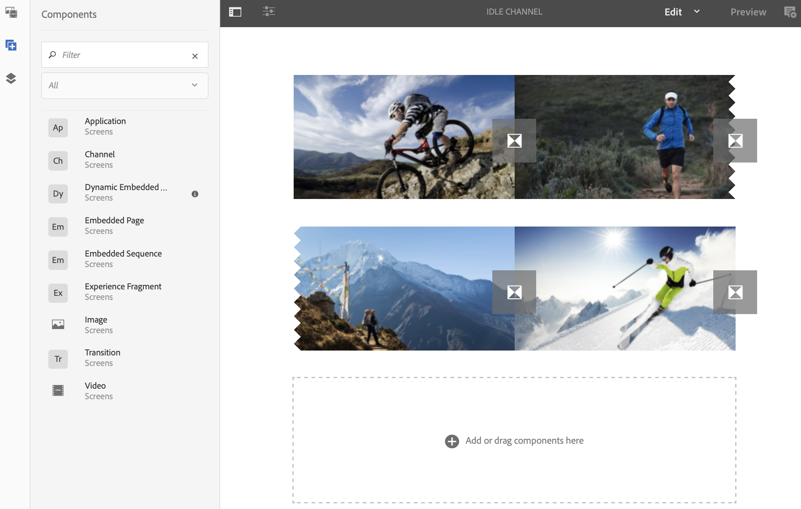

# Aggiunta di componenti a un canale{#adding-components-to-a-channel}

I componenti sono gli elementi fondamentali dell&#39;esperienza di AEM (Adobe Experience Manager). Puoi utilizzare una serie di componenti e aggiungerla al canale in un progetto di AEM Screens.

## Componenti in AEM Screens {#components-in-aem-screens}

AEM Screens fornisce i vari componenti di AEM che possono essere utilizzati in un progetto Screens.

### Visualizzare i componenti AEM Screens {#viewing-aem-screens-components}

Ogni volta che crei un progetto AEM Screens, viene visualizzato un elenco dei componenti standard che possono essere aggiunti al progetto.

Per visualizzare i componenti standard al progetto Screens, segui i seguenti passaggi:

1. Seleziona il canale. Ad esempio,**We.Retail in Store** --> **Canali** --> **Canale inattivo**.

1. Fai clic su **Modifica** nella barra delle azioni per aprire l&#39;editor AEM.
1. Fai clic sull&#39;icona **+** nella barra laterale per aprire i componenti.
1. Vengono visualizzati tutti i componenti che sono inclusi per impostazione predefinita in un progetto AEM Screens, come mostrato nella figura qui sotto.

### Aggiunta di un nuovo componente {#adding-a-new-component}

AEM offre una serie di altri componenti. È sempre possibile aggiungere altri componenti (non inclusi per impostazione predefinita) al progetto, purché compatibili con AEM Screens.

L&#39;esempio seguente mostra l&#39;aggiunta di un componente Livefyre a un progetto AEM Screens:

1. Seleziona il canale a cui desideri aggiungere un nuovo componente. Ad esempio,**We.Retail in Store** --> **Canali** --> **Canale inattivo**.

1. Fai clic su **Modifica** nella barra delle azioni per aprire l&#39;editor.
1. Select **Design** mode.
1. Seleziona l&#39;intero editor di progettazione a destra e fai clic sul simbolo delle impostazioni per aprire la finestra di dialogo **Progettazione ParSys**.
1. Puoi selezionare i componenti che desideri importare nel tuo progetto AEM Screens. The following example shows the addition of **Livefyre** component to an AEM Screens project.

>[!NOTE]
>
>Allo stesso modo, puoi aggiungere un numero qualunque di altri nuovi componenti compatibili con il progetto AEM Screens.

## Nozioni fondamentali sui componenti AEM Screens {#understanding-aem-screen-components}

La sezione seguente descrive i componenti AEM Screens che puoi utilizzare nel tuo progetto.

>[!NOTE]
>
>Per visualizzare le proprietà di qualsiasi componente, seleziona il componente e fai clic sull&#39;icona a martello per aprire/visualizzare le proprietà.

### Applicazione {#application}

Il componente **Applicazione** consente di aggiungere un&#39;applicazione al tuo canale.

Il componente Applicazione ha le seguenti proprietà:

| **Proprietà** | **Descrizione** |
|---|---|
| ***Percorso dell&#39;applicazione*** | Seleziona il percorso assoluto in cui si trova l&#39;applicazione. |
| ***Durata (ms)*** | Seleziona la durata dell&#39;applicazione. Per impostazione predefinita, la durata è impostata su -1, ossia l’elemento viene eseguito per sempre (applicazione a pagina singola). Con il valore durata impostato a >0, si mostra l&#39;elemento per la durata specificata e quindi si passa a quello successiva. |

L&#39;esempio seguente mostra come incorporare il componente applicazione insieme all&#39;anteprima delle sue proprietà:

>[!NOTE]
>
>Fai riferimento all&#39;esempio precedente per visualizzare le proprietà di ogni componente qui sotto.

### Canale {#channel}

Il componente **Canale** consente di aggiungere un intero canale al progetto.

Il componente Canale ha le seguenti proprietà:

<table> 
 <tbody> 
  <tr> 
   <td><strong>Proprietà</strong></td> 
   <td><strong>Descrizione</strong></td> 
  </tr> 
  <tr> 
   <td><strong><em>Percorso del canale</em></strong></td> 
   <td>Seleziona questo percorso assoluto in cui si trova l'applicazione.  </td> 
  </tr> 
  <tr> 
   <td><strong><em>Durata (ms)</em></strong></td> 
   <td>Seleziona l’intera durata del canale. Impostando la durata su -1, il canale incorporato viene eseguito per tutta la lunghezza in un particolare canale.</td> 
  </tr> 
 </tbody> 
</table>

### Pagina incorporata {#embedded-page}

Una **Pagina incorporata** consente di aggiungere una pagina incorporata al progetto. Ad esempio, è possibile che si tratti di un&#39;applicazione web o un catalogo di prodotti.

La pagina incorporata ha le seguenti proprietà:

<table> 
 <tbody> 
  <tr> 
   <td><strong>Proprietà</strong></td> 
   <td><strong>Descrizione</strong></td> 
  </tr> 
  <tr> 
   <td><strong><em>Pagina Percorso  </em></strong></td> 
   <td>Questo percorso assoluto in cui si trova il canale.  </td> 
  </tr> 
  <tr> 
   <td><strong><em>Durata (ms)</em></strong></td> 
   <td>Seleziona l’intera durata del canale. Impostando la durata su -1, il canale incorporato viene eseguito per tutta la lunghezza in un particolare canale.</td> 
  </tr> 
 </tbody> 
</table>

### Sequenza incorporata {#embedded-sequence}

>[!NOTE]
>
>Refer to [Embedded Sequences](embedded-sequences.md) under Authoring Screens section, to learn in detail about embedded sequences.

Una sequenza incorporata consente di aggiungere un canale per sequenza incorporato all&#39;interno di un canale esistente (con altre risorse).

La Sequenza incorporata ha le seguenti proprietà di pagina:

<table> 
 <tbody> 
  <tr> 
   <td><strong>Proprietà</strong></td> 
   <td><strong>Descrizione</strong></td> 
  </tr> 
  <tr> 
   <td>Percorso del canale</td> 
   <td>Il percorso assoluto della sequenza che vuoi includere nel tuo canale.  </td> 
  </tr> 
  <tr> 
   <td><strong><em>Durata (ms)</em></strong></td> 
   <td>Seleziona l’intera durata del canale. Impostando la durata su -1, il canale incorporato viene eseguito per tutta la lunghezza in un particolare canale.</td> 
  </tr> 
  <tr> 
   <td><strong><em>Strategia</em></strong></td> 
   <td>Set it to <strong>original</strong> or <strong>single</strong>. Setting the value to <strong>original</strong> means that the subsequence will run fully on each cycle of the parent sequence. The other possible value is <strong>single</strong> and that would only show one item of the subsequence on each run (for instance, the 1st item on the first loop, 2nd item on the second loop, and so on.)</td> 
  </tr> 
 </tbody> 
</table>

### Sequenza incorporata dinamica {#dynamic-embedded-sequence}

Una sequenza incorporata dinamica consente di aggiungere una sequenza simile a quella indicata più sopra, ad eccezione del ruolo di canale.

Refer to [Embedded Sequences](embedded-sequences.md) under Authoring Screens section, to learn in detail about embedded sequences.

La sequenza dinamica incorporata ha le seguenti proprietà:

<table> 
 <tbody> 
  <tr> 
   <td><strong>Proprietà</strong></td> 
   <td><strong>Descrizione</strong></td> 
  </tr> 
  <tr> 
   <td><strong><em>Ruolo assegnazione canale</em></strong>  </td> 
   <td>Immetti il ruolo del canale.  </td> 
  </tr> 
  <tr> 
   <td><strong><em>Durata (ms)</em></strong></td> 
   <td>Seleziona l’intera durata del canale. Impostando la durata su -1, il canale incorporato viene eseguito per tutta la lunghezza in un particolare canale.</td> 
  </tr> 
  <tr> 
   <td><strong><em>Strategia</em></strong></td> 
   <td>Set it to <strong>original</strong> or <strong>single</strong>. Setting the value to <strong>original</strong> means that the subsequence will run fully on each cycle of the parent sequence. The other possible value is <strong>single</strong> and that would only show one item of the subsequence on each run (for instance, the 1st item on the first loop, 2nd item on the second loop, and so on.)</td> 
  </tr> 
 </tbody> 
</table>

### Immagine {#image}

Un&#39;immagine consente di aggiungere un&#39;immagine al tuo canale.

La risorsa immagine ha tre schede, ovvero **Immagine**, **Accessibilità** e **Sequenza**:

| **Proprietà** | **Descrizione** |
|---|---|
| **Immagine** |
| ***Risorsa immagine*** | Seleziona la risorsa immagine. |
| ***Titolo*** | Titolo dell&#39;immagine. |
| ***Collega a*** | Aggiungi un collegamento all&#39;immagine. |
| ***Descrizione*** | Breve descrizione dell&#39;immagine. |
| ***Dimensione*** | Dimensioni dell&#39;immagine. |
| **Accessibilità** |
| ***Testo alternativo*** | Testo alternativo all&#39;immagine. |
| **Sequenza** |
| ***Durata*** | Seleziona l&#39;intera durata dell&#39;immagine. Se si imposta la durata su -1, l’immagine incorporata verrà riprodotta per intero in un particolare canale. |

### Transizione {#transition}

Il componente Transizione consente di aggiungere una transizione al tuo progetto Screens.

Il componente Transizione ha le seguenti proprietà:

| **Proprietà** | **Descrizione** |
|---|---|
| ***Tipo*** | Il tipo di transizione tra l&#39;elemento prima e dopo. Può essere un effetto di dissolvenza, o un effetto di diapositiva da quattro diapositive dello schermo. |
| ***Durata (ms)*** | Seleziona l&#39;intera durata della transizione. Impostando la durata su -1, la transizione incorporata viene eseguita per tutta la lunghezza in un canale specifico. |

### Video {#video}

Il componente Video consente di aggiungere un video al tuo progetto Screens.

Il componente Video ha le seguenti proprietà:

<table> 
 <tbody> 
  <tr> 
   <td><strong>Proprietà</strong></td> 
   <td><strong>Descrizione</strong></td> 
  </tr> 
  <tr> 
   <td><em><strong>Risorsa video</strong></em></td> 
   <td>Seleziona il collegamento al video.</td> 
  </tr> 
  <tr> 
   <td><em><strong>Durata</strong></em></td> 
   <td>Seleziona la durata del video. Per impostazione predefinita, la durata è impostata su -1, ossia l’elemento viene eseguito per sempre. Con il valore durata impostato a &gt;0, si mostra l'elemento per la durata specificata e quindi si passa a quello successiva.  </td> 
  </tr> 
  <tr> 
   <td><em><strong>Rendering</strong></em></td> 
   <td>
Se la proporzione del video non è adatta allo schermo, puoi regolare il rendering su <strong>Contain</strong> (Contiene) o <strong>Cover</strong> (Copri).
 
<em>Contain</em> (Contieni) significa che viene visualizzato il video completo e che le aree mancanti vengono riempite con un bordo nero.
 
<em>Cover</em> (Copri) significa che il video copre l'intero campo, ma alcune parti che si estendono ai lati sono nascoste.
 </td> 
  </tr> 
  <tr> 
   <td><em><strong>Dimensione</strong></em></td> 
   <td>Dimensioni del video.</td> 
  </tr> 
 </tbody> 
</table>

