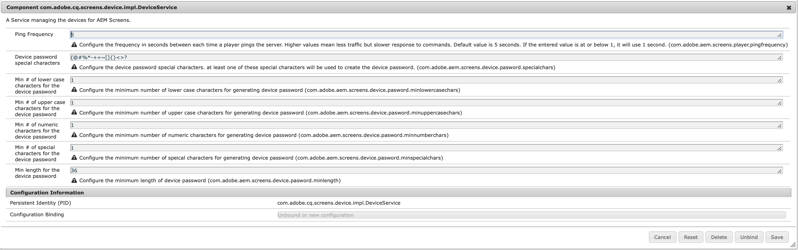

# Configuring and Deploying AEM Screens{#configuring-and-deploying-aem-screens}

Questa pagina mostra come installare e configurare i lettori Screens sui dispositivi e illustra i seguenti argomenti:

* Installazione di AEM Screens Player
* Configurazione server
* Linee guida sulla selezione hardware per il dispositivo di riproduzione
* Passaggi successivi

## Installazione di AEM Screens Player {#installing-aem-screens-player}

Il lettore AEM Screens è disponibile per Android, Chrome OS, iOS e Windows.

Per scaricare **AEM Screens Player**, visita la pagina dei download [**di **](https://download.macromedia.com/screens/)AEM 6.4 Player.

>[!NOTE]
>
>Una volta scaricata la versione più recente di Player (*.exe*), segui i passaggi del lettore per completare l&#39;installazione ad hoc:
>
>1. Tenete premuto sull’angolo in alto a sinistra per aprire il pannello di amministrazione.
>1. Andate a **Configurazione** dal menu delle azioni a sinistra e immettete l&#39;indirizzo della posizione dell&#39;istanza AEM in **Server** , quindi fate clic su **Salva**.
   >
   >
1. Fai clic sul collegamento **Registrazione** dal menu delle azioni a sinistra e dai passaggi sottostanti per completare il processo di registrazione del dispositivo.
>

### Additional Resources {#additional-resources}

Per ulteriori informazioni, consultate i seguenti argomenti:

* Per scaricare Android Player, visita **Google Play**. Per informazioni sull&#39;implementazione di Android Watchdog, fare riferimento a **[Implementazione del lettore](implementing-android-player.md)**Android.

* Per implementare Chrome OS Player, fare riferimento a [Chrome Management Console](implementing-chrome-os-player.md) per ulteriori informazioni.
* Per configurare il lettore Windows di AEM Screens, consultate [Implementazione di Windows Player](implementing-windows-player.md).

## Server Configuration {#server-configuration}

>[!NOTE]
>
>**Importante**:
>
>Il lettore AEM Screens non utilizza il token CSRF (Cross-Site Request Forgery). Per poter configurare e utilizzare AEM Server per AEM Screens, ignorate il filtro di riferimento consentendo riferimenti vuoti.

### Prerequisiti {#prerequisites}

I seguenti punti chiave aiutano a configurare e il server AEM da usare per AEM Screens:

#### Consenti richieste referente vuote {#allow-empty-referrer-requests}

Seguite i passaggi riportati di seguito per attivare il filtro Apache Sling Referrer Consenti nullo. Questo è richiesto per un funzionamento ottimale del protocollo di controllo tra AEM Screens Player e il server AEM Screens.

1. Passa a **Configurazione della console Web di Adobe Experience Manager **tramite l&#39;istanza di AEM —> icona del martello —> **Operazioni** —> Console **** Web.

   

1. **Viene aperta la configurazione** della console Web di Adobe Experience Manager. Cerca referrer di fionda.

   Per cercare la proprietà sling referrer, premere **Comando+F** per **Mac** e **Ctrl+F** per **Windows**.

   

1. Selezionare l&#39;opzione **Consenti valori nulli** , come illustrato nella figura riportata di seguito.

   

1. Fate clic su **Salva** per attivare l&#39;opzione Consenti valori nulli per il filtro Apache Sling Referrer.

#### Abilita interfaccia utente touch per AEM Screens {#enable-touch-ui-for-aem-screens}

AEM Screens richiede l’interfaccia utente TOUCH e non funziona con l’interfaccia classica di Adobe Experience Manager (AEM).

1. Passa a *&lt;istanzaAutore>/system/console/configMgr/com.day.cq.wcm.core.impl.AuthoringUIModeServiceImpl*
1. Verificate che la modalità **interfaccia utente di authoring** predefinita sia impostata su **TOUCH**, come illustrato nella figura seguente

In alternativa, puoi eseguire la stessa impostazione anche utilizzando*&lt;istanzaAutore> *->* strumenti (icona a forma di martello)* -> **Operazioni** ->Console **** Web e cercare il servizio **** WCM per la modalità dell’interfaccia utente di authoring.

>[!NOTE]
>
>Potete sempre attivare l’interfaccia classica per utenti specifici utilizzando le preferenze utente.

#### AEM in modalità di esecuzione NOSAMPLECONTENT {#aem-in-nosamplecontent-runmode}

L’esecuzione di AEM in produzione utilizza la modalità di esecuzione **NOSAMPLECONTENT** . Rimuovere l’intestazione *X-Frame-Options=SAMEORIGIN* (nella sezione dell’intestazione della risposta aggiuntiva) da

[http://localhost:4502/system/console/configMgr/org.apache.sling.engine.impl.SlingMainServlet](http://localhost:4502/system/console/configMgr/org.apache.sling.engine.impl.SlingMainServlet).

Questo è richiesto per la riproduzione dei canali online da parte di AEM Screens Player.

#### Restrizioni per la password {#password-restrictions}

Con le ultime modifiche apportate a ***DeviceServiceImpl***, non è necessario rimuovere le restrizioni relative alla password.

Puoi configurare ***DeviceServiceImpl*** dal collegamento seguente per abilitare la limitazione della password durante la creazione della password per gli utenti del dispositivo dello schermo:

[http://localhost:4502/system/console/configMgr/com.adobe.cq.screens.device.impl.DeviceService](http://localhost:4502/system/console/configMgr/com.adobe.cq.screens.device.impl.DeviceService)

Segui i passaggi indicati di seguito per configurare ***DeviceServiceImpl***:

1. Passa alla configurazione **della console Web di** Adobe Experience Manager tramite l’istanza di AEM —> icona a forma di martello —> **Operazioni** —> Console **** Web.

1. **Viene aperta la configurazione** della console Web di Adobe Experience Manager. Cercare il servizio di assistenza. Per effettuare una ricerca nella proprietà, premere **Comando+F** per **Mac** e **Ctrl+F** per **Windows**.

#### Dispatcher Configuration {#dispatcher-configuration}

Per **Dispatcher, **aggiungere intestazioni client a .any file. Consentite le seguenti intestazioni:

* &quot;X-Required-With&quot;
* &quot;X-SET-HEARTBEAT&quot;
* &quot;X-REQUEST-COMMAND&quot;

#### Codifica Java {#java-encoding}

Impostare la codifica ****** Java su Unicode. Ad esempio, *Dfile.encoding=Cp1252* non funzionerà.

>[!NOTE]
>
>**Consiglio:**
>
>Si consiglia di utilizzare HTTPS per AEM Screens Server in fase di produzione.

## Linee guida sulla selezione hardware per il dispositivo di riproduzione {#hardware-selection-guidelines-for-player-device}

La sezione seguente illustra le linee guida per la selezione dell&#39;hardware per un progetto Screens:

* Produrre sempre componenti ***commerciali*** o ***industriali*** sia per il lettore PC che per il pannello di visualizzazione o per il proiettore.

* Interagisci sempre con i fornitori che operano nel mercato del digital signage.
* Considerare sempre fattori ambientali come la temperatura ambiente e l&#39;umidità relativa.
* Controllare sempre i requisiti di alimentazione e il condizionamento.
* Esaminare attentamente le esigenze di prestazioni e le porte I/O necessarie per l&#39;applicazione.

Nella tabella seguente sono riepilogate le configurazioni hardware con i casi di utilizzo tipici per un progetto AEM Screens:

<table> 
 <tbody> 
  <tr> 
   <td>Configurazione del lettore</td> 
   <td>Processore</td> 
   <td>Memoria</td> 
   <td>SSD di storage</td> 
   <td>GPU</td> 
   <td>Visualizzazione</td> 
   <td>I/O</td> 
   <td>Casi di utilizzo tipici</td> 
  </tr> 
  <tr> 
   <td>Base</td> 
   <td>Processore Intel® Atom dual-core, i3 o quad-core entry-level</td> 
   <td>
4 GB di memoria
 
2 MB di cache
 </td> 
   <td>
・ ChromeOS 32 GB
 
・ Windows 128 GB
 </td> 
   <td>OnBoard</td> 
   <td>1920x1080</td> 
   <td>DVI,   Ethernet / Wireless,  2 x USB</td> 
   <td> 
    <ul> 
     <li>Ciclo a schermo intero standard   </li> 
     <li>Frazionamento</li> 
    </ul> </td> 
  </tr> 
  <tr> 
   <td>Standard</td> 
   <td>Processore quad core, Intel® Core i5</td> 
   <td>
8 GB di memoria
 
4 MB di cache
 </td> 
   <td>128 GBB</td> 
   <td>OnBoard</td> 
   <td>3840x2160 (4K)</td> 
   <td>DVI, HDMI  Ethernet / Wireless,  2 x USB</td> 
   <td> 
    <ul> 
     <li>Contenuto dinamico sorgente singola </li> 
     <li>Semplice interattivo</li> 
     <li> 1-3 Layout delle aree</li> 
    </ul> </td> 
  </tr> 
  <tr> 
   <td>Avanzate</td> 
   <td>Quad Core con hyperthreading, processore Intel® Core i7</td> 
   <td>
16 GB di memoria
 
8 MB di cache
 </td> 
   <td>256 GB</td> 
   <td>GPU discreta</td> 
   <td>3840x2160 (4K)</td> 
   <td>DVI, HDMI  Ethernet / Wireless,  4 x USB</td> 
   <td> 
    <ul> 
     <li>4 o più aree contenuto, riproduzione video simultanea</li> 
     <li> Interattivo multipagina</li> 
     <li>Attivatori di dati multi-sorgente</li> 
    </ul> </td> 
  </tr> 
 </tbody> 
</table>

## Passaggi successivi {#the-next-steps}

Dopo aver installato e configurato il lettore Screens, segui gli argomenti seguenti per iniziare:

1. [Creare e gestire il progetto Screens](creating-a-screens-project.md)
1. [Creare e gestire canali](managing-channels.md)
1. [Creare e gestire le posizioni](managing-locations.md)
1. [Creare e gestire le visualizzazioni](managing-displays.md)
1. [Assegna canali](channel-assignment.md)
1. [Gestisci dispositivi](managing-devices.md)
1. [Registrazione di un dispositivo](device-registration.md)
1. [Assegna dispositivi](managing-devices.md)
1. [Creare e gestire le pianificazioni](managing-schedules.md)
1. [Lettore AEM Screens](working-with-screens-player.md)
1. [Risoluzione dei problemi relativi a Device Control Center](monitoring-screens.md)

