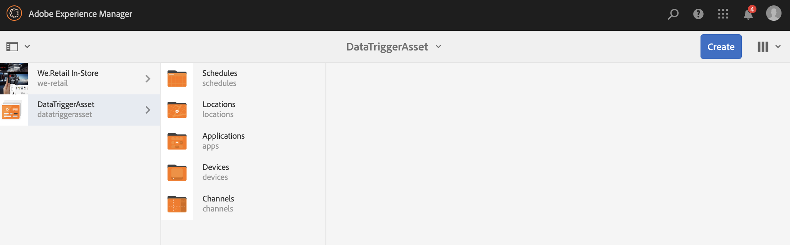

# Modifica risorsa attivata dai dati{#data-triggered-asset-change}

## Descrizione di un caso d’uso {#use-case-description}

Questo esempio descrive come ottenere contenuti personalizzati in base alle condizioni meteo della propria posizione.

Il seguente progetto AEM Screens sfrutta la personalizzazione AEM, che include ContextHub, il motore di segmentazione e l&#39;interfaccia utente di Content Targeting.

Questo caso d&#39;uso fornisce contenuti personalizzati in base al tempo corrente in ogni posizione, se il tempo è:

* *soleggiato, mostra vestiti estivi*
* *freddo, visualizza abbigliamento invernale*

>[!NOTE]
>
>A scopo dimostrativo, questo caso di utilizzo acquisisce la geolocalità per mostrare l’aggiornamento del contenuto. Potete aggiornare manualmente la visualizzazione Geolocalità dell’output in diversi scenari.

### Premesse {#preconditions}

Prima di iniziare questo caso di utilizzo, verifica di aver compreso:

* [Personalizzazione](/help/sites-administering/personalization.md)
* [Configurazione di ContextHub](/help/sites-administering/contexthub-config.md)
* [Configurazione della segmentazione con ContextHub](/help/sites-administering/segmentation.md)
* [Creazione di contenuti mirati utilizzando la modalità Targeting](/help/sites-authoring/content-targeting-touch.md)

### Attori primari {#primary-actors}

Autori contenuto

## Flusso di base:Impostazione del progetto {#basic-flow-setting-up-the-project}

Per impostare un progetto che mostri i dati che hanno attivato la modifica delle risorse, effettuate le seguenti operazioni:

1. Crea un progetto AEM Screens denominato **DataTriggerAsset**, come illustrato di seguito.

   

1. **Creazione di un canale di sequenza**

   1. Selezionate la cartella **Canali** e fate clic su **Crea** per aprire la procedura guidata per creare un canale.
   1. Selezionate Canale **** sequenza dalla procedura guidata e create il canale denominato **DataTrigger**.
   

1. **Aggiunta di contenuto al canale della sequenza**

   1. Selezionare il canale **DataTrigger**.
   1. Fai clic su **Modifica** nella barra delle azioni per aprire l&#39;editor. Trascinate alcune risorse sul canale.
   

   >[!NOTE]
   >
   >È necessario aggiungere solo le immagini predefinite all&#39;editor. Le immagini da sostituire devono essere aggiunte all&#39;editor quando si passa alla modalità di targeting nel passaggio (6).

1. **Impostazione delle configurazioni ContextHub e Targeting**

   1. Passa a **DataTriggerAsset** —> **Canali** —> **DataTrigger** e fai clic su **Proprietà** dalla barra delle azioni.
   1. Fate clic sulla scheda **Personalizzazione** .
   

1. **Aggiunta di configurazioni ContextHub e Targeting**

   1. A scopo dimostrativo, scaricate il pacchetto di contenuti di seguito.
   1. Dopo aver scaricato il pacchetto nell’istanza di AEM, è necessario impostare il percorso ContextHub e Segments:
   * Per **ContextHub**, imposta il percorso su: ***/libs/settings/cloudsettings/legacy/contexthub***
   * Per Percorso **** segmenti, imposta il percorso su: ***/conf/data-triggers/settings/wcm/segment***
   Attivatori di dati

   [Ottieni file](assets/data-triggers-1_00.zip)

   >[!NOTE]
   >
   >Per informazioni sulla configurazione di ContextHub e Segmentazione, fare riferimento a:
   >
   >* [Configurazione di ContextHub](/help/sites-administering/contexthub-config.md)
   >* [Configurazione della segmentazione con ContextHub](/help/sites-administering/segmentation.md)

   

   Fate clic su **Salva e chiudi**.

1. **Passaggio alla modalità di targeting**

   1. Passa a **DataTriggerAsset** > **Canali** > **DataTrigger** e fai clic su **Modifica** dalla barra delle azioni.
   1. Selezionate **Targeting** dalla barra dei menu in **Modifica**.
   

1. **Aggiunta di contenuto di destinazione**

   1. Selezionare **attivatori** di dati in **BRAND** e **Trigger dati stagionali **in **ATTIVITÀ**.
   1. Click the **Start Targeting**
   

1. **Definizione del componente di destinazione**

   1. Selezionate il componente per il quale desiderate avere un contenuto con targeting.
   1. Fate clic sul pulsante **Target** per abilitare il targeting per quel componente.
   1. Definite il contenuto per ciascuna variante selezionando la variazione nel **pubblico** nella barra laterale e regolando il contenuto in base alle esigenze.
   >[!NOTE]
   >
   >Per nascondere il pannello **Risorse** nell’editor, dovrete fare clic sulla freccia sinistra sul pannello a destra, come illustrato nella figura seguente.

   

## Visualizzazione dei risultati {#viewing-the-results}

Una volta completati i passaggi precedenti, seguite la procedura dettagliata per visualizzare in anteprima i risultati:

1. Fate clic su **Anteprima** dall’editor.

   

1. Per visualizzare il modo in cui l&#39;immagine cambia, a seconda della posizione e della temperatura dell&#39;area, potete fare clic manualmente sull&#39;icona ContextHub, come mostrato di seguito.

   Non appena si aggiorna la posizione, la temperatura di quell&#39;area viene catturata e l&#39;immagine si aggiorna con la selezione invernale e sostituisce l&#39;immagine di selezione estiva.

   

