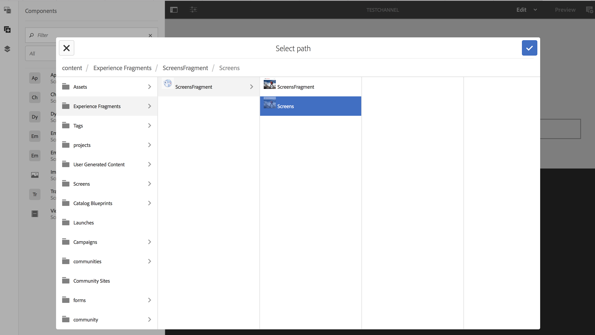

# Utilizzo di Frammenti esperienza{#using-experience-fragments}

L’utilizzo di frammenti esperienza illustra i seguenti argomenti:

* **Panoramica**
* **Utilizzo dei frammenti esperienza in AEM Screens**
* **Propagazione delle modifiche dalla pagina master**

## Panoramica {#overview}

Un ***Frammento esperienza*** è un gruppo di uno o più componenti, che include contenuto e layout, a cui è possibile fare riferimento tra le pagine. I frammenti esperienza possono includere qualsiasi componente singolo o multiplo, che contenga elementi all&#39;interno di un sistema di paragrafi e a cui si fa riferimento nell&#39;esperienza completa o che viene richiesto da un punto finale terzo.

## Utilizzo dei frammenti esperienza in AEM Screens {#using-experience-fragments-in-aem-screens}

>[!NOTE]
>
>Nell&#39;esempio seguente viene utilizzato **We.Retail** come progetto dimostrativo da cui il frammento esperienza viene sfruttato da una pagina **Siti** a un progetto AEM Screens.

Ad esempio, il seguente flusso di lavoro illustra l&#39;utilizzo di frammenti esperienza di We.Retail in Sites. Potete scegliere una pagina Web e sfruttare tale contenuto nel canale AEM Screens su uno dei vostri progetti.

### Prerequisiti {#pre-requisites}

**Creazione di un progetto dimostrativo con un canale**

***Creazione di un progetto***

1. Click Screens and select **Create** --> **Create Project **to create a new project.

1. Selezionare **Screens **dalla procedura guidata **Create Screens Project **Wizard.

1. Inserisci come titolo **DemoProject**.
1. Fai clic su **Crea**.

Un **DemoProject** verrà aggiunto alle schermate AEM.  ***Creazione di un canale***

1. Navigate to the **DemoProject** you created and select the **Channels** folder.

1. Click **Create** from the action bar (see the figure below). Si apre una procedura guidata.
1. Choose the **Sequence Channel** and click **Next**.

1. Enter the **Title** as **TestChannel** and click **Create**.

Verrà aggiunto un **TestChannel** al **DemoProject**.\

>[!NOTE]
>
>Per informazioni dettagliate sulla creazione di un progetto e la creazione di un canale, consultate [Creazione di un progetto](creating-a-screens-project.md) e [Gestione dei canali](managing-channels.md) rispettivamente.

### Creazione di un frammento esperienza {#creating-an-experience-fragment}

Seguite i passaggi riportati di seguito per sfruttare il contenuto da **We.Retail** al **TestChannel** in **DemoProject**.

1. **Passare a una pagina Siti in We.Retail**

   1. Accedi a Siti e seleziona **We.Retail **->** Stati Uniti **->**English **e seleziona la pagina **Apparecchiature** per utilizzarlo come frammento esperienza per il canale Screens.
   1. Fai clic su **Modifica** nella barra delle azioni per aprire la pagina da utilizzare come frammento esperienza per il canale Screens.
   

1. **Riutilizzo del contenuto**

   1. Selezionare il frammento da includere nel canale.
   1. Fate clic sull&#39;ultima icona da destra per aprire la finestra di dialogo **Converti in frammento** esperienza.
   

1. **Creazione di un frammento esperienza**

   1. Scegliete l&#39; **azione** come **Crea un nuovo frammento** esperienza.
   1. Selezionare il percorso **** padre.
   1. Select the **Template**. Scegliete il modello **We.Retail** qui.
   1. Enter the **Fragment Title **as **ScreensFragment**.
   1. Fate clic sul segno di spunta per completare la creazione di un nuovo frammento esperienza.
   

1. **Creazione di Live Copy di frammenti esperienza**

   1. Andate alla home page di AEM.
   1. Selezionate Frammenti **** esperienza ed evidenziate il frammento **Screens** e fate clic su **Variazione come Live Copy**, come illustrato nella figura seguente:
   

   c. Selezionate la procedura guidata** ScreensFragment (Frammento schermate) **dalla** procedura guidata Create Live Copy*** e fate clic su **Next (Avanti)**.

   d. Immettete il **titolo** e il **nome** come **schermate**.

   e. Fate clic su **Crea** per creare la Live Copy.

   

1. **Utilizzo di frammenti esperienza nel canale Screens**

   1. Passare al canale Screens in cui si desidera utilizzare il frammento **Screens** .
   1. Selezionate **TestChannel** e fate clic su **Modifica** dalla barra.
   1. Fate clic sull’icona dei componenti dalla scheda laterale.
   1. Trascinare la pagina **** incorporata sul canale.
   

   e. Selezionate il componente Pagina **** incorporata e fate clic sull’icona in alto a sinistra (chiave inglese) per aprire la finestra di dialogo **Pagina** .

   f. Selezionare la Live Copy **Screens** del frammento creato al *Passaggio 3* nel campo **Path **Path.

   

   h. Immettete i secondi nel campo** Durata**.

   
i. Fare clic sul segno di spunta per completare il processo.

   

### Convalida del risultato {#validating-the-result}

Dopo aver completato i passaggi preliminari, potete convalidare il frammento esperienza in **TestChannel** effettuando le seguenti operazioni:

1. Passaggio al **TestChannel**.
1. Selezione dell&#39; **anteprima** dalla barra delle azioni.

Il contenuto verrà visualizzato dalla pagina **Siti** (Live Copy del frammento esperienza) del canale, come illustrato nella figura seguente:\

## Propagazione delle modifiche dalla pagina master {#propagating-changes-from-the-master-page}

***Live Copy*** si riferisce alla copia (dell&#39;origine), gestita mediante azioni di sincronizzazione come definito dalle configurazioni di rollout.

Poiché il frammento esperienza è una live copy creata dalle pagine **Siti** , se apporti modifiche a quel particolare frammento dalla pagina master, visualizzerai le modifiche nel canale o nella destinazione in cui hai utilizzato il frammento esperienza.

>[!NOTE]
>
>Per ulteriori informazioni su Live Copy, consultate [Riutilizzo dei contenuti: Multi Site Manager e Live Copy](/help/sites-administering/msm.md).

Per estendere le modifiche dal canale principale al canale di destinazione, effettuate le seguenti operazioni:

1. Selezionate il frammento esperienza dalla pagina **Siti** (master) e fate clic sull&#39;icona matita per modificare gli elementi nel frammento esperienza.

   

1. Selezionate il frammento esperienza e fate clic sull’icona chiave inglese per aprire la finestra di dialogo per modificare le immagini.

   

1. Viene visualizzata la finestra di dialogo Griglia **** prodotto.

   

1. Potete modificare qualsiasi immagine. Ad esempio, in questo frammento viene sostituita la prima immagine.

   

1. Selezionate il frammento esperienza e fate clic sull&#39;icona Rollout per estendere le modifiche al frammento utilizzato nel canale.

   

1. Fate clic su Rollout per confermare le modifiche.

   Le modifiche verranno implementate.

   

### Convalida delle modifiche {#validating-the-changes}

Per confermare le modifiche apportate al canale, effettuate le seguenti operazioni:

1. Passare a **Screens** -> **Channels** -> **TestChannel**.

1. Fate clic su **Anteprima** dalla barra delle azioni per confermare le modifiche.

L’immagine seguente illustra le modifiche apportate a **TestChannel**:\

