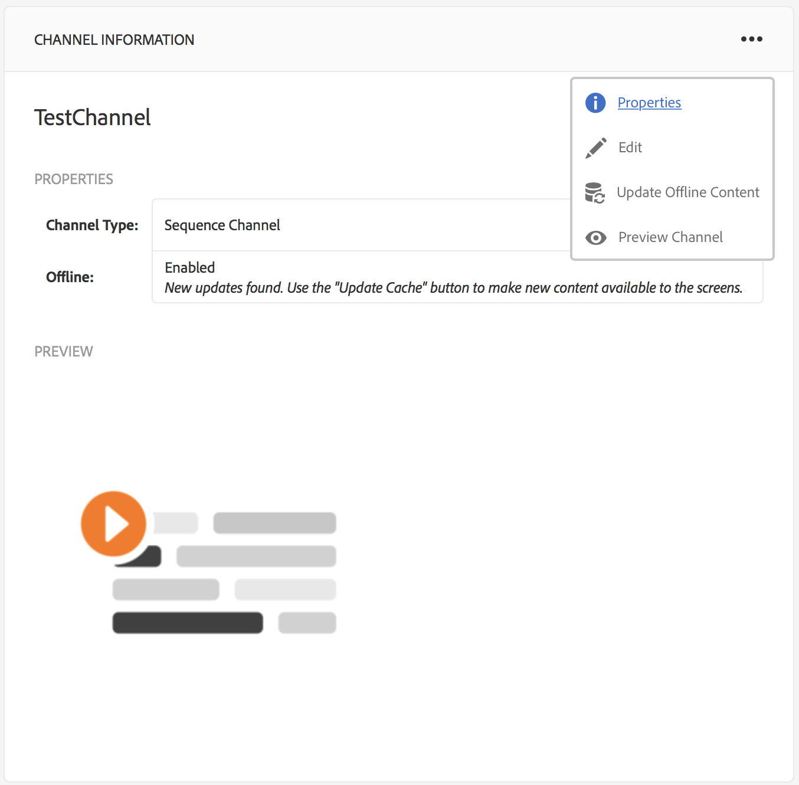
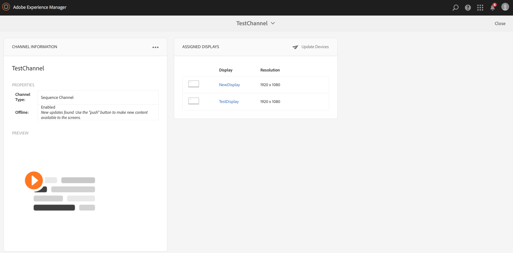
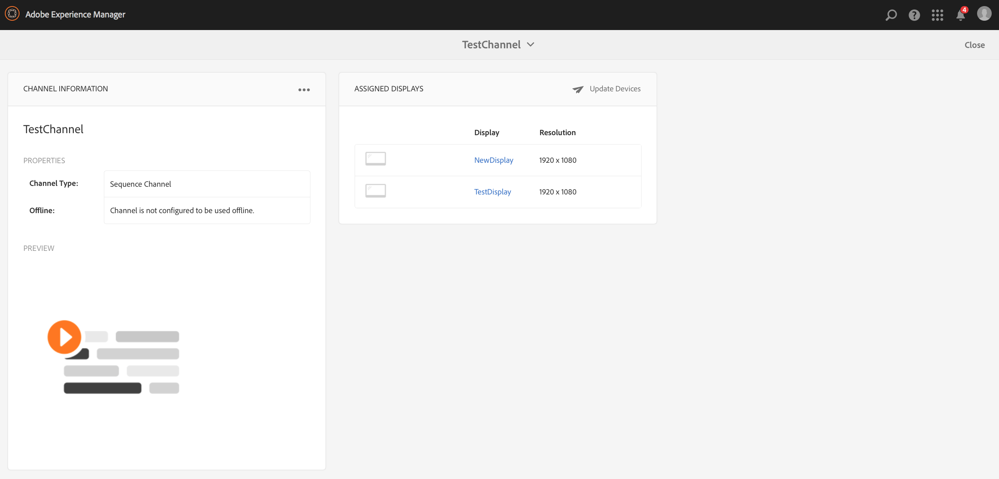

# Creazione e gestione dei canali{#creating-and-managing-channels}

Un canale visualizza una sequenza di contenuti e visualizza immagini e video, ma può anche visualizzare un sito Web o un’applicazione a pagina singola.

In questa pagina viene mostrata la creazione e la gestione dei canali per Screens.

**Prerequisiti**:

* [Configurazione e distribuzione di Screens](configuring-screens-introduction.md)
* [Creazione e gestione del progetto Screens](creating-a-screens-project.md)

## Creazione di un nuovo canale {#creating-a-new-channel}

Una volta creato il progetto per Screens, segui i passaggi descritti di seguito per creare un nuovo Canale per un progetto Screens:

1. Seleziona il collegamento ad Adobe Experience Manager (in alto a sinistra) e quindi Screens. In alternativa, potete navigare direttamente da `http://localhost:4502/screens.html/content/screens`
1. Accedi al progetto Screens e fai clic su **Canali**.
1. Click **Create** next to the plus icon in the action bar. Si aprirà una procedura guidata (*Per ulteriori informazioni vedi Tipi di Canali*).

1. Select the template from the wizard and click **Next**.
1. Enter the properties for **Title and Tags**, **More Titles and Description**, **On/Off Time**, and **Vanity URL**.

1. Fai clic su **Crea** e il canale verrà creato e aggiunto alla cartella dei canali.

### Tipi di canale {#channel-types}

Le seguenti opzioni di modello sono disponibili durante l&#39;uso della procedura guidata:

| **Opzione modello**  | **Descrizione** |
|---|---|
| Cartella canali | Consente di creare una cartella per memorizzare la raccolta dei canali. |
| Canale per sequenza | Consente di creare un canale che riproduce in sequenza i componenti (uno a uno in una presentazione). |
| Canale di applicazione | Consente di mostrare la tua applicazione web personalizzata in Screens Player. |
| Canale schermo diviso 1x1 | Consente di visualizzare il componente in una singola area. |
| Canale schermo diviso 1x2 | Consente di visualizzare le risorse in due aree (suddivise in orizzontale). |
| Canale schermo diviso 2x2 | Consente di visualizzare le risorse in quattro aree (suddivise orizzontalmente e verticalmente in una matrice). |
| Canale schermo diviso da 2 a 3 | Consente di visualizzare le risorse in due aree (suddivise in orizzontale) con una delle aree più grandi dell’altra. |

>[!NOTE]
>
>I canali Dividi schermo suddividono la visualizzazione in più zone in modo da poter riprodurre più esperienze contemporaneamente, affiancate. Le esperienze possono essere risorse statiche/testo o sequenze incorporate.

The following example shows the creation of a Sequence Channel **ChannelOne** for a Screens project **DemoProject**.

>[!NOTE]
>
>Puoi creare zone diverse utilizzando le opzioni modello, come gli schermi divisi 2x2, 1x2 o da 2 a 3 citati sopra.

***Importante***:

Dopo aver creato e aggiunto contenuto al canale, il passaggio successivo consiste nel creare una posizione seguita dalla creazione di una visualizzazione. Inoltre, è necessario assegnare quel canale a una visualizzazione. Per ulteriori informazioni, vedi le risorse riportate di seguito alla fine della sezione.

## Utilizzo dei canali {#working-with-channels}

Puoi modificare, visualizzare le proprietà e il dashboard, copiare, visualizzare in anteprima e eliminare un canale.

>[!NOTE]
>
>Fai clic sull&#39;icona a sinistra per selezionare un elemento. Ad esempio, fate clic sull&#39;icona del canale ed esegui le seguenti operazioni, come mostrato nella figura seguente.

### Aggiunta/Modifica di contenuti a un Canale {#adding-editing-content-to-a-channel}

Per aggiungere o modificare il contenuto di un canale, segui i passaggi riportati di seguito:

1. Fate clic sul canale da modificare (come illustrato nella figura precedente).
1. Click **Edit** from the top left corner of the action bar to edit the channel properties. Si apre l&#39;editor che consente di aggiungere risorse/componenti al canale che desideri pubblicare.

**Caricamento di video sul canale** Seguite la procedura riportata di seguito per caricare i video sul canale:

1. Seleziona il canale in cui desideri caricare il video.
1. Fai clic su **Modifica** nella barra delle azioni per aprire l&#39;editor.
1. Seleziona **Video** sotto Risorse, poi trascina e rilascia i video richiesti.

>[!NOTE]
>
>Se riscontri problemi a caricare i video sul tuo canale, vedi [Risoluzione dei problemi video](troubleshoot-videos.md) in Gestione Screens.

### Visualizzazione delle proprietà {#viewing-properties}

Per visualizzare o modificare le proprietà di un canale, segui i passaggi riportati di seguito:

1. Fate clic sul canale da modificare.
1. Fare clic su **Properties **dalla barra di azione per visualizzare/modificare le proprietà del canale. Le seguenti schede consentono di modificare le opzioni.

### Visualizzazione del dashboard {#viewing-dashboard}

Per visualizzare il dashboard di un canale, segui i passaggi riportati di seguito:

1. Fate clic sul canale da modificare.
1. Click **View Dashboard** from the action bar to view the dashobard. Si apre il pannello **Informazioni canale** e **Visualizzazioni assegnate**, come illustrato nella figura seguente:

### Informazioni canale {#channel-information}

Il pannello Informazioni canale descrive le proprietà Canale e l’anteprima sul canale. Inoltre, il pannello offre informazioni che notificano se il canale è offline o online.

Fai clic su (**...**) nella barra delle azioni **Informazioni canale** per visualizzare le proprietà, modificare il contenuto o aggiornare la cache (contenuto offline) per il canale.

### Canali online e offline {#online-and-offline-channels}

>[!NOTE]
>
>Per impostazione predefinita, quando create un canale, il canale è Offline.

Quando crei un canale, puoi definirlo un canale online o offline.

Un ***Canale online*** mostra il contenuto aggiornato in ambiente in tempo reale, mentre in ***Canale offline*** mostra il contenuto della cache.

Segui i passaggi riportati di seguito per rendere online il canale:

1. Andate alla cartella canale **TestChannel** dalla cartella **Channels** del **TestProject**.

   Seleziona il canale.

   

   Fai clic su **Visualizza dashboard** nella barra delle azioni per visualizzare lo stato del lettore. Il pannello **CHANNEL INFORMATION **fornisce informazioni sulla disponibilità del canale online o offline.

   

1. Fai clic su **Proprietà** nella barra delle azioni e accedi alla scheda **Canali** come illustrato di seguito:

   

1. Controllare il canale **Make online** per rendere il canale online.

   Fai clic su **Salva e chiudi** per salvare la tua opzione.

   

   Le visualizzazioni del dashboard per canale e il pannello **Informazioni canale** mostrano lo stato online del lettore.

   

#### Aggiornamenti automatici e manuali dal dashboard del dispositivo {#automatic-versus-manual-updates-from-the-device-dashboard}

La tabella seguente riassume gli eventi associati agli aggiornamenti automatici e manuali dal dashboard del dispositivo.

<table> 
 <tbody> 
  <tr> 
   <td><strong>Evento</strong></td> 
   <td><strong>Aggiornamento automatico dispositivo</strong></td> 
   <td><strong>Aggiornamento manuale dispositivo</strong></td> 
  </tr> 
  <tr> 
   <td>Modifica nel canale online</td> 
   <td>Contenuto aggiornato automaticamente</td> 
   <td>
Contenuto aggiornato su "Dispositivo: Configurazione push"
 
Oppure,
 
Contenuto aggiornato sul <strong><i>dispositivo:Riavvia</i></strong>
 </td> 
  </tr> 
  <tr> 
   <td>Modifica nel canale offline ma il canale "Push Content" NON viene attivato (nessuna ricreazione del pacchetto offline)</td> 
   <td>Nessun aggiornamento contenuto</td> 
   <td>Nessun aggiornamento contenuto</td> 
  </tr> 
  <tr> 
   <td>Viene attivata la modifica nel canale offline e nel canale "Push Content" (nuovo pacchetto offline)</td> 
   <td>Contenuto aggiornato automaticamente</td> 
   <td>
Contenuto aggiornato sul <strong><i>dispositivo: Configurazione push</i></strong>
 
Oppure,
 
Contenuto aggiornato sul <strong><i>dispositivo:Riavvia</i></strong>
 </td> 
  </tr> 
  <tr> 
   <td>
Modifica nella configurazione
 
    <ul> 
     <li>Display (canale forzato)</li> 
     <li>Dispositivo</li> 
     <li>Assegnazione canali (nuovo canale, canale rimosso)</li> 
     <li>Assegnazione canale (ruolo, evento, pianificazione)</li> 
    </ul> </td> 
   <td>Configurazione aggiornata automaticamente</td> 
   <td>
Configurazione aggiornata sul <strong><i>dispositivo: Configurazione push</i></strong>
 
Oppure,
 
Configurazione aggiornata sul <strong><i>dispositivo:Riavvia</i></strong>
 </td> 
  </tr> 
 </tbody> 
</table>

### Visualizzazioni assegnate {#assigned-displays}

Il pannello visualizzazioni assegnate mostra la visualizzazione associata al canale. Fornisce un&#39;istantanea della visualizzazione assegnata insieme alla risoluzione.

Le visualizzazioni collegate sono elencate nel pannello **Visualizzazioni assegnate**, come illustrato di seguito:

>[!NOTE]
>
>Per informazioni sulla creazione di una visualizzazione in una posizione, fare riferimento a:
>
>* [Creare e gestire le posizioni](managing-locations.md)
>* [Creare e gestire le visualizzazioni](managing-displays.md)
>

Inoltre, fai clic sulla visualizzazione nel pannello **Visualizzazioni assegnate**, per visualizzare le informazioni sulla visualizzazione, come illustrato di seguito:

### Passaggi successivi {#the-next-steps}

Dopo aver creato un canale, e aver aggiunto o modificato il contenuto, il passo successivo è imparare a creare un percorso e una visualizzazione. Inoltre, assegnare un canale a tale visualizzazione.

Per i passaggi successivi, consulta le risorse seguenti:

* [Creare e gestire canali](managing-channels.md)
* [Creare e gestire le posizioni](managing-locations.md)
* [Creare e gestire le visualizzazioni](managing-displays.md)