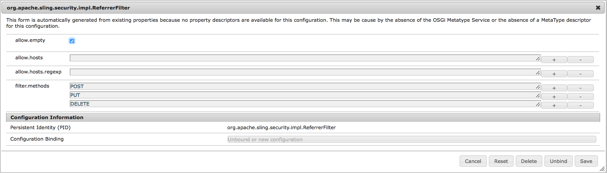

# Risoluzione dei problemi del Centro di controllo del dispositivo{#troubleshooting-device-control-center}

Puoi monitorare e risolvere i problemi di prestazioni per l&#39;attività del lettore e il dispositivo Screens utilizzando il dashboard del dispositivo. Questa pagina fornisce informazioni su come monitorare e risolvere eventuali problemi di prestazioni per il lettore Screens e i dispositivi assegnati.

## Monitoraggio e risoluzione dei problemi da Device Control Center {#monitor-and-troubleshoot-from-device-control-center}

È possibile monitorare l&#39;attività e quindi risolvere i problemi del lettore Screens, utilizzando Device Dashboard.

### Pannello dispositivo {#device-dashboard}

Seguite i passaggi riportati di seguito per passare al dashboard del dispositivo:

1. Navigate to the device dashboard from your project, for example, ***Test Project*** --> ***Devices***.

   Select **Devices** and **Device Manager** from the action bar.

   

1. Selezionare il dispositivo da monitorare.

   

1. La pagina mostra le informazioni sul dispositivo, l&#39;attività e i dettagli del dispositivo che consentono di monitorare le attività e le funzioni del dispositivo.

   

### Monitorare l&#39;attività del dispositivo {#monitor-device-activity}

Il pannello **Attività** mostra l&#39;ultimo ping del lettore di schermate con la marca temporale. L&#39;ultimo ping corrisponde all&#39;ultima volta che il dispositivo ha contattato il server.

Inoltre, fate clic su **Raccogli registri** nell’angolo in alto a destra del pannello **Attività** per visualizzare i registri del lettore.

### Aggiorna dettagli dispositivo {#update-device-details}

Controllare il pannello Dettagli **** dispositivo per visualizzare l&#39;IP del dispositivo, l&#39;utilizzo dello storage, la versione del firmware e il tempo di attività del lettore per il dispositivo.

Inoltre, fare clic su **Cancella cache** e **Aggiorna** per cancellare la cache del dispositivo e aggiornare la versione [firmware](screens-glossary.md) rispettivamente da questo pannello.

**Inoltre, fate clic sul**.. dall&#39;angolo superiore destro del pannello Dettagli **** dispositivo per riavviare o aggiornare lo stato del lettore.

### Aggiorna informazioni dispositivo {#update-device-information}

Controllate il pannello **INFORMAZIONI** DISPOSITIVO per visualizzare l&#39;aggiornamento della configurazione, il dispositivo, la piattaforma, la versione e il display associati al dispositivo.

Inoltre, fai clic su (**...**) nell&#39;angolo superiore destro del pannello Informazioni dispositivo per visualizzare le proprietà o aggiornare il dispositivo.

Fare clic su **Proprietà** per visualizzare la finestra di dialogo Proprietà **** dispositivo. Potete modificare il titolo del dispositivo o scegliere l&#39;opzione per gli aggiornamenti di configurazione come **Manuale** o **Automatico**.

>[!NOTE]
>
>Per ulteriori informazioni sugli eventi associati agli aggiornamenti automatici o manuali del dispositivo, consulta la sezione Aggiornamenti ***automatici e manuali dal Pannello*** di controllo del dispositivo in [Gestione dei canali](managing-channels.md).

### Visualizza schermata del lettore {#view-player-screenshot}

È possibile visualizzare la schermata del lettore dal dispositivo dal pannello **PLAYER SCREENSHOT **.

Fare clic (**...**) nell&#39;angolo superiore destro del pannello Screenshot del lettore e selezionare **Refresh Screenshot **per visualizzare l&#39;istantanea del lettore in esecuzione.

### Gestisci preferenze {#manage-preferences}

Il pannello **PREFERENZE** consente all&#39;utente di modificare le preferenze per l&#39;interfaccia utente **** Amministratore, **Channel Switcher** e **Remote Debugging** del dispositivo.

>[!NOTE]
>
>Per ulteriori informazioni su questa opzione, consulta Lettore AEM Screens.

Inoltre, fate clic su **Visualizza preferenze** nell’angolo in alto a destra per aggiornare l’URL del server e la risoluzione.

## Risoluzione dei problemi relativi alle impostazioni OSGI {#troubleshoot-osgi-settings}

È necessario abilitare il referente vuoto per consentire al dispositivo di inviare dati al server. Ad esempio, se la proprietà del referente vuoto è disabilitata, il dispositivo non può inviare una schermata indietro.

Attualmente alcune di queste funzioni sono disponibili solo se il filtro *Apache Sling Referrer Consenti valori nulli* è abilitato nel configurazione OSGI. Il dashboard potrebbe visualizzare un avviso che segnala che le impostazioni di protezione potrebbero impedire il funzionamento di alcune di queste funzioni.

Seguite i passaggi riportati di seguito per attivare il filtro Apache Sling Referrer Consenti vuoto

1. Passa alla configurazione [della console Web di](http://localhost:4502/system/console/configMgr/org.apache.sling.security.impl.ReferrerFilter)Adobe Experience Manager.
1. Selezionare l&#39;opzione **allow.empty **.
1. Fai clic su **Salva**.

### Consigli {#recommendations}

La sezione seguente raccomanda di monitorare i collegamenti di rete, il server e i lettori per comprendere lo stato e reagire ai problemi.

AEM fornisce il monitoraggio integrato per:

* *Heartbeat* ogni 5 secondi per indicare che AEM Screens Player è in funzione.
* *Screenshot* del lettore che mostra il contenuto visualizzato sul lettore.
* Versione firmware del lettore *AEM Screens* installata nel lettore.
* *Spazio* di archiviazione gratuito sul lettore.

Raccomandazioni per il monitoraggio remoto con software di terze parti:

* Utilizzo della CPU sui lettori.
* Verifica se è in esecuzione il processo AEM Screens Player.
* Riavvio/riavvio remoto del lettore.
* Notifiche in tempo reale.

Si consiglia di implementare l&#39;hardware e il sistema operativo Player in modo da consentire il login remoto per diagnosticare i problemi e riavviare il lettore.

#### Additional Resources {#additional-resources}

Consultate Configurazione della riproduzione [video e Risoluzione](troubleshoot-videos.md) dei problemi per eseguire il debug e risolvere i problemi relativi alla riproduzione di video nel canale.
