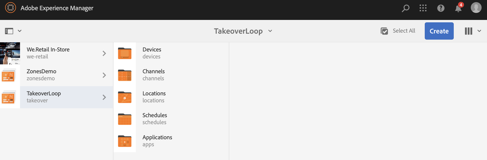

# Ciclo di acquisizione da zona a zona singola{#single-zoneto-multizone}

## Descrizione di un caso d’uso {#use-case-description}

In questa sezione viene illustrato un esempio di utilizzo che mette in evidenza come impostare un canale di layout con più zone che si alterna con un canale di layout a una singola area. Ogni canale dispone di risorse immagine/video in sequenza.

### Premesse {#preconditions}

Prima di iniziare questo caso di utilizzo, accertatevi di comprendere come:

* **[Creare e gestire canali](/help/screens/managing-channels.md)**
* **[Creare e gestire le posizioni](/help/screens/managing-locations.md)**
* **[Creare e gestire le pianificazioni](/help/screens/managing-schedules.md)**
* **[Registrazione dispositivo](/help/screens/device-registration.md)**

### Attori primari {#primary-actors}

Autori contenuto

## Impostazione del progetto {#setting-up-the-project}

Per impostare un progetto, effettuate le seguenti operazioni:

1. Crea un progetto AEM Screens denominato **TakeoverLoop**, come mostrato di seguito.

   >[!NOTE]
   >
   >Per ulteriori informazioni sulla creazione e la gestione di progetti in AEM Screens, consultate [Creazione di un progetto](/help/screens/creating-a-screens-project.md).

   

1. **Creazione di un canale di schermo diviso**

   1. Selezionate la cartella **Canali** e fate clic su **Crea** dalla barra delle azioni per aprire la procedura guidata per creare un canale.
   1. Selezionate **Sinistra-L Barra Dividi canale** schermo dalla procedura guidata e create il canale denominato **MultiZoneLayout**.

      

   1. Select the **MultiZoneLayout** channel and click **Edit** from the action bar to open the editor. Trascinate e rilasciate le risorse in ciascuna area. L’esempio seguente mostra un video, un’immagine e un banner di testo nel canale, come mostrato di seguito.
      

1. **Creazione di un canale 2X2 con quattro immagini**

   1. Selezionate la cartella **Canali** e fate clic su **Crea** dalla barra delle azioni per aprire la procedura guidata per creare un canale.

   1. Selezionate il modello **2X2 Split Screen Channel** (Canale **diviso schermo) dalla procedura guidata e create il canale denominato** TwobyTwoChannel.

      
   1. Selezionate il canale e fate clic su **Modifica** nella barra delle azioni per aprire l’editor e trascinate e rilasciate quattro immagini (quattro aree diverse) su tale canale, come mostrato di seguito.
      

1. **Creazione di un canale per schermo diviso 1X2 con due immagini**

   1. Selezionate la cartella **Canali** e fate clic su **Crea** dalla barra delle azioni per aprire la procedura guidata per creare un canale.

   1. Selezionate il modello **1X2 Split Screen Channel** (Canale **diviso schermo) dalla procedura guidata e create il canale denominato** OnebyTwoChannel.

      
   1. Selezionate il canale e fate clic su **Modifica** nella barra delle azioni per aprire l’editor e trascinate e rilasciate due immagini (due diverse zone) su tale canale, come mostrato di seguito.
      

1. **Creazione di un canale con un solo video a schermo intero**

   1. Selezionate la cartella **Canali** e fate clic su **Crea** dalla barra delle azioni per aprire la procedura guidata per creare un canale.

   1. Selezionate il modello Canale **** sequenza dalla procedura guidata e create il canale denominato **FullScreensVideo**.

      
   1. Selezionate il canale e fate clic su **Modifica** dalla barra delle azioni per aprire l’editor, quindi trascinate e rilasciate il componente video su tale canale, quindi aggiungete il video desiderato, come mostrato di seguito.
      