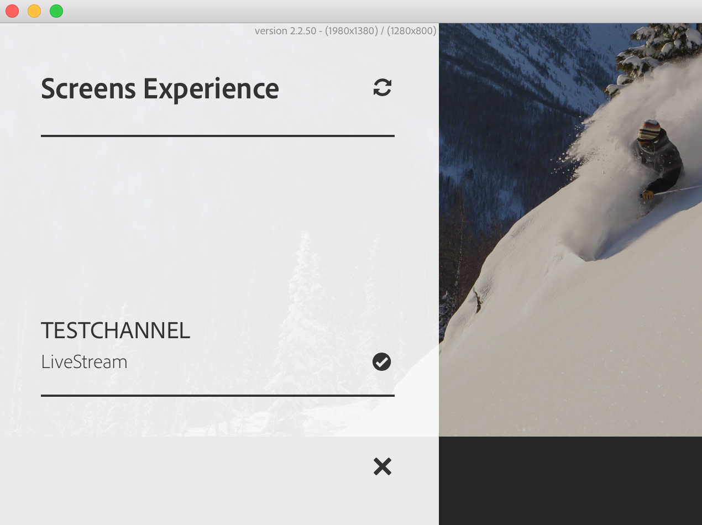

# Working with AEM Screens Player{#working-with-aem-screens-player}

Puoi gestire il contenuto del canale e altre impostazioni su AEM Screens Player.

>[!NOTE]
>
>Premi ***Ctrl+Cmd+F*** per uscire dalla modalità a schermo intero per OS X di AEM Screens Player.

Una volta assegnato un canale a una visualizzazione, AEM Screens Player mostra il contenuto. Puoi configurare le impostazioni per il lettore utilizzando le preferenze per l&#39;interfaccia utente dell&#39;amministratore (dal dashboard) o dal lettore stesso.

## Utilizzo del dashboard del dispositivo {#using-the-device-dashboard}

Puoi configurare le preferenze per il dispositivo dal dashboard del dispositivo, accessibile tramite l&#39;istanza di creazione AEM.

1. Navigate to the device dashboard from your project, for example, ***Test Project*** --> ***Devices***.

   Select **Devices** and **Device Manager** from the action bar.

   

1. Fai clic sul dispositivo per aprire il dashboard del dispositivo.

   

1. Check the **PREFERENCES** panel. You can enable/disable the **Admin UI** and **Channel Switcher** for your player from these two options.

   

### Interfaccia utente amministratore {#the-admin-ui}

Enabling the **Admin UI** from the preferences panel allows the user to open the admin settings from the Screens Player. Inoltre, disabilitando questa opzione dal dashboard del dispositivo, l&#39;utente non può aprire l&#39;interfaccia utente dell&#39;amministratore dal lettore.

Per visualizzare l&#39;interfaccia utente dell&#39;amministratore da Screens Player, tieni premuto nell&#39;angolo in alto a sinistra per aprire il menu dell&#39;amministratore, su AEM Screens Player abilitato al tocco o utilizzando il mouse. Mostra le informazioni dopo che la registrazione è stata completata e i canali sono stati caricati.

>[!NOTE]
>
>Inoltre, puoi visualizzare il tempo di attività dell&#39;applicazione AEM Screens Player per controllare lo stato dell&#39;applicazione.

Se si seleziona l&#39;opzione **Configurazione** dal menu laterale, da questa finestra di dialogo è possibile reimpostare **firmware**, **preferenze** o **su fabbrica** .

Inoltre, potete specificare il numero massimo di file di registro da conservare per un lettore AEM Screens in Numero **massimo. dei file di registro da mantenere**. Per maggiori informazioni, consulta la schermata sottostante.

>[!NOTE]
>
>L&#39;opzione **Aggiorna firmware** funziona solo sulla cordova, come i lettori Android.

Puoi cancellare la cache per i canali e le applicazioni dall&#39;interfaccia utente dell&#39;amministratore in AEM Screens Player.

Seleziona la **Cache del contenuto** dalla guida laterale per aggiornare la cache.

### Controllo canali {#the-channel-switcher}

Enabling the **Channel Switcher** from the preferences panel allows the user to open the channel selection/settings from the Screens Player.

Inoltre, disabilitando questa opzione dal dashboard del dispositivo, l&#39;utente non può controllare le preferenze dei canali da Screens Player.

Puoi cambiare e controllare le impostazioni per il canale da Screens Player.

Per visualizzare il controllo canali dal lettore, tenere premuto a lungo nell&#39;angolo in basso a sinistra per aprire il controllo canali che consente di passare da un canale all&#39;altro e ad altre funzioni.

>[!NOTE]
>
>Puoi anche attivare o disattivare il menu dell&#39;amministratore e il controllo canali per il lettore da Screens Player.
>
>(Consulta *Modifica preferenze da Screens Player* come menzionato nella sezione di seguito).

### Gestione delle preferenze da AEM Screens Player {#managing-preferences-from-the-aem-screens-player}

Puoi anche modificare le impostazioni per l&#39;interfaccia utente dell&#39;amministratore e il controllo canali dal lettore stesso.

Segui questi passaggi per modificare le preferenze dal lettore:

1. Tieni premuto sull&#39;angolo in alto a sinistra del canale inattivo per aprire il pannello di amministrazione.
1. Navigate to **Configuration** from the left action menu.
1. Enable/disable configuration for **Admin UI** or **Channel Switcher**.

## Risoluzione problemi con AEM Screens Player {#troubleshooting-aem-screens-player}

Puoi risolvere molti problemi associati ad AEM Screens Player (hardware e software):

| **Edizioni** | **Consigli** |
|---|---|
| Archiviazione del lettore completa | Eliminare i file non necessari |
| Rete persa dal lettore | Utilizzare il cavo Cat-5/Cat-6. Per il wifi, ridurre la distanza dal router alla periferica del lettore |
| Arresto anomalo di AEM Screens Player | È consigliabile disporre di un&#39;app di controllo che assicuri l&#39;esecuzione costante di AEM Screens Player |
| AEM Screens Player - Impostazioni perse | Controllare la connessione al server AEM |
| AEM Screens Player non si avvia automaticamente dopo il riavvio o il riavvio del lettore | Controllare la cartella iniziale del sistema operativo o la procedura di inizializzazione |
| AEM Screens Player visualizza contenuto errato/vecchio | Verifica connessione di rete |

### Aggiornamenti per AEM Screens Player {#updates-for-aem-screens-player}

Esistono due tipi di aggiornamenti per AEM Screens Player:

| **Metodo** | **Dettagli** | **tramite telecomando** | **Automatico** | **0 Download** |
|---|---|---|---|---|
| Aggiornamento firmware | Applicato ai lettori installati esistenti tramite il comando remoto. Dopo l&#39;aggiornamento il lettore si caricherà automaticamente con il contenuto esistente. | Sì | Personalizzata | Quasi 1-3 secondi |
| Aggiornamenti shell Player | Si tratta di un nuovo eseguibile da distribuire sul lettore. Questo tipo di operazione richiede la copia remota del nuovo binario sul lettore, l&#39;arresto dell&#39;esecuzione in corso e l&#39;avvio della nuova versione. Questo potrebbe richiedere un nuovo download del precaricamento dei pacchetti. | Sì (tramite shell remota) | Personalizzata | No |

