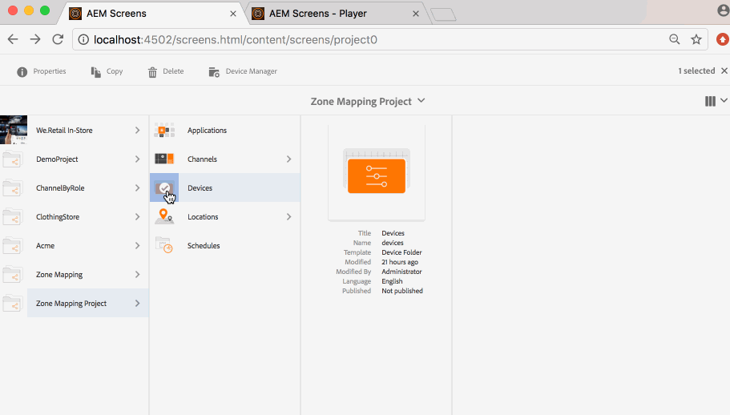

# Editor di layout della visualizzazione{#display-layout-editor}

***La mappatura delle aree*** consente di creare le aree diverse e utilizzare una varietà di risorse, quali video, immagini e testo che possono essere combinati contestualmente in un&#39;unica schermata. È possibile estrarre immagini, video e testi e combinarli per creare un&#39;esperienza digitale intuitiva e interattiva. In base ai requisiti del progetto, talvolta sono necessarie numerose aree nella stessa visualizzazione.

Ad esempio, una sequenza del prodotto con social media correlati, eseguiti in due aree distinte in una singola visualizzazione.

## Panoramica {#overview}

Durante la creazione di una visualizzazione per il canale, si possono scegliere opzioni di modelli per visualizzare o gestire il contenuto del canale.

I seguenti modelli sono disponibili durante la creazione di aree di visualizzazione:

* 1x2
* 2x2
* 3x1
* 4x1
* 5x1

Uno qualsiasi di questi modelli consente di creare un&#39;esperienza digitale intuitiva e interattiva in cui una vasta gamma di contenuti può essere inclusa in un unica schermata.

>[!NOTE]
>
>To learn in-depth about creating channels and displays, see [Managing Channels](managing-channels.md) and [Managing Displays](managing-displays.md) respectively in Authoring Screens.

## Descrizione di un caso d’uso {#use-case-description}

Questa modalità di impiego consente di creare un progetto AEM Screens con un canale che sfrutta il contenuto e lo visualizza sullo schermo in più aree.

>[!NOTE]
>
>Le aree non scalano il contenuto, questa operazione deve essere effettuata prima di inserire il contenuto nei canali.

### Passaggi per la creazione di un progetto {#steps-for-creating-a-project}

Segui i passaggi sottostanti per creare un progetto AEM Screens che mostri come ottenere la mappatura delle aree al suo interno:

1. ***Creazione di un nuovo progetto Screens***

   1. Seleziona il collegamento ad Adobe Experience Manager (in alto a sinistra) e quindi Screens. Alternatively, you can go directly to: [http://localhost:4502/screens.html/content/screens](http://localhost:4502/screens.html/content/screens).
   1. Click **Create** to create a new Screens project.
   1. Select **Screens** from the **Create Screens Project** wizard and click **Next**.
   1. Enter the title as **Demo Mapping Project** and click **Create**.
   

1. ***Creazione di una nuova cartella Canali***

   1. Passa a** Progetto mapping zone*.
   1. Fai clic su **Crea** nella barra delle azioni. Si apre una procedura guidata.
   1. Choose the **Channels Folder **and click **Next**.
   1. Enter the Title as **Dual Zone **and click **Create**.
   

1. ***Creazione di un nuovo canale***

   1. Navigate to the **Zone Mapping Project** you created and select the Channels folder (**Dual Zone**).
   1. Fai clic su **Crea** nella barra delle azioni. Si apre una procedura guidata.
   1. Choose the **Sequence Channel **and click **Next**.
   1. Enter the **Title** as **Left** and click **Create**.
   In modo analogo, crea un altro canale per sequenza desiderata come **Destra** nel **Progetto mappatura aree**.

   

1. ***Aggiunta di contenuto ai canali***

   1. Navigate to the **Zone Mapping Project** you created and select the **Channel** you created.
   1. Click **Edit** from the action bar.
   1. The editor for the **Left** opens. Fai clic sull’icona che apre o chiude il pannello laterale sinistro della barra delle azioni per aprire le risorse e i componenti.
   1. Trascina i componenti da aggiungere al canale.
   Allo stesso modo, aggiungi contenuto anche al canale **Destro**.

   

   >[!NOTE]
   >
   >È possibile popolare il contenuto dei canali con varie risorse (immagini, video) a seconda delle esigenze del progetto.

1. ***Crea una nuova posizione***

   1. Navigate to the** Zone Mapping Project** and select the **Locations** folder.
   1. Click **Create** next to the plus icon in the action bar. Si apre una procedura guidata.
   1. Select **Location** from the wizard and click **Next**.
   1. Enter the **Title** for your location (enter the title as **San Jose**) and click **Create**.
   

1. ***Creazione di un nuovo display per San Jose***

   1. Navigate to the location where you want to create your display (**Demo Mapping Project** --> **Locations** --> **San Jose**) and select **San Jose**.
   1. Fai clic su **Crea** nella barra delle azioni. Select **Display** from the **Create** wizard and click **Next**.
   1. Enter **Title** for your display location (enter the title as **Dual Zone**).
   1. Under the **Display** tab, choose the details of the Layout. Choose the Resolution as **Full HD**.
   1. Choose the **Number of Devices Horizontally** as **2**. Choose the **Number of Devices Vertically** as **1**.
   1. Fai clic su **Crea**.
   

1. ***Assegnazione di un canale***

   1. Navigate to the display from **Zone Mapping Project** --> **Locations** --> **San Jose** --> **Dual Zone Display**.
   1. Select **Dual Zone Display **and tap/click **Assign Channel** from the action bar, Or,
   1. Click **Dashboard** and select **+Assign Channel** at the top right from **ASSIGNED CHANNELS &amp; SCHEDULES** panel, as shown in the figure below. **Assegnazione canale **Viene visualizzata la finestra di dialogo.
   1. Enter the **Channel Role** as **Zone**.
   1. Selezionare Canale di riferimento per percorso. Select the channel folder path (**Zone Mapping Project **--> **Channels** --> **Dual Zone** ) in the Channel.
   1. Select the **Priority** for this channel as **1**. Choose the **Supported Events** as **Initial Load** and **Idle Screen**.
   1. Fai clic su **Salva**.
   

1. ***Registrazione e assegnazione del dispositivo***

   1. Avvia una finestra separata del browser. Andate al lettore Screens utilizzando il browser Web o avviate l&#39;app AEM Screens. Una volta aperto il dispositivo, vedrai che lo stato del dispositivo è non registrato.
   1. From the AEM dashboard, navigate to **Zone Mapping Project** --> **Devices**.
   1. Fare clic su** Device Manager** dalla barra delle azioni.
   1. Click **Device Registration** and you will see the pending devices.
   1. Select the device you want to register and click **Register Device**.
   1. Dovrai convalidare il codice di verifica dal browser web o da AEM Screens Player. Click **Validate** to navigate to **Device Registration** screen.
   1. Enter **Title** as **Zone Device** and click **Register** and the device will be registered.
   1. Click **Assign Display** to move on to the next step where you assign the device to a display.
   1. Click **Assign Device** fand select the display path for your channel () as */content/screens/Test_Project/Locations/TestLocation/TestDisplay*. Click **Assign**.
   1. Click **Finish** to complete the process, and now the device is assigned.
   

1. ***Creazione di una visualizzazione su più aree***

   1. Navigate and select the display from **Zone Mapping Project** --> **Locations** --> **San Jose **--> **Dual Zone **display and click **Dashboard** from the action bar.
   1. Seleziona l&#39;icona a sinistra della **Configurazione dispositivo** dal lettore del pannello **DISPOSITIVI** e fai clic su **proprietà**.
   1. Passa alla scheda **Configurazione dispositivo** e compila i campi **Mappatura** e **Modello**. Enter *{&quot;a1&quot;:&quot;${display.channel}/left&quot;, &quot;a2&quot;: &quot;${display.channel}/right&quot;}* in the **Mapping** field and template as *grid-2x1*.
   1. Click **Save &amp; Close** and reload the player.
   >[!NOTE]
   >
   >***Nozioni di base sul modello mappatura e nella configurazione del dispositivo:***
   >
   >* Gli identificatori &quot;a1&quot; e &quot;a2&quot; corrispondono alle aree definite nel modello, ovvero &quot;screens-zone-a1&quot; e &quot;screens-zone-a2&quot;.
   >* ${display.channel}/left&quot; punta al canale da incorporare nell&#39;area, mentre &quot;display.channel&quot; punta al percorso del canale corrente nella visualizzazione. Questo incorpora in modo efficace gli elementi secondari &quot;di sinistra&quot; e &quot;di destra&quot; del canale.

   

#### Visualizzazione del contenuto in AEM Screens Player {#viewing-content-in-aem-screens-player}

Carica AEM Screens Player oppure utilizza il browser web.

Noterai il contenuto di entrambi i canali (sinistro e destro) visualizzato in Screens Player. Il contenuto viene visualizzato come area da 2x1.

### Inferenza {#inference}

La Mappatura delle aree che utilizza uno dei modelli disponibili durante la creazione di un canale in AEM Screens consente di eseguire l&#39;appiattimento del lato client. È possibile creare diverse aree nello schermo e popolarle ulteriormente con video, immagini e altre risorse disponibili.
