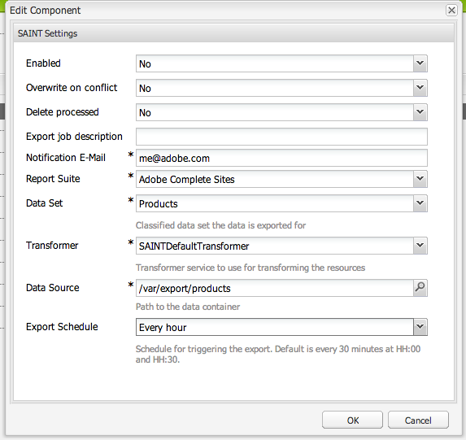

# Classificazioni  Adobe{#adobe-classifications}

 Classificazioni Adobi esporta i dati delle classificazioni in [ Adobe Analytics](/help/sites-administering/adobeanalytics.md) in modo programmato. L&#39;esportatore è un&#39;implementazione di un **com.adobe.cq.scheduled.export.Exporter**.

Per configurare:

1. Andate alla sezione **Strumenti, servizi cloud**  Adobe Analytics **.**
1. Aggiungete una nuova configurazione. Il modello **Classificazioni Adobe Analytics** viene visualizzato sotto la configurazione **Adobe Analytics Framework**. Specificare un **Titolo** e **Nome** come necessario:

   

1. Fare clic su **Crea** per configurare le impostazioni.

   

   Le proprietà includono quanto segue:

   | **Campo** | **Descrizione** |
   |---|---|
   | Abilitato | Selezionare **Yes** per abilitare le impostazioni di classificazione  Adobe. |
   | Sovrascrivi in caso di conflitto | Selezionare **Sì** per sovrascrivere eventuali conflitti di dati. Per impostazione predefinita, è impostata su **No**. |
   | Elimina elementi elaborati | Se è impostato su **Yes**, elimina i nodi elaborati dopo l&#39;esportazione. Il valore predefinito è **False**. |
   | Descrizione processo esportazione | Inserire una descrizione per il processo Classificazioni Adobe . |
   | E-mail di notifica | Inserite un indirizzo e-mail per  notifica Classificazioni Adobi. |
   | Suite di rapporti | Inserite la suite di rapporti per la quale eseguire il processo di importazione. |
   | Set di dati | Immettere l&#39;ID della relazione del set di dati per cui eseguire il processo di importazione. |
   | Trasformazione | Dal menu a discesa, selezionate un&#39;implementazione del trasformatore. |
   | Sorgente dati | Individuare il percorso del contenitore di dati. |
   | Esporta pianificazione | Selezionare la pianificazione per l&#39;esportazione. Il valore predefinito è ogni 30 minuti. |

1. Fare clic su **OK** per salvare le impostazioni.

## Modifica delle dimensioni di pagina {#modifying-page-size}

I record vengono elaborati nelle pagine. Per impostazione predefinita,  Classificazioni Adobe crea pagine con una dimensione di pagina pari a 1000.

Una pagina può avere una dimensione massima di 25000, per definizione nelle classificazioni  Adobe e può essere modificata dalla console Felix. Durante l&#39;esportazione,  Classificazioni Adobe blocca il nodo di origine per evitare modifiche simultanee. Il nodo viene sbloccato dopo l’esportazione, in caso di errore o quando la sessione viene chiusa.

Per modificare le dimensioni della pagina:

1. Andate alla console OSGI all&#39;indirizzo **https://&lt;host>:&lt;porta>/system/console/configMgr** e selezionate **Adobe AEM Esportatore classificazioni**.

   

1. Aggiornare la **Esporta dimensioni pagina** come necessario, quindi fare clic su **Salva**.

## SAINTDefaultTransformer {#saintdefaulttransformer}

>[!NOTE]
>
> Classificazioni Adobe era precedentemente noto come Esportatore SAINT.

Un esportatore può usare un trasformatore per trasformare i dati di esportazione in un formato specifico. Per  Classificazioni Adobi, è stata fornita una sottointerfaccia `SAINTTransformer<String[]>` che implementa l&#39;interfaccia Transformer. Questa interfaccia viene utilizzata per limitare il tipo di dati a `String[]` utilizzato dall&#39;API SAINT e per avere un&#39;interfaccia marker per la ricerca di tali servizi per la selezione.

Nell&#39;implementazione predefinita SAINTDefaultTransformer, le risorse figlio dell&#39;origine esportatore vengono trattate come record con nomi di proprietà come chiavi e valori di proprietà come valori. La colonna **Key** viene aggiunta automaticamente come prima colonna; il suo valore sarà il nome del nodo. Le proprietà con nome (contenenti :) non vengono prese in considerazione.

*Struttura nodo:*

* id-Classification `nt:unstructured`

   * 1 `nt:unstructured`

      * Prodotto = Nome Prodotto Personale (Stringa)
      * Prezzo = 120,90 (Stringa)
      * Dimensioni = M (String)
      * Colore = nero (String)
      * Color^Code = 101 (String)

**Intestazione e record SAINT:**

| **Chiave** | **Prodotto** | **Prezzo** | **Dimensione** | **Colore** | **Colore^Code** |
|---|---|---|---|---|---|
| 1 | Nome prodotto personale | 120,90 | M | black | 101 |

Le proprietà includono quanto segue:

<table> 
 <tbody> 
  <tr> 
   <td><strong>Percorso proprietà</strong></td> 
   <td><strong>Descrizione</strong></td> 
  </tr> 
  <tr> 
   <td>trasformatore</td> 
   <td>Un nome di classe di un'implementazione SAINTTransformer</td> 
  </tr> 
  <tr> 
   <td>e-mail</td> 
   <td>Indirizzo e-mail notifica.</td> 
  </tr> 
  <tr> 
   <td>reportsuites</td> 
   <td>ID suite di rapporti per cui eseguire il processo di importazione. </td> 
  </tr> 
  <tr> 
   <td>dataset</td> 
   <td>ID relazione set di dati per cui eseguire il processo di importazione. </td> 
  </tr> 
  <tr> 
   <td>descrizione</td> 
   <td>Descrizione del processo.   </td> 
  </tr> 
  <tr> 
   <td>sovrascrivi</td> 
   <td>Flag per sovrascrivere le collisioni di dati. Il valore predefinito è <strong>false</strong>.</td> 
  </tr> 
  <tr> 
   <td>divisioni di controllo</td> 
   <td>Flag per verificare la compatibilità delle suite di rapporti. Il valore predefinito è <strong>true</strong>.</td> 
  </tr> 
  <tr> 
   <td>deleteprocessed</td> 
   <td>Flag per eliminare i nodi elaborati dopo l'esportazione. Il valore predefinito è <strong>false</strong>.</td> 
  </tr> 
 </tbody> 
</table>

## Automatizzazione dell&#39;esportazione delle classificazioni  Adobe {#automating-adobe-classifications-export}

Potete creare un flusso di lavoro personalizzato, in modo che qualsiasi nuova importazione avvii il flusso di lavoro per creare i dati appropriati e strutturati correttamente in **/var/export/** in modo che possano essere esportati  Classificazioni Adobi.
