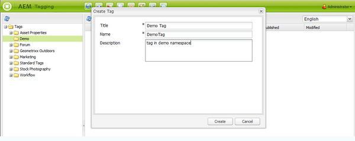

# Console per assegnazione tag dell’interfaccia classica{#classic-ui-tagging-console}

>[!CAUTION]
>
>AEM 6.4 ha raggiunto la fine del supporto esteso e questa documentazione non viene più aggiornata. Per maggiori dettagli, consulta la nostra [periodi di assistenza tecnica](https://helpx.adobe.com/it/support/programs/eol-matrix.html). Trova le versioni supportate [qui](https://experienceleague.adobe.com/docs/).

Questa sezione è destinata alla console di assegnazione tag dell’interfaccia classica.

La console di assegnazione tag dell’interfaccia touch è [qui](/help/sites-administering/tags.md#tagging-console).

Per accedere alla console Tag dell’interfaccia classica :

* sull&#39;autore
* accesso con privilegi amministrativi
* passa alla console

   ad esempio, [http://localhost:4502/tagging](http://localhost:4502/tagging)

## Creazione di tag e namespace {#creating-tags-and-namespaces}

1. A seconda del livello di partenza, è possibile creare un tag o uno spazio dei nomi utilizzando **Nuovo**:

   Se si seleziona **Tag** puoi creare uno spazio dei nomi:

   

   Se selezioni uno spazio dei nomi (ad esempio **Demo**) è possibile creare un tag all’interno di tale namespace:

   

1. In entrambi i casi, inserisci

   * **Titolo**
(
*Obbligatorio*) Il titolo visualizzato del tag. Mentre è possibile inserire un carattere,

      si consiglia di non utilizzare questi caratteri speciali :

      * `colon (:)` - delimitatore dello spazio dei nomi
      * `forward slash (/)` - delimitatore di tag secondari

      Questi caratteri non verranno visualizzati se immessi.

   * **Nome**

      (*Obbligatorio*) Il nome del nodo del tag.

   * **Descrizione**

      (*Facoltativo*) Una descrizione del tag .

   * select **Crea**

## Modifica dei tag {#editing-tags}

1. Nel riquadro a destra, seleziona il tag da modificare.
1. Fai clic su **Modifica**.
1. Puoi modificare la **Titolo** e **Descrizione**.
1. Fai clic su **Salva** per chiudere la finestra di dialogo.

## Eliminazione dei tag {#deleting-tags}

1. Nel riquadro a destra, seleziona il tag da eliminare.
1. Fai clic su **Elimina**.
1. Fai clic su **Sì** per chiudere la finestra di dialogo.

   Il tag non deve più essere elencato.

## Attivazione e disattivazione dei tag {#activating-and-deactivating-tags}

1. Nel riquadro a destra, seleziona lo spazio dei nomi o il tag da attivare (pubblicare) o disattivare (annullare la pubblicazione).
1. Fai clic su **Attiva** o **Disattiva** se necessario.

## Elenco : mostra dove si fa riferimento ai tag {#list-showing-where-tags-are-referenced}

**Elenco** apre una nuova finestra che mostra i percorsi di tutte le pagine che utilizzano il tag evidenziato:

## Spostamento dei tag {#moving-tags}

Per aiutare gli amministratori di tag e gli sviluppatori a ripulire la tassonomia o rinominare un ID tag, è possibile spostare un tag in una nuova posizione :

1. Apri **Assegnazione tag** console.
1. Seleziona il tag e fai clic su **Sposta...** nella barra degli strumenti superiore (o nel menu di scelta rapida).
1. In **Sposta tag** finestra di dialogo, definisci:

   * **a**, il nodo di destinazione.
   * **Rinomina in**, il nome del nuovo nodo.

1. Fai clic su **Sposta**.

La **Sposta tag** la finestra di dialogo si presenta come segue:

>[!NOTE]
>
>Gli autori non devono spostare i tag o rinominarli. Se necessario, gli autori devono [modificare i titoli dei tag](#editing-tags).

## Unione dei tag {#merging-tags}

L’unione dei tag può essere utilizzata quando una tassonomia presenta duplicati. Quando il tag A viene unito al tag B, tutte le pagine contrassegnate con il tag A vengono contrassegnate con il tag B e il tag A non è più disponibile per gli autori.

Per unire un tag a un altro:

1. Apri **Assegnazione tag** console.
1. Seleziona il tag e fai clic su **Unisci...** nella barra degli strumenti superiore (o nel menu di scelta rapida).
1. In **Unisci tag** finestra di dialogo, definisci:

   * **in**, il nodo di destinazione.

1. Fai clic su **Unisci**.

La **Unisci tag** la finestra di dialogo si presenta come segue:

## Conteggio dell’utilizzo dei tag {#counting-usage-of-tags}

Per vedere quante volte viene utilizzato un tag:

1. Apri **Assegnazione tag** console.
1. Fai clic su **Utilizzo del conteggio** nella barra degli strumenti superiore: nella colonna Conteggio viene visualizzato il risultato.

## Gestione dei tag in diverse lingue {#managing-tags-in-different-languages}

L&#39;opzione `title`La proprietà di un tag può essere tradotta in più lingue. Tag `titles` possono quindi essere visualizzati in base alla lingua dell’utente o alla lingua della pagina.

### Definizione dei titoli dei tag in più lingue {#defining-tag-titles-in-multiple-languages}

La procedura seguente illustra come tradurre `title`del tag **Animali** in inglese, tedesco e francese:

1. Vai a **Assegnazione tag** console.
1. Modificare il tag **Animali** di seguito **Tag** > **Fotografia Stock**.
1. Aggiungi le traduzioni nelle seguenti lingue:

   * **Inglese**: Animali
   * **Tedesco**: Tipologia
   * **Francese**: Animaux

1. Salva le modifiche.

La finestra di dialogo si presenta come segue:

La console Tagging utilizza l’impostazione della lingua utente, quindi per il tag Animals viene visualizzato &quot;Animaux&quot; per un utente che imposta la lingua in francese nelle proprietà dell’utente.

Per aggiungere una nuova lingua alla finestra di dialogo, consulta la sezione . [Aggiunta di una nuova lingua alla finestra di dialogo Modifica tag](/help/sites-developing/building.md#adding-a-new-language-to-the-edit-tag-dialog) in **Assegnazione tag per sviluppatori** sezione .

### Visualizzazione dei titoli dei tag nelle proprietà della pagina in una lingua specifica {#displaying-tag-titles-in-page-properties-in-a-specified-language}

Per impostazione predefinita, il tag `titles`nelle proprietà della pagina vengono visualizzate nella lingua della pagina. La finestra di dialogo dei tag nelle proprietà della pagina dispone di un campo della lingua che consente la visualizzazione del tag `titles`in una lingua diversa. La procedura seguente descrive come visualizzare il tag `titles`in francese:

1. Fai riferimento alla sezione precedente per aggiungere la traduzione francese al **Animali** di seguito **Tag** > **Fotografia Stock**.
1. Apri le proprietà della pagina **Prodotti** nella sezione inglese del **Geometrixx** sito.
1. Apri **Tag/Parole chiave** selezionando il menu a discesa a destra dell’area di visualizzazione Tag/Parole chiave e **Francese** dal menu a discesa nell&#39;angolo in basso a destra.
1. Scorri utilizzando le frecce sinistra-destra fino a selezionare la **Fotografia Stock** scheda

   Seleziona la **Animali** (**Animaux**) e seleziona all’esterno della finestra di dialogo per chiuderla e aggiungere il tag alle proprietà della pagina.

   

Per impostazione predefinita, nella finestra di dialogo Proprietà pagina viene visualizzato il tag `titles`in base alla lingua della pagina.

In generale, la lingua del tag viene presa dalla lingua della pagina se la lingua della pagina è disponibile. Quando il [widget tag](/help/sites-developing/building.md#tagging-on-the-client-side) viene utilizzato in altri casi (ad esempio nei moduli o nelle finestre di dialogo), il linguaggio dei tag dipende dal contesto.

>[!NOTE]
>
>Il tag cloud e le parole chiave meta nel componente pagina standard utilizzano il tag localizzato `titles`in base alla lingua della pagina, se disponibile.
