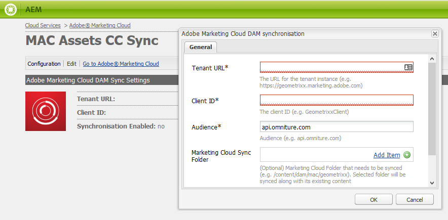

# Configurare &#39;integrazione AEM Assets con  Experience Cloud e Creative Cloud {#configure-aem-assets-integration-with-experience-cloud-and-creative-cloud}

I clienti Adobe Experience Cloud possono sincronizzare le risorse all’interno di Adobe Experience Manager (AEM) Assets con Adobe Creative Cloud e viceversa. Potete inoltre sincronizzare le risorse con  Experience Cloud e viceversa. È possibile impostare questa sincronizzazione tramite  I/O Adobe.

Il flusso di lavoro per impostare questa integrazione è:

1. Create un&#39;autenticazione in  I/O Adobe utilizzando un gateway pubblico e ottenete un ID applicazione.
1. Create un profilo nell&#39;istanza di AEM Assets  utilizzando l&#39;ID applicazione.
1. Utilizzate questa configurazione per sincronizzare le risorse in  AEM Assets con Creative Cloud.

Nel backend, il server AEM autentica il profilo con il gateway e quindi sincronizza i dati tra  AEM Assets e  Experience Cloud.

>[!NOTE]
>
>AEM la funzionalità di condivisione delle cartelle di Adobe Creative Cloud non è più disponibile. Scopri di più e trova un metodo migliore nelle best practice per l&#39;integrazione [AEM e Creative Cloud](../assets/aem-cc-integration-best-practices.md). La configurazione della replica da AEM a Marketing Cloud e lo scambio di risorse tra  AEM Assets e Marketing Cloud non è obsoleta.

Flusso di dati quando  AEM Assets e Creative Cloud sono integrati

>[!NOTE]
>
>La condivisione di risorse tra Adobe Experience Cloud e Adobe Creative Cloud richiede privilegi di amministratore nell’istanza AEM.

>[!CAUTION]
>
> Adobe Marketing Cloud è stato rinominato come Adobe Experience Cloud. Le procedure riportate di seguito fanno ancora riferimento al Marketing Cloud per riflettere l&#39;interfaccia corrente.

## Creare un&#39;applicazione {#create-an-application}

1. Per accedere all&#39;interfaccia del gateway di  Adobe, effettuate l&#39;accesso all&#39;indirizzo [https://legacy-oauth.cloud.adobe.io](https://legacy-oauth.cloud.adobe.io/).

   >[!NOTE]
   >
   >Per creare un ID applicazione sono necessari privilegi di amministratore.

1. Nel riquadro a sinistra, passare a Strumenti **[!UICONTROL per]** sviluppatori > **[!UICONTROL Applicazioni]** per visualizzare un elenco delle applicazioni.
1. Fate clic su **[!UICONTROL Aggiungi]** aem_assets_addcerchio_icon  per creare un&#39;applicazione.
1. Dall&#39;elenco Credenziali **** client, selezionare Account **[!UICONTROL servizio (Asserzione JWT)]**, un servizio di comunicazione server-to-server per l&#39;autenticazione server.

   

1. Specificate un nome per l’applicazione e una descrizione facoltativa.
1. Dall’elenco **[!UICONTROL Organizzazione]** , selezionate l’organizzazione per la quale desiderate sincronizzare le risorse.
1. Nell&#39;elenco **[!UICONTROL Ambito]** , selezionare **[!UICONTROL dam-read]**, **[!UICONTROL dam-sync]**, **[!UICONTROL dam-write]** e **[!UICONTROL cc-share]**.
1. Fai clic su **[!UICONTROL Crea]**. Un messaggio notifica che l’applicazione è stata creata.

   

1. Copiate l&#39;ID **** applicazione generato per la nuova applicazione.

   >[!CAUTION]
   >
   >Assicuratevi di non copiare inavvertitamente il Segreto **** applicazione invece dell&#39;ID **** applicazione.

## Aggiungere una nuova configurazione al Marketing Cloud {#add-a-new-configuration-to-marketing-cloud}

1. Fare clic sul logo AEM nell&#39;interfaccia utente dell&#39;istanza AEM Assets  locale e passare a **[!UICONTROL Strumenti]** > **[!UICONTROL Cloud Services]** > Cloud Services **** legacy.

1. Individuate il servizio **[!UICONTROL Adobe Marketing Cloud]** . Se non esistono configurazioni, fate clic su **[!UICONTROL Configura ora]**. Se sono presenti configurazioni, fate clic su **[!UICONTROL Mostra configurazioni]** e fate clic su **[!UICONTROL [+]]** per aggiungere una nuova configurazione.

   >[!NOTE]
   >
   >Utilizzate un account Adobe ID  con privilegi di amministratore per l&#39;organizzazione.

1. Nella finestra di dialogo **[!UICONTROL Crea configurazione]** , specificate un titolo e un nome per la nuova configurazione e fate clic su **[!UICONTROL Crea]**.

   

1. Nel campo URL **** tenant, specificate l&#39;URL per  AEM Assets.

   >[!CAUTION]
   >
   >A causa di un rebranding, se hai inserito l&#39;URL tenant come **https://&lt;tenant_id>.marketing.adobe.com** , devi modificarlo in **https://&lt;tenant_id>.experienceecCloud.adobe.com.** A questo scopo, attenetevi alla procedura seguente:
   1. Vai a **Strumenti > Cloud Services > Servizi cloud precedenti**.
   1. In Adobe Marketing Cloud, fate clic su **Mostra configurazioni**.
   1. Selezionate la configurazione creata durante la configurazione della sincronizzazione AEM-MAC-CC.
   1. Modificate la configurazione del servizio cloud e sostituite **marketing.adobe.com** nel campo URL tenant con **experience**.adobe.com.
   1. Salva la configurazione.
   1. Verificate gli agenti di replica della sincronizzazione mac.

1. Nel campo ID **** client, incollate l&#39;ID applicazione che avete copiato alla fine della procedura [Creare un&#39;applicazione](/help/sites-administering/configure-assets-cc-integration.md#create-an-application).

   

1. In **[!UICONTROL Sincronizzazione]** , selezionate **[!UICONTROL Abilitato]** per abilitare la sincronizzazione e fate clic su **[!UICONTROL OK]**.

   >[!NOTE]
   Se selezionate **Disattivato**, la sincronizzazione funzionerà in una sola direzione.

1. Dalla pagina di configurazione, fate clic su **[!UICONTROL Visualizza chiave]** pubblica per visualizzare la chiave pubblica generata per l’istanza. In alternativa, fai clic su **[!UICONTROL Scarica chiave pubblica per Gateway]** OAuth per scaricare il file contenente la chiave pubblica. Quindi, aprite il file per visualizzare la chiave pubblica.

## Abilita sincronizzazione {#enable-synchronization}

1. Visualizzare la chiave pubblica utilizzando uno dei seguenti metodi menzionati nell&#39;ultimo passaggio della procedura [Aggiungere una nuova configurazione al Marketing Cloud](/help/sites-administering/configure-assets-cc-integration.md#add-a-new-configuration-to-marketing-cloud). Click **[!UICONTROL Display Public Key]**.

   

1. Copiate la chiave pubblica e incollatela nel campo Chiave **** pubblica dell&#39;interfaccia di configurazione dell&#39;applicazione creata in [Creare un&#39;applicazione](/help/sites-administering/configure-assets-cc-integration.md#create-an-application).

   

1. Click **[!UICONTROL Update]**. Sincronizzate ora le risorse con l’istanza di AEM Assets .

## Verificare la sincronizzazione {#test-the-synchronization}

1. Fare clic sul logo AEM nell&#39;interfaccia utente dell&#39;istanza AEM Assets  locale e passare a **[!UICONTROL Strumenti]**> **[!UICONTROL Distribuzione]**> **[!UICONTROL Replica]**per individuare i profili di replica creati per la sincronizzazione.
1. Nella pagina **[!UICONTROL Replica]** , fate clic su **[!UICONTROL Agenti sull’autore]**.
1. Dall&#39;elenco dei profili, fate clic sul profilo di replica predefinito per l&#39;organizzazione in uso per aprirlo.
1. Nella finestra di dialogo, fate clic su **[!UICONTROL Test connessione]**.

   

1. Al termine della replica, verificare la presenza di un messaggio di riuscita alla fine dei risultati del test.

## Aggiunta di utenti al Marketing Cloud {#add-users-to-marketing-cloud}

1. Effettuate l&#39;accesso al Marketing Cloud utilizzando le credenziali di amministratore.
1. Dai binari, andate a **[!UICONTROL Administration]**e toccate o fate clic su **[!UICONTROL Avvia Enterprise Dashboard]**.
1. Dalla barra laterale, fate clic su **[!UICONTROL Utenti]** per aprire la pagina Gestione **** utente.
1. Dalla barra degli strumenti, fate clic o toccate **Aggiungi** aem_assets_add_icon .
1. Aggiungete uno o più utenti per consentire loro di condividere le risorse con la Creative Cloud.

   >[!NOTE]
   Solo gli utenti aggiunti al Marketing Cloud possono condividere le risorse da  AEM Assets a Creative Cloud.

## Exchange assets tra  AEM Assets e Marketing Cloud {#exchange-assets-between-aem-assets-and-marketing-cloud}

1. Effettuate l&#39;accesso a  AEM Assets.
1. Nella console Risorse, create una cartella e caricate alcune risorse su di essa. Ad esempio, create una cartella **mc-demo** e caricate una risorsa su di essa.
1. Selezionate la cartella e fate clic su **Condividi** .
1. Dal menu, selezionate **[!UICONTROL Adobe Marketing Cloud]** e fate clic su **[!UICONTROL Condividi]**. Un messaggio notifica che la cartella è condivisa con il Marketing Cloud.

   

   >[!NOTE]
   La condivisione di una cartella di risorse di tipo `sling:OrderedFolder`non è supportata nel contesto della condivisione in Adobe Marketing Cloud. Se desiderate condividere una cartella, quando la create in  AEM Assets, non selezionate l’opzione **[!UICONTROL Ordinato]** .

1. Aggiornare l&#39;interfaccia utente  AEM Assets. La cartella creata nella console Risorse dell’istanza AEM Assets  locale viene copiata nell’interfaccia utente del Marketing Cloud. La risorsa caricata nella cartella in  AEM Assets viene visualizzata nella copia della cartella nel Marketing Cloud dopo l’elaborazione da parte del server di AEM.
1. Potete anche caricare una risorsa nella copia replicata della cartella del Marketing Cloud. Una volta elaborata, la risorsa viene visualizzata nella cartella condivisa in  AEM Assets.

## Exchange assets tra  AEM Assets e Creative Cloud {#exchange-assets-between-aem-assets-and-creative-cloud}

 AEM Assets consente di condividere con gli utenti Adobe Creative Cloud le cartelle contenenti risorse.

1. Nella console Risorse, seleziona la cartella da condividere con la Creative Cloud.
1. Dalla barra degli strumenti, fate clic su **[!UICONTROL Condividi]** .
1. Dall’elenco, selezionate l’opzione **[!UICONTROL Adobe Creative Cloud]** .

   >[!NOTE]
   Le opzioni sono disponibili per gli utenti con autorizzazioni di lettura nella directory principale. Gli utenti devono disporre dell&#39;autorizzazione necessaria per accedere alle informazioni dell&#39;agente di replica del Marketing Cloud.

1. Nella pagina **[!UICONTROL Creative Cloud condivisione]** , aggiungete l’utente con cui condividere la cartella e scegliete un ruolo per l’utente. Fate clic su **[!UICONTROL Salva]** e su **[!UICONTROL OK]**.

1. Accedete alla Creative Cloud con le credenziali dell&#39;utente con cui avete condiviso la cartella. La cartella condivisa è disponibile nella Creative Cloud.

La sincronizzazione  Marketing Cloud AEM Assets è progettata in modo che l’istanza del computer dell’utente da cui viene caricata la risorsa mantenga il diritto di modificare la risorsa. Solo queste modifiche vengono propagate all&#39;altra istanza.

Ad esempio, se una risorsa viene caricata da un’istanza di AEM Assets  (nei locali), le modifiche apportate alla risorsa da questa istanza vengono propagate all’istanza di Marketing Cloud. Tuttavia, le modifiche apportate dall’istanza di Marketing Cloud alla stessa risorsa non vengono propagate all’istanza AEM e viceversa per le risorse caricate da Marketing Cloud.

>[!MORELIKETHIS]
* [Tecniche consigliate per l&#39;integrazione di AEM e Creative Cloud](../assets/aem-cc-integration-best-practices.md)
* [Tecniche consigliate per AEM la condivisione delle cartelle](../assets/aem-cc-folder-sharing-best-practices.md)

