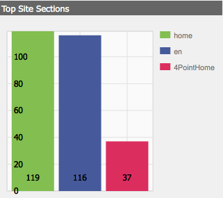

# Dashboard{#dashboards}

>[!CAUTION]
>
>AEM 6.4 ha raggiunto la fine del supporto esteso e questa documentazione non viene più aggiornata. Per maggiori dettagli, consulta la nostra [periodi di assistenza tecnica](https://helpx.adobe.com/it/support/programs/eol-matrix.html). Trova le versioni supportate [qui](https://experienceleague.adobe.com/docs/).

Utilizzando AEM puoi gestire numerosi contenuti di tipi diversi (ad esempio pagine, risorse). I dashboard di AEM forniscono un modo semplice e personalizzabile per definire pagine che visualizzano dati consolidati.

>[!NOTE]
>
>I dashboard di AEM vengono creati in base all’utente, in modo che un utente possa accedere solo al proprio dashboard.
>
>
>Tuttavia, [Modelli per dashboard](#creating-a-dashboard-template) può essere utilizzato per condividere la configurazione comune e il layout del dashboard.


## Amministrazione di dashboard {#administering-dashboards}

### Creazione di un dashboard {#creating-a-dashboard}

Per creare un nuovo dashboard, procedere come segue:

1. In **Strumenti** sezione, fai clic su **Console di configurazione**.

1. Nella struttura, fare doppio clic su **Dashboard**.

1. Fai clic su **Nuovo dashboard**.

1. Digita il **Titolo** (ad esempio, il mio dashboard) e il **Nome**.

1. Fai clic su **Crea**.

### Clonazione di un dashboard {#cloning-a-dashboard}

È possibile disporre di più dashboard per visualizzare rapidamente le informazioni sui contenuti provenienti da diverse viste. Per facilitare la creazione di un nuovo dashboard, AEM fornisce una funzione clone da utilizzare per duplicare un dashboard esistente. Per clonare un dashboard, procedi come segue:

1. In **Strumenti** sezione, fai clic su **Console di configurazione**.

1. Nella struttura, fai clic su **Dashboard**.
1. Fare clic sul dashboard da clonare.

1. Fai clic su **Clona**.

1. Digita il **Nome** del nuovo dashboard.

### Rimozione di un dashboard {#removing-a-dashboard}

1. In **Strumenti** sezione, fai clic su **Console di configurazione**.

1. Nella struttura, fai clic su **Dashboard**.
1. Fai clic sul dashboard da eliminare.

1. Fai clic su **Rimuovi**.

1. Fai clic su **Sì** per confermare.

## Componenti per dashboard {#dashboard-components}

### Panoramica {#overview}

I componenti del dashboard non sono altro che normali [Componenti AEM](/help/sites-developing/developing-components-samples.md). Questa sezione descrive i componenti per report forniti con AEM.

### Componenti per la generazione di rapporti di Web Analytics {#web-analytics-reporting-components}

AEM viene fornito con un set di componenti che eseguono il rendering di più metriche del [SiteCatalyst](/help/sites-administering/adobeanalytics.md) dati. Tali componenti sono elencati nella barra laterale sotto la barra laterale **Dashboard** sezione .

Ogni componente di reporting fornisce almeno tre schede:

* **Base**: contiene la configurazione principale.

* **Rapporto:** contiene la configurazione specifica di ciascun report.
* **Stile**: contiene la configurazione dello stile, ad esempio la dimensione del grafico e il margine.

I componenti per report vengono inizializzati con una configurazione predefinita che consente di configurare rapidamente il dashboard.

#### Configurazione di base {#basic-configuration}

La **Base** tab consente di accedere alle seguenti voci di configurazione:

**Titolo** Titolo visualizzato sul dashboard.

**Tipo di richiesta** Modalità di richiesta dei dati.

**Configurazione del SiteCatalyst (opzionale)** Configurazione da utilizzare per la connessione al SiteCatalyst. Se non viene fornita, si presume che la configurazione sia configurata nella pagina Dashboard (tramite le proprietà della pagina).

**ID suite di rapporti (facoltativo)** La suite di rapporti di SiteCatalyst che desideri utilizzare per generare il grafico.

#### Configurazione del rapporto {#report-configuration}

Per visualizzare le statistiche web, è necessario definire l’intervallo di date dei dati che si desidera eliminare. La **Rapporto** La scheda fornisce due campi per definire tale intervallo.

>[!NOTE]
>
>L’impostazione di un intervallo di date ampio può ridurre la reattività del dashboard.

**Data Da** Data assoluta o relativa a partire dalla quale i dati vengono recuperati.

**Data a** Data assoluta o relativa alla quale vengono recuperati i dati.

Ogni componente definisce anche impostazioni specifiche.

#### Report tempo eccessivo {#overtime-report}


**Granularità della data** Unità di tempo dell’asse X (ad esempio giorno, ora).

**Metriche** Elenco degli eventi da visualizzare.

**Elementi** Elenco di elementi che suddividono i dati delle metriche nel grafico.

#### Report elenco classifica {#ranked-list-report}


**Elementi** L’elemento che suddivide i dati delle metriche nel grafico.

**Metriche** L’evento da visualizzare.

**No. degli elementi principali** Numero di elementi visualizzati dal rapporto.

#### Report classifica {#ranked-report}


**Metriche** L’evento da visualizzare.

**Elementi** L’elemento che suddivide i dati delle metriche nel grafico.

#### Report sezione del sito principale {#top-site-section-report}

Questo componente visualizza un grafico che mostra la sezione più visitata di un sito web in base alla seguente configurazione.



**No. degli elementi principali** Numero di sezioni visualizzate dal report.

#### Report con tendenze {#trended-report}


**Granularità della data** Unità di tempo dell’asse X (ad esempio giorno, ora).

**Metriche** L’evento da visualizzare.

**Elementi** L’elemento che suddivide i dati delle metriche nel grafico.

## Estensione del dashboard {#extending-dashboard}

### Panoramica {#overview-1}

Le dashboard sono pagine normali ( `cq:Page`), pertanto è possibile utilizzare qualsiasi componente per assemblare dashboard.

Esiste un gruppo di componenti predefinito `Dashboard` contenente i componenti di reporting di analytics che sono abilitati sul modello per impostazione predefinita.

### Creazione di un modello di dashboard {#creating-a-dashboard-template}

Un modello definisce il contenuto predefinito di un nuovo dashboard. È possibile utilizzare diversi modelli per creare diversi tipi di dashboard.

I modelli di dashboard vengono creati come altri modelli di pagina, ma sono memorizzati in `/libs/cq/dashboards/templates/`. Consulta la sezione [Creazione del modello di pagina di contenuto](/help/sites-developing/website.md#creating-the-contentpage-template) sezione .

>[!NOTE]
>
>I modelli di dashboard sono condivisi tra gli utenti.

### Sviluppo di un componente Dashboard {#developing-a-dashboard-component}

Lo sviluppo di un componente Dashboard consiste nella creazione di un componente AEM regolare. In questa sezione viene illustrato un esempio di un componente che visualizza i primi 10 collaboratori.


I componenti per autori principali vengono memorizzati nell’archivio all’indirizzo `/apps/geometrixx-outdoors/components/reporting` ed è composto da :

1. a `jsp` file che legge i dati jcr e definisce il `html` segnaposto.

1. una libreria lato client contenente un `js` file che recupera e ordina i dati, quindi compila il `html` segnaposto.


Il seguente file Javascript è definito nel `geout.reporting.topauthors` [Libreria client](/help/sites-developing/clientlibs.md) come figlio del componente stesso.

La [QueryBuilder](/help/sites-developing/querybuilder-api.md) viene utilizzato per eseguire query sul repository da leggere `cq:AuditEvent` nodi. Il risultato della query è un oggetto JSON dal quale vengono estratti i contributi dell’autore.

#### top_authors.js {#top-authors-js}

```
$.ajax({
  url: "/bin/querybuilder.json",
  cache: false,
  data: {
       "orderby": "cq:time",
       "orderby.sort": "desc",
       "p.hits": "full",
       "p.limit": 100,
       "path": "/var/audit/com.day.cq.wcm.core.page/",
       "type": "cq:AuditEvent"
   },
  dataType: "json"     
}).done(function( res ) {
    var authors = {};
    // from JSON to Object
    for(var r in res.hits) {
        var userId = res.hits[r].userId;
        if(userId == undefined) {
            continue;
        }
        var auth = authors[userId] || {userId : userId};
        auth.contrib = (auth.contrib || 0) +1;
        
        authors[userId] = auth;
    }
    
    // order by contribution
    var orderedByContrib = [];
    for(var a in authors) {
        orderedByContrib.push(authors[a]);
    }
    orderedByContrib.sort(function(a,b){return b.contrib - a.contrib});
    
    // produce the list
    for (var i=0, tot=orderedByContrib.length; i < tot; i++) {
        var current = orderedByContrib[i];
        $("<div> #" + (i + 1) +" "+ current.userId + " (" + current.contrib +" contrib.)</div>").appendTo("#authors-list");

    }
});  
```

La `JSP` include entrambi `global.jsp` e `clientlib`.

#### top_authors.jsp {#top-authors-jsp}

```java
<%@page session="false" contentType="text/html; charset=utf-8" %><%
%><%
%><%@include file="/libs/foundation/global.jsp" %><%
%>
<ui:includeClientLib categories="geout.reporting.topauthors" />
<%
String reportletTitle = properties.get("title", "Top Authors");
%>
<html>
     <h3><%=xssAPI.encodeForHTML(reportletTitle) %></h3>
     <div id="authors-list"></div>
</html>
```
