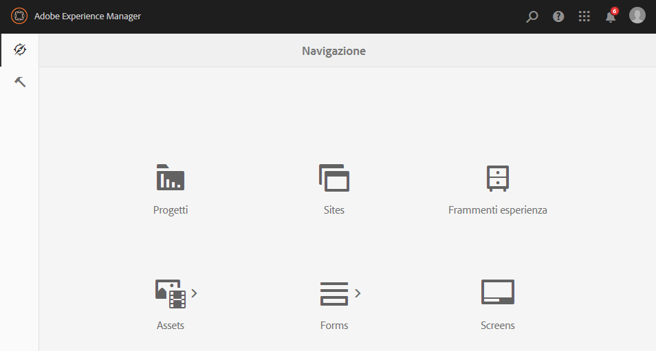

# Console di amministrazione{#admin-consoles}

Per impostazione predefinita, è stata disattivata la possibilità di passare all’interfaccia classica tramite le console di amministrazione. Pertanto, le icone a comparsa visualizzate quando si passa il mouse su determinate icone della console e si consente l’accesso all’interfaccia classica, non vengono più visualizzate.

Ogni console con una versione dell’interfaccia classica in `/libs/cq/core/content/nav` può essere riattivata singolarmente, in modo che l’opzione dell’interfaccia **** classica venga nuovamente visualizzata sopra l’icona della console quando viene spostata.

In questo esempio viene riattivata l’interfaccia classica per la console Siti.

1. Utilizzando CRXDE Lite, trovate il nodo corrispondente alla console di amministrazione per la quale desiderate riabilitare l’interfaccia classica. Sono disponibili in:

   `/libs/cq/core/content/nav`

   Ad esempio

   [ `http://localhost:4502/crx/de/index.jsp#/libs/cq/core/content/nav`](http://localhost:4502/crx/de/index.jsp#/libs/cq/core/content/nav)

1. Selezionate il nodo corrispondente alla console per la quale desiderate riattivare l’interfaccia classica. Ad esempio, riattiveremo l’interfaccia classica per la console Siti.

   `/libs/cq/core/content/nav/sites`

1. Create una sovrapposizione utilizzando l’opzione **Overlay Node** (Nodo sovrapposizione); ad esempio:

   * **Percorso**: `/apps/cq/core/content/nav/sites`
   * **Posizione sovrapposizione**: `/apps/`
   * **Corrispondenza tipi** di nodo: active (seleziona la casella di controllo)

1. Aggiungete la seguente proprietà booleana al nodo sovrapposto:

   `enableDesktopOnly = {Boolean}true`

1. L’opzione Interfaccia **** classica è nuovamente disponibile come opzione di pover nella console di amministrazione.

   

Ripetete questi passaggi per ogni console per la quale desiderate riattivare l’accesso alla versione dell’interfaccia classica.
