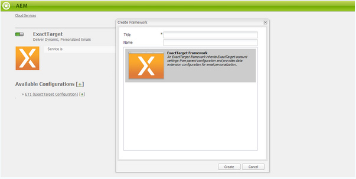

# Integrazione con ExactTarget{#integrating-with-exacttarget}

L’integrazione di AEM con Exact Target consente di gestire e inviare e-mail create in AEM tramite Exact Target. Consente inoltre di utilizzare le funzioni di gestione dei lead di Exact Target tramite moduli AEM su AEM pagine.

L&#39;integrazione offre le seguenti funzionalità:

* La possibilità di creare e AEM e pubblicarli su Exact Target per la distribuzione.
* Possibilità di impostare l&#39;azione di un modulo AEM per creare un utente iscritto a Exact Target.

Una volta configurato ExactTarget, potete pubblicare newsletter o e-mail su ExactTarget. Consultate [Pubblicazione di newsletter su un servizio](/help/sites-authoring/personalization.md)e-mail.

## Creazione di una configurazione ExactTarget {#creating-an-exacttarget-configuration}

Le configurazioni ExactTarget possono essere aggiunte tramite Cloudservices o Strumenti. Entrambi i metodi sono descritti in questa sezione.

### Configurazione di ExactTarget tramite Cloudservices {#configuring-exacttarget-via-cloudservices}

Per creare una configurazione ExactTarget in Cloud Services:

1. Nella pagina di benvenuto, fate clic su **Cloud Services**. (Or directly access at `https://<hostname>:<port>/etc/cloudservices.html`.)
1. Fate clic su **ExactTarget** , quindi su **Configura**. Viene visualizzata la finestra di configurazione ExactTarget.

   

1. Enter a title and optionally, a name and click **Create**. Viene visualizzata la finestra di configurazione** ExactTarget Settings**.

   

1. Inserite il nome utente e la password e selezionate un endpoint API (ad esempio, **https://webservice.exacttarget.com/Service.asmx**).
1. Fate clic su **Connetti a ExactTarget.** Una volta stabilita la connessione, viene visualizzata una finestra di dialogo di successo. Fare clic su **OK** per uscire dalla finestra.

   

1. Selezionate un account, se disponibile. L&#39;account è per i clienti Enterprise 2.0. Fai clic su **OK**.

   ExactTarget è stato configurato. Per modificare la configurazione, fai clic su **Modifica**. Per accedere a ExactTarget, fai clic su **Vai a ExactTarget**.

1. AEM ora offre una funzione di estensione dei dati. Potete importare le colonne delle estensioni di dati ExactTarget. Per configurarlo, fate clic sul segno &quot;+&quot; visualizzato insieme alla configurazione ExactTarget creata correttamente. Qualsiasi estensione di dati esistente può essere selezionata dall&#39;elenco a discesa. Per ulteriori informazioni sulla configurazione delle estensioni di dati, consulta la documentazione ExactTarget.

   Le colonne di estensione dei dati importati possono essere utilizzate in un secondo momento tramite il componente **Testo e personalizzazione** .

   

### Configurazione di ExactTarget tramite Strumenti {#configuring-exacttarget-via-tools}

Per creare una configurazione ExactTarget in Strumenti:

1. Nella pagina di benvenuto, fai clic su **Strumenti**. Oppure andate direttamente a `https://<hostname>:<port>/misadmin#/etc`.
1. Selezionate **Strumenti**, quindi **Cloud Services Configurazioni,** quindi **ExactTarget**.
1. Click **New** to open the **Create Page **window.

   

1. Immettete il **Titolo** e facoltativamente il **Nome**, quindi fate clic su **Crea**.
1. Immettete le informazioni di configurazione come indicato al punto 4 della procedura precedente. Seguite questa procedura per completare la configurazione di ExactTarget.

### Aggiunta di più configurazioni {#adding-multiple-configurations}

Per aggiungere più configurazioni:

1. Nella pagina di benvenuto, fate clic su **Cloud Services** e fate clic su **ExactTarget**. Fate clic sul pulsante **Mostra configurazioni** che viene visualizzato se sono disponibili una o più configurazioni ExactTarget. Vengono elencate tutte le configurazioni disponibili.
1. Fate clic sul segno **+** accanto a Configurazioni disponibili. Viene visualizzata la finestra **Crea configurazioni** . Seguite la procedura di configurazione precedente per creare una nuova configurazione.

