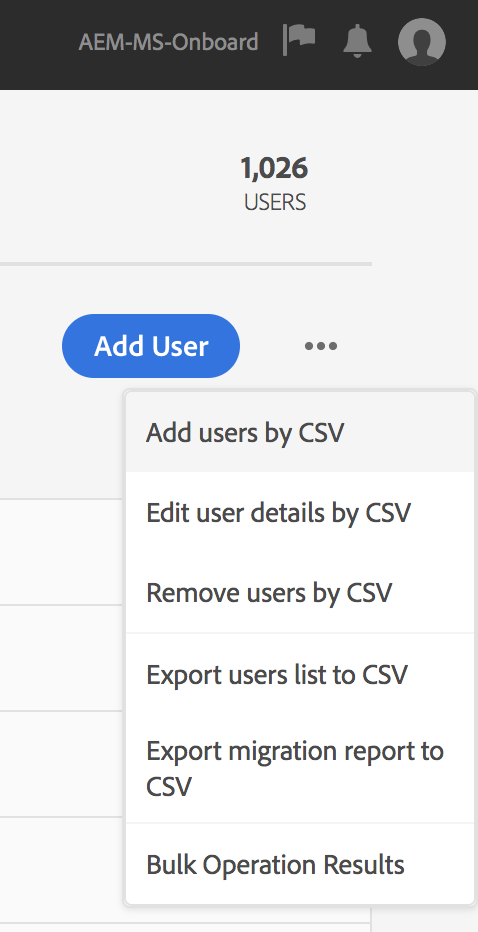

#  autenticazione IMS Adobe e  supporto Admin Console AEM Managed Services {#adobe-ims-authentication-and-admin-console-support-for-aem-managed-services}

>[!NOTE]
>
>Questa funzione è disponibile solo per i clienti di Adobe Managed Services.

## Introduzione {#introduction}

AEM 6.4.3.0 introduce  supporto Admin Console per AEM istanze e  autenticazione basata su Adobe IMS( Identity Management System) per **AEM clienti Managed Services** .

AEM l&#39;accesso al Admin Console  consentirà AEM clienti Managed Services di gestire tutti gli utenti  Experienci Cloud in un&#39;unica console. Gli utenti e i gruppi possono essere assegnati ai profili di prodotto associati alle istanze AEM, consentendo loro di accedere a un&#39;istanza specifica.

## Elementi di rilievo {#key-highlights}

* AEM supporto dell&#39;autenticazione IMS è solo per autori, amministratori o sviluppatori AEM, non per utenti finali esterni di siti cliente come i visitatori del sito
* Il Admin Console  rappresenterà AEM clienti Managed Services come organizzazioni IMS e le loro istanze come contesti di prodotto. Gli amministratori di prodotto e di sistema dei clienti potranno gestire l&#39;accesso alle istanze
* AEM Managed Services sincronizzerà le topologie dei clienti con il Admin Console . Nell&#39;Admin Console di  sarà presente un&#39;istanza AEM contesto prodotto Managed Services per istanza.
* Profili di prodotto in  Admin Console determinerà a quali istanze può accedere un utente
* È supportata l&#39;autenticazione federativa tramite provider di identità conformi SAML 2
* Saranno supportati solo Enterprise ID o Federated ID (per il cliente Single Sign-On), non  ID Adobe personali.
* La gestione degli utenti (in Adobe Admin Console) continuerà ad essere di proprietà degli amministratori cliente.

## Architettura {#architecture}

L&#39;autenticazione IMS funziona utilizzando il protocollo OAuth tra AEM e l&#39;endpoint IMS del Adobe . Dopo l’aggiunta a IMS, un utente con identità Adobe può accedere ad AEM Managed Services utilizzando le credenziali IMS.

Il flusso di accesso dell&#39;utente è riportato di seguito, l&#39;utente verrà reindirizzato a IMS e, facoltativamente, all&#39;IDP del cliente per la convalida SSO e quindi reindirizzato nuovamente a AEM.

## How To Set Up {#how-to-set-up}

### Onboarding di organizzazioni in Admin Console {#onboarding-organizations-to-admin-console}

L&#39;onboarding del cliente  Admin Console è un prerequisito per utilizzare  Adobe IMS per AEM autenticazione.

Come primo passo, i clienti devono avere un&#39;organizzazione predisposta in  Adobe IMS.  clienti Enterprise di Adobe sono rappresentati come organizzazioni IMS in [Adobe Admin Console](https://helpx.adobe.com/it/enterprise/using/admin-console.html).

AEM clienti Managed Services devono già disporre di un&#39;organizzazione predisposta e, come parte del provisioning IMS, le istanze cliente saranno rese disponibili nel Admin Console  per la gestione delle adesioni e dell&#39;accesso degli utenti.

Il passaggio a IMS per l&#39;autenticazione degli utenti sarà uno sforzo congiunto tra AMS e i clienti, con ciascuno dei quali i flussi di lavoro saranno completati.

Una volta che un cliente esiste come organizzazione IMS e AMS ha effettuato il provisioning del cliente per IMS, questo è il riepilogo dei flussi di lavoro di configurazione richiesti:

1. L&#39;amministratore di sistema designato riceve un invito ad accedere al Admin Console 
1. L&#39;amministratore di sistema richiede il dominio per confermare la proprietà del dominio (in questo esempio acme.com)
1. L&#39;amministratore di sistema imposta le directory utente
1. L&#39;amministratore di sistema configura il provider di identità (IDP) nel Admin Console  per l&#39;impostazione SSO.
1. L&#39;amministratore AEM gestisce i gruppi locali, le autorizzazioni e i privilegi come al solito. Consultate Sincronizzazione di utenti e gruppi

>[!NOTE]
>
>Per ulteriori informazioni sul Adobe   Identity Management Basics, inclusa la configurazione IDP, consultate l&#39;articolo [in questa pagina.](https://helpx.adobe.com/it/enterprise/using/set-up-identity.html)
>
>Per ulteriori informazioni sull&#39;amministrazione Enterprise e  Admin Console, consultate l&#39;articolo [in questa pagina](https://helpx.adobe.com/it/enterprise/managing/user-guide.html).

### Onboarding Users to the  Admin Console {#onboarding-users-to-the-admin-console}

Esistono tre modi per integrare gli utenti a seconda delle dimensioni del cliente e delle loro preferenze:

1. Creare manualmente utenti e gruppi in  Admin Console
1. Caricare un file CSV con gli utenti
1. Sincronizzare utenti e gruppi dall&#39;Active Directory aziendale del cliente.

#### Aggiunta manuale tramite l’interfaccia di Admin Console {#manual-addition-through-admin-console-ui}

È possibile creare manualmente utenti e gruppi nell’interfaccia di Admin Console. Questo metodo può essere utilizzato se non dispone di un numero elevato di utenti da gestire. Ad esempio, un numero inferiore a 50 utenti AEM.

Gli utenti possono anche essere creati manualmente se il cliente utilizza già questo metodo per amministrare altri prodotti  Adobe come Analytics, Target o applicazioni di Creative Cloud.

#### File Upload in the Admin Console UI {#file-upload-in-the-admin-console-ui}

Per semplificare la gestione della creazione di utenti, potete caricare un file CSV per aggiungere utenti in massa:

#### Strumento User Sync {#user-sync-tool}

Lo strumento di sincronizzazione utenti (UST in breve) consente ai clienti aziendali di creare o gestire  utenti di Adobi che utilizzano Active Directory o altri servizi di directory OpenLDAP testati. Gli utenti di destinazione sono amministratori di identità IT (Enterprise Directory e System Admins) che saranno in grado di installare e configurare lo strumento. Lo strumento open source è personalizzabile in modo che i clienti possano modificarlo in base alle proprie esigenze specifiche.

Durante l&#39;esecuzione della sincronizzazione utenti, recupera un elenco di utenti da Active Directory dell&#39;organizzazione (o da qualsiasi altra origine dati compatibile) e lo confronta con l&#39;elenco di utenti all&#39;interno del Admin Console . Chiama quindi l’API User Management di Adobe in modo che Admin Console sia sincronizzato con la directory dell’organizzazione. Il flusso di variazione è interamente unidirezionale; eventuali modifiche apportate nel Admin Console  non vengono inviate alla directory.

Lo strumento consente all&#39;amministratore di sistema di mappare i gruppi di utenti nella directory del cliente con la configurazione del prodotto e i gruppi di utenti nel Admin Console . La nuova versione UST consente inoltre la creazione dinamica dei gruppi di utenti nel Admin Console .

Per configurare User Sync, l’organizzazione deve creare un set di credenziali in modo analogo a come userebbe l’[API User Management](https://www.adobe.io/apis/cloudplatform/usermanagement/docs/setup.html).

La sincronizzazione degli utenti è distribuita tramite l&#39;archivio di Github  Adobe, nel seguente percorso:

[https://github.com/adobe-apiplatform/user-sync.py/releases/latest](https://github.com/adobe-apiplatform/user-sync.py/releases/latest)

Una versione precedente alla release 2.4RC1 è disponibile con il supporto per la creazione di gruppi dinamici ed è disponibile qui: [https://github.com/adobe-apiplatform/user-sync.py/releases/tag/v2.4rc1](https://github.com/adobe-apiplatform/user-sync.py/releases/tag/v2.4rc1)

Le funzioni principali di questa versione includono la possibilità di mappare dinamicamente i nuovi gruppi LDAP per l’iscrizione degli utenti in Admin Console, nonché la creazione dinamica di gruppi di utenti.

Ulteriori informazioni sulle nuove funzioni del gruppo sono disponibili qui:

[https://github.com/adobe-apiplatform/user-sync.py/blob/v2/docs/en/user-manual/advanced_configuration](https://github.com/adobe-apiplatform/user-sync.py/blob/v2/docs/en/user-manual/advanced_configuration.md#additional-group-options)

>[!NOTE]
>
>Per ulteriori informazioni sullo strumento di sincronizzazione degli utenti, consulta la pagina [della](https://adobe-apiplatform.github.io/user-sync.py/en/)documentazione.
>
>
>The User Sync Tool needs to register as an Adobe I/O client UMAPI using the procedure described [here](https://adobe-apiplatform.github.io/umapi-documentation/en/UM_Authentication.html).
>
>The Adobe I/O Console Documentation can be found [here](https://www.adobe.io/apis/cloudplatform/console.html).
>
>
>The User Management API that is used by the User Sync Tool is covered at this [location](https://www.adobe.io/apis/cloudplatform/umapi-new.html).

>[!NOTE]
>
>La configurazione IMS AEM sarà gestita dal team Adobe Managed Services. Tuttavia, l&#39;amministratore del cliente può modificarlo in base alle proprie esigenze (ad esempio, Appartenenza automatica al gruppo o Mappatura del gruppo). Il client IMS verrà registrato anche dal team Managed Services.

## Guida all’uso {#how-to-use}

### Gestione dei prodotti e dell’accesso utente in Admin Console {#managing-products-and-user-access-in-admin-console}

Quando l&#39;amministratore del prodotto cliente accede al  Admin Console, visualizzerà più istanze del contesto AEM prodotto Managed Services come illustrato di seguito:

In this example, the org *AEM-MS-Onboard* has 32 instances spanning different topologies and environments like Stage, Prod, etc.

I dettagli dell’istanza possono essere verificati per identificare l’istanza:

In ogni istanza Contesto prodotto, sarà associato un profilo di prodotto. Questo profilo di prodotto viene utilizzato per assegnare l&#39;accesso a utenti e gruppi.

Tutti gli utenti e i gruppi aggiunti sotto questo profilo di prodotto potranno accedere a tale istanza come mostrato nell&#39;esempio seguente:

### Accesso AEM {#logging-into-aem}

#### Login amministratore locale {#local-admin-login}

AEM continuare a supportare gli accessi locali per gli utenti Admin, poiché la schermata di accesso dispone di un&#39;opzione per accedere localmente:

#### Accesso basato su IMS {#ims-based-login}

Per altri utenti, è possibile utilizzare l’accesso basato su IMS dopo che IMS è stato configurato per l’istanza. The user will first click on the **Sign in with Adobe** button as shown below:

Vengono quindi reindirizzati alla schermata di accesso IMS e immettono le proprie credenziali:

Se durante la configurazione iniziale di Admin Console viene configurato un IDP federato, l’utente verrà reindirizzato all’IDP del cliente per l’accesso SSO.

L&#39;IDP è Okta nell&#39;esempio seguente:

Una volta completata l’autenticazione, l’utente verrà reindirizzato ad AEM per eseguire l’accesso:

### Migrazione degli utenti esistenti {#migrating-existing-users}

Per le istanze di AEM esistenti che utilizzano un altro metodo di autenticazione e che ora vengono trasferite a IMS, è necessario effettuare una migrazione.

Gli utenti esistenti nell&#39;archivio AEM (originati localmente, tramite LDAP o SAML) possono essere migrati a IMS come IDP utilizzando l&#39;Utilità di migrazione degli utenti.

Questa utility verrà eseguita dal team AMS come parte del provisioning IMS.

### Gestione di autorizzazioni e ACL in AEM {#managing-permissions-and-acls-in-aem}

Il controllo degli accessi e le autorizzazioni continueranno a essere gestiti in AEM, ciò può essere ottenuto separando i gruppi di utenti provenienti da IMS (ad es. AEM-GRP-008 nell&#39;esempio seguente) e i gruppi locali in cui sono definite le autorizzazioni e il controllo degli accessi. I gruppi di utenti sincronizzati da IMS possono essere assegnati a gruppi locali e ereditare le autorizzazioni.

Nell’esempio seguente, ad esempio, i gruppi sincronizzati vengono aggiunti al gruppo *Dam_Users* locale.

In questo caso, un utente è stato assegnato anche a alcuni gruppi nel Admin Console . (Gli utenti e i gruppi possono essere sincronizzati da LDAP utilizzando lo strumento di sincronizzazione utenti o creati localmente. Consultate la sezione Utenti **onboarding all’Admin Console**  precedente).

&amp;ast;Si noti che i gruppi di utenti vengono sincronizzati solo quando gli utenti accedono all&#39;istanza, per i clienti che hanno un numero elevato di utenti e gruppi, AMS può eseguire un&#39;utility di sincronizzazione di gruppo per preacquisire i gruppi per il controllo degli accessi e la gestione delle autorizzazioni descritte in precedenza.

L’utente fa parte dei seguenti gruppi in IMS:

Quando l’utente esegue l’accesso, le iscrizioni ai gruppi vengono sincronizzate, come illustrato di seguito:

In AEM, i gruppi di utenti sincronizzati da IMS possono essere aggiunti come membri a gruppi locali esistenti, ad esempio Utenti DAM.

Come mostrato di seguito, il gruppo *AEM-GRP_008* eredita i privilegi e le autorizzazioni degli utenti DAM. Questo è un modo efficace per gestire le autorizzazioni per i gruppi sincronizzati ed è comunemente utilizzato anche nei metodi di autenticazione basati su LDAP.

