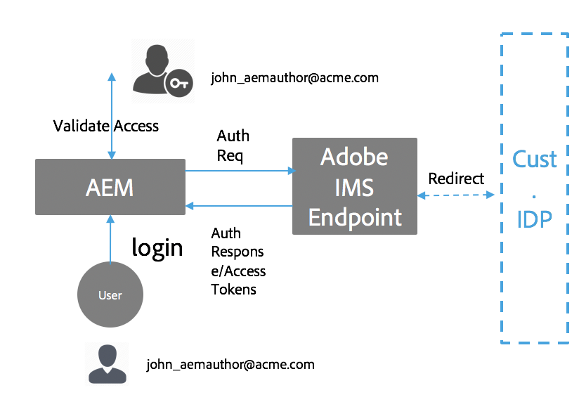

# Autenticazione Adobe IMS e supporto per Admin Console per AEM Managed Services {#adobe-ims-authentication-and-admin-console-support-for-aem-managed-services}

>[!CAUTION]
>
>AEM 6.4 ha raggiunto la fine del supporto esteso e questa documentazione non viene più aggiornata. Per maggiori dettagli, consulta la nostra [periodi di assistenza tecnica](https://helpx.adobe.com/it/support/programs/eol-matrix.html). Trova le versioni supportate [qui](https://experienceleague.adobe.com/docs/).

>[!NOTE]
>
>Questa funzione è disponibile solo per i clienti di Adobe Managed Services.

## Introduzione {#introduction}

AEM 6.4.3.0 introduce un supporto Admin Console per le istanze AEM e l’autenticazione basata su Adobe IMS(Identity Management System) per **AEM Managed Services** clienti.

AEM l’onboarding nell’Admin Console consentirà AEM clienti Managed Services di gestire tutti gli utenti di Experience Cloud in un’unica console. Gli utenti e i gruppi possono essere assegnati ai profili di prodotto associati alle istanze AEM, consentendo loro di accedere a un’istanza specifica.

## Elementi di rilievo {#key-highlights}

* Il supporto per l’autenticazione IMS di AEM è riservato solo agli autori, agli amministratori o agli sviluppatori di AEM, non agli utenti finali esterni di siti di clienti come i visitatori del sito
* L’Admin Console rappresenta AEM clienti Managed Services come organizzazioni IMS e le loro istanze come contesti di prodotto. Gli amministratori di prodotto e di sistema dei clienti potranno gestire l’accesso alle istanze
* AEM Managed Services sincronizzerà le topologie dei clienti con l’Admin Console. Nell’Admin Console sarà presente un’istanza AEM contesto di prodotto Managed Services per istanza.
* I profili di prodotto in Admin Console determinano a quali istanze un utente può accedere
* È supportata l’autenticazione federata tramite provider di identità conformi a SAML 2 dei clienti
* Saranno supportati solo Enterprise ID o Federated ID (per il servizio Single Sign-On del cliente), non gli ID Adobe personali.
* La gestione degli utenti (in Adobe Admin Console) continuerà a essere di proprietà degli amministratori dei clienti.

## Architettura {#architecture}

L’autenticazione IMS funziona utilizzando il protocollo OAuth tra AEM e l’endpoint Adobe IMS. Dopo l’aggiunta a IMS, un utente con identità Adobe può accedere ad AEM Managed Services utilizzando le credenziali IMS.

Il flusso di accesso dell&#39;utente è mostrato di seguito, l&#39;utente verrà reindirizzato a IMS ed eventualmente all&#39;IDP del cliente per la convalida SSO e quindi reindirizzato nuovamente a AEM.

## Come impostare {#how-to-set-up}

### Onboarding di organizzazioni in Admin Console {#onboarding-organizations-to-admin-console}

L’onboarding del cliente in Admin Console è un prerequisito per l’utilizzo di Adobe IMS per l’autenticazione AEM.

Come primo passo, i clienti devono disporre di un&#39;organizzazione in Adobe IMS. Ad Adobe, i clienti Enterprise sono rappresentati come organizzazioni IMS nel [Adobe Admin Console](https://helpx.adobe.com/it/enterprise/using/admin-console.html).

AEM i clienti Managed Services devono già disporre del provisioning di un’organizzazione e, nell’ambito del provisioning IMS, le istanze dei clienti saranno rese disponibili nell’Admin Console per la gestione delle adesioni e dell’accesso degli utenti.

Il passaggio a IMS per l’autenticazione degli utenti sarà uno sforzo congiunto tra AMS e i clienti, ciascuno dei quali avrà i propri flussi di lavoro da completare.

Quando un cliente esiste come organizzazione IMS e AMS esegue il provisioning del cliente per IMS, questo è il riepilogo dei flussi di lavoro di configurazione richiesti:

1. L’amministratore di sistema designato riceve un invito ad accedere all’Admin Console
1. L’amministratore di sistema richiede il dominio per confermare la proprietà del dominio (in questo esempio acme.com)
1. L&#39;amministratore di sistema imposta le directory utente
1. L’amministratore di sistema configura il provider di identità (IDP) nell’Admin Console per la configurazione SSO.
1. L’amministratore AEM gestisce i gruppi, le autorizzazioni e i privilegi locali come di consueto. Consulta Sincronizzazione utenti e gruppi

>[!NOTE]
>
>Per ulteriori informazioni su Adobe Identity Management Basics, inclusa la configurazione IDP, consulta l’articolo [questa pagina.](https://helpx.adobe.com/it/enterprise/using/set-up-identity.html)
>
>Per ulteriori informazioni sull’amministrazione e l’Admin Console Enterprise, consulta l’articolo [questa pagina](https://helpx.adobe.com/it/enterprise/managing/user-guide.html).

### Onboarding degli utenti nell’Admin Console {#onboarding-users-to-the-admin-console}

Sono disponibili tre modi per integrare gli utenti a seconda delle dimensioni del cliente e delle loro preferenze:

1. Creare manualmente utenti e gruppi in Admin Console
1. Caricare un file CSV con gli utenti
1. Sincronizza utenti e gruppi dall&#39;organizzazione Active Directory del cliente.

#### Aggiunta manuale tramite l’interfaccia di Admin Console {#manual-addition-through-admin-console-ui}

È possibile creare manualmente utenti e gruppi nell’interfaccia di Admin Console. Questo metodo può essere utilizzato se non dispongono di un numero elevato di utenti da gestire. Ad esempio, un numero di utenti meno di 50 AEM.

Gli utenti possono anche essere creati manualmente se il cliente utilizza già questo metodo per amministrare altri prodotti di Adobe come le applicazioni di Analytics, Target o Creative Cloud.

#### Caricamento di file nell’interfaccia utente di Admin Console {#file-upload-in-the-admin-console-ui}

Per facilitare la creazione di utenti, è possibile caricare un file CSV per aggiungere utenti in blocco:

#### Strumento User Sync {#user-sync-tool}

Lo strumento User Sync (UST) consente ai clienti aziendali di creare o gestire gli utenti Adobe che utilizzano Active Directory o altri servizi di directory OpenLDAP testati. Gli utenti di destinazione sono amministratori di identità IT (directory Enterprise e amministratori di sistema) che saranno in grado di installare e configurare lo strumento. Lo strumento open source è personalizzabile in modo che i clienti possano modificarlo in base a specifiche esigenze.

Durante l’esecuzione di User Sync, recupera un elenco di utenti da Active Directory dell’organizzazione (o da qualsiasi altra origine dati compatibile) e lo confronta con l’elenco di utenti all’interno dell’Admin Console. Chiama quindi l’API User Management di Adobe in modo che Admin Console sia sincronizzato con la directory dell’organizzazione. Il flusso di variazione è interamente unidirezionale; eventuali modifiche apportate nell’Admin Console non vengono inviate alla directory.

Lo strumento consente all’amministratore di sistema di mappare i gruppi di utenti nella directory del cliente con la configurazione del prodotto e i gruppi di utenti nell’Admin Console, la nuova versione di UST consente anche la creazione dinamica dei gruppi di utenti nell’Admin Console.

Per configurare User Sync, l’organizzazione deve creare un set di credenziali in modo analogo a come userebbe l’[API User Management](https://www.adobe.io/apis/cloudplatform/usermanagement/docs/setup.html).

User Sync viene distribuito tramite l’archivio Adobe Github nel seguente percorso:

[https://github.com/adobe-apiplatform/user-sync.py/releases/latest](https://github.com/adobe-apiplatform/user-sync.py/releases/latest)

Una versione pre-release 2.4RC1 è disponibile con supporto per la creazione di gruppi dinamici ed è disponibile qui: [https://github.com/adobe-apiplatform/user-sync.py/releases/tag/v2.4rc1](https://github.com/adobe-apiplatform/user-sync.py/releases/tag/v2.4rc1)

Le funzioni principali di questa versione includono la possibilità di mappare dinamicamente i nuovi gruppi LDAP per l’iscrizione degli utenti in Admin Console, nonché la creazione dinamica di gruppi di utenti.

Ulteriori informazioni sulle nuove funzioni per i gruppi sono disponibili qui:

[https://github.com/adobe-apiplatform/user-sync.py/blob/v2/docs/en/user-manual/advanced_configuration](https://github.com/adobe-apiplatform/user-sync.py/blob/v2/docs/en/user-manual/advanced_configuration.md#additional-group-options)

>[!NOTE]
>
>Per ulteriori informazioni sullo strumento User Sync, consulta la [pagina della documentazione](https://adobe-apiplatform.github.io/user-sync.py/en/).
>
>
>Lo strumento User Sync deve essere registrato come client UMAPI di Adobe I/O utilizzando la procedura descritta [qui](https://adobe-apiplatform.github.io/umapi-documentation/en/UM_Authentication.html).
>
>È possibile trovare la documentazione della console Adobe I/O [qui](https://www.adobe.io/apis/cloudplatform/console.html).
>
>
>L’API User Management utilizzata dallo strumento User Sync viene descritta in [posizione](https://www.adobe.io/apis/cloudplatform/umapi-new.html).

>[!NOTE]
>
>La configurazione IMS AEM sarà gestita dal team di Adobe Managed Services. Tuttavia, l’amministratore del cliente può modificarlo in base alle proprie esigenze (ad esempio, Appartenenza al gruppo automatico o Mappatura gruppo). Il client IMS verrà registrato anche dal team Managed Services.

## Guida all’uso {#how-to-use}

### Gestione dei prodotti e dell’accesso utente in Admin Console {#managing-products-and-user-access-in-admin-console}

Quando l’amministratore del prodotto del cliente accede all’Admin Console, visualizza più istanze del contesto di prodotto Managed Services AEM come mostrato di seguito:

In questo esempio, l’organizzazione *Onboard AEM-MS* dispone di 32 istanze che si estendono su topologie e ambienti diversi come Stage, Prod, ecc.

Puoi controllare i dettagli dell’istanza per identificare l’istanza:

In ogni istanza del contesto di prodotto, sarà presente un profilo di prodotto associato. Questo profilo di prodotto viene utilizzato per assegnare l’accesso a utenti e gruppi.

Tutti gli utenti e i gruppi aggiunti sotto questo profilo di prodotto potranno accedere a tale istanza come mostrato nell’esempio seguente:

### Accesso a AEM {#logging-into-aem}

#### Accesso amministratore locale {#local-admin-login}

AEM continuare a supportare gli accessi locali per gli utenti amministratori, in quanto la schermata di accesso dispone di un’opzione per accedere localmente:

#### Accesso basato su IMS {#ims-based-login}

Per altri utenti, è possibile utilizzare l’accesso basato su IMS dopo che IMS è stato configurato per l’istanza. L’utente farà prima clic sul pulsante **Accesso con Adobe** come mostrato di seguito:

Vengono quindi reindirizzati alla schermata di accesso di IMS e immettono le proprie credenziali:

Se durante la configurazione iniziale di Admin Console viene configurato un IDP federato, l’utente verrà reindirizzato all’IDP del cliente per l’accesso SSO.

L&#39;IDP è Okta nell&#39;esempio seguente:

Una volta completata l’autenticazione, l’utente verrà reindirizzato ad AEM per eseguire l’accesso:

### Migrazione di utenti esistenti {#migrating-existing-users}

Per le istanze AEM esistenti che utilizzano un altro metodo di autenticazione e che vengono ora migrate a IMS, è necessario eseguire un passaggio di migrazione.

Gli utenti esistenti nell&#39;archivio AEM (originati localmente, tramite LDAP o SAML) possono essere migrati per puntare a IMS come IDP utilizzando l&#39;Utilità di migrazione utenti.

Questa utility verrà eseguita dal team AMS come parte del provisioning IMS.

### Gestione di autorizzazioni e ACL in AEM {#managing-permissions-and-acls-in-aem}

Il controllo degli accessi e le autorizzazioni continueranno a essere gestiti in AEM, ciò può essere ottenuto separando i gruppi di utenti provenienti da IMS (ad esempio, AEM-GRP-008 nell’esempio seguente) e i gruppi locali in cui sono definite le autorizzazioni e il controllo degli accessi. I gruppi di utenti sincronizzati da IMS possono essere assegnati a gruppi locali e ereditare le autorizzazioni.

Nell’esempio seguente, ad esempio, i gruppi sincronizzati vengono aggiunti al gruppo *Dam_Users* locale.

In questo caso, un utente è stato assegnato anche ad alcuni gruppi nell’Admin Console. ( Si prega di notare che gli utenti e i gruppi possono essere sincronizzati da LDAP utilizzando lo strumento di sincronizzazione degli utenti o creati localmente, vedi la sezione **Onboarding degli utenti nell’Admin Console** sopra).

>[!NOTE]
>
>I gruppi di utenti vengono sincronizzati solo quando gli utenti accedono all&#39;istanza.

L’utente fa parte dei seguenti gruppi in IMS:

Quando l’utente esegue l’accesso, le iscrizioni ai gruppi vengono sincronizzate, come illustrato di seguito:

In AEM, i gruppi di utenti sincronizzati da IMS possono essere aggiunti come membri a gruppi locali esistenti, ad esempio Utenti DAM.

Come mostrato di seguito, il gruppo *AEM-GRP_008* eredita le autorizzazioni e i privilegi degli utenti DAM. Questo è un modo efficace di gestire le autorizzazioni per i gruppi sincronizzati ed è comunemente utilizzato anche nei metodi di autenticazione basati su LDAP.

