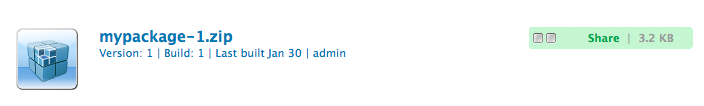
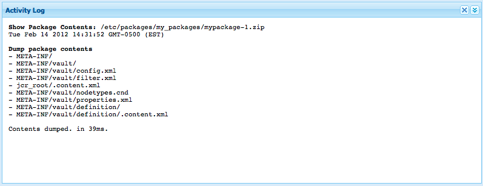

# Come utilizzare i pacchetti{#how-to-work-with-packages}

I pacchetti consentono di importare ed esportare il contenuto del repository. Ad esempio, potete utilizzare i pacchetti per installare nuove funzionalità, trasferire contenuti tra le istanze e eseguire il backup del contenuto del repository.

È possibile accedere ai pacchetti e/o mantenerli nelle pagine seguenti:

* [Gestione](#package-manager) pacchetti, che consente di gestire i pacchetti nell&#39;istanza AEM locale.

* [Package Share](#package-share), un server centralizzato che contiene sia i pacchetti disponibili al pubblico che quelli privati per la società. I pacchetti pubblici possono contenere hotfix, nuove funzionalità, documentazione, ecc.

Potete trasferire i pacchetti tra Package Manager, Package Share e il file system.

## Che cosa sono i pacchetti? {#what-are-packages}

Un pacchetto è un file zip che contiene il contenuto del repository sotto forma di serializzazione del file system (chiamata serializzazione &quot;vault&quot;). Questo fornisce una rappresentazione semplice da usare e modificare di file e cartelle.

I pacchetti includono il contenuto, sia contenuto della pagina che contenuto relativo al progetto, selezionato utilizzando i filtri.

Un pacchetto contiene anche metadati di archivio, comprese le definizioni dei filtri e le informazioni di configurazione dell&#39;importazione. Nel pacchetto possono essere incluse ulteriori proprietà di contenuto (non utilizzate per l&#39;estrazione del pacchetto), ad esempio una descrizione, un&#39;immagine visiva o un&#39;icona; queste proprietà sono riservate al consumatore del pacchetto di contenuti e sono riservate solo a scopo informativo.

>[!NOTE]
>
>I pacchetti rappresentano la versione corrente del contenuto al momento della creazione del pacchetto. Non includono versioni precedenti del contenuto che AEM conservato nella directory archivio.

Potete eseguire le azioni seguenti su o con i pacchetti:

* Creare nuovi pacchetti; definizione delle impostazioni e dei filtri del pacchetto come richiesto
* Anteprima del contenuto del pacchetto (prima della creazione)
* Creare pacchetti
* Visualizzazione delle informazioni sul pacchetto
* Visualizzare il contenuto del pacchetto (dopo la creazione)
* Modificare la definizione dei pacchetti esistenti
* Ricreare i pacchetti esistenti
* Riavvolgere i pacchetti
* Scaricare pacchetti da AEM al file system
* Caricare i pacchetti dal file system nell’istanza AEM locale
* Convalida del contenuto del pacchetto prima dell&#39;installazione
* Eseguire un&#39;installazione a prova di secco
* Installare i pacchetti (AEM non installa automaticamente i pacchetti dopo il caricamento)
* Eliminare i pacchetti
* Scaricare pacchetti, come hotfix, dalla libreria Condivisione pacchetti
* Caricare i pacchetti nella sezione interna della società della libreria Package Share

## Informazioni pacchetto {#package-information}

Una definizione di pacchetto è composta da vari tipi di informazioni:

* [Impostazioni pacchetto](#package-settings)
* [Filtri pacchetto](#package-filters)
* [Schermate pacchetto](#package-screenshots)
* [Icone pacchetto](#package-icons)

### Impostazioni pacchetto {#package-settings}

Potete modificare diverse impostazioni del pacchetto per definire aspetti quali la descrizione del pacchetto, i bug correlati, le dipendenze e le informazioni sul fornitore.

La finestra di dialogo **Impostazioni pacchetto** è disponibile tramite il pulsante **Modifica** quando [create](#creating-a-new-package) o [editing](#viewing-and-editing-package-information) un pacchetto e fornisce tre schede per la configurazione. Dopo aver apportato le modifiche, fare clic su **OK** per salvarle.


| **Campo** | **Descrizione** |
|---|---|
| Nome | Nome del pacchetto. |
| Gruppo | Nome del gruppo a cui aggiungere il pacchetto per organizzare i pacchetti. Digitate il nome di un nuovo gruppo o selezionate un gruppo esistente. |
| Versione | Testo da utilizzare per la versione personalizzata. |
| Descrizione | Breve descrizione del pacchetto. È possibile utilizzare i tag HTML per la formattazione. |
| Miniatura  | Icona visualizzata con l&#39;elenco dei pacchetti. Fate clic su Sfoglia per selezionare un file locale. |


<table> 
 <tbody> 
  <tr> 
   <th><strong>Campo</strong></th> 
   <th><strong>Descrizione</strong></th> 
   <th><strong>Formato/Esempio</strong></th> 
  </tr> 
  <tr> 
   <td>Nome</td> 
   <td>Nome del provider.</td> 
   <td><em>Geometrixx AEM<br /> </em></td> 
  </tr> 
  <tr> 
   <td>URL</td> 
   <td>URL del provider.</td> 
   <td><em>https://www.aem-geometrixx.com</em></td> 
  </tr> 
  <tr> 
   <td>Collegamento</td> 
   <td>Collegamento specifico al pacchetto a una pagina del fornitore.</td> 
   <td><em>https://www.aem-geometrixx.com/mypackage.html</em></td> 
  </tr> 
  <tr> 
   <td>Richiede<br /> </td> 
   <td> 
    <ul> 
     <li>Amministratore: Selezionate quando il pacchetto può essere installato solo da un account con privilegi di amministratore.</li> 
     <li>Riavvia: Selezionate quando il server deve essere riavviato dopo l'installazione del pacchetto.</li> 
    </ul> </td> 
   <td> </td> 
  </tr> 
  <tr> 
   <td>Gestione AC</td> 
   <td><p>Specificate come vengono gestite le informazioni sul controllo di accesso definite nel pacchetto quando il pacchetto viene importato:</p> 
    <ul> 
     <li><strong>Ignora</strong></li> 
     <li><strong>Sovrascrivi</strong></li> 
     <li><strong>Unisci</strong></li> 
     <li><strong>Cancella</strong></li> 
     <li><strong>MergePreserve</strong></li> 
    </ul> <p>Il valore predefinito è <strong>Ignore</strong>.</p> </td> 
   <td> 
    <ul> 
     <li><strong>Ignora</strong> : mantiene gli ACL nell'archivio</li> 
     <li><strong>Sovrascrivi</strong> : sovrascrivi ACL nell'archivio</li> 
     <li><strong>Unisci</strong> : unisci entrambi i set di ACL</li> 
     <li><strong>Cancella</strong>  - ACL trasparenti</li> 
     <li><strong>MergePreserve</strong> : consente di unire il controllo di accesso nel contenuto con quello fornito con il pacchetto aggiungendo le voci di controllo di accesso delle entità non presenti nel contenuto</li> 
    </ul> </td> 
  </tr> 
 </tbody> 
</table>


| **Campo** | **Descrizione** | **Formato/Esempio** |
|---|---|---|
| Test con | Il nome e la versione del prodotto a cui è destinato il pacchetto o con cui è compatibile. | *AEM 6* |
| Bug/Problemi risolti | Campo di testo che consente di elencare i dettagli dei bug corretti con questo pacchetto. Elenca ciascun bug su una riga separata. | riepilogo bug-nr |
| Dipende da | Elenca le informazioni sulle dipendenze che devono essere rispettate ogni volta che sono necessari altri pacchetti per consentire l&#39;esecuzione del pacchetto corrente come previsto. Questo campo è importante quando si utilizzano gli hotfix. | groupId:name:version |
| Sostituisce | Un elenco di pacchetti obsoleti che il pacchetto sostituisce. Prima di eseguire l&#39;installazione, verificate che il pacchetto includa tutto il contenuto necessario dai pacchetti obsoleti, in modo da non sovrascrivere il contenuto. | groupId:name:version |

### Filtri pacchetto {#package-filters}

I filtri identificano i nodi del repository da includere nel pacchetto. A **Filter Definition** specifica le informazioni seguenti:

* Il **percorso principale** del contenuto da includere.
* **Regole** che includono o escludono nodi specifici sotto il percorso principale.

I filtri possono includere zero o più regole. Quando non sono definite regole, il pacchetto contiene tutto il contenuto al di sotto del percorso principale.

Potete definire una o più definizioni di filtro per un pacchetto. Utilizzate più di un filtro per includere il contenuto proveniente da più percorsi principali.


Nella tabella seguente sono descritte le regole e sono riportati alcuni esempi:

<table> 
 <tbody> 
  <tr> 
   <th> Tipo di regola</th> 
   <th>Descrizione </th> 
   <th>Esempio </th> 
  </tr> 
  <tr> 
   <td> includi</td> 
   <td>È possibile definire un percorso o utilizzare un'espressione regolare per specificare tutti i nodi che si desidera includere.<br /> <br /> Includendo una directory: 
    <ul> 
     <li>includere la directory <i>e</i> tutti i file e le cartelle presenti in tale directory (ovvero l'intera sottostruttura)</li> 
     <li><strong>non </strong> includere altri file o cartelle dal percorso principale specificato</li> 
    </ul> </td> 
   <td>/libs/sling/install(/.*)? </td> 
  </tr> 
  <tr> 
   <td> escludi</td> 
   <td>È possibile specificare un percorso o utilizzare un'espressione regolare per specificare tutti i nodi da escludere.<br /> <br /> Escludendo una directory, tale directory  <i></i> e tutti i file e le cartelle presenti in tale directory (ovvero l’intera sottostruttura) verranno esclusi.<br /> </td> 
   <td>/libs/wcm/foundation/components(/.*)?</td> 
  </tr> 
 </tbody> 
</table>

>[!NOTE]
>
>Un pacchetto può contenere più definizioni di filtro, in modo che i nodi di diverse ubicazioni possano essere facilmente combinati in un unico pacchetto.

I filtri pacchetto vengono definiti più spesso quando [create il pacchetto](#creating-a-new-package), ma possono essere modificati anche in un secondo momento (dopodiché il pacchetto deve essere rigenerato).

### Schermate pacchetto {#package-screenshots}

Potete allegare schermate al pacchetto per fornire una rappresentazione visiva dell&#39;aspetto del contenuto; ad esempio, fornendo schermate di nuove funzionalità.

### Icone pacchetto {#package-icons}

Potete anche allegare un’icona al pacchetto per fornire una rappresentazione visiva di riferimento rapido del contenuto del pacchetto. Questo viene visualizzato nell&#39;elenco dei pacchetti e può essere utile per identificare facilmente il pacchetto o la classe del pacchetto.

Poiché un pacchetto può contenere un&#39;icona, per i pacchetti ufficiali vengono utilizzate le seguenti convenzioni:

>[!NOTE]
>
>Per evitare confusione, usate un’icona descrittiva per il pacchetto e non usate una delle icone ufficiali.

Pacchetto Hotfix ufficiale:


Pacchetto di installazione o estensione AEM ufficiale:

Pacchetti di funzioni ufficiali:


## Gestione pacchetti {#package-manager}

Gestione pacchetti gestisce i pacchetti nell&#39;installazione AEM locale. Dopo aver [assegnato le autorizzazioni necessarie](#permissions-needed-for-using-the-package-manager) potete utilizzare Gestione pacchetti per diverse azioni, tra cui la configurazione, la creazione, il download e l&#39;installazione dei pacchetti. Gli elementi chiave da configurare sono:

* [Impostazioni pacchetto](#package-settings)
* [Filtri pacchetto](#package-filters)

### Autorizzazioni necessarie per l&#39;utilizzo di Package Manager {#permissions-needed-for-using-the-package-manager}

Per concedere agli utenti il diritto di creare, modificare, caricare e installare pacchetti, dovete concedere loro le autorizzazioni appropriate nei seguenti percorsi:

* **/etc/packages** (diritti completi esclusa l’eliminazione)
* il nodo che contiene il contenuto del pacchetto

Per istruzioni sulla modifica delle autorizzazioni, vedere [Impostazione delle autorizzazioni](/help/sites-administering/security.md).

### Creazione di un nuovo pacchetto {#creating-a-new-package}

Per creare una nuova definizione di pacchetto:

1. Nella schermata di benvenuto AEM, fate clic su **Pacchetti** oppure, dalla console **Strumenti**, fate doppio clic su **Pacchetti**.

1. Selezionate quindi **Gestione pacchetti**.
1. Fare clic su **Crea pacchetto**.

   >[!NOTE]
   >
   >Se l’istanza include molti pacchetti, potrebbe essere presente una struttura di cartelle, in modo da poter passare alla cartella di destinazione richiesta prima di creare il nuovo pacchetto.

1. Nella finestra di dialogo:

   

   Immettere:

   * **Nome gruppo**

      Nome del gruppo di destinazione (o cartella). I gruppi sono destinati all’organizzazione dei pacchetti.

      Se il gruppo non esiste già, viene creata una cartella. Se lasciate vuoto il nome del gruppo, verrà creato il pacchetto nell&#39;elenco dei pacchetti principali (Home > Pacchetti).

   * **Nome pacchetto**

      Nome del nuovo pacchetto. Selezionate un nome descrittivo per identificare facilmente i contenuti del pacchetto.

   * **Versione**

      Campo di testo per indicare una versione. Questo verrà aggiunto al nome del pacchetto per formare il nome del file zip.
   Fate clic su **OK** per creare il pacchetto.

1. AEM elenca il nuovo pacchetto nella cartella del gruppo appropriata.

   

   Fate clic sull&#39;icona o sul nome del pacchetto da aprire.

   

   >[!NOTE]
   >
   >Se necessario, potete tornare a questa pagina in un secondo momento.

1. Fare clic su **Modifica** per modificare le impostazioni [del pacchetto](#package-settings).

   Qui è possibile aggiungere informazioni e/o definire determinate impostazioni; ad esempio, questi includono una descrizione, l&#39; [icona](#package-icons), i bug correlati e aggiungere i dettagli del fornitore.

   Fare clic su **OK** al termine della modifica delle impostazioni.

1. Aggiungete **[Screenshots](#package-screenshots)** al pacchetto come necessario. Quando viene creato il pacchetto, è disponibile un&#39;istanza; se necessario, aggiungete altro utilizzando **Package Screenshot** dalla barra laterale.

   Aggiungete l&#39;immagine effettiva facendo doppio clic sul componente immagine nell&#39;area **Screenshots**, aggiungendo un&#39;immagine e facendo clic su **OK**.

1. Definite i **[filtri pacchetto](#package-filters)** trascinando le istanze del **filtro definizione** dalla barra laterale, quindi fate doppio clic per aprire la finestra di modifica:

   

   Specifica:

   * **Percorso**
radice: il contenuto da includere nel pacchetto; può essere la radice di un sottoalbero.
   * ****
RulesRules sono facoltative; per le definizioni di pacchetti semplici, non è necessario specificare regole di inclusione o esclusione.

      Se necessario, potete definire [**Includi** o **Escludi** regole](#package-filters) per definire esattamente il contenuto del pacchetto.

      Aggiungete le regole utilizzando il simbolo **+**, in alternativa rimuovete le regole utilizzando il simbolo **-**. Le regole vengono applicate in base al loro ordine, in modo da posizionarle come necessario utilizzando i pulsanti **Su** e **Giù**.
   Fare clic su **OK** per salvare il filtro.

   >[!NOTE]
   >
   >Puoi utilizzare tutte le definizioni di filtro necessarie, ma devi fare attenzione a non creare conflitti. Utilizzate **Preview** per confermare quali saranno i contenuti del pacchetto.

1. Per confermare il contenuto del pacchetto, potete utilizzare **Preview**. Questo esegue una prova a secco del processo di compilazione ed elenca tutti gli elementi che verranno aggiunti al pacchetto quando viene effettivamente costruito.
1. Ora è possibile [Generare](#building-a-package) il pacchetto.

   >[!NOTE]
   >
   >Non è obbligatorio costruire il pacchetto a questo punto, può essere fatto in un momento successivo.

### Creazione di un pacchetto {#building-a-package}

Spesso un pacchetto viene creato contemporaneamente alla [creazione della definizione del pacchetto](#creating-a-new-package), ma potete tornare in un momento successivo per creare o ricreare il pacchetto. Questo può essere utile se il contenuto all’interno della directory archivio è stato modificato.

>[!NOTE]
>
>Prima di creare il pacchetto può essere utile visualizzare in anteprima il contenuto del pacchetto. Fare clic su **Anteprima**.

1. Aprite la definizione del pacchetto da **Gestione pacchetti** (fate clic sull&#39;icona o sul nome del pacchetto).

1. Fare clic su **Build**. Viene visualizzata una finestra di dialogo con richiesta di conferma per confermare la creazione del pacchetto.

   >[!NOTE]
   >
   >Questo è particolarmente importante quando si sta ricreando un pacchetto in quanto il contenuto del pacchetto verrà sovrascritto.

1. Fai clic su **OK**. AEM creare il pacchetto, elencando tutti i contenuti aggiunti al pacchetto così come lo è. Al termine del AEM viene visualizzata una conferma che il pacchetto è stato creato e (quando chiudete la finestra di dialogo) aggiorna le informazioni dell’elenco dei pacchetti.

### Rewrapping di un pacchetto {#rewrapping-a-package}

Una volta creato, un pacchetto può essere reinserito, se necessario.

Il rewrapping modifica le informazioni sul pacchetto - *senza* modificare il contenuto del pacchetto. Le informazioni sul pacchetto sono la miniatura, la descrizione, ecc., in altre parole tutto ciò che è possibile modificare con la finestra di dialogo **Impostazioni pacchetto** (per aprire questo clic **Modifica**).

Un caso di utilizzo principale per il rewrapping è la preparazione di un pacchetto per la condivisione del pacchetto. Ad esempio, potreste avere un pacchetto esistente e decidere di condividerlo con altri utenti. Per aggiungere una miniatura, aggiungere una descrizione. Invece di ricreare l&#39;intero pacchetto con tutte le sue funzionalità (che potrebbero richiedere un po&#39; di tempo e comporta il rischio che il pacchetto non sia più identico all&#39;originale) potete reinserirlo e aggiungere semplicemente la miniatura e la descrizione.

1. Aprite la definizione del pacchetto da **Gestione pacchetti** (fate clic sull&#39;icona o sul nome del pacchetto).

1. Fare clic su **Modifica** e aggiornare le impostazioni **[Package Settings](#package-settings)** come necessario. Fate clic su **OK** per salvare. 

1. Fare clic su **Rewrapper**. Viene visualizzata una finestra di dialogo per richiedere una conferma.

### Visualizzazione e modifica delle informazioni sul pacchetto {#viewing-and-editing-package-information}

Per visualizzare o modificare le informazioni sulla definizione di un pacchetto:

1. In Gestione pacchetti, andate al pacchetto da visualizzare.
1. Fate clic sull&#39;icona del pacchetto da visualizzare. Viene aperta la pagina del pacchetto in cui sono elencate le informazioni sulla definizione del pacchetto:

   

   >[!NOTE]
   >
   >Potete anche modificare ed eseguire determinate azioni sul pacchetto da questa pagina.
   >
   >I pulsanti disponibili dipendono dal fatto che il pacchetto sia già stato creato o meno.

1. Se il pacchetto è già stato creato, fate clic su **Contents**, si aprirà una finestra con l&#39;elenco completo del contenuto del pacchetto:

### Visualizzazione del contenuto del pacchetto e installazione di test {#viewing-package-contents-and-testing-installation}

Dopo aver creato un pacchetto, potete visualizzare i contenuti:

1. In Gestione pacchetti, andate al pacchetto da visualizzare.
1. Fate clic sull&#39;icona del pacchetto da visualizzare. Viene aperta la pagina del pacchetto con le informazioni sulla definizione del pacchetto.

1. Per visualizzare il contenuto fare clic su **Contents**, si apre una finestra con l&#39;elenco completo del contenuto del pacchetto:

   

1. Per eseguire una prova a secco dell&#39;installazione, fare clic su **Test Installation**. Dopo aver confermato l’azione, si apre una finestra in cui sono elencati i risultati come se l’installazione fosse stata eseguita:

   

### Download dei pacchetti nel file system {#downloading-packages-to-your-file-system}

Questa sezione descrive come scaricare un pacchetto da AEM al file system utilizzando **Package Manager**.

>[!NOTE]
>
>Per informazioni sul download di hotfix, pacchetti di funzionalità e pacchetti dall&#39;area pubblica e dall&#39;area interna della condivisione di pacchetti, consultate [Package Share](#package-share).
>
>Da Condivisione pacchetti potete:
>
>* scaricare pacchetti da [Package Share direttamente nella tua istanza AEM locale](#downloading-and-installing-packages-from-package-share).\
   >  Al momento del download, il pacchetto viene importato nella directory archivio, dopodiché è possibile installarlo immediatamente nell&#39;istanza locale utilizzando la **Gestione pacchetti**. Questi pacchetti includono hotfix e altri pacchetti condivisi.
   >
   >
* scaricare pacchetti da [Package Share nel file system](#downloading-packages-to-your-file-system-from-package-share).

>


1. Nella schermata di benvenuto AEM, fate clic su **Packages**, quindi selezionate **Package Manager**.
1. Passate al pacchetto da scaricare.

   

1. Fate clic sul collegamento formato dal nome del file ZIP (sottolineato) per il pacchetto da scaricare; ad esempio `export-for-offline.zip`.

   AEM scarica il pacchetto sul computer (utilizzando una finestra di dialogo di download standard del browser).

### Caricamento di pacchetti dal file system {#uploading-packages-from-your-file-system}

Il caricamento di un pacchetto consente di caricare un pacchetto dal file system in AEM Package Manager.

>[!NOTE]
>
>Consultate [Caricamento di pacchetti in Package Share](#uploading-a-package) interno della società per caricare un pacchetto nell&#39;area privata della società di Package Share.

Per caricare un pacchetto:

1. Andate alla **Gestione pacchetti**. Quindi nella cartella del gruppo in cui desiderate caricare il pacchetto.

   

1. Fate clic su **Carica pacchetto**.

   

   * **File**

      È possibile digitare direttamente il nome del file oppure utilizzare il percorso **Sfoglia...** finestra di dialogo per selezionare il pacchetto richiesto dal file system locale (dopo la selezione fare clic su **OK**).

   * **Forza caricamento**

      Se esiste già un pacchetto con questo nome, potete fare clic su di esso per forzare il caricamento (e sovrascrivere il pacchetto esistente).
   Fate clic su **OK** in modo che il nuovo pacchetto venga caricato ed elencato nell&#39;elenco Gestione pacchetti.

   >[!NOTE]
   >
   >Per rendere il contenuto disponibile a AEM, [installate il pacchetto](#installing-packages).

### Convalida dei pacchetti {#validating-packages}

Prima di installare un pacchetto, potreste desiderare verificarne il contenuto. Poiché i pacchetti possono modificare i file sovrapposti in `/apps` e/o aggiungere, modificare e rimuovere ACL, spesso è utile convalidare queste modifiche prima dell&#39;installazione.

#### Opzioni di convalida {#validation-options}

Il meccanismo di convalida può controllare le seguenti caratteristiche del pacchetto:

* Importazioni pacchetti OSGi
* Sovrapposizioni
* ACL

Queste opzioni sono descritte di seguito.

* **Convalida importazioni di pacchetti OSGi**

   **Elementi controllati**

   Questa convalida esamina il pacchetto per tutti i file JAR (bundle OSGi), ne estrae i `manifest.xml` (che contiene le dipendenze con le versioni su cui si basa il bundle OSGi) e verifica che l&#39;istanza AEM esporta tali dipendenze con le versioni corrette.

   **Come viene segnalato**

   Tutte le dipendenze con versione che non possono essere soddisfatte dall&#39;istanza AEM sono elencate nel **log attività** di Package Manager.

   **Stati di errore**

   Se le dipendenze non sono soddisfatte, i bundle OSGi nel pacchetto con tali dipendenze non verranno avviati. Ciò comporta l’interruzione della distribuzione dell’applicazione in quanto tutto ciò che si basa sul bundle OSGi non avviato non funzionerà a sua volta correttamente.

   **Risoluzione errori**

   Per risolvere gli errori dovuti ai bundle OSGi non soddisfatti, è necessario modificare la versione della dipendenza nel bundle con importazioni non soddisfatte.

* **Convalida sovrapposizioni**

   **Elementi controllati**

   Questa convalida determina se il pacchetto installato contiene un file già sovrapposto nell&#39;istanza AEM di destinazione.

   Ad esempio, data una sovrapposizione esistente in `/apps/sling/servlet/errorhandler/404.jsp`, un pacchetto che contiene `/libs/sling/servlet/errorhandler/404.jsp`, in modo da modificare il file esistente in `/libs/sling/servlet/errorhandler/404.jsp`.

   **Come viene segnalato**

   Tali sovrapposizioni sono descritte nel **Registro attività** di Gestione pacchetti.

   **Stati di errore**

   Uno stato di errore indica che il pacchetto sta tentando di distribuire un file già sovrapposto, pertanto le modifiche nel pacchetto verranno sostituite (e quindi &quot;nascoste&quot;) dalla sovrapposizione e non avranno effetto.

   **Risoluzione errori**

   Per risolvere questo problema, il gestore del file di sovrapposizione in `/apps` deve rivedere le modifiche apportate al file di sovrapposizione in `/libs` e incorporare le modifiche necessarie nella sovrapposizione ( `/apps`), quindi ridistribuire il file di sovrapposizione.

   >[!NOTE]
   >
   >Il meccanismo di convalida non può essere conciliato se il contenuto sovrapposto è stato correttamente incorporato nel file della sovrapposizione. Pertanto, tale convalida continuerà a segnalare i conflitti anche dopo che saranno state apportate le necessarie modifiche.

* **Convalida ACL**

   **Elementi controllati**

   Questa convalida verifica quali autorizzazioni vengono aggiunte, come verranno gestite (unione/sostituzione) e se le autorizzazioni correnti verranno interessate.

   **Come viene segnalato**

   Le autorizzazioni sono descritte in **Activity Log** di Package Manager.

   **Stati di errore**

   Non è possibile fornire errori espliciti. La convalida indica semplicemente se le nuove autorizzazioni ACL verranno aggiunte o influenzate dall&#39;installazione del pacchetto.

   **Risoluzione errori**

   Utilizzando le informazioni fornite dalla convalida, i nodi interessati possono essere revisionati in CRXDE e gli ACL possono essere regolati nel pacchetto in base alle esigenze.

   >[!CAUTION]
   >
   >Come procedura ottimale, si consiglia di evitare che i pacchetti influenzino gli ACL forniti AEM, in quanto ciò potrebbe causare un comportamento inatteso del prodotto.

#### Esecuzione della convalida {#performing-validation}

La convalida dei pacchetti può essere eseguita in due modi diversi:

* Tramite l’interfaccia utente di Gestione pacchetti
* Tramite richiesta POST HTTP, ad esempio con cURL

>[!NOTE]
>
>La convalida deve sempre verificarsi dopo il caricamento del pacchetto ma prima di installarlo.

**Convalida del pacchetto tramite Gestione pacchetti**

1. Apri Gestione pacchetti in `https://<server>:<port>/crx/packmgr`
1. Selezionate il pacchetto nell&#39;elenco, quindi selezionate il menu a discesa **Altro** dall&#39;intestazione e quindi **Convalida** dal menu a discesa.

   >[!NOTE]
   >
   >Questa operazione deve essere eseguita dopo il caricamento del pacchetto di contenuto, ma prima di installare il pacchetto.

1. Nella finestra di dialogo modale visualizzata, utilizzare le caselle di controllo per selezionare i tipi di convalida e iniziare la convalida facendo clic su **Validate**. In alternativa, fare clic su **Annulla**.

1. Le convalida scelte vengono quindi eseguite. I risultati vengono visualizzati nel registro attività di Gestione pacchetti.

**Convalida del pacchetto tramite richiesta POST HTTP**

La richiesta POST è costituita dal seguente modulo.

```
https://<host>:<port>/crx/packmgr/service.jsp?cmd=validate&type=osgiPackageImports,overlays,acls
```

>[!NOTE]
>
>Il parametro `type` può essere un qualsiasi elenco non ordinato separato da virgole composto da:
>
>* `osgiPackageImports`
>* `overlays`
>* `acls`

>
>
Se non viene passato, il valore di `type` viene impostato come predefinito su `osgiPackageImports`.

Di seguito è riportato un esempio di utilizzo di cURL per eseguire la convalida di un pacchetto.

1. Se utilizzate cURL, eseguite un&#39;istruzione simile a quella riportata di seguito:

   ```shell
   curl -v -X POST --user admin:admin -F file=@/Users/SomeGuy/Desktop/core.wcm.components.all-1.1.0.zip 'http://localhost:4502/crx/packmgr/service.jsp?cmd=validate&type=osgiPackageImports,overlays,acls'
   ```

1. La convalida richiesta viene eseguita e la risposta viene restituita come oggetto JSON.

>[!NOTE]
>
>La risposta a una richiesta di POST HTTP di convalida sarà un oggetto JSON con i risultati della convalida.

### Installazione di pacchetti {#installing-packages}

Dopo aver caricato un pacchetto, dovete installare il contenuto. Per avere installato e funzionante il contenuto del pacchetto, è necessario che sia:

* caricato in AEM ([caricato dal file system](#uploading-packages-from-your-file-system) o [scaricato da Package Share](#downloading-and-installing-packages-from-package-share))

* installati

>[!CAUTION]
>
>L&#39;installazione di un pacchetto può sovrascrivere o eliminare il contenuto esistente. Caricate un pacchetto solo se siete certi che non eliminerà o sovrascriverà il contenuto necessario.
>
>Per visualizzare il contenuto o l’impatto di un pacchetto, potete effettuare le seguenti operazioni:
>
>* Eseguite un&#39;installazione di prova del pacchetto senza modificare il contenuto:\
   >  Aprite il pacchetto (fate clic sull&#39;icona o sul nome del pacchetto) e fate clic su **Test Install**.
   >
   >
* Consultate un elenco dei contenuti del pacchetto:\
   >  Aprite il pacchetto e fate clic su **Contents**.

>


>[!NOTE]
>
>Immediatamente prima dell&#39;installazione del pacchetto, viene creato un pacchetto di snapshot che contiene il contenuto che verrà sovrascritto.
>
>Lo snapshot verrà reinstallato se/quando disinstallate il pacchetto.

>[!CAUTION]
>
>Se state installando delle risorse digitali, dovete:
>
>* Innanzitutto, disattivate WorkflowLauncher.\
   >  Utilizzate l&#39;opzione di menu Componenti della console OSGi per disattivare `com.day.cq.workflow.launcher.impl.WorkflowLauncherImpl`.
   >
   >
* Al termine dell&#39;installazione, riattivate WorkflowLauncher.
>
>
La disattivazione di WorkflowLauncher assicura che il framework di Importazione risorse non modifichi (in modo involontario) le risorse al momento dell’installazione.

1. In Gestione pacchetti, andate al pacchetto da installare.

   Un pulsante **Install** viene visualizzato sul lato dei pacchetti che non sono ancora stati installati.

   >[!NOTE]
   >
   >In alternativa, potete aprire il pacchetto facendo clic sulla relativa icona per accedere al pulsante **Install**.

1. Fare clic su **Installa** per avviare l&#39;installazione. Viene visualizzata una finestra di dialogo con richiesta di conferma e con l’elenco di tutte le modifiche in corso. Al termine, fare clic su **Chiudi** nella finestra di dialogo.

   La parola **Installed** viene visualizzata accanto al pacchetto dopo che è stato installato.

### Caricamento e installazione basati su file system {#file-system-based-upload-and-installation}

Esiste un metodo alternativo per caricare e installare i pacchetti nell’istanza. Nel file system è presente una cartella `crx-quicksart` con il file jar e `license.properties`. È necessario creare una cartella denominata `install` in `crx-quickstart`. Avrete quindi qualcosa di simile a questo: `<aem_home>/crx-quickstart/install`

In questa cartella di installazione, potete aggiungere direttamente i pacchetti. Saranno automaticamente caricati e installati nell’istanza. Al termine, potete visualizzare i pacchetti in Gestione pacchetti.

Se l&#39;istanza è in esecuzione, l&#39;aggiunta di un pacchetto alla cartella `install` avvierà direttamente il caricamento e l&#39;installazione nell&#39;istanza. Se l&#39;istanza non è in esecuzione, i pacchetti inseriti nella cartella `install` verranno installati all&#39;avvio in ordine alfabetico.

>[!NOTE]
>
>È inoltre possibile eseguire questa operazione prima ancora di avviare l&#39;istanza per la prima volta. A tal fine, è necessario creare manualmente la cartella `crx-quickstart`, creare la cartella `install` al suo interno e inserire i pacchetti. Al primo avvio dell&#39;istanza, i pacchetti verranno installati in ordine alfabetico.

### Disinstallazione di pacchetti {#uninstalling-packages}

AEM consente di disinstallare i pacchetti. Questa azione consente di ripristinare i contenuti del repository interessati dallo snapshot creato immediatamente prima dell&#39;installazione del pacchetto.

>[!NOTE]
>
>Al momento dell&#39;installazione, viene creato un pacchetto di snapshot contenente il contenuto che verrà sovrascritto.
>
>Il pacchetto verrà reinstallato quando disinstallate il pacchetto.

1. In Gestione pacchetti, andate al pacchetto da disinstallare.
1. Fate clic sull&#39;icona del pacchetto da disinstallare.
1. Fate clic su **Disinstalla** per rimuovere il contenuto del pacchetto dall&#39;archivio. Viene visualizzata una finestra di dialogo con richiesta di conferma e con l’elenco di tutte le modifiche in corso. Al termine, fare clic su **Chiudi** nella finestra di dialogo.

### Eliminazione di pacchetti {#deleting-packages}

Per eliminare un pacchetto dagli elenchi Gestione pacchetti:

>[!NOTE]
>
>I file/nodi installati dal pacchetto sono **non** eliminati.

1. Nella console **Strumenti**, espandete la cartella **Packages** per visualizzare il pacchetto nel riquadro a destra.

1. Fate clic sul pacchetto da eliminare in modo che sia evidenziato e quindi:

   * Fare clic su **Elimina** nel menu della barra degli strumenti.
   * Fare clic con il pulsante destro del mouse e selezionare **Elimina**.

   

1. AEM richiede la conferma dell’eliminazione del pacchetto. Fare clic su **OK** per confermare l&#39;eliminazione.

>[!CAUTION]
>
>Se il pacchetto è già stato installato, il contenuto *installato* **non** verrà eliminato.

### Replica di pacchetti {#replicating-packages}

Replicate il contenuto di un pacchetto per installarlo nell&#39;istanza di pubblicazione:

1. In **Gestione pacchetti**, andate al pacchetto da replicare.

1. Fate clic sull&#39;icona o sul nome del pacchetto da replicare per espanderlo.
1. Nel menu a discesa **Altro** della barra degli strumenti, selezionare **Replica**.

## Condivisione pacchetti {#package-share}

Package Share è un server centralizzato reso disponibile al pubblico per la condivisione di pacchetti di contenuti.

Con Package Share potete scaricare questi pacchetti, che possono includere hotfix ufficiali, set di funzioni, aggiornamenti o contenuti di esempio generati da altri utenti.

Potete anche caricare e condividere i pacchetti all’interno della società.

### Accesso a Package Share {#access-to-package-share}

Non esiste un accesso anonimo a Package Share; in altre parole, solo gli utenti registrati possono visualizzare, scaricare e caricare i pacchetti.

L&#39;accesso a Package Share è disponibile per i nostri partner e clienti. Per poter assegnare i diritti di accesso, è necessario presentare i dettagli di registrazione.

Per accedere a Package Share:

* Utilizzare la pagina [Accesso](#signing-in-to-package-share)
* La prima volta che utilizzate la pagina di accesso dovrete:

   * [Registratevi per ottenere un ](#registering-for-package-share) ID Adobe  e/o  [convalidate l’Adobe ID  esistente](#validating-your-adobe-id)
   * in modo che sia possibile creare l&#39; [account di condivisione dei pacchetti](#package-share-account)

>[!NOTE]
>
>Gli utenti di Package Share che non sono stati assegnati a un cliente devono unirsi a una community per visualizzare tali risorse facendo clic su **Iscriviti** accanto all&#39;accesso alla condivisione del pacchetto.

#### Accesso a Package Share {#signing-in-to-package-share}

1. Nella schermata di benvenuto AEM fare clic su **Strumenti** -> **Distribuzione**
1. Selezionate quindi **Package Share**. Sarà necessario:

   * accedere con il proprio Adobe ID 
   * [Creare un Adobe ID ](#registering-for-package-share)

   >[!NOTE]
   >
   >La prima volta che accedete con il vostro Adobe ID , dovete completare la [convalida del vostro indirizzo e-mail](#validating-your-adobe-id).

   >[!NOTE]
   >
   >Se avete dimenticato la password, utilizzate i **Problemi di accesso?** nella finestra di dialogo di accesso.

#### Convalida dell&#39;Adobe ID  {#validating-your-adobe-id}

La prima volta che accedete a Package Share con il vostro  Adobe ID, il vostro indirizzo e-mail verrà convalidato.

1. Riceverai un messaggio e-mail contenente un collegamento.
1. Fai clic su questo collegamento.
1. Viene aperta una pagina Web.

   L&#39;apertura di questa pagina Web viene eseguita come convalida.

1. L&#39;accesso continuerà.

1. Riceverai un messaggio e-mail contenente un collegamento.
1. Fai clic su questo collegamento.
1. Viene aperta una pagina Web. L&#39;apertura di questa pagina Web viene eseguita come convalida.
1. L&#39;accesso continuerà.

#### Registrazione per Package Share {#registering-for-package-share}

Se avete bisogno di accedere a Package Share, dovrete registrarvi per un Adobe ID :

* La [pagina di accesso di Package Share](#signing-in-to-package-share) offre un collegamento per la registrazione di un Adobe ID .
* È possibile registrarsi per un Adobe ID  da determinati software desktop  Adobe.
* In alternativa, è possibile effettuare la registrazione online su [ Adobe Sign In page](https://www.adobe.com/cfusion/membership/index.cfm?nf=1&amp;nl=1).

È possibile creare un Adobe ID  fornendo:

* il tuo indirizzo e-mail
* una password a scelta
* alcune informazioni aggiuntive, come il vostro nome e il paese di residenza

#### Account di condivisione pacchetto {#package-share-account}

La validità della domanda verrà verificata prima di:

* L&#39;account utente viene creato con le autorizzazioni richieste/consentite.
* Il vostro account viene aggiunto al gruppo della società.

>[!NOTE]
>
>Un utente di una delle nostre società partner può anche essere membro del suo gruppo di clienti.

#### Considerazioni sulla rete {#network-considerations}

**IPv6**

Potrebbero verificarsi problemi durante il tentativo di accesso a Package Share da un ambiente IPv6 puro.

Questo perché la condivisione del pacchetto è un servizio ospitato su un server, il che significa che la connessione viene effettuata attraverso diverse reti su Internet. Non si può garantire che tutte le reti di collegamento supportino l&#39;IPv6; in caso contrario, la connessione potrebbe non riuscire.

Per evitare questo problema, potete accedere a Package Share da una rete IPv4, scaricare il pacchetto e quindi caricarlo nell&#39;ambiente IPv6.

**Proxy HTTP**

Package Share non è al momento disponibile se la società esegue un proxy http che richiede l&#39;autenticazione.

Package Share è disponibile solo quando il server AEM ha accesso a Internet senza che sia necessaria l&#39;autenticazione. Per configurare il proxy per tutti i servizi che utilizzano il client http (inclusa la condivisione del pacchetto), utilizzate la configurazione [OSGi del bundle Day Commons HTTP Client 3.1](/help/sites-deploying/osgi-configuration-settings.md).

### Condivisione pacchetti interna {#inside-package-share}

I pacchetti di Package Share sono disposti in sottostrutture ad albero:

*  pacchetti di Adobe forniti dal Adobe .
* Pacchetti condivisi forniti da altre aziende e resi pubblici dal Adobe .
* I pacchetti aziendali privati.


### Ricerca e filtro di pacchetti {#searching-and-filtering-packages}

Condivisione pacchetti offre una barra di ricerca che consente di cercare parole chiave o tag specifici. Sia le parole chiave che i tag supportano più valori.

* Per cercare più parole chiave è necessario separare ciascuna parola chiave da uno spazio.
* Per cercare più tag, dovete selezionarli ciascuno nelle strutture del pacchetto.

Potete anche modificare l&#39;operatore condizionale da OR a AND sul lato destro della barra di riepilogo del filtro.

### Download E Installazione Di Pacchetti Da Package Share {#downloading-and-installing-packages-from-package-share}

Per scaricare i pacchetti da Package Share e installarli nell&#39;istanza locale, è più semplice accedere a Package Share dall&#39;istanza AEM. Il pacchetto verrà scaricato e registrato immediatamente in Package Manager, da dove può essere installato.

1. Dalla schermata di benvenuto AEM, fate clic su **Strumenti**, quindi selezionate **Condivisione pacchetti** per aprire la pagina Condivisione pacchetti.
1. Utilizzando i dettagli dell&#39;account, accedete a Package Share. Viene visualizzata la pagina di destinazione, in cui sono elencate la cartella  Adobe, la cartella condivisa e una specifica per la società.

   >[!NOTE]
   >
   >Prima di iniziare a scaricare i pacchetti da Package Share, accertatevi di disporre dell&#39; [accesso richiesto](#access-to-package-share).

1. Individuate il pacchetto da scaricare e fate clic su **Scarica**.

1. Torna all&#39;istanza di **Package Manager** oppure passa a &lt;a0/>Package Manager&lt;a1/>. Individuate il pacchetto appena scaricato.

   >[!NOTE]
   >
   >Per trovare il pacchetto scaricato, seguite lo stesso percorso di Package Share. Ad esempio, se avete scaricato un pacchetto dal seguente percorso in Package Share:
   >
   >**Pacchetti**  >  **Pubblico**  >  **Hotfix**
   Quindi in Gestione pacchetti nell’istanza locale il pacchetto verrà visualizzato anche in:
   **Pacchetti**  >  **Pubblico**  >  **Hotfix**

1. Fate clic su **Installa** per installare il pacchetto nell&#39;installazione AEM locale.

   >[!NOTE]
   Se il pacchetto è già stato installato nell&#39;istanza, l&#39;indicatore **Installed** viene visualizzato accanto al pacchetto invece del pulsante **Install**.

   >[!CAUTION]
   L&#39;installazione di un pacchetto può sovrascrivere il contenuto esistente nella directory archivio. Pertanto, si consiglia di eseguire prima una **installazione di test**. Questo consente di verificare se il contenuto del pacchetto contiene dei conflitti con il contenuto esistente.

### Download dei pacchetti nel file system da Package Share {#downloading-packages-to-your-file-system-from-package-share}

[Il download e l&#39;](#downloading-and-installing-packages-from-package-share) installazione sono molto comodi, ma se necessario potete anche scaricare il pacchetto e salvarlo nel file system locale:

1. In Package Share fate clic sull&#39;icona o sul nome del pacchetto.
1. Fare clic sulla scheda **Risorse**.
1. Fare clic su **Scarica su disco**.

### Caricamento di un pacchetto {#uploading-a-package}

Con Package Share (Condivisione pacchetti), potete caricare i pacchetti nell’area interna della società di condivisione dei pacchetti. Questo li rende disponibili per la condivisione all’interno della società.

Questi pacchetti sono *non* disponibili per la comunità AEM generale, ma sono disponibili per tutti gli utenti registrati presso la società.

Per caricare i pacchetti per la condivisione di pacchetti interna della società:

>[!CAUTION]
Per caricare un pacchetto in Package Share, dovete innanzitutto creare una cartella di gruppo con il nome della società in Package Manager locale. Ad esempio, geometrixx. Tutti i pacchetti da caricare per la condivisione devono trovarsi in questa cartella di gruppo.
Non è possibile condividere i pacchetti nell&#39;elenco principale di Gestione pacchetti o in altre cartelle.

1. Aprite la **Gestione pacchetti** e individuate il pacchetto da caricare.

1. Fate clic sull&#39;icona del pacchetto per aprirlo.
1. Fate clic su **Condividi** per aprire la finestra di dialogo per il caricamento del pacchetto in Package Share.
1. Se non avete già eseguito l&#39;accesso a Package Share, dovrete immettere le credenziali di accesso.

   Una volta effettuato l’accesso, AEM visualizzare i dettagli sul pacchetto da caricare:

   

1. Fate clic su **Condividi** per caricare il pacchetto nella condivisione pacchetti interna della società.

   AEM visualizza lo stato e indica quando il pacchetto ha completato il caricamento, dopodiché potete fare clic su **x** (angolo in alto a destra) per uscire dalla finestra **Condividi pacchetto**.

1. Al termine del caricamento, potete spostarvi nella cartella interna della società per visualizzare il pacchetto appena condiviso.

>[!NOTE]
Per modificare un pacchetto disponibile in Package Share, dovete scaricarlo, ricrearlo e caricarlo nuovamente in Package Share.

### Eliminazione di un pacchetto {#deleting-a-package}

Potete eliminare solo i pacchetti che avete caricato procedendo come segue:

1. Nella struttura della società, controllate il gruppo di pacchetti contenente il pacchetto.
1. Fate clic sul pacchetto.
1. Fate clic sul pulsante Elimina.

   

1. Fate clic su **Elimina** per confermare l&#39;eliminazione del pacchetto.

### Creazione di pacchetti semi-privati {#making-packages-semi-private}

Potete condividere i pacchetti all&#39;esterno dell&#39;organizzazione, ma non pubblicamente. Questi pacchetti sarebbero considerati semi-privati. Per condividere questi pacchetti semi-privati, è necessario ricevere assistenza  supporto del Adobe. A questo scopo, aprite un ticket con  Adobe Support che richiede di rendere disponibile un pacchetto all’esterno dell’organizzazione. Vi verrà chiesto un elenco di  Adobe ID che desiderate concedere l&#39;accesso ai pacchetti.

