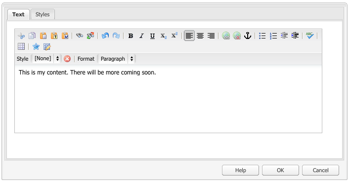

# Configure the Rich Text Editor {#configure-the-rich-text-editor}

L’editor Rich Text (RTE) offre agli autori un’ampia gamma di funzionalità per la modifica del contenuto testuale. Le icone, le caselle di selezione, la barra degli strumenti e i menu sono disponibili per un’esperienza di modifica del testo WYSIWYG.

Per sapere come utilizzare le funzioni RTE per la creazione, consulta [Utilizzare l’editor Rich Text per la creazione](/help/sites-authoring/rich-text-editor.md). L’editor Rich Text può essere configurato per abilitare, disabilitare ed estendere le funzioni disponibili nei componenti di authoring. Il flusso di lavoro seguente illustra un ordine consigliato per completare le attività di configurazione dell’editor Rich Text in Experience Manager.


*Figura: Flusso di lavoro tipico per la configurazione dell’editor Rich Text*

## Comprendere l’interfaccia touch e l’interfaccia classica {#understand-touch-enabled-ui-and-classic-ui}

L’interfaccia touch è l’interfaccia standard di AEM. Nella versione 5.6, Adobe ha introdotto l’interfaccia utente touch con design [](/help/sites-authoring/responsive-layout.md) reattivo per l’ambiente di authoring. L’interfaccia utente touch è progettata per i dispositivi touch e desktop. L’interfaccia utente è molto diversa dall’interfaccia classica originale.


*Figura: Barra degli strumenti Editor Rich Text nell’interfaccia touch*


*Figura: Barra degli strumenti Editor Rich Text nell’interfaccia classica*

>[!MORELIKETHIS]
>
>* [Consigli interfaccia utente](/help/sites-deploying/ui-recommendations.md)
>* Informazioni sulla rimozione dell’interfaccia classica, consultate Note sulla versione di [AEM 6.4](/help/release-notes/deprecated-removed-features.md)
>* Per differenze tra le interfacce, consulta Interfaccia [touch e Interfaccia classica](https://aemcq5pedia.wordpress.com/2018/01/05/touch-enabled-ui-aem6-3/)
>* Per informazioni dettagliate sull&#39;interfaccia touch, consultate [Concetti dell&#39;interfaccia utente di AEM Touch](/help/sites-developing/touch-ui-concepts.md)


## Varie modalità di modifica {#editingmodes}

Gli autori possono creare e modificare contenuti testuali in AEM utilizzando le diverse modalità di componenti. Le opzioni della barra degli strumenti per la creazione e formattazione di contenuti e l’esperienza utente dei componenti abilitati all’editor Rich Text in modalità di modifica diversa variano in base alle configurazioni dell’editor Rich Text.

| Modalità di modifica | Area di modifica | Funzioni consigliate da abilitare | Interfaccia touch | Interfaccia classica |
|--- |--- |--- |--- |--- |
| In linea | Modifica diretta per modifiche rapide e secondarie; Formato senza aprire una finestra di dialogo | Funzioni RTE minime | Y | Y |
| Schermo intero RTE | Copertina intera pagina | Tutte le funzioni RTE richieste | Y | N |
| Finestra di dialogo | Finestra di dialogo sopra al contenuto della pagina, ma non copre l’intera pagina | Tutte le funzioni RTE richieste nell’interfaccia classica; abilitare le funzionalità in modo prudente nell&#39;interfaccia utente touch | Y | Y |
| Finestra di dialogo a schermo intero | Come modalità a schermo intero; contiene i campi del dialogo accanto all’editor Rich Text | Tutte le funzioni RTE richieste | Y | N |

>[!NOTE]
>
>La funzione di modifica sorgente non è disponibile in modalità di modifica in linea nell’interfaccia touch. Non è possibile trascinare le immagini in modalità schermo intero. Tutte le altre funzioni funzionano in tutte le modalità.

### Modifica in linea {#inline-editing}

Quando il contenuto viene aperto (con un doppio tocco o clic lento), è possibile modificarlo all’interno della pagina. Viene visualizzata una barra degli strumenti compatta con le opzioni di base.


*Figura: Modifica in linea con la barra degli strumenti di base nell’interfaccia touch*

Nell’interfaccia classica, un doppio clic lento sul componente consente la modifica in linea e un contorno arancione evidenzia il contenuto. Se Content Finder è aperto, nella parte superiore della finestra viene visualizzata una barra degli strumenti con le opzioni di formattazione RTE disponibili. Se Content Finder non è aperto, le opzioni di formattazione non vengono visualizzate e potete eseguire solo modifiche di testo di base.

### Full screen editing {#full-screen-editing}

I componenti AEM possono essere aperti a schermo intero, in modo da nascondere il contenuto della pagina e occupare lo schermo disponibile. Considerate la possibilità di modificare a schermo intero una versione dettagliata dell&#39;editing in linea in quanto offre il maggior numero di opzioni di modifica. È possibile aprirlo facendo clic su , dalla barra degli strumenti compatta, quando si utilizza la modalità di modifica in linea.

La modalità a schermo intero della finestra di dialogo fornisce una barra degli strumenti dettagliata dell’editor Rich Text, le opzioni e i componenti disponibili in modalità finestra di dialogo. È applicabile solo per una finestra di dialogo che contiene l’editor Rich Text insieme ad altri componenti.


*Figura: Barra degli strumenti dettagliata dell’editor Rich Text per la modifica in modalità a schermo intero nell’interfaccia touch*

### Modifica finestra di dialogo {#dialog-editing}

Quando si fa doppio clic su un componente nell’interfaccia classica, si apre una finestra di dialogo per la modifica del contenuto. Viene visualizzata la finestra di dialogo sopra la pagina esistente. In alcuni scenari specifici, la finestra di dialogo si apre come finestra a comparsa. Ad esempio, quando un componente Testo fa parte di una colonna in un layout di pagina a più colonne e l’area disponibile per la finestra di dialogo è minore.


*Figura: Modalità di modifica finestra di dialogo nell’interfaccia touch*



*Figura: Finestra di dialogo nell’interfaccia classica che contiene una barra degli strumenti dettagliata per la modifica*

## Informazioni sui plug-in RTE e le relative funzioni {#aboutplugins}

La funzionalità è disponibile tramite una serie di plug-in, ognuno dei quali è dotato di:

* Una `features` proprietà:

   * che consente di attivare o disattivare le funzionalità di base del plug-in.
   * Può essere configurato utilizzando una procedura standard.

* Se appropriato, più proprietà e opzioni che richiedono una configurazione specializzata.

Le funzioni di base dell&#39;editor Rich Text sono attivate o disattivate dal valore della `features` proprietà su un nodo specifico del plug-in appropriato.

Nella tabella seguente sono elencati i plug-in correnti, che mostrano:

* ID plug-in con un collegamento alla documentazione API. L&#39;ID viene utilizzato come nome del nodo quando si [attiva un plug-in](/help/sites-administering/configure-rich-text-editor-plug-ins.md#activateplugin).
* Valori consentiti per la `features` proprietà.
* Una descrizione delle funzionalità fornite dal plug-in.

| ID plug-in | funzionalità | Descrizione |
|--- |--- |--- |
| modifica | cut copy paste-default paste-plintext paste-wordhtml | [Tagliare, copiare e incollare le tre modalità](/help/sites-administering/configure-rich-text-editor-plug-ins.md#textstyles). |
| [punto](https://helpx.adobe.com/experience-manager/6-4/sites/developing/using/reference-materials/widgets-api/index.html?class=CQ.form.rte.plugins.FindReplacePlugin) | trova sostituzione | Trova e sostituisci. |
| [format](https://helpx.adobe.com/experience-manager/6-4/sites/developing/using/reference-materials/widgets-api/index.html?class=CQ.form.rte.plugins.FormatPlugin) | grassetto sottolineato in corsivo | [Formattazione](/help/sites-administering/configure-rich-text-editor-plug-ins.md#textstyles)di base del testo. |
| [image](https://helpx.adobe.com/experience-manager/6-4/sites/developing/using/reference-materials/widgets-api/index.html?class=CQ.form.rte.plugins.ImagePlugin) | immagine | Supporto per immagini di base (trascinate da Content Finder). A seconda del browser, il supporto ha diversi comportamenti per gli autori |
| [keys](https://helpx.adobe.com/experience-manager/6-4/sites/developing/using/reference-materials/widgets-api/index.html?class=CQ.form.rte.plugins.KeyPlugin) |  | Per definire questo valore, vedere [Dimensione](/help/sites-administering/configure-rich-text-editor-plug-ins.md#tabsize)tabulazione. |
| [justify](https://helpx.adobe.com/experience-manager/6-4/sites/developing/using/reference-materials/widgets-api/index.html?class=CQ.form.rte.plugins.JustifyPlugin) | justifyleft justifycenter righright | Allineamento del paragrafo. |
| [links](https://helpx.adobe.com/experience-manager/6-4/sites/developing/using/reference-materials/widgets-api/index.html?class=CQ.form.rte.plugins.LinkPlugin) | ancoraggio di scollegamento modifica collegamento | [Collegamenti ipertestuali e ancoraggi](/help/sites-administering/configure-rich-text-editor-plug-ins.md#linkstyles). |
| [list](https://helpx.adobe.com/experience-manager/6-4/sites/developing/using/reference-materials/widgets-api/index.html?class=CQ.form.rte.plugins.ListPlugin) | rientro ordinato e non ordinato | Questo plug-in controlla sia i [rientri che gli elenchi](/help/sites-administering/configure-rich-text-editor-plug-ins.md#indentmargin); inclusi gli elenchi nidificati. |
| [cattivi](https://helpx.adobe.com/experience-manager/6-4/sites/developing/using/reference-materials/widgets-api/index.html?class=CQ.form.rte.plugins.MiscToolsPlugin) | specialchars sourceedit | Gli strumenti vari consentono agli autori di immettere caratteri [](/help/sites-administering/configure-rich-text-editor-plug-ins.md#spchar) speciali o modificare l’origine HTML. Inoltre, potete aggiungere un intero [intervallo di caratteri](/help/sites-administering/configure-rich-text-editor-plug-ins.md#definerangechar) speciali se desiderate definire il vostro elenco. |
| Paraformat | paraformat | I formati di paragrafo predefiniti sono Paragrafo, Intestazione 1, Intestazione 2 e Intestazione 3 (`<p>`, `<h1>`, `<h2>`e `<h3>`). Potete [aggiungere altri formati](/help/sites-administering/configure-rich-text-editor-plug-ins.md#paraformats) di paragrafo o estendere l’elenco. |
| controllo ortografia | checktext | [Controllo](/help/sites-administering/configure-rich-text-editor-plug-ins.md#adddict)ortografia basato sulla lingua |
| stili | stili | Supporto per lo stile con una classe CSS. [Aggiungete nuovi stili](/help/sites-administering/configure-rich-text-editor-plug-ins.md#textstyles) di testo se desiderate aggiungere (o estendere) un intervallo personalizzato di stili da usare con il testo. |
| pedice | pedice | Estensioni ai formati di base, aggiunta di script secondari e super. |
| tabella | tabella amovibile insertrow removerow insertcolumn removecolumn cellprop ungecells splitcell seltrow seltrow selectColumns | Per aggiungere stili personalizzati per intere tabelle o singole celle, vedere [Configurare gli stili](/help/sites-administering/configure-rich-text-editor-plug-ins.md#tablestyles)di tabella. |
| annulla | annullamento ripristino | Dimensione cronologia delle operazioni di [annullamento e ripristino](/help/sites-administering/configure-rich-text-editor-plug-ins.md#undohistory) . |

>[!NOTE]
>
>Il plug-in a schermo intero non è supportato in modalità finestra di dialogo. Utilizzo dell’ `dialogFullScreen` impostazione per configurare la barra degli strumenti per la modalità a schermo intero.

## Comprendere i percorsi e le posizioni di configurazione {#understand-the-configuration-paths-and-locations}

La [modalità di modifica dell’editor Rich Text (e l’interfaccia utente)](#editingmodes) fornita per gli autori determina il percorso in cui vengono definiti i dettagli di configurazione quando si [attivano i plug-in](/help/sites-administering/configure-rich-text-editor-plug-ins.md#activateplugin)dell’editor Rich Text:

| Modalità di modifica | Posizione per l’interfaccia utente touch | Posizione per l’interfaccia classica |
|---|---|---|
| In linea | `cq:editConfig/cq:inplaceEditing` | `cq:editConfig/cq:inplaceEditing` |
| Schermo intero | `cq:editConfig/cq:inplaceEditing` | Non applicabile |
| Finestra di dialogo | `cq:dialog` | `dialog` |
| Finestra di dialogo a schermo intero | `cq:dialog` | Non applicabile |

>[!NOTE]
>
>Non assegnare al nodo il nome sotto `cq:inplaceEditing` come `config`. Sul `cq:inplaceEditing` nodo, definire le seguenti proprietà:
>
>* **Nome**: `configPath`
>* **Tipo**: `String`
>* **Valore**: percorso del nodo contenente la configurazione effettiva
>
>
Non assegnare al nodo di configurazione RTE il nome `config`. In caso contrario, le configurazioni dell’editor Rich Text hanno effetto solo per gli amministratori e non per gli utenti del gruppo `content-author`.

Configura le seguenti proprietà che si applicano in modalità di modifica finestra di dialogo solo nell’interfaccia utente touch:

* `useFixedInlineToolbar`: Impostate questa proprietà booleana definita sul nodo RTE (uno con sling:resourceType= `cq/gui/components/authoring/dialog/richtext`) su `True`, affinché la barra degli strumenti RTE sia fissa invece che mobile.

   Quando questa proprietà è true, per impostazione predefinita la modifica Richtext viene avviata in corrispondenza dell&#39;evento &quot;foundation-contentloaded&quot;.

   Per evitare questo problema, impostare la proprietà `customStart` su `True`e attivare l&#39;evento &#39;rte-start&#39; per avviare la modifica dell&#39;editor Rich Text. Quando questa proprietà è &#39;true&#39;, il comportamento predefinito, con inizio clic, non funziona.

* `customStart`: Impostate questa proprietà booleana definita sul nodo dell&#39;editor Rich Text su `True`, per controllare quando avviare l&#39;editor Rich Text attivando l&#39;evento `rte-start`.

* `rte-start`: Attiva questo evento sull’ `contenteditable-div` editor Rich Text, quando avviare la modifica dell’editor Rich Text. Questo funziona solo se `customStart` è stato impostato su true.

Quando l’editor Rich Text viene utilizzato nella finestra di dialogo con attivazione touch, l’impostazione della proprietà `useFixedInlineToolbar` su true è obbligatoria per evitare problemi.

## Abilitare le funzionalità RTE attivando i plug-in {#enable-rte-functionalities-by-activating-plug-ins}

Le funzionalità RTE sono disponibili tramite una serie di plug-in, ognuno dei quali dispone della proprietà features. Potete configurare la proprietà features in modo da attivare o disattivare le varie funzioni di ciascun plug-in.

Per configurazioni dettagliate dei plug-in RTE, consulta [come attivare e configurare i plug-in](/help/sites-administering/configure-rich-text-editor-plug-ins.md)RTE.

Scarica questa configurazione di esempio per apprendere come configurare l’editor Rich Text. In questo pacchetto tutte le funzioni sono abilitate.

[Ottieni file](/help/assets/assets/rte-sample-all-features-enabled-10.zip)

>[!NOTE]
>
>Il componente [di testo Componenti](https://helpx.adobe.com/experience-manager/core-components/using/text.html) principali consente agli editor modelli di configurare molti plug-in RTE nell&#39;interfaccia utente come criteri di contenuto, eliminando la necessità di configurare la configurazione tecnica. I criteri di contenuto possono funzionare con le configurazioni dell&#39;interfaccia utente RTE come descritto. Per ulteriori informazioni, consulta le impostazioni dell’interfaccia utente [RTE e i criteri](/help/sites-administering/rich-text-editor.md#rtecontentpolicies)di contenuto, [Creare modelli](/help/sites-authoring/templates.md)di pagina e la documentazione [per lo sviluppo dei componenti](https://helpx.adobe.com/experience-manager/core-components/using/developing.html)core.

>[!NOTE]
>
>A scopo di riferimento, i componenti Testo predefiniti (forniti nell’ambito di un’installazione standard) sono disponibili all’indirizzo:
>
>* `/libs/wcm/foundation/components/text`
>* `/libs/foundation/components/text`
>
>
Per creare un componente di testo personalizzato, copiate il componente sopra anziché modificarlo.

## Configura RTE, barra degli strumenti {#dialogfullscreen}

AEM consente di configurare l’interfaccia per l’editor Rich Text in modo diverso per le diverse modalità di modifica. Le impostazioni predefinite sono fornite di seguito. Potete ignorare queste impostazioni predefinite in base alle vostre esigenze.

Per una migliore esperienza di authoring:

* In una finestra di dialogo mobile, abilitate solo i plug-in che non dispongono di un pop-up, poiché la finestra di dialogo mobile ha dimensioni più ridotte.
* Nella finestra di dialogo a schermo intero, abilitate tutti i plug-in richiesti, anche i plug-in con pop-up più grandi, come il `Paste` plug-in. Utilizzate la `dialogFullScreen` configurazione descritta di seguito.

```java
<uiSettings jcr:primaryType="nt:unstructured">
  <cui jcr:primaryType="nt:unstructured">
    <inline
      jcr:primaryType="nt:unstructured"
      toolbar="[format#bold,format#italic,format#underline,#justify,#lists,links#modifylink,links#unlink,#paraformat]">
      <popovers jcr:primaryType="nt:unstructured">
        <justify
          jcr:primaryType="nt:unstructured"
          items="[justify#justifyleft,justify#justifycenter,justify#justifyright]"
          ref="justify"/>
        <lists
          jcr:primaryType="nt:unstructured"
          items="[lists#unordered,lists#ordered,lists#outdent,lists#indent]"
          ref="lists"/>
        <paraformat
          jcr:primaryType="nt:unstructured"
          items="paraformat:getFormats:paraformat-pulldown"
          ref="paraformat"/>
      </popovers>
    </inline>
    <dialogFullScreen
      jcr:primaryType="nt:unstructured"
      toolbar="[format#bold,format#italic,format#underline,justify#justifyleft,justify#justifycenter,justify#justifyright,lists#unordered,lists#ordered,lists#outdent,lists#indent,links#modifylink,links#unlink,table#createoredit,#paraformat,image#imageProps]">
      <popovers jcr:primaryType="nt:unstructured">
        <paraformat
          jcr:primaryType="nt:unstructured"
          items="paraformat:getFormats:paraformat-pulldown"
          ref="paraformat"/>
      </popovers>
    </dialogFullScreen>
    <tableEditOptions
      jcr:primaryType="nt:unstructured"
      toolbar="[table#insertcolumn-before,table#insertcolumn-after,table#removecolumn,-,table#insertrow-before,table#insertrow-after,table#removerow,-,table#mergecells-right,table#mergecells-down,table#mergecells,table#splitcell-horizontal,table#splitcell-vertical,-,table#selectrow,table#selectcolumn,-,table#ensureparagraph,-,table#modifytableandcell,table#removetable,-,undo#undo,undo#redo,-,table#exitTableEditing,-]">
    </tableEditOptions>
  </cui>
</uiSettings>
```

Per la modalità in linea e per la modalità a schermo intero vengono utilizzate diverse impostazioni dell&#39;interfaccia utente. La proprietà della barra degli strumenti viene utilizzata per specificare i pulsanti della barra degli strumenti. Ad esempio, se il pulsante è esso stesso una funzione (ad esempio, `Bold`), viene specificato come `PluginName#FeatureName` (ad esempio, `links#modifylink`). Se il pulsante è un contenitore (contenente alcune funzioni di un plug-in), viene specificato come `#PluginName` (ad esempio, `#format`). Separatori (| ) tra un gruppo di pulsanti può essere specificato con &#39;-&#39;.

Il nodo a comparsa nella modalità in linea o a schermo intero contiene un elenco dei popovers utilizzati. Ogni nodo secondario sotto il `popovers` nodo viene denominato in base al plug-in (ad esempio, `format`). Dispone di una proprietà `items` contenente un elenco delle funzioni del plug-in (ad esempio, `format#bold`).

## Impostazioni dell&#39;interfaccia utente e criteri di contenuto RTE {#rtecontentpolicies}

Gli amministratori possono controllare le opzioni dell&#39;editor Rich Text utilizzando criteri di contenuto, ad esempio anziché eseguire la configurazione come descritto in precedenza. I criteri di contenuto definiscono le proprietà di progettazione di un componente quando viene utilizzato come parte di un modello [](../sites-authoring/templates.md)modificabile. Ad esempio, se un componente di testo che utilizza l’editor Rich Text viene utilizzato con un modello modificabile, il criterio del contenuto può definire la disponibilità dell’opzione grassetto e alcune opzioni di formattazione del paragrafo. I criteri di contenuto sono riutilizzabili e possono essere applicati a più modelli.

A partire da AEM 6.4 Service Pack 3, le opzioni disponibili nell’editor Rich Text scorrono a valle dalle configurazioni dell’interfaccia utente ai criteri dei contenuti.

* Le impostazioni di configurazione dell&#39;interfaccia utente definiscono le opzioni disponibili per i criteri di contenuto.
* Se la configurazione dell&#39;interfaccia utente dell&#39;editor Rich Text è stata rimossa o non abilita un elemento, il criterio del contenuto non è in grado di configurarlo.
* Un autore ha accesso solo a tali funzionalità, rese disponibili dalle configurazioni dell&#39;interfaccia utente e dai criteri di contenuto.

Ad esempio, è possibile consultare la documentazione [sul componente](https://docs.adobe.com/content/help/en/experience-manager-core-components/using/components/text.html#the-text-component-and-the-rich-text-editor)Text Core.

## Personalizzare la mappatura tra icone e comandi della barra degli strumenti {#iconstoolbar}

È possibile personalizzare la mappatura tra le icone Corallo visualizzate sulla barra degli strumenti dell’editor Rich Text e i comandi disponibili. Non è possibile utilizzare altre icone oltre alle icone Corallo.

1. Crea un nodo denominato `icons` in `uiSettings/cui`.

1. Creare nodi per le singole icone sottostanti.
1. Su ciascuno dei singoli nodi di icona, specificate un&#39;icona Corallo e un comando da associare all&#39;icona.

Segue uno snippet di esempio per mappare il comando Grassetto all&#39;icona Corallo denominata `textItalic`.

```java
<text jcr:primaryType="nt:unstructured" sling:resourceType="cq/gui/components/authoring/dialog/richtext" name="./text" useFixedInlineToolbar="{Boolean}true"> 
    <rtePlugins jcr:primaryType="nt:unstructured"> 
        <format jcr:primaryType="nt:unstructured" features="bold,italic"/> 
    </rtePlugins> 
    <uiSettings jcr:primaryType="nt:unstructured"> 
        <cui jcr:primaryType="nt:unstructured"> 
            <inline jcr:primaryType="nt:unstructured" 
                toolbar="[format#bold,format#italic,format#underline,links#modifylink,links#unlink]"> 
            </inline> 
            <icons jcr:primaryType="nt:unstructured"> 
                <bold jcr:primaryType="nt:unstructured" 
                    command="format#bold" 
                    icon="textItalic"/> 
            </icons> 
        </cui> 
    </uiSettings> 
</text>
```

## Passa a Editor Rich Text CoralUI 2 {#switch-to-coralui-rich-text-editor}

In una pagina, è possibile includere la clientlib dell’editor Rich Text CoralUI 2 o la clientlib dell’editor Rich Text CoralUI 3. Per impostazione predefinita, l’editor Rich Text include la clientlib dell’editor Rich Text CoralUI 3. Per passare all’editor Rich Text CoralUI 2, effettuare le seguenti operazioni.

>[!NOTE]
>
>Adobe consiglia di non effettuare il passaggio. Passate all’editor Rich Text CoralUI 2 come ultima risorsa. I plug-in personalizzati per l’editor Rich Text CoralUI 2 funzionano con l’editor Rich Text CoralUI 3 se i plug-in non dipendono da elementi interni dell’editor Rich Text, ad esempio classi. Se utilizzate plug-in personalizzati per l’editor Rich Text CoralUI 3, utilizzate `rte.coralui3` la libreria.

1. Sovrapponi il nodo `/libs/cq/gui/components/authoring/editors/clientlibs/core` sotto `/apps`, quindi effettua le seguenti operazioni:

   * Replace `rte.coralui3` with `rte.coralui2` for the dependencies property.
   * Replace `cq.authoring.editor.core.inlineediting.rte.coralui3` with `cq.authoring.editor.core.inlineediting.rte.coralui2` for the embed property.
   * Replace `cq.authoring.rte.coralui3` with `cq.authoring.rte.coralui2` for the embed property.

1. Sovrapponi i nodi `/libs/cq/gui/components/authoring/dialog/richtext/clientlibs/rte/coralui3` e `/libs/cq/gui/components/authoring/dialog/richtext/clientlibs/rte/coralui2` sotto `/apps`.

   Rimuovere la categoria `cq.authoring.dialog` da `/apps/cq/gui/components/authoring/dialog/richtext/clientlibs/rte/coralui3` e aggiungerla a `/apps/cq/gui/components/authoring/dialog/richtext/clientlibs/rte/coralui2`.

1. Modificare qualsiasi altra dipendenza che viene inclusa nella pagina da `rte.coralui3` a `rte.coralui2`. Ad esempio, dopo aver sovrapposto il nodo `/libs/mcm/campaign/components/touch-ui/clientlibs/rte` in `/apps`, modificare qualsiasi dipendenza da esso da `rte.coralui3` a `rte.coralui2`.

1. Sovrapponi il nodo `cq/ui/widgets` sotto `/apps`. Sostituire la dipendenza `cq.rte` nel nodo `/apps/cq/ui/widgets` con `cq.coralui2.rte`.

>[!NOTE]
>
>L’editor Rich Text CoralUI 2 utilizza modelli handlebars per le finestre di dialogo dei plug-in. Di conseguenza, la clientlib dell’editor Rich Text CoralUI 2 presentava una dipendenza dalla clientlib handlebars. L’editor Rich Text CoralUI 3 non utilizza modelli handlebars e non ha alcuna dipendenza associata. Se i plug-in personalizzati utilizzano modelli handlebars, includi la clientlib handlebars nella pagina Web.

## Ulteriori informazioni {#further-information}

Per ulteriori informazioni sulla configurazione dell&#39;editor Rich Text, consulta il riferimento API [](https://helpx.adobe.com/experience-manager/6-4/sites/developing/using/reference-materials/widgets-api/index.html) AEM Widget.

In particolare, per visualizzare i plug-in e le relative opzioni disponibili:

* Il componente [CQ.form.RichText](https://helpx.adobe.com/experience-manager/6-4/sites/developing/using/reference-materials/widgets-api/index.html?class=CQ.form.RichText) fornisce un campo modulo per la modifica delle informazioni di testo formattate (RTF). Per conoscere tutti i parametri disponibili per il modulo RTF, vedere Opzioni di configurazione.
* Il componente RichText offre un’ampia gamma di funzionalità tramite i plug-in elencati in [CQ.form.rte.plugins.Plugin](https://helpx.adobe.com/experience-manager/6-4/sites/developing/using/reference-materials/widgets-api/index.html?class=CQ.form.rte.plugins.Plugin). Per ciascun plug-in:

   * Per informazioni dettagliate sulle funzionalità che possono essere abilitate o disattivate, consultate Funzioni.
   * Consultate Opzioni di configurazione per tutti i parametri disponibili per una configurazione dettagliata del plug-in appropriato.

* Sono inoltre disponibili ulteriori informazioni sulle regole HTML per i collegamenti.

Le opzioni di cui sopra possono essere utilizzate per estendere e personalizzare il proprio editor Rich Text. Ad esempio, per elencare gli ancoraggi disponibili nella pagina durante la creazione di un collegamento, puoi fornire la tua implementazione dell’ `LinkPlugin`.

## Limitazioni note {#known-limitations}

La funzionalità AEM RTE presenta i seguenti limiti:

* Le funzionalità RTE sono supportate solo nelle finestre di dialogo dei componenti di AEM. L&#39;editor Rich Text non è supportato nelle procedure guidate o nei moduli di base come Proprietà [](/help/sites-developing/page-properties-views.md) pagina e [Scaffolding](/help/sites-authoring/scaffolding.md) nell&#39;interfaccia touch.

* AEM non funziona sui dispositivi [](/help/release-notes/known-issues.md)ibridi.

* Non assegnare un nome al nodo di configurazione RTE `config`. In caso contrario, la configurazione dell’editor Rich Text ha effetto solo per gli amministratori e non per gli utenti del gruppo `content-author`.

* L’editor Rich Text non supporta la cornice in linea o l’iframe per incorporare il contenuto.

>[!MORELIKETHIS]
>
>* [Configurare i plug-in RTE](configure-rich-text-editor-plug-ins.md)
>* [Utilizzo dell’editor Rich Text per la creazione](../sites-authoring/rich-text-editor.md)
>* [Configurare l&#39;editor Rich Text per i siti con accesso facilitato](rte-accessible-content.md)
>* [Interfaccia touch e parità delle funzioni dell’interfaccia classica](../release-notes/touch-ui-features-status.md)
>* [Esempio di esercitazione per creare un componente multicampo composito](https://experience-aem.blogspot.com/2019/05/aem-65-touchui-composite-multifield-with-coral3-rte-rich-text.html)

