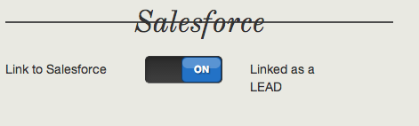

# Integrazione con Salesforce{#integrating-with-salesforce}

L&#39;integrazione di Salesforce con AEM fornisce funzionalità di gestione dei lead e sfrutta le capacità già esistenti fornite da Salesforce. Puoi configurare AEM per pubblicare i lead su Salesforce e creare componenti che accedono direttamente ai dati da Salesforce.

L&#39;integrazione bidirezionale ed estensibile tra AEM e Salesforce consente:

* Organizzazioni per utilizzare e aggiornare completamente i dati per migliorare l&#39;esperienza del cliente.
* Coinvolgimento dal marketing alle attività di vendita.
* Organizzazioni per trasmettere e ricevere automaticamente i dati da un archivio dati Salesforce.

Il presente documento descrive quanto segue:

* come configurare Cloud Services Salesforce (configurare AEM da integrare con Salesforce).
* come utilizzare le informazioni di contatto/lead Salesforce in ClientContext e per la personalizzazione.
* come utilizzare il modello di flusso di lavoro Salesforce per pubblicare gli utenti AEM come lead a Salesforce.
* come creare un componente che mostri i dati da Salesforce.

## Configurazione di AEM da integrare con Salesforce {#configuring-aem-to-integrate-with-salesforce}

Per configurare AEM da integrare con Salesforce, devi prima configurare un’applicazione di accesso remoto in Salesforce. Quindi configuri il servizio cloud Salesforce per puntare a questa applicazione di accesso remoto.

>[!NOTE]
>
>Puoi creare un account sviluppatore gratuito in Salesforce.

Per configurare AEM da integrare con Salesforce:

1. In AEM, passare a **Cloud Services**. In Servizi di terze parti, fare clic su **Configura ora** in **Salesforce**.

   

1. Create una nuova configurazione, ad esempio **sviluppatore**.

   >[!NOTE]
   >
   >La nuova configurazione reindirizza a una nuova pagina: **http://localhost:4502/etc/cloudservices/salesforce/developer.html**. Si tratta dello stesso valore che è necessario specificare nell’URL di callback durante la creazione dell’applicazione di accesso remoto in Salesforce. Questi valori devono corrispondere.

1. Accedi al tuo account di vendita (o, se non ne hai uno, creane uno in [https://developer.force.com](https://developer.force.com).)
1. In Salesforce, andate a **Crea** > **App** per accedere a **App collegate** (nelle versioni precedenti di salesforce, il flusso di lavoro era **Distribuisci** > **Accesso remoto**).
1. Fare clic su **Nuovo** per collegare AEM con Salesforce.

   

1. Immettete il **nome app connesso**, il **nome API** e **l&#39;e-mail di contatto**. Selezionare la casella di controllo **Abilita impostazioni OAuth**, quindi inserire l&#39; **URL di callback** e aggiungere un ambito OAuth (ad esempio, accesso completo). L’URL di callback è simile al seguente: `http://localhost:4502/etc/cloudservices/salesforce/developer.html`

   Modificate il nome del server, il numero della porta e il nome della pagina in modo che corrisponda alla configurazione.

   

1. Fare clic su **Salva** per salvare la configurazione di Salesforce. Salesforce crea una **chiave del consumatore** e un **segreto del consumatore**, che è necessario per AEM configurazione.

   

   >[!NOTE]
   >
   >Potrebbe essere necessario attendere alcuni minuti (fino a 15 minuti) per attivare l’applicazione di accesso remoto in Salesforce.

1. In AEM, andate a **Cloud Services** e andate alla configurazione di Salesforce creata in precedenza (ad esempio, **sviluppatore**). Fate clic su **Edit** e immettete la chiave cliente e il segreto cliente da salesforce.com.

   

   | Url di accesso | Questo è l&#39;endpoint di autorizzazione di Salesforce. Il suo valore è precompilato e serve la maggior parte dei casi. |
   |---|---|
   | Chiave cliente | Immettete il valore ottenuto dalla pagina Registrazione dell&#39;applicazione di accesso remoto in salesforce.com |
   | Segreto cliente | Immettete il valore ottenuto dalla pagina Registrazione dell&#39;applicazione di accesso remoto in salesforce.com |

1. Fare clic su **Connetti a Salesforce** per connettersi. Salesforce richiede che la configurazione sia connessa a Salesforce.

   

   In AEM viene visualizzata una finestra di dialogo di conferma in cui viene indicato che la connessione è stata completata.

1. Andate alla pagina principale del sito Web e fate clic su **Proprietà pagina**. Selezionare **Cloud Services** e aggiungere **Salesforce** e selezionare la configurazione corretta (ad esempio, **sviluppatore**).

   

   Ora puoi usare il modello di workflow per pubblicare i lead su Salesforce e creare componenti che accedono ai dati da Salesforce.

## Esportazione AEM utenti come lead Salesforce {#exporting-aem-users-as-salesforce-leads}

Se desiderate esportare un utente AEM come lead di Salesforce, dovete configurare il flusso di lavoro per pubblicare i lead a Salesforce.

Per esportare AEM utenti come lead Salesforce:

1. Andate al flusso di lavoro Salesforce in `http://localhost:4502/workflow` facendo clic con il pulsante destro del mouse sul flusso di lavoro **Salesforce.com Export** e facendo clic su **Start**.

   

1. Selezionate l&#39;utente AEM che desiderate creare come lead come **Payload** per questo flusso di lavoro (home -> utenti). Assicurati di selezionare il nodo del profilo dell&#39;utente che contiene informazioni come **givenName**, **familyName** e così via, mappate sui campi del lead Salesforce **FirstName** e **LastName**.

   

   >[!NOTE]
   >
   >Prima di avviare questo flusso di lavoro, è necessario che un nodo lead in AEM disponga di alcuni campi obbligatori prima di essere pubblicato in Salesforce. Si tratta di **givenName**, **familyName**, **company** e **email**. Per visualizzare un elenco completo della mappatura tra AEM utente e il lead Salesforce, vedi [Mappatura della configurazione tra AEM utente e il lead Slaesforce.](#mapping-configuration-between-aem-user-and-salesforce-lead)

1. Fai clic su **OK**. Le informazioni utente vengono esportate in salesforce.com. Potete verificarlo su salesforce.com.

   >[!NOTE]
   >
   >I registri errori mostrano se un lead viene importato. Per ulteriori informazioni, controllare il registro degli errori.

### Configurazione del flusso di lavoro di esportazione Salesforce.com {#configuring-the-salesforce-com-export-workflow}

Potrebbe essere necessario configurare il flusso di lavoro di esportazione Salesforce.com in modo che corrisponda alla configurazione Salesforce.com corretta o per apportare altre modifiche.

Per configurare il flusso di lavoro di esportazione Salesforce.com:

1. Accedi a `http://localhost:4502/cf#/etc/workflow/models/salesforce-com-export.html.`

   

1. Aprite il passaggio di esportazione Salesforce.com, selezionate la scheda **Argomenti**, selezionate la configurazione corretta e fate clic su **OK**. Inoltre, se desiderate che il flusso di lavoro ricrei un lead eliminato in Salesforce, selezionate la casella di controllo.

   

1. Fare clic su **Salva** per salvare le modifiche.

   

### Mappatura della configurazione tra AEM utente e Lead di Salesforce {#mapping-configuration-between-aem-user-and-salesforce-lead}

Per visualizzare o modificare la configurazione di mappatura corrente tra un utente AEM e un lead Salesforce, apri Gestione configurazione: `https://<hostname>:<port>/system/console/configMgr` e cercare **Configurazione mappatura lead Salesforce**.

1. Aprire Gestione configurazione facendo clic su **Console Web** o andando direttamente a `https://<hostname>:<port>/system/console/configMgr.`
1. Cerca **Configurazione mappatura lead Salesforce**.

   

1. Modificate le mappature, come necessario. La mappatura predefinita segue il pattern** aemUserAttribute=sfLeadAttribute**. Fare clic su **Salva** per salvare le modifiche.

## Configurazione dell&#39;archivio Contesto Client Salesforce {#configuring-salesforce-client-context-store}

L&#39;archivio contestuale del client Salesforce mostra informazioni aggiuntive sull&#39;utente attualmente connesso rispetto a quanto è già disponibile all&#39;interno di AEM. Richiama queste informazioni aggiuntive da Salesforce a seconda della connessione dell&#39;utente con Salesforce.

A questo scopo, è necessario configurare quanto segue:

1. Collegate un utente AEM con un ID Salesforce tramite il componente Salesforce Connect.
1. Aggiungi i dati del profilo Salesforce nella pagina del contesto del client per configurare le proprietà che desideri visualizzare.
1. (Facoltativo) Crea un segmento che utilizza i dati dallo store Client Context di Salesforce.

### Collegamento di un utente AEM con un ID Salesforce {#linking-an-aem-user-with-a-salesforce-id}

Devi mappare un utente AEM con un ID Salesforce per caricarlo nel contesto client. In uno scenario reale, il collegamento si basa su dati utente noti con la convalida. A scopo dimostrativo, in questa procedura viene utilizzato il componente **Salesforce Connect**.

1. Andate a un sito Web in AEM, accedete e trascinate il componente **Salesforce Connect** dalla barra laterale.

   >[!NOTE]
   >
   >Se il componente **Salesforce Connect** non è disponibile, andate alla visualizzazione **Progettazione** e selezionatelo per renderlo disponibile nella visualizzazione **Modifica**.

   

   Quando trascinate il componente sulla pagina, viene visualizzato **Collega a Salesforce=Off**.

   

   >[!NOTE]
   >
   >Questo componente è solo a scopo dimostrativo. Per gli scenari reali, ci sarebbe un altro processo per collegare/far corrispondere gli utenti con i lead.

1. Dopo aver trascinato il componente sulla pagina, apritelo per configurarlo. Selezionare la configurazione, il tipo di contatto e il lead o il contatto Salesforce, quindi fare clic su **OK**.

   

   AEM collega l’utente con il contatto Salesforce o il lead.

   

### Aggiunta di dati Salesforce al contesto client {#adding-salesforce-data-to-client-context}

Puoi caricare i dati utente da Salesforce nel ClientContext per utilizzarli per la personalizzazione:

1. Aprire il contesto client che si desidera estendere, ad esempio `http://localhost:4502/etc/clientcontext/default/content.html.`

   

1. Trascina il componente **Dati profilo Salesforce** nel contesto client.

   

1. Fate doppio clic sul componente per aprirlo. Selezionare **Aggiungi elemento** e selezionare una proprietà dall&#39;elenco a discesa. Aggiungete tutte le proprietà desiderate e selezionate **OK**.

   

1. Ora vengono visualizzate le proprietà specifiche di Salesforce di Salesforce nel contesto client.

   

### Creazione di un segmento utilizzando i dati dallo store Client Context di Salesforce {#building-a-segment-using-data-from-salesforce-client-context-store}

Puoi creare un segmento che utilizza i dati dall&#39;archivio di contesto client Salesforce. Per effettuare ciò:

1. Per passare alla segmentazione in AEM, passare a **Strumenti** > **Segmentazione** o [http://localhost:4502/miscadmin#/etc/segmentation](Http://localhost:4502/miscadmin#/etc/segmentation).
1. Crea o aggiorna un segmento per includere dati da Salesforce. Per ulteriori informazioni, vedere [Segmentazione](/help/sites-administering/campaign-segmentation.md).

## Ricerca di lead {#searching-leads}

AEM viene fornito con un componente Ricerca di esempio che esegue la ricerca dei lead in Salesforce in base ai criteri specificati. Questo componente mostra come utilizzare l’API REST di Salesforce per cercare oggetti Salesforce. Devi collegare una pagina con una configurazione Salesforce per avviare una chiamata a salesforce.com.

>[!NOTE]
>
>Questo è un componente di esempio che mostra come utilizzare l&#39;API REST di Salesforce per eseguire query sugli oggetti Salesforce. Utilizzatelo come esempio per creare componenti più complessi in base alle vostre esigenze.

Per utilizzare questo componente:

1. Passate alla pagina in cui desiderate utilizzare questa configurazione. Aprire le proprietà della pagina e selezionare **Cloud Services.** Fate clic su  **Aggiungi** servizi, selezionate  **** Salesforce e la configurazione appropriata, quindi fate clic su  **OK**.

   

1. Trascina il componente di ricerca Salesforce sulla pagina (purché sia stato abilitato. Per attivarla, passate alla modalità Progettazione e aggiungetela all&#39;area appropriata.

   

1. Aprite il componente Ricerca e specificate i parametri di ricerca e fate clic su **OK.**

   

1. AEM visualizza i lead specificati nel componente di ricerca che corrispondono ai criteri specificati.

   

