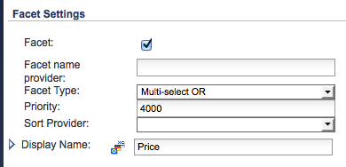
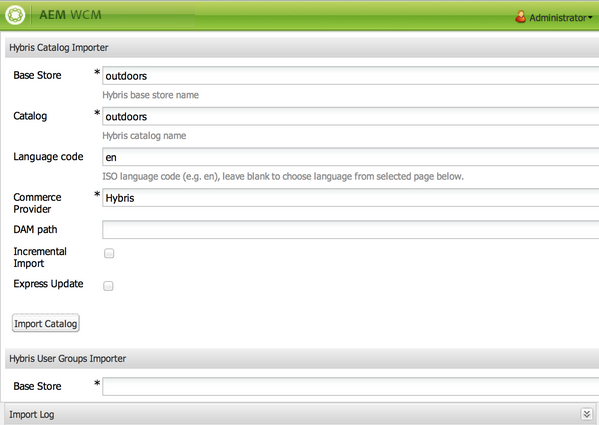

# SAP Commerce Cloud{#sap-commerce-cloud}

Dopo l’installazione potete configurare l’istanza:

1. [Configurate la ricerca su facet per Geometrixx Outdoors](#configure-the-facetted-search-for-geometrixx-outdoors).
1. [Configurare la versione](#configure-the-catalog-version)del catalogo.
1. [Configurare la struttura](#configure-the-import-structure)di importazione.
1. [Configurare gli attributi del prodotto da caricare](#configure-the-product-attributes-to-load).
1. [Importazione dei dati](#importing-the-product-data)del prodotto.
1. [Configurare Catalog Importer](#configure-the-catalog-importer).
1. Utilizzate [Importa per importare il catalogo](#catalog-import) in un percorso specifico in AEM.

## Configurare la ricerca su facet per Geometrixx Outdoors {#configure-the-facetted-search-for-geometrixx-outdoors}

>[!NOTE]
>
>Questo non è necessario per hybris 5.3.0.1 e versioni successive.

1. Nel browser, accedete alla console **di gestione** ibrida all’indirizzo:

   [http://localhost:9001/hmc/hybris](http://localhost:9001/hmc/hybris)

1. Dalla barra laterale, selezionate **Sistema**, quindi Cerca **** facet, quindi Configurazione ricerca **facet**.
1. **Aprite Editor** per Configurazione Solr **di esempio per clothescatalog**.

1. Nelle versioni **** catalogo, usate la versione **** Aggiungi catalogo per aggiungere `outdoors-Staged` e `outdoors-Online` aggiungere all’elenco.
1. **** Salva la configurazione.
1. Aprite i tipi **di elementi** SOLR per aggiungere **gli ordinamenti** SOLR a `ClothesVariantProduct`:

   * rilevanza (&quot;Pertinenza&quot;, punteggio)
   * name-asc (&quot;Name (crescente)&quot;, name)
   * name-desc (&quot;Name (descending)&quot;, name)
   * price-asc (&quot;Price (crescente)&quot;, priceValue)
   * price-desc (&quot;Price (descending)&quot;, priceValue)
   >[!NOTE]
   >
   >Utilizzate il menu di scelta rapida (in genere fate clic con il pulsante destro del mouse) per selezionare `Create Solr sort`.
   >
   >Per Hybris 5.0.0 aprire la `Indexed Types` scheda, fare doppio clic su di essa `ClothesVariantProduct`, quindi sulla scheda `SOLR Sort`.

   

1. Nella scheda Tipi **** indicizzati impostare il tipo **** composto su:

   `Product - Product`

1. Nella scheda Tipi **** indicizzati regolare le query **** Indicizzatore per `full`:

   ```shell
   SELECT {pk} FROM {Product} WHERE {pk} NOT IN ({{SELECT {baseProductpk} FROM {variantproduct}}})
   ```

1. Nella scheda Tipi **** indicizzati regolare le query **** Indicizzatore per `incremental`:

   ```shell
   SELECT {pk} FROM {Product} WHERE {pk} NOT IN ({{SELECT {baseProductpk} FROM {variantproduct}}}) AND {modifiedtime} <= ?lastIndexTime
   ```

1. Nella scheda Tipi **** indicizzati regolare il `category` facet. Fare doppio clic sull&#39;ultima voce nell&#39;elenco delle categorie per aprire la scheda delle proprietà **** Indicizzato:

   >[!NOTE]
   >
   >Per hybris 5.2, accertatevi che l&#39; `Facet` attributo nella tabella Properties sia selezionato in base alla schermata seguente:

    

1. Aprite la scheda Impostazioni **** facet e regolate i valori dei campi:

   

1. **Salva le modifiche.**
1. Di nuovo dai tipi **di elementi** SOLR, regolare il `price` facet in base alle seguenti schermate. Come con `category`, fate doppio clic `price` per aprire la scheda delle proprietà **** Indicizzato:

   

1. Aprite la scheda Impostazioni **** facet e regolate i valori dei campi:

   

1. **Salva le modifiche.**
1. Aprire **Sistema**, **Facet search**, quindi **Indicizzatore procedura guidata**. Avvia un cronjob:

   * **Operazione** indicizzatore: `full`
   * **Configurazione** Solr: `Sample Solr Config for Clothes`

## Configurare la versione del catalogo {#configure-the-catalog-version}

La versione **** del catalogo ( `hybris.catalog.version`) importata può essere configurata per il servizio OSGi:

**Configurazione** dell&#39;ibrido di CQ Commerce Day( `com.adobe.cq.commerce.hybris.common.DefaultHybrisConfigurationService`)

**La versione** del catalogo è in genere impostata su `Online` o `Staged` (impostazione predefinita).

>[!NOTE]
>
>When working with AEM there are several methods of managing the configuration settings for such services; see [Configuring OSGi](/help/sites-deploying/configuring-osgi.md) for full details. Consultare anche la console per un elenco completo dei parametri configurabili e delle relative impostazioni predefinite.

L’output del registro fornisce un feedback sulle pagine e sui componenti creati e segnala potenziali errori.

## Configurare la struttura di importazione {#configure-the-import-structure}

L’elenco seguente mostra una struttura di esempio (di risorse, pagine e componenti) creata per impostazione predefinita:

```shell
+ /content/dam/path/to/images
  + 12345.jpg (dam:Asset)
    + ...
  + ...
+ /content/site/en
  - cq:commerceProvider = "hybris"
  - cq:hybrisBaseStore = "basestore"
  - cq:hybrisCatalogId = "catalog"
  + category1 (cq:Page)
    + jcr:content (cq:PageContent)
      - jcr:title = "Category 1"
    + category11 (cq:Page)
      + jcr:content (cq:PageContent)
        - jcr:title = "Category 1.1"
      + 12345 (cq:Page)
        + jcr:content (cq:PageContent)
          + par
            + product (nt:unstructured)
              - cq:hybrisProductId = "12345"
              - sling:resourceType = "commerce/components/product"
              + image (nt:unstructured)
                - sling:resourceType = "commerce/components/product/image"
                - fileReference = "/content/dam/path/to/images/12345.jpg"
              + 12345.1-S (nt:unstructured)
                - cq:hybrisProductId = "12345.1-S"
                - sling:resourceType = "commerce/components/product"
                + image (nt:unstructured)
                  - sling:resourceType = "commerce/components/product/image"
                  - fileReference = "/content/dam/path/to/images/12345.1-S.jpg"
              + ...
```

Tale struttura viene creata dal servizio OSGi `DefaultImportHandler` che implementa l&#39; `ImportHandler` interfaccia. L&#39;importatore effettivo chiama un gestore di importazioni per creare prodotti, varianti di prodotti, categorie, risorse e così via.

>[!NOTE]
>
>Potete [personalizzare questo processo implementando un handler](#configure-the-import-structure)di importazione personalizzato.

La struttura da generare durante l&#39;importazione può essere configurata per:

&quot;Gestore **importazione** predefinito Hybris CQ Commerce Day`(com.adobe.cq.commerce.hybris.importer.DefaultImportHandler`)

When working with AEM there are several methods of managing the configuration settings for such services; see [Configuring OSGi](/help/sites-deploying/configuring-osgi.md) for full details. Consultare anche la console per un elenco completo dei parametri configurabili e delle relative impostazioni predefinite.

## Configurare gli attributi di prodotto da caricare {#configure-the-product-attributes-to-load}

Il parser di risposte può essere configurato per definire le proprietà e gli attributi da caricare per i prodotti (variante):

1. Configurare il bundle OSGi:

   **Analisi** di risposta predefinita per CQ Commerce Day (`com.adobe.cq.commerce.hybris.impl.importer.DefaultResponseParser`)

   Qui puoi definire le varie opzioni e attributi necessari per il caricamento e la mappatura.

   >[!NOTE]
   >
   >When working with AEM there are several methods of managing the configuration settings for such services; see [Configuring OSGi](/help/sites-deploying/configuring-osgi.md) for full details. Consultare anche la console per un elenco completo dei parametri configurabili e delle relative impostazioni predefinite.

## Importazione di dati di prodotto {#importing-the-product-data}

Esistono diversi modi per importare i dati del prodotto. I dati del prodotto possono essere importati al momento della configurazione iniziale dell&#39;ambiente o dopo aver apportato modifiche nei dati hybris:

* [Importazione completa](#full-import)
* [Importazione incrementale](#incremental-import)
* [Express Update](#express-update)

Le informazioni effettive sul prodotto importate da hybris sono memorizzate nella directory archivio in:

`/etc/commerce/products`

Le seguenti proprietà indicano il collegamento con hybris:

* `commerceProvider`
* `cq:hybrisCatalogId`
* `cq:hybrisProductID`

>[!NOTE]
>
>Implementazione dell&#39;hybris (es. `geometrixx-outdoors/en_US`) memorizza solo gli ID prodotto e altre informazioni di base in `/etc/commerce`.
>
>Viene fatto riferimento al server hybris ogni volta che vengono richieste informazioni su un prodotto.

### Importazione completa {#full-import}

1. Se necessario, eliminare tutti i dati di prodotto esistenti utilizzando CRXDE Lite.

   1. Andate alla sottostruttura che contiene i dati del prodotto:

      `/etc/commerce/products`

      Ad esempio:

      [`http://localhost:4502/crx/de/index.jsp#/etc/commerce/products`](http://localhost:4502/crx/de/index.jsp#/etc/commerce/products)

   1. Eliminare il nodo che contiene i dati del prodotto; ad esempio, `outdoors`.
   1. **Salva tutto** per mantenere la modifica.

1. Aprite Importazione ibridi in AEM:

   `/etc/importers/hybris.html`

   Ad esempio:

   [http://localhost:4502/etc/importers/hybris.html](http://localhost:4502/etc/importers/hybris.html)

1. Configurare i parametri richiesti; ad esempio:

   

1. Fate clic su **Importa catalogo** per avviare l’importazione.

   Al termine, è possibile verificare i dati importati in:

   ```
       /etc/commerce/products/outdoors
   ```

   È possibile aprirlo in CRXDE Lite; ad esempio:

   `[http://localhost:4502/crx/de/index.jsp#/etc/commerce/products](http://localhost:4502/crx/de/index.jsp#/etc/commerce/products)`

### Importazione incrementale {#incremental-import}

1. Controlla le informazioni in AEM relative ai prodotti rilevanti, nella sottostruttura appropriata sotto:

   `/etc/commerce/products`

   È possibile aprirlo in CRXDE Lite; ad esempio:

   [http://localhost:4502/crx/de/index.jsp#/etc/commerce/products](http://localhost:4502/crx/de/index.jsp#/etc/commerce/products)

1. In hybris, aggiornare le informazioni detenute sui prodotti rivelatori.

1. Aprite Importazione ibridi in AEM:

   `/etc/importers/hybris.html`

   Ad esempio:

   [http://localhost:4502/etc/importers/hybris.html](http://localhost:4502/etc/importers/hybris.html)

1. Selezionate la casella di controllo **Importazione** incrementale.
1. Fate clic su **Importa catalogo** per avviare l’importazione.

   Al termine, puoi verificare i dati aggiornati in AEM nei seguenti modi:

   ```
       /etc/commerce/products
   ```


### Express Update {#express-update}

Il processo di importazione può richiedere molto tempo, pertanto un’estensione alla sincronizzazione dei prodotti consente di selezionare aree specifiche del catalogo per un aggiornamento rapido attivato manualmente. Questo utilizza il feed di esportazione insieme alla configurazione degli attributi standard.

1. Controlla le informazioni in AEM relative ai prodotti rilevanti, nella sottostruttura appropriata sotto:

   `/etc/commerce/products`

   È possibile aprirlo in CRXDE Lite; ad esempio:

   [http://localhost:4502/crx/de/index.jsp#/etc/commerce/products](http://localhost:4502/crx/de/index.jsp#/etc/commerce/products)

1. In hybris, aggiornare le informazioni detenute sui prodotti rivelatori.

1. In hybris, aggiungere i prodotti alla coda espressa; ad esempio:

   

1. Aprite Importazione ibridi in AEM:

   `/etc/importers/hybris.html`

   Ad esempio:

   [http://localhost:4502/etc/importers/hybris.html](http://localhost:4502/etc/importers/hybris.html)

1. Selezionate clickbox **Express Update**.
1. Fate clic su **Importa catalogo** per avviare l’importazione.

   Al termine, puoi verificare i dati aggiornati in AEM nei seguenti modi:

   ```
       /etc/commerce/products
   ```

   ` [](http://localhost:4502/crx/de/index.jsp#/etc/commerce/products)`

## Configurare l’Importatore catalogo {#configure-the-catalog-importer}

Il catalogo ibridi può essere importato in AEM tramite Importazione batch per cataloghi, categorie e prodotti ibridi.

I parametri utilizzati dall&#39;importatore possono essere configurati per:

**Importazione** catalogo Ibris di CQ Commerce Day( `com.adobe.cq.commerce.hybris.impl.importer.DefaultHybrisImporter`)

When working with AEM there are several methods of managing the configuration settings for such services; see [Configuring OSGi](/help/sites-deploying/configuring-osgi.md) for full details. Consultare anche la console per un elenco completo dei parametri configurabili e delle relative impostazioni predefinite.

## Importazione catalogo {#catalog-import}

Il pacchetto hybris viene fornito con un importatore di catalogo per impostare la struttura di pagina iniziale.

È disponibile da:

`http://localhost:4502/etc/importers/hybris.html`


Devono essere fornite le seguenti informazioni:

* **Store** di base Identificatore dello store di base configurato in hybris.

* **Catalogo** Identificatore del catalogo da importare.

* **Percorso** radice Percorso in cui importare il catalogo.

## Rimozione di un prodotto dal catalogo {#removing-a-product-from-the-catalog}

Per rimuovere uno o più prodotti dal catalogo:

1. [Configurare l&#39;opzione per Importazione](/help/sites-deploying/configuring-osgi.md) catalogo Ibris di CQ Commerce **Day OSGi**; consultate anche [Configurare l’importazione](#configure-the-catalog-importer)del catalogo.

   Attivare le seguenti proprietà:

   * **Abilita rimozione prodotto**
   * **Abilita rimozione risorse di prodotto**
   >[!NOTE]
   >
   >When working with AEM there are several methods of managing the configuration settings for such services; see [Configuring OSGi](/help/sites-deploying/configuring-osgi.md) for full details. Consultare anche la console per un elenco completo dei parametri configurabili e delle relative impostazioni predefinite.

1. Inizializzare l’importatore eseguendo due aggiornamenti incrementali (consultate Importazione [](#catalog-import)catalogo):

   * Il primo risultato di esecuzione consiste in un set di prodotti modificati, indicato nell&#39;elenco di registro.
   * Per la seconda volta nessun prodotto deve essere aggiornato.
   >[!NOTE]
   >
   >La prima importazione consiste nell&#39;inizializzare le informazioni sul prodotto. La seconda importazione verifica che tutto è stato lavorato e il set di prodotti è pronto.

1. Controllate la pagina della categoria che contiene il prodotto da rimuovere. I dettagli del prodotto devono essere visibili.

   Ad esempio, la seguente categoria mostra i dettagli del prodotto Cajamara:

   [http://localhost:4502/editor.html/content/geometrixx-outdoors/en_US/equipment/biking.html](http://localhost:4502/editor.html/content/geometrixx-outdoors/en_US/equipment/biking.html)

1. Rimuovere il prodotto dalla console hybris. Utilizzate l&#39;opzione **Modifica stato** approvazione per impostare lo stato su `unapproved`. Il prodotto verrà rimosso dal feed live.

   Ad esempio:

   * Aprite la pagina [http://localhost:9001/productcockpit](http://localhost:9001/productcockpit)
   * Selezionare il catalogo `Outdoors Staged`
   * Cerca `Cajamara`
   * Selezionate questo prodotto e modificate lo stato di approvazione in `unapproved`

1. Effettuate un altro aggiornamento incrementale (consultate Importazione [](#catalog-import)catalogo). Il registro elenca il prodotto eliminato.
1. [Eseguire il rollout](/help/sites-administering/generic.md#rolling-out-a-catalog) del catalogo appropriato. La pagina prodotto e prodotto sarà stata rimossa da AEM.

   Ad esempio:

   * Apri:

      [http://localhost:4502/aem/catalogs.html/content/catalogs/geometrixx-outdoors-hybris](http://localhost:4502/aem/catalogs.html/content/catalogs/geometrixx-outdoors-hybris)

   * Rollout del `Hybris Base` catalogo
   * Apri:

      [http://localhost:4502/editor.html/content/geometrixx-outdoors/en_US/equipment/biking.html](http://localhost:4502/editor.html/content/geometrixx-outdoors/en_US/equipment/biking.html)

   * Il `Cajamara` prodotto sarà stato rimosso dalla `Bike` categoria

1. Per ripristinare il prodotto:

   1. In hybris, reimpostare lo stato di approvazione su **approvato**
   1. In AEM:

      1. eseguire un aggiornamento incrementale
      1. rollout del catalogo appropriato
      1. aggiorna la pagina della categoria appropriata

## Aggiungi caratteristica cronologia ordine al contesto client {#add-order-history-trait-to-the-client-context}

Per aggiungere la cronologia degli ordini al contesto [](/help/sites-developing/client-context.md)client:

1. Aprite la pagina [di progettazione del contesto del](/help/sites-administering/client-context.md)client:

   * Aprite una pagina per la modifica, quindi aprite il contesto client utilizzando **Ctrl+Alt+C** (finestre) o **Ctrl+Opzione+C** (Mac). Utilizzate l&#39;icona matita nell&#39;angolo superiore sinistro del contesto client per **aprire la pagina** di progettazione ClientContext.
   * Andate direttamente a [http://localhost:4502/etc/clientcontext/default/content.html](http://localhost:4502/etc/clientcontext/default/content.html)

1. [Aggiungete il componente Cronologia **** ordine](/help/sites-administering/client-context.md#adding-a-property-component) al componente **Carrello** acquisti del contesto client.
1. È possibile confermare che il contesto cliente mostra i dettagli della cronologia degli ordini. Ad esempio:

   1. Open the [client context](/help/sites-administering/client-context.md).
   1. Aggiungi un elemento al carrello.
   1. Completate il checkout.
   1. Controllare il contesto del client.
   1. Aggiungi un altro elemento al carrello.
   1. Passate alla pagina di estrazione:

      * Il contesto client mostra un riepilogo della cronologia dell&#39;ordine.
      * Viene visualizzato il messaggio &quot;Sei un cliente di ritorno&quot;.
   >[!NOTE]
   >
   >Il messaggio è realizzato da:
   >
   >* Andate a [http://localhost:4502/content/campaigns/geometrixx-outdoors/hybris-returning-customer.html](http://localhost:4502/content/campaigns/geometrixx-outdoors/hybris-returning-customer.html)
   >
   >  La campagna è composta da un&#39;esperienza.
   >
   >* Fate clic sul segmento ([http://localhost:4502/etc/segmentation/geometrixx-outdoors/returning-customer.html](http://localhost:4502/etc/segmentation/geometrixx-outdoors/returning-customer.html))
      >
      >
   * Il segmento viene creato utilizzando la caratteristica Proprietà **cronologia** ordine.

