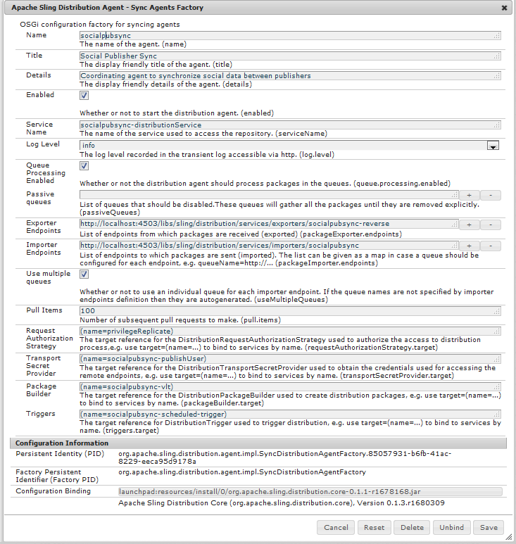
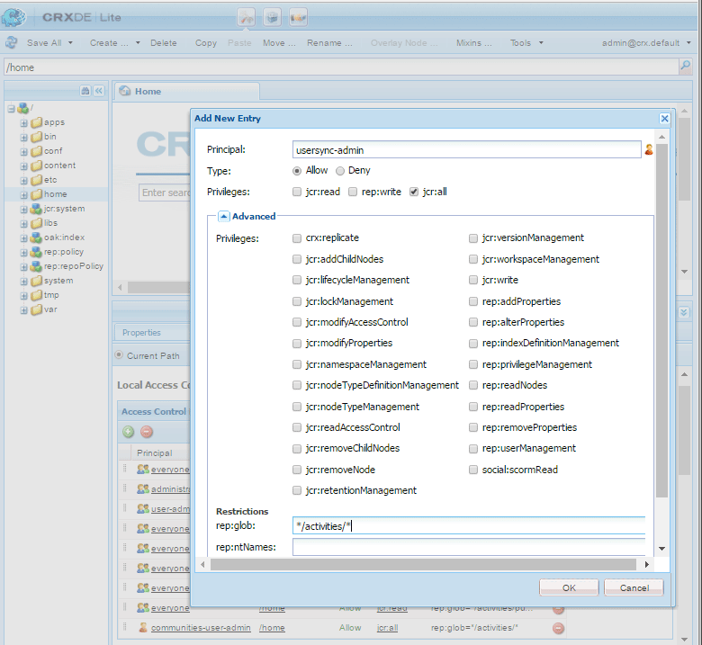
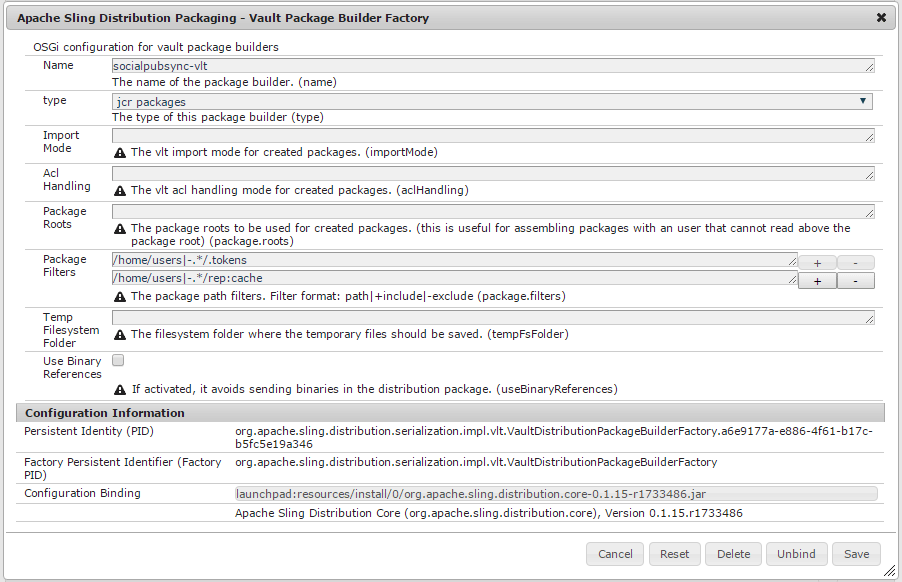
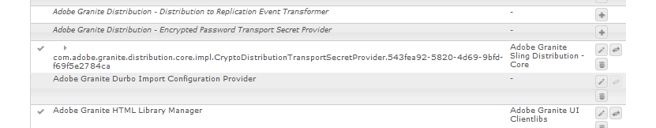

# Sincronizzazione utente{#user-synchronization}

## Introduzione {#introduction}

Quando la distribuzione è una farm [di](/help/sites-deploying/recommended-deploys.md#tarmk-farm)pubblicazione, i membri devono poter accedere e visualizzare i dati su qualsiasi nodo di pubblicazione.

Gli utenti e i gruppi di utenti (dati utente) creati nell’ambiente di pubblicazione non sono necessari nell’ambiente di authoring.

La maggior parte dei dati utente creati nell’ambiente di authoring deve restare nell’ambiente di authoring e non deve essere copiata nelle istanze di pubblicazione.

Per poter accedere agli stessi dati utente, le registrazioni e le modifiche effettuate su un’istanza di pubblicazione devono essere sincronizzate con altre istanze di pubblicazione.

A partire da AEM 6.1, quando la sincronizzazione degli utenti è abilitata, i dati utente vengono automaticamente sincronizzati tra le istanze pubblicate nella farm e non vengono creati in fase di creazione.

## Distribuzione Sling {#sling-distribution}

I dati utente, insieme ai relativi [ACL](/help/sites-administering/security.md), sono memorizzati nel [Oak Core](/help/sites-deploying/platform.md), il livello sotto Oak JCR, e sono accessibili tramite l&#39;API [](https://helpx.adobe.com/experience-manager/6-4/sites/developing/using/reference-materials/javadoc/org/apache/jackrabbit/oak/api/package-tree.html)Oak. Con aggiornamenti non frequenti, è ragionevole che i dati utente siano sincronizzati con altre istanze di pubblicazione utilizzando la distribuzione [di contenuti](https://github.com/apache/sling/blob/trunk/contrib/extensions/distribution/README.md) Sling (distribuzione Sling).

Rispetto alla replica tradizionale, i vantaggi della sincronizzazione utente mediante la distribuzione Sling sono:

* *gli utenti*, i profili ** utente e i gruppi *di* utenti creati al momento della pubblicazione non vengono creati in fase di creazione

* La distribuzione Sling imposta le proprietà negli eventi jcr, consentendo di agire all&#39;interno dei listener di eventi lato pubblicazione senza preoccuparsi di cicli di replica infiniti
* La distribuzione Sling invia solo i dati utente alle istanze di pubblicazione non originarie, eliminando il traffico non necessario
* [Gli ACL](/help/sites-administering/security.md) impostati nel nodo utente sono inclusi nella sincronizzazione

>[!NOTE]
>
>Se sono necessarie sessioni, si consiglia di utilizzare una soluzione SSO o una sessione fissa e di fare in modo che i clienti accedano se accedono a un altro editore.

>[!CAUTION]
>
>La sincronizzazione del gruppo ***Administrators** *non è supportata, anche se è abilitata la sincronizzazione utente. Al contrario, un&#39;operazione di importazione delle diff verrà registrata nel registro degli errori.
>
>Pertanto, se l&#39;implementazione è un&#39;azienda di pubblicazione, se un utente viene aggiunto o rimosso dal gruppo ***Administrators** *, la modifica deve essere eseguita manualmente su ogni istanza di pubblicazione.

## Abilita sincronizzazione utente {#enable-user-sync}

>[!NOTE]
>
>Per impostazione predefinita, la sincronizzazione utente è `disabled`.
>
>L&#39;abilitazione della sincronizzazione utente comporta la modifica delle configurazioni OSGi *esistenti* .
>
>Non è necessario aggiungere nuove configurazioni per abilitare la sincronizzazione degli utenti.

La sincronizzazione utente si basa sull’ambiente di authoring per gestire le distribuzioni dei dati utente, anche se i dati utente non vengono creati in fase di creazione. Gran parte, ma non tutti, della configurazione avviene nell’ambiente di authoring e ogni passaggio indica chiaramente se deve essere eseguita sull’autore o sulla pubblicazione.

Di seguito sono riportati i passaggi necessari per abilitare la sincronizzazione degli utenti, seguiti da una sezione sulla [risoluzione](#troubleshooting) dei problemi:

### Prerequisiti {#prerequisites}

1. Se utenti e gruppi di utenti sono già stati creati su un editore, si consiglia di sincronizzare [](#manually-syncing-users-and-user-groups) manualmente i dati utente a tutti gli editori prima di configurare e abilitare la sincronizzazione utente.

   Una volta attivata la sincronizzazione degli utenti, vengono sincronizzati solo gli utenti e i gruppi appena creati.

1. Verifica che sia stato installato il codice più recente:

* [Aggiornamenti della piattaforma AEM](https://helpx.adobe.com/experience-manager/kb/aem62-available-hotfixes.html)
* [Aggiornamenti di AEM Communities](/help/communities/deploy-communities.md#latest-releases)

### 1. Apache Sling Distribution Agent - Sync Agent Factory {#apache-sling-distribution-agent-sync-agents-factory}

**Abilita sincronizzazione utente**

* **sull&#39;autore**

   * accesso con privilegi di amministratore
   * accedere alla console [Web](/help/sites-deploying/configuring-osgi.md)

      * ad esempio, [http://localhost:4502/system/console/configMgr](http://localhost:4502/system/console/configMgr)
   * locate `Apache Sling Distribution Agent - Sync Agents Factory`

      * selezionate la configurazione esistente da aprire per la modifica (icona matita)

         Verifica `name`: **`socialpubsync`**

      * selezionare la `Enabled` casella di controllo
      * select `Save`




### 2. Crea utente autorizzato {#createauthuser}

**Configura autorizzazioni** Questo utente autorizzato verrà utilizzato nel passaggio 3 per configurare la distribuzione Sling per l&#39;autore.

* **in ogni istanza di pubblicazione**

   * accesso con privilegi di amministratore
   * accedere alla console [di sicurezza](/help/sites-administering/security.md)

      * ad esempio, [http://localhost:4503/useradmin](http://localhost:4503/useradmin)
   * creare un nuovo utente

      * for example, `usersync-admin`
   * add this user to the **`administrators`** user group
   * [aggiungi ACL per questo utente a /home](#addacls)

      * `Allow jcr:all` con restrizione `rep:glob=*/activities/*`


>[!CAUTION]
>
>È necessario creare un nuovo utente.
>
>* L&#39;utente predefinito assegnato è **`admin`**.
>* Non utilizzare `*communities-user-admin *user*.*`
>


#### Come aggiungere ACL {#addacls}

* access CRXDE Lite

   * ad esempio, [http://localhost:4503/crx/de](http://localhost:4503/crx/de)

* seleziona `/home` nodo
* nel riquadro a destra, selezionare la `Access Control` scheda
* selezionare il `+` pulsante per aggiungere una voce ACL

   * **Principal**: *ricerca di utenti creati per la sincronizzazione degli utenti*
   * **Tipo**: `Allow`
   * **Privilegi**: `jcr:all`
   * **Limitazioni** rep:idspn: `*/activities/*`
   * selezionate **OK**

* seleziona **Salva tutto**



Consulta anche

* [Accesso a Right Management](/help/sites-administering/user-group-ac-admin.md#access-right-management)
* Sezione Risoluzione dei problemi [Modifica eccezione operazione durante l&#39;elaborazione](#modify-operation-exception-during-response-processing)delle risposte.

### 3. Distribuzione di Adobe Granite - Provider Segreto di trasporto password crittografato {#adobegraniteencpasswrd}

**Configurare le autorizzazioni**

Una volta creato un utente autorizzato, membro del gruppo di utenti **`administrators`**2, su tutte le istanze di pubblicazione, tale utente autorizzato deve essere identificato all&#39;autore come dotato dell&#39;autorizzazione per sincronizzare i dati utente dall&#39;autore alla pubblicazione.

* **sull&#39;autore**

   * accesso con privilegi di amministratore
   * accedere alla console [Web](/help/sites-deploying/configuring-osgi.md)

      * ad esempio, [http://localhost:4502/system/console/configMgr](http://localhost:4502/system/console/configMgr)
   * locate `Adobe Granite Distribution - Encrypted Password Transport Secret Provider`
   * selezionate la configurazione esistente da aprire per la modifica (icona matita)

      Verifica `property name` : **`socialpubsync-publishUser`**

   * imposta nome utente e password per l’utente [](#createauthuser) autorizzato creato al momento della pubblicazione nel passaggio 2

      * for example, `usersync-admin`


### 4. Apache Sling Distribution Agent - Coda Agenti Factory {#apache-sling-distribution-agent-queue-agents-factory}

**Abilita sincronizzazione utente**

* **al momento della pubblicazione** :

   * accesso con privilegi di amministratore
   * accedere alla console [Web](/help/sites-deploying/configuring-osgi.md)

      * ad esempio, [http://localhost:4503/system/console/configMgr](http://localhost:4503/system/console/configMgr)
   * locate `Apache Sling Distribution Agent - Queue Agents Factory`

      * selezionate la configurazione esistente da aprire per la modifica (icona matita)

         Verifica `Name` : `socialpubsync-reverse`

      * selezionare la `Enabled` casella di controllo
      * select `Save`
   * **ripetizione** per ogni istanza di pubblicazione


### 5. Distribuzione Adobe Granite - Diff Observer Factory {#diffobserver}

**Abilita sincronizzazione gruppo**

* **in ogni istanza** di pubblicazione :

   * accesso con privilegi di amministratore
   * accedere alla console [Web](/help/sites-deploying/configuring-osgi.md)

      * ad esempio, [http://localhost:4503/system/console/configMgr](http://localhost:4503/system/console/configMgr)
   * locate `Adobe Granite Distribution - Diff Observer Factory`

      * selezionate la configurazione esistente da aprire per la modifica (icona matita)

         Verifica `agent name` : `socialpubsync-reverse`

      * selezionare la `Enabled` casella di controllo
      * select `Save`


### 6. Trigger di distribuzione Apache Sling - Factory Triggers programmati {#apache-sling-distribution-trigger-scheduled-triggers-factory}

**(Facoltativo) modificare l’intervallo di polling**

Per impostazione predefinita, l’autore effettua il sondaggio per le modifiche ogni 30 secondi. Per modificare questo intervallo:

* **sull&#39;autore**

   * accesso con privilegi di amministratore
   * accedere alla console [Web](/help/sites-deploying/configuring-osgi.md)

      * ad esempio, [http://localhost:4502/system/console/configMgr](http://localhost:4502/system/console/configMgr)
   * locate `Apache Sling Distribution Trigger - Scheduled Triggers Factory`

      * selezionate la configurazione esistente da aprire per la modifica (icona matita)

         * Verifica `Name` : `socialpubsync-scheduled-trigger`
      * imposta l&#39;intervallo `Interval in Seconds` desiderato
      * select `Save`


## Configurare per più istanze di pubblicazione {#configure-for-multiple-publish-instances}

La configurazione predefinita è per una singola istanza di pubblicazione. Poiché l’abilitazione della sincronizzazione degli utenti consente di sincronizzare più istanze di pubblicazione, ad esempio per una farm di pubblicazione, è necessario aggiungere ulteriori istanze di pubblicazione alla fabbrica di sincronizzazione degli agenti.

### 7. Apache Sling Distribution Agent - Sync Agent Factory {#apache-sling-distribution-agent-sync-agents-factory-1}

**Aggiungi istanze di pubblicazione:**

* **sull&#39;autore**

   * accesso con privilegi di amministratore
   * accedere alla console [Web](/help/sites-deploying/configuring-osgi.md)

      * ad esempio, [http://localhost:4502/system/console/configMgr](http://localhost:4502/system/console/configMgr)
   * locate `Apache Sling Distribution Agent - Sync Agents Factory`

      * selezionate la configurazione esistente da aprire per la modifica (icona matita)

         Verifica `Name` : `socialpubsync`


* **Endpoint** di esportazione Per ogni editore deve essere presente un endpoint di esportazione. Ad esempio, se ci sono 2 editori, localhost:4503 e 4504, dovrebbero essere 2 voci:

   * http://localhost:4503/libs/sling/distribution/services/exporters/socialpubsync-reverse
   * http://localhost:4504/libs/sling/distribution/services/exporters/socialpubsync-reverse

* **Endpoint** importazioneÈ necessario disporre di un endpoint di importazione per ogni editore. Ad esempio, se ci sono 2 editori, localhost:4503 e 4504, dovrebbero essere 2 voci:

   * http://localhost:4503/libs/sling/distribution/services/importers/socialpubsync
   * http://localhost:4504/libs/sling/distribution/services/importers/socialpubsync

* select `Save`

### 8. Listener di sincronizzazione utenti di AEM Communities {#aem-communities-user-sync-listener}

**(Facoltativo) Sincronizzare nodi JCR aggiuntivi**

Se è necessario sincronizzare dati personalizzati tra più istanze di pubblicazione, effettuate le seguenti operazioni:

* **in ogni istanza** di pubblicazione:

   * accesso con privilegi di amministratore
   * accedere alla console [Web](/help/sites-deploying/configuring-osgi.md)

      * ad esempio, [http://localhost:4503/system/console/configMgr](http://localhost:4503/system/console/configMgr)
   * locate `AEM Communities User Sync Listener`
   * selezionate la configurazione esistente da aprire per la modifica (icona matita)

      Verifica `Name`: `socialpubsync-scheduled-trigger`


* **Tipi di nodo**

   Si tratta dell&#39;elenco dei tipi di nodo che verranno sincronizzati. È necessario elencare qui qualsiasi tipo di nodo diverso da sling:Folder (sling:folder viene gestito separatamente).

   Elenco predefinito dei tipi di nodo da sincronizzare:

   * rep:Utente
   * nt:unstructured
   * nt:resource

* **Proprietà ignorabili**

   Si tratta dell&#39;elenco delle proprietà che verranno ignorate in caso di rilevamento di modifiche. Le modifiche apportate a queste proprietà potrebbero essere sincronizzate come effetto collaterale di altre modifiche (poiché la sincronizzazione è sempre a livello di nodo), ma le modifiche apportate a tali proprietà non attiveranno di per sé la sincronizzazione.

   Proprietà predefinita da ignorare:

   * cq:lastModified

* **Nodi ignorabili**

   Percorsi secondari che verranno ignorati completamente durante la sincronizzazione. Nessun elemento all&#39;interno di questi sottotracciati verrà sincronizzato in qualsiasi momento.

   Nodi predefiniti da ignorare:

   * .token
   * system

* **Cartelle distribuite**

   La maggior parte delle sling:Folders vengono ignorate perché la sincronizzazione non è necessaria. Le poche eccezioni sono elencate qui.

   Cartelle predefinite da sincronizzare

   * segmenti/punteggio
   * social/relazioni
   * attività

### 9. ID Sling univoco {#unique-sling-id}

>[!CAUTION]
>
>Se l’ID Sling corrisponde a due o più istanze di pubblicazione, la sincronizzazione dei gruppi di utenti non riesce.

Se l’ID Sling è lo stesso per più istanze pubblicate in una farm di pubblicazione, i gruppi di utenti non verranno sincronizzati.

Per verificare che tutti i valori Sling ID siano diversi, in ogni istanza di pubblicazione:

1. individuare `http://<host>:<port>/system/console/status-slingsettings`
1. verifica il valore di **Sling ID**


Se l’ID Sling di un’istanza di pubblicazione corrisponde all’ID Sling di qualsiasi altra istanza di pubblicazione, effettuate le seguenti operazioni:

1. arrestate una delle istanze di pubblicazione con un ID Sling corrispondente
1. nella directory crx-quickstart/launchpad/felix

   * cercare ed eliminare il file denominato *sling.id.file*

      * ad esempio, su un sistema Linux:

         `rm -i $(find . -type f -name sling.id.file)`

      * ad esempio, in un sistema Windows:

         `use windows explorer and search for *sling.id.file*`

1. avviare l’istanza di pubblicazione

   * all’avvio, gli verrà assegnato un nuovo ID Sling

1. verifica che l’ID **** Sling sia ora univoco

Ripetete questi passaggi finché tutte le istanze di pubblicazione non dispongono di un ID Sling univoco.

## Vault Package Builder Factory {#vault-package-builder-factory}

Per sincronizzare correttamente gli aggiornamenti, è necessario modificare il generatore di pacchetti vault per la sincronizzazione utente:

* in ogni istanza di pubblicazione AEM
* accedere alla console [Web](/help/sites-deploying/configuring-osgi.md)

   * ad esempio, [http://localhost:4503/system/console/configMgr](http://localhost:4503/system/console/configMgr)

* individuare la `Apache Sling Distribution Packaging - Vault Package Builder Factor`

   * `Builder name: socialpubsync-vlt`

* seleziona l’icona di modifica
* aggiungete due `Package Filters` :

   * `/home/users|-.*/.tokens`
   * `/home/users|-.*/rep:cache`

* gestione criteri:

   * per sovrascrivere i nodi rep:policy esistenti con i nuovi, aggiungi un terzo Filtro pacchetto:

      * `/home/users|+.*/rep:policy`
   * per impedire la distribuzione dei criteri, impostare

      * `Acl Handling :` `IGNORE`




## Cosa Succede Quando ... {#what-happens-when}

### Registrazioni o modifiche del profilo utente durante la pubblicazione {#user-self-registers-or-edits-profile-on-publish}

Per impostazione predefinita, gli utenti e i profili creati nell’ambiente di pubblicazione (registrazione automatica) non vengono visualizzati nell’ambiente di authoring.

Se la topologia è una farm [di](/help/sites-deploying/recommended-deploys.md#tarmk-farm) pubblicazione e la sincronizzazione utente è stata configurata correttamente, il *utente *e il profilo ** utente vengono sincronizzati nella farm di pubblicazione utilizzando la distribuzione Sling.

### Utenti o gruppi di utenti creati tramite la console di sicurezza {#users-or-user-groups-are-created-using-security-console}

Per impostazione predefinita, i dati utente creati nell’ambiente di pubblicazione non vengono visualizzati nell’ambiente di authoring e viceversa.

Quando la console Amministrazione [utente e sicurezza](/help/sites-administering/security.md) viene utilizzata per aggiungere nuovi utenti nell’ambiente di pubblicazione, la sincronizzazione utente sincronizza i nuovi utenti e i relativi membri del gruppo con altre istanze di pubblicazione, se necessario. La sincronizzazione utente sincronizza anche i gruppi di utenti creati tramite la console di protezione.

## Risoluzione dei problemi {#troubleshooting}

### Come attivare la sincronizzazione degli utenti offline {#how-to-take-user-sync-offline}

Per ottimizzare la sincronizzazione degli utenti, per [rimuovere un editore](#how-to-remove-a-publisher) o sincronizzare [manualmente i dati](#manually-syncing-users-and-user-groups), la coda di distribuzione deve essere vuota e silenziosa.

Per verificare lo stato della coda di distribuzione:

* autore:

   * utilizzo di [CRXDE Lite](/help/sites-developing/developing-with-crxde-lite.md)

      * cerca le voci in `/var/sling/distribution/packages`

         * nodi cartella denominati con il pattern `distrpackage_*`
   * utilizzo di Gestione [pacchetti](/help/sites-administering/package-manager.md)

      * cercare pacchetti in sospeso (non ancora installati)

         * denominato con il pattern `socialpubsync-vlt*`
         * created by `communities-user-admin`


Quando la coda di distribuzione è vuota, disattivate la sincronizzazione utente:

* sull&#39;autore

   * *deselezionare *la `Enabled` casella di controllo per l&#39;agente di distribuzione [Apache Sling - fabbrica agenti di sincronizzazione](#apache-sling-distribution-agent-sync-agents-factory)

Una volta completate le attività, per riabilitare la sincronizzazione utente:

* sull&#39;autore

   * selezionare la `Enabled` casella di controllo per [Apache Sling Distribution Agent - Sync Agent Factory](#apache-sling-distribution-agent-sync-agents-factory)

### Diagnostica sincronizzazione utenti {#user-sync-diagnostics}

Diagnostica sincronizzazione utenti è uno strumento che controlla la configurazione e tenta di identificare eventuali problemi.

Per effettuare l’authoring, è sufficiente spostarsi dalla console principale tramite **Strumenti, Operazioni, Diagnosi, Diagnostica sincronizzazione utenti.**

I risultati verranno visualizzati semplicemente entrando nella console Diagnostica sincronizzazione utenti.

Questo è ciò che viene visualizzato quando la sincronizzazione utente non è stata abilitata:


#### Come eseguire la diagnostica per gli editori {#how-to-run-diagnostics-for-publishers}

Quando la diagnosi viene eseguita dall&#39;ambiente di authoring, i risultati di esito positivo/negativo includeranno una sezione [INFO] che mostra l&#39;elenco delle istanze di pubblicazione configurate per la conferma.

Nell’elenco è incluso un URL per ogni istanza di pubblicazione che eseguirà la diagnostica per tale istanza. Il parametro url `syncUser` viene aggiunto all’URL di diagnostica con il relativo valore impostato sull’utente *di sincronizzazione* autorizzato creato al [passaggio 2](/help/sites-administering/sync.md#createauthuser).

**Nota** : prima di avviare l’URL, l’utente *di sincronizzazione* autorizzato deve già essere connesso a tale istanza di pubblicazione.


### Configurazione Aggiunta Non Corretta {#improperconfig}

Quando la sincronizzazione degli utenti non funziona, il problema più comune è che sono state *aggiunte* configurazioni aggiuntive. Al contrario, la *configurazione predefinita esistente dovrebbe essere *modificata*.

Di seguito sono riportate le visualizzazioni di come dovrebbero essere visualizzate le configurazioni modificate e predefinite nella console Web. Se viene visualizzata più di un&#39;istanza, la configurazione aggiunta deve essere rimossa.

#### (autore) Un agente di distribuzione Apache Sling - Sync Agent Factory {#author-one-apache-sling-distribution-agent-sync-agents-factory}


#### (autore) Una distribuzione Adobe Granite - Provider Segreto di trasporto con password crittografata {#author-one-adobe-granite-distribution-encrypted-password-transport-secret-provider}



#### (pubblica) Un agente di distribuzione Apache Sling - Coda Agenti Factory {#publish-one-apache-sling-distribution-agent-queue-agents-factory}


#### (pubblicare) Una distribuzione Adobe Granite - Diff Observer Factory {#publish-one-adobe-granite-distribution-diff-observer-factory}


#### (autore) Un trigger di distribuzione Apache Sling - Scheduled Triggers Factory {#author-one-apache-sling-distribution-trigger-scheduled-triggers-factory}


### Modifica eccezione operazione durante l&#39;elaborazione delle risposte {#modify-operation-exception-during-response-processing}

Se nel registro è visibile quanto segue:

`org.apache.sling.servlets.post.impl.operations.ModifyOperation Exception during response processing.`

`java.lang.IllegalStateException: This tree does not exist`

Quindi verificate che la sezione [2. Create un utente]autorizzato (/content/docs/en/aem/6-1/administer/security/security/sync.md#2). create authorized user (Crea utente autorizzato) è stato seguito correttamente.

Questa sezione descrive come creare un utente autorizzato, che esiste su tutte le istanze di pubblicazione e identificarlo nella configurazione OSGi &#39;Provider segreto&#39; dell&#39;autore. By default, the user is `admin`.

L’utente autorizzato deve essere membro del gruppo di **`administrators`** utenti e le autorizzazioni per tale gruppo non devono essere modificate.

L’utente autorizzato deve disporre esplicitamente dei seguenti privilegi e restrizioni per tutte le istanze di pubblicazione:

| **path** | **jcr:all** | **rep:idspn** |
|---|---|---|
| /home | X | &amp;ast;/activity/&amp;ast; |
| /home/users | X | &amp;ast;/activity/&amp;ast; |
| /home/groups | X | &amp;ast;/activity/&amp;ast; |

Come membro del `administrators` gruppo, l’utente autorizzato deve disporre dei seguenti privilegi su tutte le istanze di pubblicazione:

| **path** | **jcr:all** | **jcr:read** | **rep:write** |
|---|---|---|---|
| /etc/packages/sling/distribution |  |  | X |
| /libs/sling/distribution |  | X |  |
| /var |  |  | X |
| /var/eventing |  | X | X |
| /var/sling/distribution |  | X | X |

### Sincronizzazione gruppo utenti non riuscita {#user-group-sync-failed}

Se l’ID Sling corrisponde a due o più istanze di pubblicazione, la sincronizzazione dei gruppi di utenti non riesce.

Cfr. sezione [9. ID Sling univoco](#unique-sling-id)

### Sincronizzazione manuale di utenti e gruppi di utenti {#manually-syncing-users-and-user-groups}

* sull’editore in cui esistono utenti e gruppi di utenti:

   * [se abilitata, disattiva la sincronizzazione utente](#how-to-take-user-sync-offline)
   * [create un pacchetto](/help/sites-administering/package-manager.md#creating-a-new-package) di `/home`

      * durante la modifica del pacchetto

         * Scheda Filtri: Aggiungi filtro: Percorso directory principale: `/home`
         * Scheda avanzata : Gestione CA: `Overwrite`
   * [esportare il pacchetto](/help/sites-administering/package-manager.md#downloading-packages-to-your-file-system)


* in altre istanze di pubblicazione:

   * [importare il pacchetto](/help/sites-administering/package-manager.md#installing-packages)

Per configurare o abilitare la sincronizzazione degli utenti, andate al punto 1: Agente di distribuzione [Apache Sling - Sync Agent Factory](#apache-sling-distribution-agent-sync-agents-factory)

### Quando un editore diventa non disponibile {#when-a-publisher-becomes-unavailable}

Quando un&#39;istanza di pubblicazione diventa non disponibile, non deve essere rimossa se torna in linea in futuro. Le modifiche verranno messe in coda per l&#39;editore e, una volta che l&#39;editore sarà nuovamente online, saranno elaborate.

Se l’istanza di pubblicazione non torna mai online, se è offline in modo permanente, deve essere rimossa perché la compilazione della coda comporterà un utilizzo notevole dello spazio su disco nell’ambiente di authoring.

Quando un editore non è attivo, nel registro dell’autore sono presenti eccezioni simili a:

```
28.01.2016 15:57:48.475 ERROR
 [pool-12-thread-34-org_apache_sling_distribution_queue_socialpubsync_endpoint1
 (org/apache/sling/distribution/queue/socialpubsync/endpoint1)]
 org.apache.sling.distribution.agent.impl.SimpleDistributionAgent [agent][socialpubsync] could not deliver package distrpackage_1454014575838_a2b45ec8-0400-42f3-bed8-ae09b66381cb
 org.apache.sling.distribution.packaging.DistributionPackageImportException: failed in importing package ...
```

### Come rimuovere un editore {#how-to-remove-a-publisher}

Per rimuovere un editore dall&#39;agente di distribuzione [Apache Sling - Sync Agent Factory](#apache-sling-distribution-agent-sync-agents-factory), la coda di distribuzione deve essere vuota e silenziosa.

* autore :

   * [Sincronizzazione utenti offline](#how-to-take-user-sync-offline)
   * seguire il [passaggio 7](#apache-sling-distribution-agent-sync-agents-factory) per rimuovere l&#39;editore da entrambi gli elenchi server:

      * `Exporter Endpoints`
      * `Importer Endpoints`
   * riabilitare la sincronizzazione degli utenti

      * selezionare la `Enabled` casella di controllo per [Apache Sling Distribution Agent - Sync Agent Factory](#apache-sling-distribution-agent-sync-agents-factory)


