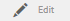
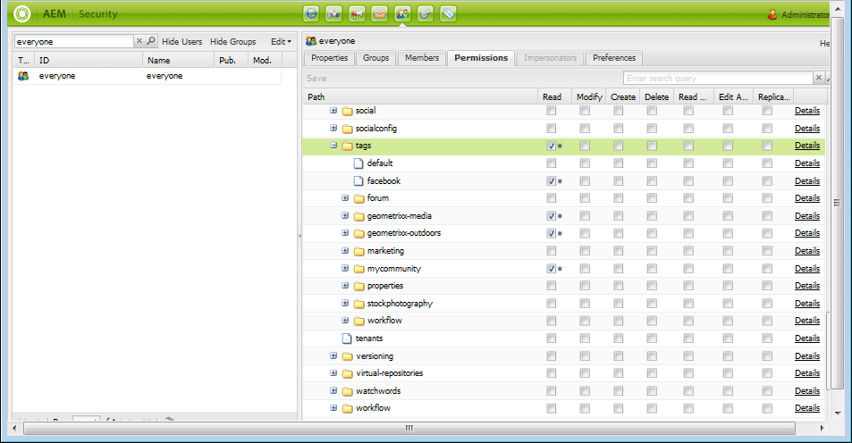

# Amministrazione dei tag{#administering-tags}

I tag sono un metodo semplice e veloce per classificare i contenuti di un sito web. Possono essere considerate come parole chiave o etichette (metadati) che consentono di trovare più rapidamente il contenuto a seguito di una ricerca.

In Adobe Experience Manager (AEM), un tag può essere una proprietà di

* un nodo di contenuto per una pagina (consulta [Uso dei tag](/help/sites-authoring/tags.md))

* un nodo di metadati per una risorsa (consulta [Gestione dei metadati per le risorse digitali](/help/assets/metadata.md))

Oltre alle pagine e alle risorse, i tag vengono utilizzati per le funzioni di AEM Communities

* contenuto generato dall&#39;utente (consulta [Assegnazione tag UGC)](/help/communities/tag-ugc.md)

* Risorse di abilitazione (consulta [Assegnazione tag alle risorse di abilitazione](/help/communities/functions.md#catalog-function))

## Funzioni tag {#tag-features}

Alcune delle funzioni dei tag in AEM includono :

* I tag possono essere raggruppati in vari namespace. Tali gerarchie consentono di creare tassonomie Queste tassonomie sono globali in tutta AEM.
* La restrizione principale per i tag appena creati è che devono essere univoci all’interno di uno specifico spazio dei nomi.
* Il titolo di un tag non deve includere caratteri di separazione del percorso del tag (né saranno visualizzati se presenti)

   * due punti (:) - delimita il tag namespace
   * barra (/) - delimita i tag secondari

* I tag possono essere applicati da autori e visitatori del sito. A prescindere dalla modalità di creazione, tutti i tipi di tag possono essere selezionati sia per essere assegnati a una pagina, sia per operazioni di ricerca.
* I tag possono essere creati e la loro tassonomia può essere modificata dai membri del gruppo &quot;tag-administrators&quot; e dai membri che dispongono dei diritti di modifica per `/content/cq:tags`.

   * Un tag contenente tag secondari è denominato tag contenitore
   * Un tag che non è un tag contenitore è denominato tag foglia
   * Un tag namespace è un tag foglia o contenitore

* I tag vengono utilizzati dal [componente Ricerca](https://helpx.adobe.com/experience-manager/core-components/using/quick-search.html) per facilitare la ricerca di contenuti.
* I tag vengono utilizzati dal [componente teaser](https://helpx.adobe.com/experience-manager/core-components/using/teaser.html), che controlla il tag cloud di un utente per fornire contenuti mirati.
* Assegnazione di tag a un aspetto importante del contenuto

   * assicurati di creare pacchetti di tag con le pagine che li utilizzano
   * assicurati che [autorizzazioni tag](#setting-tag-permissions) abilitino l&#39;accesso in lettura

## Console assegnazione tag {#tagging-console}

La console Assegnazione tag consente di creare e gestire i tag e le relative tassonomie. Un obiettivo è quello di evitare di avere molti tag simili che si riferiscono sostanzialmente alla stessa cosa : ad esempio, pagina e pagine o calzature e scarpe.

I tag vengono gestiti raggruppandoli in spazi dei nomi, esaminando l’utilizzo dei tag esistenti prima di crearne di nuovi e riorganizzandoli senza scollegare il tag dal contenuto attualmente a cui si fa riferimento.

Per accedere alla console Tagging :

* sull&#39;autore
* accesso con privilegi amministrativi
* dalla navigazione globale

   * select **`Tools`**
   * seleziona **`General`**
   * seleziona **`Tagging`**

### Creazione di un namespace {#creating-a-namespace}

Per creare un nuovo namespace, seleziona l’icona **`Create Namespace`** .

Lo spazio dei nomi è di per sé un tag e non deve contenere tag secondari. Tuttavia, per continuare a creare una tassonomia, [crea tag secondari](#creating-tags), che a loro volta possono essere tag foglia o contenitore.

 

* **Titolo**
* (obbligatorio) *Un titolo di visualizzazione per lo spazio dei nomi.

* **Nome**
* (facoltativo) *Un nome per lo spazio dei nomi. Se non viene specificato, dal Titolo viene creato un nome di nodo valido. Consulta [TagID](/help/sites-developing/framework.md#tagid).

* **Descrizione**
*(opzionale) *Una descrizione dello spazio dei nomi.

Una volta inserite le informazioni richieste

* seleziona **Crea**

### Operazioni sui tag {#operations-on-tags}

Quando si seleziona uno spazio dei nomi o un altro tag, sono disponibili le seguenti operazioni:

* [Visualizza proprietà](#viewing-tag-properties)
* [Riferimenti](#showing-tag-references)
* [Crea tag](#creating-tags)
* [Modifica](#editing-tags)
* [Sposta](#moving-tags)
* [Unisci](#merging-tags)
* [Pubblicazione](#publishing-tags)
* [Annulla pubblicazione](#unpublishing-tags)
* [Elimina](#deleting-tags)

Quando la finestra del browser non è sufficientemente ampia da visualizzare tutte le icone, le icone più a destra sono raggruppate sotto un&#39;icona **`... More`**, che mostra un elenco a discesa delle icone delle operazioni nascoste quando selezionate.

### Selezione di un tag dello spazio dei nomi {#selecting-a-namespace-tag}

Quando è selezionata per la prima volta, se lo spazio dei nomi non contiene tag, le proprietà vengono visualizzate a destra, altrimenti vengono visualizzati i tag secondari. Ogni tag selezionato visualizzerà i tag in esso contenuti o le relative proprietà se non dispone di tag secondari.

Per selezionare il tag per le operazioni e per effettuare una selezione multipla, seleziona solo l’icona accanto al titolo. Quando si seleziona il titolo, vengono visualizzate solo le proprietà o il tag viene aperto per visualizzarne il contenuto.

 

### Visualizzazione delle proprietà dei tag {#viewing-tag-properties}

Quando si seleziona uno spazio dei nomi o un altro tag, quando si seleziona l’icona **`View Properties`** vengono visualizzate le informazioni relative a `name`, all’ora dell’ultima modifica e al numero di riferimenti. Se pubblicata, viene visualizzata l’ora dell’ultima pubblicazione e l’ID dell’editore. Queste informazioni vengono visualizzate in una colonna a sinistra delle colonne del tag.

### Visualizzazione dei riferimenti ai tag {#showing-tag-references}

Quando selezioni uno spazio dei nomi o un altro tag, seleziona l’icona **`References`**per identificare il contenuto a cui è stato applicato il tag.

La visualizzazione iniziale è un conteggio dei tag applicati.

Selezionando la freccia a destra del conteggio, vengono elencati i nomi di riferimento.

Il percorso del riferimento viene visualizzato come una descrizione comandi quando si passa il mouse su un riferimento.

### Creazione di tag {#creating-tags}

Quando selezioni uno spazio dei nomi o un altro tag (selezionando l’icona accanto al titolo), puoi creare un tag secondario per il tag corrente selezionando l’icona **`Create Tag`** .

* **Titolo**
* (obbligatorio) *Un titolo di visualizzazione per il tag.

* **Nome**
* (facoltativo) *Un nome per il tag. Se non viene specificato, dal Titolo viene creato un nome di nodo valido. Consulta [TagID](/help/sites-developing/framework.md#tagid).

* **Descrizione**
*(opzionale) *Una descrizione del tag.

Una volta inserite le informazioni richieste

* seleziona **Crea**

### Modifica dei tag {#editing-tags}

Quando è selezionato uno spazio dei nomi o un altro tag, è possibile modificare il Titolo, la Descrizione e fornire le localizzazioni del Titolo selezionando l’icona **`Edit`**icona.

Dopo aver apportato le modifiche, seleziona **Salva**.

Per informazioni dettagliate sull&#39;aggiunta di traduzioni in lingua, consulta la sezione sulla [Gestione dei tag in diverse lingue](#managing-tags-in-different-languages).

### Spostamento dei tag {#moving-tags}

Quando selezioni uno spazio dei nomi o un altro tag, seleziona l’icona **`Move`** per consentire agli amministratori di tag e agli sviluppatori di ripulire la tassonomia spostando il tag in una nuova posizione o rinominandolo. Quando il tag selezionato è un tag contenitore, lo spostamento del tag comporta anche lo spostamento di tutti i tag secondari.

>[!NOTE]
>
>È consigliabile che gli autori possano solo [modificare](#editing-tags) il tag `title` e non spostare o rinominare i tag.

* **Percorso**

   *(Solo lettura)* Il percorso corrente del tag selezionato.

* **Passa**
aSfoglia fino al nuovo percorso in cui spostare il tag.

* **Rinomina**
inInizialmente visualizza il valore corrente 
`name`del tag . È possibile immettere un nuovo elemento `name`.

* seleziona **Salva**

### Unione dei tag {#merging-tags}

Se una tassonomia include duplicati, è possibile unire i tag. Quando il tag A viene unito al tag B, tutte le pagine contrassegnate con il tag A vengono contrassegnate con il tag B e il tag A non è più disponibile per gli autori.

Quando selezioni uno spazio dei nomi o un altro tag, seleziona l’icona **`Merge`**per aprire un pannello in cui è possibile selezionare il percorso in cui eseguire l’unione.

* **Percorso**

   *(Solo lettura)* Il percorso del tag selezionato da unire in un altro tag.

* **Unisci**
inSfoglia per selezionare il percorso del tag in cui unire.

>[!NOTE]
>
>Dopo l&#39;unione, il **Path **selezionato originariamente (virtualmente) non esisterà più.
>
>Quando un tag di riferimento viene spostato o unito, il tag non viene fisicamente eliminato in modo da poter mantenere i riferimenti.

### Pubblicazione dei tag {#publishing-tags}

Quando selezioni uno spazio dei nomi o un altro tag, seleziona l’icona **`Publish`**per attivare il tag nell’ambiente di pubblicazione. Analogamente al contenuto della pagina, viene pubblicato solo il tag selezionato, indipendentemente dal fatto che si tratti o meno di un tag contenitore .

Per pubblicare una tassonomia (uno spazio dei nomi e dei tag secondari), la best practice consiste nel creare un [pacchetto](/help/sites-administering/package-manager.md) dello spazio dei nomi (consulta [Nodo principale tassonomia](/help/sites-developing/framework.md#taxonomy-root-node)). Assicurati di [applicare le autorizzazioni](#setting-tag-permissions) allo spazio dei nomi prima di creare il pacchetto.

### Annullamento della pubblicazione dei tag {#unpublishing-tags}

Quando selezioni uno spazio dei nomi o un altro tag, seleziona l’icona **`Unpublish`**per disattivare il tag nell’ambiente di authoring e rimuoverlo dall’ambiente di pubblicazione. Analogamente all’operazione `Delete`se il tag selezionato è un tag contenitore, tutti i relativi tag figlio verranno disattivati nell’ambiente di authoring e rimossi dall’ambiente di pubblicazione.

### Eliminazione dei tag {#deleting-tags}

Quando selezioni uno spazio dei nomi o un altro tag, quando selezioni l’icona **`Delete`**rimuovi definitivamente il tag dall’ambiente di authoring. Se il tag è stato pubblicato, viene rimosso anche dall’ambiente di pubblicazione. Se il tag selezionato è un tag contenitore, verranno rimossi anche tutti i tag secondari corrispondenti.

## Impostazione delle autorizzazioni dei tag {#setting-tag-permissions}

Le autorizzazioni dei tag sono [&#39;secure (by default)&#39;](/help/sites-administering/production-ready.md); una best practice per l’ambiente di pubblicazione che richiede l’autorizzazione di lettura per consentire esplicitamente i tag. Basciamente, questo viene fatto creando un pacchetto dello spazio dei nomi dei tag dopo che le autorizzazioni sono state impostate sull&#39;autore e installando il pacchetto su tutte le istanze di pubblicazione.

* sull’istanza dell’autore

   * accesso con privilegi amministrativi
   * accedere alla [console di sicurezza](/help/sites-administering/security.md#accessing-user-administration-with-the-security-console),

      * ad esempio, cerca http://localhost:4502/useradmin
   * nel riquadro a sinistra, selezionare il gruppo (o l&#39;utente) per il quale è concesso [read permission](/help/sites-administering/security.md#permissions)
   * nel riquadro a destra, individua il **Path **to the Tag Namespace

      * ad esempio, `/content/cq:tags/mycommunity`
   * seleziona la colonna `checkbox`in **Leggi**
   * seleziona **Salva**

* assicurati che tutte le istanze di pubblicazione abbiano le stesse autorizzazioni

   * un approccio è quello di [creare un pacchetto](/help/sites-administering/package-manager.md#package-manager) dello spazio dei nomi sull&#39;autore

      * nella scheda `Advanced`, per `AC Handling` seleziona `Overwrite`
   * replicare il pacchetto

      * scegli `Replicate` dal gestore dei pacchetti

## Gestione dei tag in diverse lingue {#managing-tags-in-different-languages}

La proprietà `title`di un tag può essere tradotta in più lingue. Una volta tradotto, il tag appropriato `title`può essere visualizzato in base alla lingua dell’utente o alla lingua della pagina.

### Definizione dei titoli dei tag in diverse lingue {#defining-tag-titles-in-multiple-languages}

Di seguito viene descritto come tradurre il `title`del tag **Animals** dall&#39;inglese al tedesco e al francese.

Per iniziare, seleziona il tag nello spazio dei nomi **Fotografia Stock** e fai clic sull’icona **`Edit`**(consulta la sezione [Modifica di tag](#editing-tags) ).

Il pannello Modifica tag consente di scegliere le lingue in cui il titolo del tag deve essere localizzato.

Quando si seleziona ogni lingua, viene visualizzata una casella di immissione testo in cui è possibile inserire il titolo tradotto.

Una volta immesse tutte le traduzioni, seleziona **Salva **per uscire dalla modalità di modifica.

In generale, la lingua scelta per il tag viene presa dalla lingua della pagina, se disponibile. Quando si utilizza il widget [`tag` in altre situazioni (ad esempio nei moduli o nelle finestre di dialogo) la lingua del tag dipende dal contesto.](/help/sites-developing/building.md#tagging-on-the-client-side)

Invece di usare l’impostazione per la lingua della pagina, nella console Assegnazione tag vengono utilizzate le impostazioni per la lingua utente. Nella console Tagging, per il tag &quot;Animals&quot; viene visualizzato &quot;Animaux&quot; per un utente che imposta la lingua in francese nelle relative proprietà utente.

Per aggiungere una nuova lingua alla finestra di dialogo, consulta [Aggiunta di una nuova lingua alla finestra di dialogo Modifica tag](/help/sites-developing/building.md#adding-a-new-language-to-the-edit-tag-dialog).

>[!NOTE]
>
>Il tag cloud dei tag e le parole chiave meta nel componente pagina standard utilizzano il tag localizzato `titles`in base alla lingua della pagina, se disponibile.

## Riferimenti {#resources}

* [Assegnazione tag per sviluppatori](/help/sites-developing/tags.md)

   Informazioni sul framework dei tag, nonché sull’estensione e l’inclusione di tag nelle applicazioni personalizzate.

* [Console per assegnazione tag dell’interfaccia classica](/help/sites-administering/classic-console.md)
