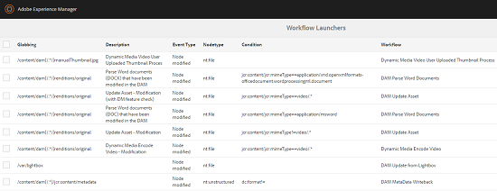

# Offloader flusso di lavoro risorse{#assets-workflow-offloader}

Lo scaricatore del flusso di lavoro di Assets consente di abilitare più istanze di Adobe Experience Manager (AEM) Assets per ridurre il carico di elaborazione sull’istanza principale (riempimento iniziale). Il carico di elaborazione viene distribuito tra l&#39;istanza di riempimento iniziale e le varie istanze offload (Worker) ad essa aggiunte. La distribuzione del carico di elaborazione delle risorse aumenta l’efficienza e la velocità con cui  AEM Assets elabora le risorse. Inoltre, consente di allocare risorse dedicate per elaborare risorse di un particolare tipo MIME. Ad esempio, potete allocare un nodo specifico nella topologia per elaborare solo risorse  InDesign.

## Configurare la topologia offloader {#configure-offloader-topology}

Utilizzate Configuration Manager per aggiungere l&#39;URL per l&#39;istanza leader e i nomi host delle istanze offloader per le richieste di connessione nell&#39;istanza leader.

1. Toccate/fate clic sul logo AEM e scegliete **Strumenti** > **Operazioni** > **Console Web** per aprire Gestione configurazione.
1. Dalla console Web, selezionare **Sling** > **Gestione topologia**.

   

1. Nella pagina Gestione topologia, tocca o fai clic sul collegamento **Configura servizio Discovery.Oak**.

   

1. Nella pagina Configurazione servizio di individuazione, specificate l&#39;URL del connettore per l&#39;istanza leader nel campo **URL del connettore topologia**.

   

1. Nel campo **Whitelist del connettore topologia**, specificate l&#39;indirizzo IP o i nomi host delle istanze offloader che possono connettersi all&#39;istanza leader. Toccate/fate clic su **Salva**.

   

1. Per visualizzare le istanze offloader collegate all&#39;istanza leader, passare a **Strumenti** > **Distribuzione** > **Topologia** e toccare/fare clic sulla vista Cluster.

## Disattivazione dell&#39;offload {#disable-offloading}

1. Toccate/fate clic sul logo AEM e scegliete **Strumenti** > **Distribuzione** > **Offload**. La pagina **Scaricamento del browser** visualizza gli argomenti e le istanze del server che possono utilizzare gli argomenti.

   

1. Disattiva l&#39;argomento *com/adobe/granite/workflow/offloading* sulle istanze iniziali con cui gli utenti interagiscono per caricare o modificare AEM risorse.

   

## Configurare i avviatori di workflow sull&#39;istanza iniziale {#configure-workflow-launchers-on-the-leader-instance}

Configurate gli avviatori del flusso di lavoro per utilizzare il flusso di lavoro **Aggiornamento DAM Asset Offloading** sull&#39;istanza principale invece del flusso di lavoro **Aggiorna risorsa Dam**.

1. Toccate/fate clic sul logo AEM e scegliete **Strumenti** > **Flusso di lavoro** > **Avviatori** per aprire la console **Avviatori flusso di lavoro**.

   

1. Individuate le due configurazioni di avvio con il tipo di evento **Node Create** e **Node Modified** rispettivamente, che eseguono il flusso di lavoro **DAM Update Asset**.
1. Per ogni configurazione, seleziona la casella di controllo prima e tocca o fai clic sull&#39;icona **Visualizza proprietà** nella barra degli strumenti per visualizzare la finestra di dialogo **Proprietà di avvio**.

   

1. Nell&#39;elenco **Workflow**, scegliere **Aggiornamento DAM Asset Offloading** e toccare o fare clic su **Salva**.

   

1. Toccate/fate clic sul logo AEM e scegliete **Strumenti** > **Workflow** > **Modelli** per aprire la pagina **Modelli di workflow**.
1. Selezionate il flusso di lavoro **DAM Update Asset Offloading**, quindi toccate o fate clic su **Edit** dalla barra degli strumenti per visualizzarne i dettagli.

   

1. Visualizzare il menu di scelta rapida per il passaggio **Scaricamento del flusso di lavoro DAM** e scegliere **Modifica**. Verificare la voce nel campo **Argomento processo** della scheda **Argomenti generici** della finestra di dialogo di configurazione.

   

## Disabilitare gli avviatori del flusso di lavoro sulle istanze offload {#disable-the-workflow-launchers-on-the-offloader-instances}

Disattivate i avviatori del flusso di lavoro che eseguono il flusso di lavoro **DAM Update Asset** sull&#39;istanza iniziale.

1. Toccate/fate clic sul logo AEM e scegliete **Strumenti** > **Flusso di lavoro** > **Avviatori** per aprire la console **Avviatori flusso di lavoro**.

   

1. Individuate le due configurazioni di avvio con il tipo di evento **Node Create** e **Node Modified** rispettivamente, che eseguono il flusso di lavoro **DAM Update Asset**.
1. Per ogni configurazione, seleziona la casella di controllo prima e tocca o fai clic sull&#39;icona **Visualizza proprietà** nella barra degli strumenti per visualizzare la finestra di dialogo **Proprietà di avvio**.

   

1. Nella sezione **Activate **, trascinare il cursore per disattivare l&#39;avvio del flusso di lavoro e toccare/fare clic su **Save** per disattivarlo.

   

1. Caricate qualsiasi risorsa di tipo immagine nell’istanza di riempimento iniziale. Verifica le miniature generate e riportate di nuovo per la risorsa dall’istanza scaricata.

