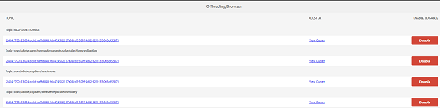
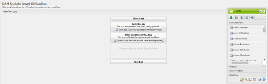

# Offloader flusso di lavoro risorse{#assets-workflow-offloader}

>[!CAUTION]
>
>AEM 6.4 ha raggiunto la fine del supporto esteso e questa documentazione non viene più aggiornata. Per maggiori dettagli, consulta la nostra [periodi di assistenza tecnica](https://helpx.adobe.com/it/support/programs/eol-matrix.html). Trova le versioni supportate [qui](https://experienceleague.adobe.com/docs/).

Lo scaricatore del flusso di lavoro di Assets consente di abilitare più istanze di Adobe Experience Manager (AEM) Assets per ridurre il carico di elaborazione sull’istanza principale (leader). Il carico di elaborazione viene distribuito tra l’istanza leader e le varie istanze offloader (worker) aggiunte a essa. La distribuzione del carico di elaborazione delle risorse aumenta l’efficienza e la velocità con cui AEM Assets elabora le risorse. Inoltre, consente di allocare risorse dedicate per elaborare le risorse di un particolare tipo MIME. Ad esempio, puoi allocare un nodo specifico nella topologia per elaborare solo le risorse di InDesign.

## Configurare la topologia offloader {#configure-offloader-topology}

Utilizza Configuration Manager per aggiungere l&#39;URL per l&#39;istanza leader e i nomi host delle istanze offloader per le richieste di connessione nell&#39;istanza leader.

1. Tocca o fai clic sul logo AEM e scegli **Strumenti** > **Operazioni** > **Console web** per aprire Configuration Manager.
1. Dalla console Web, seleziona **Sling** >  **Gestione topologia**.

   

1. Nella pagina Gestione topologia, tocca o fai clic sul pulsante **Configura il servizio Discovery.Oak** link.

   

1. Nella pagina Configurazione del servizio di individuazione , specifica l’URL del connettore per l’istanza leader nel **URL del connettore topologico** campo .

   

1. In **Whitelist del connettore topologia** specificare l&#39;indirizzo IP o i nomi host delle istanze offloader che possono connettersi all&#39;istanza leader. Tocca o fai clic su **Salva**.

   

1. Per visualizzare le istanze offloader collegate all&#39;istanza leader, vai a **Strumenti** > **Distribuzione** > **Topologia** quindi tocca o fai clic sulla vista Cluster.

## Disattiva offload {#disable-offloading}

1. Tocca o fai clic sul logo AEM e scegli **Strumenti** > **Distribuzione** > **Offload**. La **Download del browser** In questa pagina vengono visualizzati gli argomenti e le istanze del server che possono essere utilizzati.

   

1. Disattiva la *com/adobe/granite/workflow/offload* argomento relativo alle istanze iniziali con cui gli utenti interagiscono per caricare o modificare AEM risorse.

   

## Configurare i moduli di avvio del flusso di lavoro sull&#39;istanza leader {#configure-workflow-launchers-on-the-leader-instance}

Configurare i moduli di avvio del flusso di lavoro per utilizzare **Offload delle risorse di aggiornamento DAM** flusso di lavoro sull’istanza leader invece del **Risorsa di aggiornamento DAM** workflow.

1. Tocca o fai clic sul logo AEM e scegli, **Strumenti** > **Flusso di lavoro** > **Lanci** per aprire **Utilità di avvio flussi di lavoro** console.

   

1. Individua le due configurazioni di Launcher con il tipo di evento **Nodo creato** e **Nodo modificato** che eseguono rispettivamente il **Risorsa di aggiornamento DAM** workflow.
1. Per ogni configurazione, seleziona la casella di controllo prima di essa e tocca o fai clic sul pulsante **Visualizza proprietà** dalla barra degli strumenti per visualizzare **Proprietà Launcher** finestra di dialogo.

   

1. Da **Flusso di lavoro** elenco, scegli **Offload delle risorse di aggiornamento DAM** e tocca/fai clic su **Salva**.

   

1. Tocca o fai clic sul logo AEM e scegli, **Strumenti** > **Flusso di lavoro** > **Modelli** per aprire **Modelli di flusso di lavoro** pagina.
1. Seleziona la **Offload delle risorse di aggiornamento DAM** , quindi tocca o fai clic **Modifica** dalla barra degli strumenti per visualizzarne i dettagli.

   

1. Visualizza il menu di scelta rapida per **Offload del flusso di lavoro DAM** e scegli **Modifica**. Verifica la voce nella **Argomento processo** campo **Argomenti generici** scheda della finestra di dialogo di configurazione.

   

## Disattiva i moduli di avvio del flusso di lavoro sulle istanze offloader {#disable-the-workflow-launchers-on-the-offloader-instances}

Disattiva i moduli di avvio del flusso di lavoro che eseguono il **Risorsa di aggiornamento DAM** sull’istanza leader.

1. Tocca o fai clic sul logo AEM e scegli, **Strumenti** > **Flusso di lavoro** > **Lanci** per aprire **Utilità di avvio flussi di lavoro** console.

   

1. Individua le due configurazioni di Launcher con il tipo di evento **Nodo creato** e **Nodo modificato** che eseguono rispettivamente il **Risorsa di aggiornamento DAM** workflow.
1. Per ogni configurazione, seleziona la casella di controllo prima di essa e tocca o fai clic sul pulsante **Visualizza proprietà** dalla barra degli strumenti per visualizzare **Proprietà Launcher** finestra di dialogo.

   

1. Nella sezione **Attiva **trascina il cursore per disabilitare il modulo di avvio del flusso di lavoro e tocca/fai clic su **Salva** per disattivarlo.

   

1. Carica qualsiasi risorsa di tipo immagine nell’istanza principale. Verifica le miniature generate e riportate nuovamente per la risorsa dall’istanza offload.
