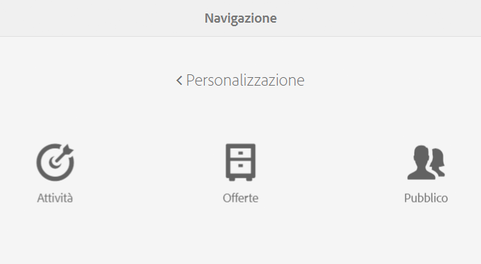
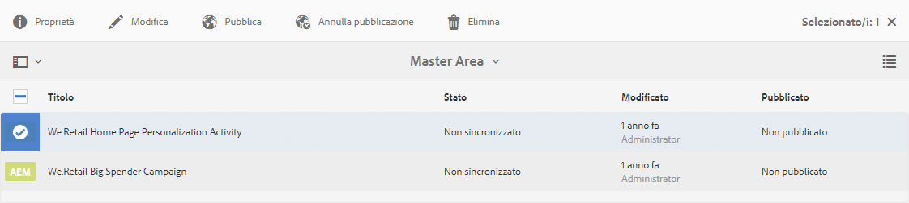
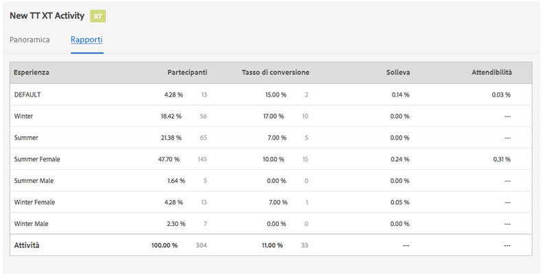
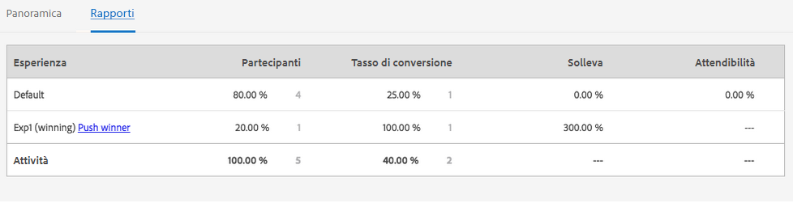

# Gestione delle attività{#managing-activities}

>[!CAUTION]
>
>AEM 6.4 ha raggiunto la fine del supporto esteso e questa documentazione non viene più aggiornata. Per maggiori dettagli, consulta la nostra [periodi di assistenza tecnica](https://helpx.adobe.com/it/support/programs/eol-matrix.html). Trova le versioni supportate [qui](https://experienceleague.adobe.com/docs/).

La console Attività consente di creare, organizzare e gestire il marketing [attività](/help/sites-authoring/personalization.md#activities) dei tuoi marchi:

* Aggiungi marchi.
* Per ogni marchio puoi aggiungere e configurare delle attività.
* Attività di amministrazione.

>[!NOTE]
>
>Se utilizzi Adobe Target come motore di destinazione, puoi anche [visualizzare i dati sulle prestazioni delle attività](#viewing-performance-and-converting-winning-experiences-a-b-test). Se utilizzi il test A/B, puoi [convertire i vincitori](#viewing-performance-and-converting-winning-experiences-a-b-test).

Nella console Attività , le attività sono organizzate per marchio. Puoi utilizzare marchi e cartelle per strutturare l’organizzazione delle attività. Per accedere alla console Attività, tocca o fai clic su **Personalizzazione** e tocca/fai clic su **Attività**.

Le attività sono disponibili in modalità Targeting per la [creazione di contenuti con targeting](/help/sites-authoring/content-targeting-touch.md). dove è anche possibile creare attività. Le attività create in modalità Targeting vengono visualizzate nella console Attività.

Le attività vengono visualizzate con un’etichetta che descrive il tipo di attività definita:

* XT - Targeting delle esperienze Adobe Target
* A/B - Test A/B di Adobe Target
* AEM - Targeting Adobe Experience Manager (basato su contexthub o clientcontext)

>[!NOTE]
>
>Il tipo di attività disponibile viene stabilito in base ai seguenti elementi:
>
>* Se la **xt_only** l’opzione è abilitata sul tenant di Adobe Target (clientcode) utilizzato sul lato AEM per connettersi ad Adobe Target, quindi puoi creare **only** Attività XT in AEM.
>
>* Se la **xt_only** opzioni **not** abilitato sul tenant di Adobe Target (clientcode), puoi creare **entrambi** Attività XT e A/B in AEM.
>
>**Nota aggiuntiva:** **xt_only** options è un’impostazione applicata a un determinato tenant Target (clientcode) e può essere modificata solo direttamente in Adobe Target. Non puoi attivare o disattivare questa opzione da AEM.

>[!CAUTION]
>
>È necessario proteggere il nodo delle impostazioni delle attività **cq:ActivitySettings** sull&#39;istanza di pubblicazione in modo che sia inaccessibile agli utenti normali. Il nodo delle impostazioni delle attività deve essere accessibile solo al servizio che gestisce la sincronizzazione delle attività con Adobe Target.
>
>Consulta [Prerequisiti per l&#39;integrazione con Adobe Target](/help/sites-administering/target-requirements.md) per informazioni dettagliate.

## Creazione di un marchio tramite la console Attività {#creating-a-brand-using-the-activities-console}

Crea un marchio per il quale desideri gestire le attività di marketing.

Quando crei un marchio utilizzando la console Attività, questa viene visualizzata anche nella [console Offerte](/help/sites-authoring/offerlib.md), dove puoi creare offerte per le esperienze delle tue attività.

1. Nella console Navigazione, tocca o fai clic su **Personalizzazione**. Tocca o fai clic su **Attività**.

   

1. Nella console Attività, tocca o fai clic su **Crea** then **Crea marchio**.
1. Seleziona il modello di marchio e tocca o fai clic su **Successivo**.
1. Digita un titolo per il marchio come desideri che appaia nelle console Attività e Offerte . Facoltativamente, digita o seleziona uno o più tag da associare al brand.
1. Tocca o fai clic su **Crea**. Il tuo marchio viene visualizzato nella console Attività .

## Aggiunta/modifica di un’attività tramite la console Attività {#adding-editing-an-activity-using-the-activities-console}

Aggiungi un’attività o modifica un’attività esistente per concentrare le tue attività di marketing su tipi di pubblico specifici. Quando crei/modifichi un’attività, specifica le seguenti informazioni:

* **Nome:** il nome dell’attività.
* **Motore di destinazione:** [AEM](/help/sites-authoring/personalization.md#aem) oppure [Adobe Target](/help/sites-authoring/personalization.md#adobe-target) come motore per il contenuto di destinazione.

* **Seleziona una configurazione di destinazione:** (Solo Adobe Target) la configurazione cloud che questa attività deve utilizzare per connettersi ad Adobe Target. Questa opzione viene visualizzata solo quando è selezionato Adobe Target è per il motore di destinazione.
* **Tipo di attività:** Tipo di attività: test A/B o targeting delle esperienze
* **Obiettivo:** (facoltativo) una descrizione dell’attività.
* **Esperienze:** mappature tra i nomi del pubblico e i segmenti di marketing di destinazione.
* **Traffic Percentages (Percentuali di traffico):** se è selezionato il test A/B, puoi modificare la quantità di traffico (in percentuale) che viene indirizzato a ogni esperienza.
* **Durata:** il periodo di tempo in cui viene applicata l’attività.
* **Priorità:** la priorità relativa dell’attività. Quando le attività forniscono contenuto per gli stessi segmenti di utenti, l’attività della priorità superiore ha la precedenza.
* **Metrica per obiettivo:** se Adobe Target è selezionato come motore di destinazione, puoi aggiungere all’attività le metriche di successo. È necessaria una metrica di successo.

>[!NOTE]
>
>È necessario **creare** nuove attività di Adobe Target nell’editor del contenuto di destinazione, non nella console **Attività**, in quanto la sincronizzazione con Adobe Target avrà esito negativo.
>
>Tuttavia, puoi modificare le attività Adobe Target esistenti nella console.

Per aggiungere un’attività:

1. Tocca o fai clic sul marchio per il quale stai creando l’attività, quindi tocca o fai clic su **Crea** e poi **Crea attività**. Se stai modificando, seleziona l’attività e quindi tocca o fai clic su **Modifica**.
1. Fornisci le seguenti informazioni e quindi tocca o fai clic su **Successivo**:

   * Un nome per l’attività.
   * Il motore di destinazione da utilizzare. ContextHub (AEM) è selezionato per impostazione predefinita. Se devi utilizzare Adobe Target, crea l’attività nell’editor di contenuti di destinazione.
   * Se hai selezionato Adobe Target come motore di destinazione, seleziona/modifica la configurazione cloud da utilizzare per la connessione ad Adobe Target. (Non selezionare un framework creato per la configurazione cloud).
   * (Facoltativo) La finalità o una descrizione dell’attività.
   * Seleziona il tipo di attività.

1. Aggiungi una o più esperienze all’attività. Tocca o fai clic su **Aggiungi esperienza**.
1. Se utilizzi il targeting AEM o il targeting delle esperienze Adobe Target:

   1. Tocca o fai clic su **Seleziona pubblico **e seleziona il segmento a cui viene indirizzata l’esperienza.
   1. Tocca o fai clic su **Aggiungi esperienza**, digita un nome e tocca o fai clic su **OK**. 
   1. Tocca o fai clic su **Avanti**.

   Se utilizzi il test A/B di Adobe Target:

   1. Tocca o fai clic sulla matita nella casella Tipi di pubblico per selezionare un pubblico.
   1. Tocca o fai clic su **Aggiungi esperienza**, digita un nome e tocca o fai clic su **OK**. 
   1. Immetti la percentuale di traffico che visualizza ogni esperienza.
   1. Tocca o fai clic su **Avanti**.

1. Per specificare quando l’attività viene avviata, utilizza la variabile **Inizio** menu a discesa per selezionare uno dei seguenti valori:

   * **Quando è attivato:** L’attività viene avviata quando la pagina contenente il contenuto con targeting viene attivata.
   * **Data e ora specificate:** Un&#39;ora specifica. Quando selezioni questa opzione, fai clic o tocca l’icona del calendario, seleziona una data e specifica l’ora in cui avviare l’attività.

1. Per specificare quando l’attività termina, utilizza il menu a discesa Fine per selezionare uno dei seguenti valori:

   * **Quando viene disattivato**: L’attività termina quando la pagina contenente il contenuto di destinazione viene disattivata.
   * **Data e ora specificata**: un tempo specifico. Quando selezioni questa opzione, tocca o fai clic sull’icona del calendario, seleziona una data e specifica l’ora in cui terminare l’attività.

1. Per specificare una priorità per l’attività, utilizza il cursore per selezionare uno dei due **Basso**, **Normale** oppure **Alta**.
1. Se utilizzi Adobe Target come motore di destinazione, seleziona ciò che desideri misurare con questa attività. Consulta [Configurazione dell&#39;attività e definizione degli obiettivi](/help/sites-authoring/content-targeting-touch.md) per ulteriori informazioni sulle metriche di successo disponibili. È necessario selezionare almeno un obiettivo.
1. Tocca o fai clic su **Salva**.

   >[!NOTE]
   >
   >Dopo aver creato un’attività, devi pubblicarla in modo che sia disponibile.

## Pubblicazione e annullamento della pubblicazione delle attività {#publishing-and-unpublishing-activities}

Devi pubblicare le attività per renderle disponibili. Al contrario, puoi rendere le attività non disponibili annullandone la pubblicazione.

>[!NOTE]
>
>Quando si annulla la pubblicazione di un’attività, lo stato dell’attività non cambia a meno che non si aggiorni la pagina.

Per pubblicare o annullare la pubblicazione delle attività:

1. Tocca o fai clic sul marchio, quindi sull’area che contiene l’attività da pubblicare o di cui desideri annullare la pubblicazione.
1. Tocca o fai clic sull’icona accanto all’attività o alle attività che desideri pubblicare o di cui desideri annullare la pubblicazione.

   

1. Per pubblicare, tocca o fai clic su **Pubblica**. Per annullare la pubblicazione, tocca o fai clic su **Annulla pubblicazione**. L&#39;attività o le attività vengono pubblicate o annullate la pubblicazione e il loro stato cambia nella console Attività (potrebbe essere necessario un aggiornamento).

## Attività sulle istanze Author e Publish {#activities-on-author-and-publish-instances}

Quando viene attivata un’attività che utilizza il motore di destinazione di Adobe Target, viene creata una seconda attività nell’istanza di pubblicazione:

* L’attività sull’istanza di authoring tiene traccia dell’attività sull’istanza di authoring ed è utile per simulare l’esperienza del visitatore. L&#39;analisi registrata per questa attività riflette solo ciò che si verifica sull&#39;istanza dell&#39;autore.
* L’attività sull’istanza di pubblicazione riflette e risponde all’attività sul server di pubblicazione. Questa è l’attività che viene eseguita sul sito web pubblico. Solo l’attività di pubblicazione è rilevante per monitorare e analizzare l’utilizzo del sito pubblico effettivo.

## Visualizzazione delle prestazioni e conversione delle esperienze vincenti (test A/B) {#viewing-performance-and-converting-winning-experiences-a-b-test}

Puoi vedere le prestazioni di qualsiasi attività Adobe Target (XT o A/B). Se utilizzi il test A/B, puoi anche convertire l’esperienza vincente, che diventa l’esperienza predefinita.

Per visualizzare le prestazioni dell&#39;attività e convertire l&#39;esperienza vincente:

1. In **Personalizzazione**, tocca o fai clic su **Attività** per accedere alla console **Attività**.
1. Tocca o fai clic sul marchio di cui desideri visualizzare le attività.
1. Seleziona l’attività e tocca o fai clic su **Visualizza proprietà **e fai clic sul pulsante **Rapporti** seleziona l’attività per la quale desideri visualizzare le prestazioni o convertire le esperienze vincenti. Vengono visualizzati i dati sulle prestazioni.

   

1. Tocca o fai clic sul collegamento **** Invia vincitore per impostare l&#39;esperienza come predefinita.

   La conversione del vincitore comporta le seguenti operazioni:

   * Disattiva l&#39;attività in corso
   * Modifica tutte le pagine e sostituisce il contenuto con targeting con il contenuto effettivo dell&#39;esperienza vincente. Il contenuto dell&#39;esperienza vincente diventa parte della pagina standard **senza** targeting.

   

   Un’esperienza vincente è l’esperienza che genera un incremento maggiore nei rapporti, in base al tasso di conversione.

1. Tocca o fai clic su **Sì** per confermare che desideri convertire il vincitore, disattiva l’esperienza corrente e la sostituisce con il contenuto dell’esperienza vincente.

## Sincronizzazione delle attività con Adobe Target {#synchronizing-activities-with-adobe-target}

Le attività che utilizzano il motore di destinazione Adobe Target vengono sincronizzate con le campagne Adobe Target. Un’attività viene automaticamente sincronizzata con Adobe Target quando sono soddisfatte le seguenti condizioni:

* L’attività contiene almeno un’esperienza.
* Almeno un’esperienza contiene un segmento mappato e un’offerta.
* Ciascuna esperienza nell’attività deve avere lo stesso numero di offerte.

Queste condizioni si applicano alle attività sulle istanze di authoring e pubblicazione.

Quando un’attività viene sincronizzata, viene creata una campagna corrispondente in Adobe Target:

* Le attività sull&#39;istanza di pubblicazione hanno lo stesso nome della campagna Adobe Target corrispondente.
* Le attività sull&#39;istanza autore corrispondono alle campagne Target con lo stesso nome con il suffisso `_author`.

Le attività _author vengono sincronizzate immediatamente quando l&#39;attività viene modificata. La sincronizzazione immediata consente la simulazione delle attività con ClientContext o ContextHub.

Le attività di pubblicazione vengono sincronizzate quando l’attività viene pubblicata nell’istanza di pubblicazione AEM.

## Risoluzione dei problemi di sincronizzazione delle attività {#troubleshooting-activity-synchronization}

Quando AEM sincronizza un&#39;attività con Adobe Target, AEM include una proprietà dell&#39;attività denominata `thirdPartyId`. Il valore di questa proprietà è basato sul percorso dell&#39;attività nel repository AEM. Non ci sono due campagne in Adobe Target che possono avere lo stesso valore per la proprietà `thirdPartyId`. Pertanto, un&#39;attività non sarà sincronizzata se una campagna esistente (di tipo diverso AB, XT) in Adobe Target utilizza lo stesso valore per `thirdPartyId`.

Questa situazione può verificarsi nelle seguenti circostanze:

1. Viene creata e sincronizzata un’attività con Adobe Target.
1. In un’altra istanza AEM viene creata un’attività con lo stesso marchio e con lo stesso nome. La sincronizzazione di questa attività non riesce quando si tenta di eseguirla.

Questa situazione può verificarsi anche nelle seguenti circostanze:

1. Viene creata e sincronizzata un’attività con Adobe Target. L’attività viene quindi eliminata in AEM.
1. Un’attività viene creata con lo stesso marchio e con lo stesso nome dell’attività eliminata. La sincronizzazione di questa attività non riesce quando si tenta di eseguirla.

Per evitare problemi di sincronizzazione, utilizza sempre nomi univoci per le attività. Se un&#39;attività non viene sincronizzata, puoi eliminare la campagna in Adobe Target che utilizza lo stesso nome se non viene utilizzata.

>[!NOTE]
>
>Quando crei una campagna in Adobe Target, assegna una proprietà denominata `thirdPartyId t`Per ogni campagna. Quando elimini la campagna in Adobe Target, `thirdPartyId` non viene eliminato. Non è possibile riutilizzare `thirdPartyId` per campagne di tipo diverso (AB, XT) e non può essere rimosso manualmente. Per evitare questo problema, rinomina ogni campagna con un nome univoco; i nomi delle campagne non possono quindi essere riutilizzati in diversi tipi di campagne.
>
>Se utilizzi lo stesso nome nello stesso tipo di campagna, sovrascriverai la campagna esistente.
>
>Se durante la sincronizzazione si verifica l’errore “Richiesta non riuscita. `thirdPartyId` esiste già”, modifica il nome della campagna ed esegui di nuovo la sincronizzazione.
