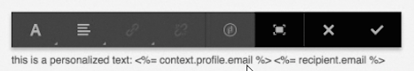

# Componenti di Adobe Campaign{#adobe-campaign-components}

Al momento dell’integrazione con Adobe Campaign, hai a disposizione componenti per newsletter e moduli. In questo documento sono descritti entrambi.

## Componenti per newsletter di Adobe Campaign {#adobe-campaign-newsletter-components}

Tutti i componenti di Campaign seguono le best practice descritte in [Best practice per i modelli di e-mail](/help/sites-administering/best-practices-for-email-templates.md) e sono basati sul linguaggio di markup Adobe [HTL](https://helpx.adobe.com/experience-manager/htl/using/overview.html).

Quando apri una newsletter/e-mail configurata per l’integrazione con Adobe Campaign, verifica che i seguenti componenti siano presenti nella sezione **Newsletter di Adobe Campaign**:

* Intestazione (Campaign)
* Immagine (Campaign)
* Collegamento (Campaign)
* Modello immagini Scene7 (Campaign)
* Riferimento di destinazione (Campaign)
* Testo e immagine (Campaign)
* Testo e personalizzazione (Campaign)

La sezione seguente descrive questi componenti.

I componenti vengono visualizzati come segue:

### Intestazione (Campaign) {#heading-campaign}

Per il componente di intestazione è possibile:

* Mostrare il nome della pagina corrente lasciando vuoto il campo **Titolo**.
* Mostrare un testo specificato nel campo **Titolo**.

Modifica direttamente il componente **Intestazione (Campaign)**. Lascia vuoto per usare il titolo della pagina.

Puoi configurare le seguenti operazioni:

* **Titolo** Per utilizzare un nome diverso dal titolo della pagina, inseriscilo in questo campo.

* **Livello di intestazione (1, 2, 3, 4)** Il livello di intestazione basato sulle dimensioni da 1 a 4 in HTML.

Il seguente esempio mostra come viene visualizzato il componente Intestazione (Campaign).

### Immagine (Campaign) {#image-campaign}

Il componente Immagine (Campaign) mostra un’immagine e il relativo testo in base ai parametri specificati.

Puoi caricare un’immagine, quindi modificarla e manipolarla (ad esempio ritagliandola, ruotandola o aggiungendo un collegamento, un titolo o un testo).

Potete trascinare un&#39;immagine dal [Browser risorse](/help/sites-authoring/author-environment-tools.md#assets-browser) direttamente sul componente o nella relativa [finestra di dialogo Configura](/help/sites-authoring/editing-content.md#edit-configure-copy-cut-delete-paste). È anche possibile caricare un&#39;immagine dalla finestra di dialogo Configura; questa finestra di dialogo controlla anche tutte le definizioni e le operazioni di alterazione delle immagini:

>[!NOTE]
>
>You must enter information in the **Alt Text** field, or the image cannot be saved.

After the image is uploaded (and not before) you can use [inplace editing](/help/sites-authoring/editing-content.md#edit-configure-copy-cut-delete-paste) to crop/rotate the image as required:

>[!NOTE]
>
>L’editor locale utilizza le dimensioni e le proporzioni originali dell’immagine durante la modifica. Potete inoltre specificare le proprietà relative a altezza e larghezza. Eventuali limitazioni di dimensioni e proporzioni definite nelle proprietà vengono applicate al salvataggio delle modifiche.
>
>In base all’istanza, le limitazioni minime e massime possono essere imposte anche a partire dalla [progettazione della pagina](/help/sites-developing/designer.md); queste vengono sviluppate durante l’implementazione del progetto.

Diverse opzioni aggiuntive sono disponibili nella modalità di modifica a schermo intero, ad esempio, mappa e zoom: 

Quando carichi un’immagine, puoi configurare le opzioni seguenti:

* **Mappa**

   Per mappare un’immagine, selezionate Mappa. Potete specificare come desiderate creare la mappa immagine (rettangolare, poligonale e così via) e la destinazione dell’area.

* **Ritaglia**

   Selezionate Ritaglia per ritagliare un’immagine. Ritagliate l’immagine utilizzando il mouse.

* **Ruota**

   Per ruotare un’immagine, selezionate Ruota. Usate più volte fino a ottenere la rotazione desiderata.

* **Cancella**

   Rimuove l’immagine corrente.

* Barra Zoom (solo interfaccia classica)

   Per ingrandire e ridurre l’immagine, utilizzate la barra di scorrimento al di sotto dell’immagine (sopra ai pulsanti OK e Annulla)

* **Titolo**

   Titolo dell’immagine.

* **Testo alt**

   Testo alternativo per la creazione di contenuto accessibile.

* **Collega a**

   Create un collegamento a risorse o altre pagine all’interno del sito Web.

* **Descrizione**

   Descrizione dell’immagine.

* **Dimensione**

   Imposta l’altezza e la larghezza dell’immagine.

>[!NOTE]
>
>Immetti le informazioni nel campo **Testo Alt** della scheda **Avanzate**. In caso contrario l’immagine non verrà salvata e verrà visualizzato il seguente messaggio di errore:
>
>`Validation failed. Verify the values of the marked fields.`

Il seguente esempio mostra come viene visualizzato il componente Immagine (Campaign).

### Collegamento (Campaign) {#link-campaign}

Il componente Collegamento (Campaign) consente di aggiungere un collegamento alla newsletter.

Puoi configurare le seguenti operazioni nelle schede **Visualizzazione**, **Informazioni URL** o **Avanzate**:

* **Didascalia collegamento**

   Didascalia del collegamento. Questo è il testo che gli utenti vedranno.

* **Descrizione collegamento**

   Aggiunge ulteriori informazioni su come utilizzare il collegamento.

* **LinkType**

   In the drop-down list, select between a **Custom URL** and an **Adaptive Document**. Questo campo è obbligatorio. Se selezioni URL personalizzato, puoi fornire l’URL del collegamento. Se selezioni Documento adattivo, puoi fornire il percorso del documento.

* **Parametro URL aggiuntivo**

   Aggiungete eventuali parametri URL aggiuntivi. Fai clic su Aggiungi elemento per aggiungere altri elementi.

>[!NOTE]
>
>You must enter information in the **Link Type** field in the **URL Info** tab, or the component cannot save and you see the following error message:
>
>`Validation failed. Verify the values of the marked fields.`

I seguenti esempi mostrano come viene visualizzato un componente Collegamento (Campaign).

### Modello immagini Scene7 (Campaign) {#scene-image-template-campaign}

[I modelli](https://help.adobe.com/en_US/scene7/using/WS60B68844-9054-4099-BF69-3DC998A04D3C.html) immagine di Scene7 sono file immagine con più livelli, con i quali è possibile parametrizzare contenuto e proprietà per la variabilità. Il componente **Modello immagini** consente di utilizzare i modelli di Scene7 all&#39;interno delle newsletter e modificare i valori dei parametri di modello. Inoltre, puoi utilizzare le variabili di metadati Adobe Campaign all&#39;interno dei parametri, in modo che ogni utente possa vedere l&#39;immagine in modo personalizzato.

Fai clic su **Modifica** per configurare il componente. Potete configurare le impostazioni descritte in questa sezione. This Scene7 Image template is described in detail in [Scene7 Image Template component](/help/assets/scene7.md#image-template).

Inoltre, il pannello dei parametri elenca tutti i parametri del modello che sono stati definiti per il modello in Scene7. Per ciascuno di questi parametri, puoi personalizzare il valore, inserire variabili o ripristinarli ai loro valori predefiniti.

### Riferimento di destinazione (Campaign) {#targeted-reference-campaign}

Il componente Riferimento di destinazione (Campaign) consente di creare un rimando a un paragrafo di destinazione.

In questo componente, accedi al paragrafo di destinazione per selezionarlo.

Fai clic sull’icona della cartella per accedere al paragrafo a cui fare riferimento. Una volta terminato, fai clic sul segno di spunta.

### Testo e immagine (Campaign) {#text-image-campaign}

Il componente Testo e immagine (Campaign) aggiunge un blocco di testo e un’immagine.

Quando fai clic per configurare il componente, seleziona il testo o l’immagine.

Selezionando **Testo** viene visualizzato un editor in linea:

Selezionando **Immagine** viene visualizzato un editor in linea per le immagini:

Consulta [componente Immagine (Campaign)](#image-campaign) per ulteriori informazioni sulle operazioni con le immagini. Consulta [componente Testo e personalizzazione (Campaign)](#text-personalization-campaign) per ulteriori informazioni sulle operazioni con il testo.

Come per i componenti di Testo e personalizzazione (Campaign) e Immagine (Campaign), puoi configurare:

* **Testo**

   Inserite il testo. Utilizzate la barra degli strumenti per modificare la formattazione, creare elenchi e aggiungere collegamenti.

* **Immagine**

   Trascinate un’immagine da Content Finder oppure fate clic per individuare l’immagine desiderata. Se necessario, ritagliate o ruotate l’immagine.

* **Proprietà** immagine (proprietà&#x200B;**immagine** avanzate)

   Potete specificare i seguenti parametri:

   * **Titolo**

      Titolo del blocco di testo, che verrà visualizzato al passaggio del mouse.

   * **Testo alt**

      Testo alternativo che verrà mostrato qualora l’immagine non sia disponibile.

   * **Collega a**

      Create un collegamento a risorse o altre pagine all’interno del sito Web.

   * **Descrizione**

      Descrizione dell’immagine.

   * **Dimensione**

      Imposta l’altezza e la larghezza dell’immagine.

>[!NOTE]
>
>Il campo **Testo Alt** nella scheda **Avanzate** è obbligatorio; se non viene fornito, il componente non verrò salvato e viene visualizzato il seguente messaggio di errore:
>
>`Validation failed. Verify the values of the marked fields.`

I seguenti esempi mostrano un componente Testo e immagine (Campaign) che viene visualizzato.

### Testo e personalizzazione (Campaign) {#text-personalization-campaign}

The Text &amp; Personalization (Campaign) component lets you enter a text block using a WYSIWYG editor, with functionality provided by the [Rich Text editor](/help/sites-authoring/rich-text-editor.md). Inoltre, consente di utilizzare i campi di contesto e i blocchi di personalizzazione da Adobe Campaign. Consulta [Inserimento di personalizzazioni](/help/sites-authoring/campaign.md#inserting-personalization).

Le varie icone consentono di formattare il testo con font, allineamento, collegamenti, elenchi e rientri. The functionality is basically the same in [both UIs](/help/sites-authoring/editing-content.md), although the look-and-feel is different:

Nell’editor interno è possibile aggiungere testo, modificare la giustificazione, aggiungere e rimuovere collegamenti, aggiungere campi contestuali o blocchi di personalizzazione ed entrare in modalità a schermo intero. Una volta finito di aggiungere testo/personalizzare, seleziona il segno di spunta per salvare le modifiche (oppure x per annullare). See [Inplace editing](/help/sites-authoring/editing-content.md#edit-configure-copy-cut-delete-paste) for more information.

>[!NOTE]
>
>* I campi disponibili dipendono dal modello di Adobe Campaign a cui la newsletter è collegata.
>* Dopo aver selezionato una persona da ContextHub, i campi di personalizzazione vengono automaticamente sostituiti dai dati del profilo selezionato.
>
>
Consulta [Inserimento di personalizzazioni](/help/sites-authoring/campaign.md#inserting-personalization).

>[!NOTE]
>
>Vengono presi in considerazione solo i campi definiti nello schema **nms:seedMember** o in una delle sue estensioni. Gli attributi di tabelle collegate a **nms:seedMember** non sono disponibili.

## Componenti per i moduli di Adobe Campaign {#adobe-campaign-form-components}

Utilizza i componenti di Adobe Campaign per creare un modulo che gli utenti dovranno compilare per iscriversi a una newsletter, annullare l’iscrizione a una newsletter o aggiornare il proprio profilo utente. Consulta [Creazione di moduli di Adobe Campaign](/help/sites-authoring/adobe-campaign-forms.md).

Ogni campo del componente può essere collegato a un campo del database di Adobe Campaign. I campi disponibili dipendono dal tipo di dati che contengono, come descritto nella sezione [Componenti e tipi di dati](#components-and-data-type). Se si estende lo schema dei destinatari in Adobe Campaign, i nuovi campi saranno disponibili nei componenti con tipi di dati corrispondenti.

When you open a form that is configured to integrate with Adobe Campaign, you see the following components in the **Adobe Campaign** section:

* Casella di selezione (Campaign)
* Campo data (Campaign) e Campo data/HTML 5 (Campaign)
* Chiave principale crittografata (Campaign)
* Visualizzazione errori (Campaign)
* Chiave riconciliazione nascosta (Campaign)
* Campo numerico (Campaign)
* Campo opzione (Campaign)
* Lista di controllo delle iscrizioni (Campaign)
* Campo testo (Campaign)

I componenti vengono visualizzati come segue:

Questa sezione descrive ogni componente.

### Componenti e tipi di dati {#components-and-data-type}

La tabella seguente descrive i componenti disponibili per visualizzare e modificare i dati di profilo Adobe Campaign. Ogni componente può essere mappato su un campo profilo Adobe Campaign, per visualizzarne il valore e aggiornare il campo quando il modulo viene inviato. I diversi componenti possono essere associati solo a campi di un tipo di dati appropriato.

<table> 
 <tbody> 
  <tr> 
   <td>
<strong>Componente</strong>
 </td> 
   <td>
<strong>Tipo di dati del campo Adobe Campaign</strong>
 </td> 
   <td>
<strong>Esempio di campo</strong>
 </td> 
  </tr> 
  <tr> 
   <td>
Casella di selezione (Campaign)
 </td> 
   <td>
booleano
 </td> 
   <td>
Nessun contatto (da un canale)
 </td> 
  </tr> 
  <tr> 
   <td>
Campo data (Campaign)
 
Campo data/HTML 5 (Campaign)
 </td> 
   <td>
data
 </td> 
   <td>
Data di nascita
 </td> 
  </tr> 
  <tr> 
   <td>
Campo numerico (Campaign)
 </td> 
   <td>
numeric (byte, short, long, double)
 </td> 
   <td>
Età
 </td> 
  </tr> 
  <tr> 
   <td>
Campo opzione (Campaign)
 </td> 
   <td>
byte con valori associati
 </td> 
   <td>
Genere
 </td> 
  </tr> 
  <tr> 
   <td>
Campo testo (Campaign)
 </td> 
   <td>
string
 </td> 
   <td>
E-mail
 </td> 
  </tr> 
 </tbody> 
</table>

### Impostazioni comuni alla maggior parte dei componenti {#settings-common-to-most-components}

I componenti di Adobe Campaign hanno impostazioni comuni a tutti i componenti (eccetto i componenti Chiave principale crittografata e Chiave di riconciliazione nascosta).

Nella maggior parte dei componenti, è possibile configurare le seguenti operazioni:

#### Titolo e testo {#title-and-text}

* **Titolo**

   Se desiderate utilizzare un nome diverso dal nome dell&#39;elemento, immettetelo qui.

* **Nascondi titolo**

   Selezionare questa casella di controllo se non si desidera che il titolo sia visibile.

* **Descrizione**

   Aggiungete una descrizione al campo per fornire ulteriori informazioni agli utenti.

* **Mostra solo valore**

   Mostra solo il valore, se esiste un

#### Adobe Campaign {#adobe-campaign}

Puoi configurare le seguenti operazioni:

* **Mappatura**

   Se appropriato, seleziona un campo di personalizzazione di Adobe Campaign.

* **Chiave riconciliazione**

   Selezionare questa casella di controllo se il campo fa parte della chiave di riconciliazione.

#### Vincoli {#constraints}

* **Obbligatorio**

   Selezionate questa casella di controllo per rendere obbligatorio questo componente; in altre parole, gli utenti devono immettere un valore.

* **Messaggio richiesto**

   Facoltativamente, aggiungere un messaggio che indica che il campo è obbligatorio.

#### Attribuzione stile {#styling}

* **CSS** Immetti le classi CSS da usare per questo componente.

### Casella di selezione (Campaign) {#checkbox-campaign}

Il componente Casella di selezione (Campaign) consente all’utente di modificare i campi del profilo Adobe Campaign che corrispondono al tipo di dati booleano. Ad esempio, potresti disporre di un componente Casella di selezione (Campaign) che consente al destinatario di specificare che non desidera essere contattato tramite alcun canale.

Puoi [configurare le impostazioni comuni alla maggior parte dei componenti di Adobe Campaign](#settings-common-to-most-components) nel componente Casella di selezione (Campaign).

I seguenti esempi mostrano come viene visualizzato il componente Casella di selezione (Campaign).

### Campo data (Campaign) e Campo data/HTML 5 (Campaign) {#date-field-campaign-and-date-field-html-campaign}

Consenti ai destinatari di aggiungere una data tramite il campo data; ad esempio, ai destinatari potrebbe essere richiesto di specificare la data di nascita. Il formato della data corrisponde al formato utilizzato nell’istanza di Adobe Campaign.

Oltre alle [impostazioni comuni alla maggior parte dei componenti di Adobe Campaign](#settings-common-to-most-components), puoi configurare le seguenti opzioni:

* **Vincoli - Elenco a discesa Vincolo**

   You can select - **None** or **Date**- to add the constraint of a date or no constraint. Se si seleziona la data, la risposta che gli utenti immettono nel campo deve essere in un formato di data.

* **Messaggio vincolo**

   Inoltre, potete aggiungere un messaggio di vincolo in modo che gli utenti siano in grado di formattare correttamente le risposte.
* **Attribuzione stile - Larghezza** Consente di regolare la larghezza del campo toccando o facendo clic sulle icone **+** e **+** oppure immettendo un numero.

L’esempio seguente mostra come viene visualizzato il componente Campo data (Campaign) con la larghezza regolata.

### Chiave principale crittografata (Campaign) {#encrypted-primary-key-campaign}

Questo componente definisce il dominio del parametro URL che conterrà l’identificatore di un profilo Adobe Campaign: **Main Resource ID** (Identificatore della risorsa principale) o **Encrypted primary key** (Chiave principale crittografata), rispettivamente in Adobe Campaign Standard e 6.1.

Ogni modulo che visualizza e modifica i dati di profilo Adobe Campaign **deve** includere un componente Chiave principale crittografata.

Puoi configurare le seguenti opzioni nel componente Chiave principale crittografata (Campaign):

* **Titolo e testo - Nome elemento**

   Il valore predefinito è encryptPK. È sufficiente modificare il nome dell’elemento quando è in conflitto con il nome di un altro elemento del modulo. Due campi del modulo non possono avere lo stesso nome elemento.
* **Adobe Campaign: parametro URL** Aggiungi il parametro URL per EPK. Ad esempio, puoi utilizzare il valore **epk**.

I seguenti esempi mostrano come viene visualizzato il componente Chiave principale crittografata (Campaign).

### Visualizzazione errori (Campaign) {#error-display-campaign}

Questo componente consente di visualizzare gli errori di backend. Per far funzionare correttamente il componente, la gestione degli errori del modulo deve essere impostata su Inoltra.

I seguenti esempi mostrano come viene visualizzato il componente Visualizzazione errori (Campaign).

### Chiave riconciliazione nascosta (Campaign) {#hidden-reconciliation-key-campaign}

Il componente Chiave di riconciliazione nascosta (Campaign) consente di aggiungere campi nascosti come parte della chiave di riconciliazione a un modulo.

Puoi configurare le seguenti opzioni nel componente Chiave riconciliazione nascosta (Campaign):

* **Titolo e testo - Nome elemento**

   L&#39;impostazione predefinita è riconciliilKey. È sufficiente modificare il nome dell’elemento quando è in conflitto con il nome di un altro elemento del modulo. Due campi del modulo non possono avere lo stesso nome elemento.
* **Adobe Campaign: Mappatura** Mappa su un campo per la personalizzazione di Adobe Campaign.

Il seguente esempio mostra come viene visualizzato il componente Chiave riconciliazione nascosta (Campaign).

### Campo numerico (Campaign) {#numeric-field-campaign}

Usa il campo numerico per consentire ai destinatari di immettere numeri, ad esempio la loro età.

Oltre alle [impostazioni comuni alla maggior parte dei componenti di Adobe Campaign](#settings-common-to-most-components), puoi configurare le seguenti opzioni:

* **Vincoli - Elenco a discesa Vincolo**

   You can select - **None** or **Numeric** - to add the constraint of either a number or no constraint. Se si seleziona un numero, la risposta che gli utenti immettono nel campo deve essere numerica.

* **Messaggio vincolo**

   Inoltre, potete aggiungere un messaggio di vincolo in modo che gli utenti siano in grado di formattare correttamente le risposte.
* **Attribuzione stile - Larghezza** Consente di regolare la larghezza del campo toccando o facendo clic sulle icone **+** e **+** oppure immettendo un numero.

L’esempio seguente mostra come viene visualizzato il componente Campo numerico (Campaign) con la larghezza configurata.

### Campo opzione (Campaign) {#option-field-campaign}

Questo elenco a discesa consente di selezionare un’opzione; ad esempio, il sesso o lo stato di un destinatario.

Puoi [configurare le impostazioni comuni alla maggior parte dei componenti di Adobe Campaign](#settings-common-to-most-components) nel componente Campo opzione (Campaign). Per compilare l’elenco a discesa, seleziona il campo appropriato nei campi di personalizzazione di Adobe Campaign toccando o facendo clic sul simbolo di Adobe Campaign e passando al campo.

I seguenti esempi mostrano come viene visualizzato il componente Campo opzione (Campaign).

### Lista di controllo delle iscrizioni (Campaign) {#subscriptions-checklist-campaign}

Usa il componente **Lista di controllo delle iscrizioni (Campaign)** per modificare le iscrizioni associate a un profilo Adobe Campaign.

Una volta aggiunto a un modulo, questo componente mostra tutte le iscrizioni disponibili come caselle di controllo e consente all’utente di selezionare quelle desiderate. When users submit the form, this component subscribes the user to or unsubscribes the user from the selected services depending on the form action type (**Adobe Campaign: Subscribe to Services** or **Adobe Campaign: Unsubscribe from Services**).

>[!NOTE]
>
>Il componente non controlla a quali servizi l’utente è già iscritto o meno.

Puoi [configurare le impostazioni comuni alla maggior parte dei componenti di Adobe Campaign](#settings-common-to-most-components) nel componente Lista di controllo delle iscrizioni (Campaign). Non sono disponibili configurazioni di Adobe Campaign per questo componente.

I seguenti esempi mostrano come viene visualizzato un componente Lista di controllo delle iscrizioni (Campaign).

### Campo testo (Campaign) {#text-field-campaign}

Il componente Campo testo (Campaign) che consente di immettere dati di tipo stringa, quali nome, cognome, indirizzo, indirizzo e-mail e così via.

Oltre alle [impostazioni comuni alla maggior parte dei componenti di Adobe Campaign](#settings-common-to-most-components), puoi configurare le seguenti opzioni:

* **Vincoli - Elenco a discesa Vincolo**

   You can select - **None, Email,** or **Name (no umlauts)**- to add the constraint of either an email address, name, or no constraint. Se selezioni E-mail, le risposte inserite dagli utenti nel campo devono essere un indirizzo e-mail. Se selezionate un nome, deve essere un nome (gli umlauts non sono consentiti).

* **Messaggio vincolo**

   Inoltre, potete aggiungere un messaggio di vincolo in modo che gli utenti siano in grado di formattare correttamente le risposte.

* **Attribuzione stile - Larghezza**

   Adjust the width of the field by clicking or tapping the **+** and **-** icons or entering a number.

I seguenti esempi mostrano viene visualizzato un componente Campo testo (Campaign).

