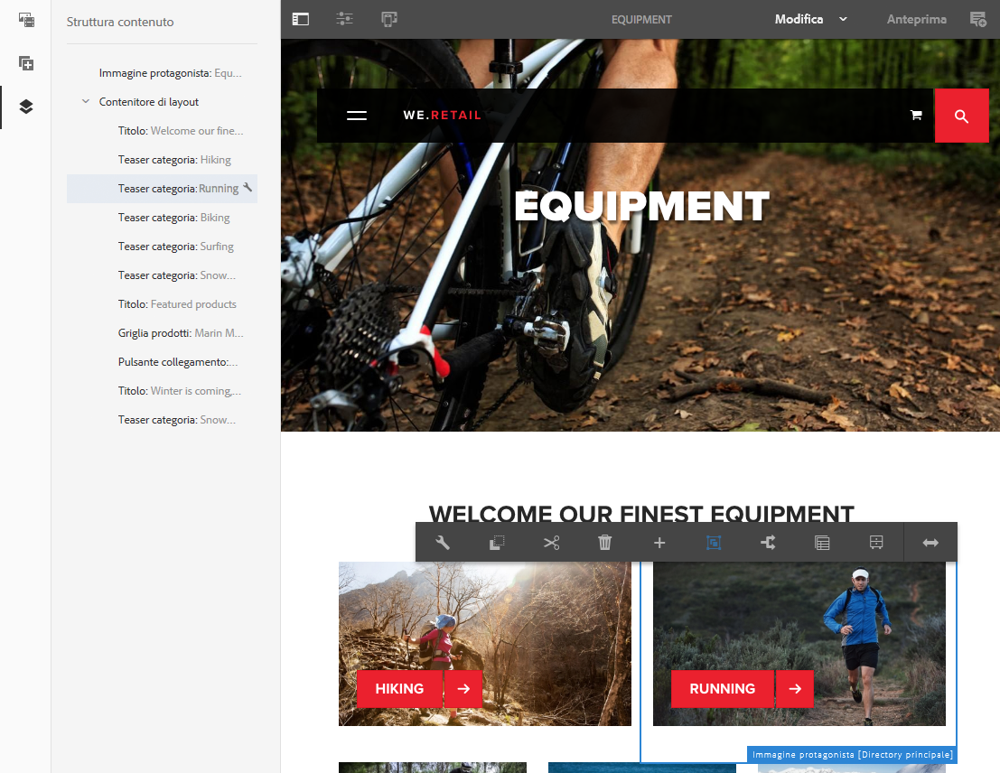

# Ambiente e strumenti di authoring{#authoring-the-environment-and-tools}

>[!CAUTION]
>
>AEM 6.4 ha raggiunto la fine del supporto esteso e questa documentazione non viene più aggiornata. Per maggiori dettagli, consulta la nostra [periodi di assistenza tecnica](https://helpx.adobe.com/it/support/programs/eol-matrix.html). Trova le versioni supportate [qui](https://experienceleague.adobe.com/docs/).

L’ambiente di authoring di AEM offre diversi metodi per organizzare e modificare i contenuti. Gli strumenti disponibili sono accessibili da varie console ed editor di pagina.

## Gestione del sito {#managing-your-site}

La **Sites** La console consente di navigare nel sito web e di gestirlo utilizzando la barra dell’intestazione, la barra degli strumenti, le icone delle azioni (per la risorsa selezionata), le breadcrumb e, se selezionate, le barre laterali secondarie (ad esempio Timeline e Riferimenti).

Ad esempio, nella vista a schede:

## Modifica del contenuto di una pagina {#editing-page-content}

È possibile modificare una pagina con l’editor di pagine. Esempio:

`http://localhost:4502/editor.html/content/we-retail/us/en/equipment.html`

>[!NOTE]
>
>La prima volta che apri una pagina per la modifica, una serie di diapositive illustra le funzioni disponibili.
>
>Puoi saltare il tour se lo desideri e ripeterlo in qualsiasi momento selezionando dalla **Informazioni pagina** menu.

## Accedere all’Aiuto   {#accessing-help}

Durante la modifica di una pagina, l’**Aiuto** è accessibile dalle seguenti aree:

* la [**Informazioni pagina**](/help/sites-authoring/editing-page-properties.md#page-properties) selettore; vengono mostrate le diapositive introduttive (come mostrato al primo accesso all’editor).
* la [configurazione](/help/sites-authoring/editing-content.md#edit-configure-copy-cut-delete-paste) finestra di dialogo per componenti specifici (utilizzando l’icona ? nella barra degli strumenti della finestra di dialogo); questo mostrerà la guida sensibile al contesto.

Ulteriori informazioni [le risorse relative all’Aiuto sono disponibili dalle console](/help/sites-authoring/basic-handling.md#accessing-help).

## Browser Componenti   {#components-browser}

Il browser Componenti mostra tutti i componenti disponibili per la pagina corrente. Puoi trascinarli nella posizione appropriata e quindi modificarli per aggiungere il contenuto.

Il browser Componenti è una scheda che si trova nel pannello laterale, insieme al [browser Risorse](/help/sites-authoring/author-environment-tools.md#assets-browser) e alla [struttura dei contenuti](/help/sites-authoring/author-environment-tools.md#content-tree). Per aprire (o chiudere) il pannello laterale utilizza l’icona in alto a sinistra della barra degli strumenti:

All’apertura, il pannello laterale scivolerà in posizione da sinistra (seleziona la **Componenti** (se necessario). Quando è aperta, puoi sfogliare tutti i componenti disponibili per la pagina.

L’aspetto e la gestione effettivi dipendono dal tipo di dispositivo in uso:

>[!NOTE]
>
>Un dispositivo viene rilevato come mobile se la larghezza è inferiore a 1024 px. Questo può accadere anche per una piccola finestra desktop.

* **Dispositivo mobile (ad esempio iPad)**

   Il browser Componenti copre completamente la pagina in corso di modifica.

   Per aggiungere un componente alla pagina, toccate e tenete premuto il componente richiesto e spostatelo verso destra: il browser Componenti si chiude e torna a essere visibile la pagina, dove potete posizionare il componente.

   

* **Dispositivo desktop**

   Il browser Componenti viene aperto sul lato sinistro della finestra.

   Per aggiungere un componente alla pagina, fai clic sul componente richiesto e trascinalo nella posizione desiderata.

   

   I componenti sono rappresentati da

   * Nome componente
   * Gruppo di componenti (in grigio)
   * Icona o abbreviazione

      * Le icone dei componenti standard sono monocromatiche.
      * Le abbreviazioni sono sempre i primi due caratteri del nome del componente.

   Dalla barra degli strumenti nella parte superiore del browser Componenti, puoi effettuare le seguenti operazioni:

   * Filtrare i componenti per nome
   * Limitare la visualizzazione a uno specifico gruppo selezionandolo dall’elenco a discesa

   Per una descrizione più dettagliata del componente, tocca o fai clic sull’icona delle informazioni posta accanto al componente nel browser Componenti (se disponibile).

   

   Per ulteriori informazioni sui componenti disponibili, consulta la sezione sulla [console Componenti](/help/sites-authoring/default-components-console.md).

## Browser Risorse {#assets-browser}

Il browser Risorse mostra tutte le risorse disponibili per la pagina corrente.

Il browser Risorse è una scheda che si trova nel pannello laterale insieme al [browser componenti](/help/sites-authoring/author-environment-tools.md#components-browser)r e [struttura contenuto](/help/sites-authoring/author-environment-tools.md#content-tree). Per aprire o chiudere il pannello laterale utilizza l’icona in alto a sinistra della barra degli strumenti:

All’apertura, il pannello laterale scivolerà in posizione da sinistra. Se necessario seleziona la scheda **Risorse**.

Quando il browser Risorse è aperto, puoi sfogliare tutte le risorse disponibili per la pagina. Lo scorrimento infinito viene utilizzato per espandere l’elenco quando necessario.

Per aggiungere una risorsa alla pagina, selezionala e trascinala nella posizione desiderata. Può essere:

* Un componente esistente del tipo appropriato.

   * Ad esempio, puoi trascinare una risorsa di tipo immagine su un componente Immagine.

* Un [segnaposto](/help/sites-authoring/editing-content.md#component-placeholder) nel sistema paragrafo per creare un nuovo componente di tipo appropriato.

   * Ad esempio, puoi trascinare una risorsa di tipo immagine sul sistema di paragrafi per creare un componente Immagine.

>[!NOTE]
>
>Questa funzione è disponibile per risorse e tipi di componenti specifici. Vedi [Inserimento di un componente utilizzando il browser Risorse](/help/sites-authoring/editing-content.md#inserting-a-component-using-the-assets-browser) per ulteriori dettagli.

Dalla barra degli strumenti nella parte superiore del browser Risorse, puoi filtrare le risorse in base a:

* Nome
* Percorso
* Tipo di risorsa, ad esempio immagini, manoscritti, documenti, video, pagine, paragrafi e prodotti
* Caratteristiche della risorsa, ad esempio Orientamento (Verticale, Orizzontale, Quadrato) e Stile (Colore, Monocromatico, Scala di grigio)

   * Disponibile solo per determinati tipi di risorse

L’aspetto e la gestione effettivi dipendono dal tipo di dispositivo in uso:

>[!NOTE]
>
>Un dispositivo viene rilevato come mobile se la larghezza è inferiore a 1024 px (quindi anche una piccola finestra desktop).

* **Dispositivo mobile, ad esempio iPad**

   Il browser Risorse copre completamente la pagina in corso di modifica.

   Per aggiungere una risorsa alla pagina, toccate e tenete premuto sulla risorsa richiesta, quindi spostatela verso destra: il browser Risorse si chiude e torna a essere visibile la pagina, dove potete aggiungere la risorsa al componente richiesto.

   

* **Dispositivo desktop**

   Il browser Risorse si apre nella parte sinistra della finestra.

   Per aggiungere una risorsa alla pagina, fai clic sulla risorsa richiesta e trascinala sul componente o sulla posizione richiesta.

   

Se devi apportare rapidamente una modifica a una risorsa, puoi avviare [l’editor risorse](/help/assets/managing-assets-touch-ui.md) direttamente dal browser Risorse facendo clic sull&#39;icona Modifica accanto al nome della risorsa.

## Struttura contenuto {#content-tree}

La **Struttura contenuto** offre una panoramica di tutti i componenti della pagina sotto forma di gerarchia, per vedere subito come è composta la pagina.

Struttura contenuto è una scheda che si trova nel pannello laterale, insieme ai browser Componenti e Risorse. Per aprire (o chiudere) il pannello laterale utilizza l’icona in alto a sinistra della barra degli strumenti:

Quando apri il pannello laterale, questo si apre scorrendo dal lato sinistro. Se necessario, seleziona la scheda **Struttura contenuto**. Una volta aperta è possibile visualizzare una struttura ad albero della pagina o del modello, che permette di capire come il contenuto è strutturato gerarchicamente. Inoltre, in una pagina complessa rende più facile passare da un componente all’altro della pagina.

Poiché una pagina può essere composta da numerosi componenti dello stesso tipo, la struttura dei componenti presenta un testo descrittivo (in grigio) dopo il nome del tipo di componente (in nero). Il testo descrittivo proviene dalle proprietà comuni del componente, ad esempio titolo o testo.

I tipi di componente vengono visualizzati nella lingua dell’utente, mentre il testo della descrizione del componente viene dalla lingua della pagina.

Facendo clic sulla freccia accanto a un componente, questo livello viene compresso o espanso.

Facendo clic sul componente viene evidenziato il componente nell’editor di pagine.

Se il componente su cui fai clic nella struttura ad albero è modificabile, a destra del nome compare un’icona a forma di chiave inglese. Fai clic su questa icona per avviare direttamente la finestra di dialogo di modifica del componente.

>[!NOTE]
>
>La struttura del contenuto non è disponibile quando si modifica una pagina su un dispositivo mobile (se la larghezza del browser è inferiore a 1024 px).

## Frammenti - Browser Contenuto associato {#fragments-associated-content-browser}

Se la pagina contiene frammenti di contenuto, avrai accesso anche al [browser Contenuto associato](/help/sites-authoring/content-fragments.md#using-associated-content).

## Riferimenti {#references}

**Riferimenti** mostra i collegamenti alla pagina selezionata:

* Blueprint
* Lanci
* Live Copy
* Copie per lingua
* Uso del componente di riferimento
* Riferimenti alle pagine dei prodotti (dalla console Commerce - Prodotti )

Apri la console richiesta, quindi accedi alla risorsa desiderata e apri i **Riferimenti** utilizzando:

[Seleziona la risorsa richiesta](/help/sites-authoring/basic-handling.md#viewing-and-selecting-resources) per visualizzare un elenco dei tipi di riferimenti relativi a tale risorsa:

Seleziona il tipo di riferimento adeguato per ulteriori informazioni. In determinate situazioni sono disponibili azioni ulteriori quando viene selezionato un riferimento specifico, inclusi:

* Istanze del componente Riferimento (ad esempio navigazione alla pagina di riferimento o a cui si fa riferimento)
* [Riferimenti alle pagine di prodotto](/help/sites-administering/generic.md#showing-product-references) (disponibile dalla console Commerce - Prodotti)
* [Lanci](/help/sites-authoring/launches.md)
* [Live Copy](/help/sites-administering/msm.md) visualizza i percorsi di tutte le Live Copy basate sulla risorsa selezionata.
* [Blueprint](/help/sites-administering/msm-best-practices.md)
* [Copie per lingua](/help/sites-administering/tc-manage.md#creating-translation-projects-using-the-references-panel)

Ad esempio, puoi correggere un riferimento interrotto all’interno di un componente Riferimento :

## Eventi - Timeline {#events-timeline}

Per le risorse appropriate (ad esempio, pagine dalla console **Sites** o risorse dalla console **Risorse**) è possibile [utilizzare la timeline per visualizzare le attività recenti relative agli elementi selezionati](/help/sites-authoring/basic-handling.md#timeline).

Apri la console richiesta, quindi accedi alla risorsa desiderata e apri la **Timeline** utilizzando:

[Scegli la risorsa desiderata](/help/sites-authoring/basic-handling.md#viewing-and-selecting-resources), quindi seleziona **Mostra tutto** o **Attività** per ottenere un elenco delle azioni recenti relative alle risorse selezionate:

## Informazioni sulle pagine {#page-information}

Informazioni pagina (icona equalizzatore) mostra un menu che fornisce anche dettagli sull’ultima operazione di modifica e di pubblicazione. A seconda delle caratteristiche della pagina (e del relativo sito) potrebbero essere disponibili più o meno opzioni:

* [Apri proprietà](/help/sites-authoring/editing-page-properties.md)
* [Rollout pagina](/help/sites-administering/msm.md#msm-from-the-ui)
* [Avvia flusso di lavoro](/help/sites-authoring/workflows-applying.md#starting-a-workflow-from-the-page-editor)
* [Blocca pagina](/help/sites-authoring/editing-content.md#locking-a-page)
* [Pubblica pagina](/help/sites-authoring/publishing-pages.md#publishing-pages)
* [Annulla pubblicazione pagina](/help/sites-authoring/publishing-pages.md#unpublishing-pages)
* [Visualizza come pubblicato](/help/sites-authoring/editing-content.md#view-as-published)
* [Visualizza in Amministrazione](/help/sites-authoring/basic-handling.md#viewing-and-selecting-resources)
* [Aiuto](/help/sites-authoring/basic-handling.md#accessing-help)

Ad esempio, se del caso, **Informazioni pagina** dispone anche delle seguenti opzioni:

* [Promuovi lancio](/help/sites-authoring/launches-promoting.md) se la pagina è un lancio.
* [Modifica modello](/help/sites-authoring/templates.md) se la pagina è basata su un [modello modificabile](/help/sites-authoring/templates.md#editable-and-static-templates)

* [Apri nell’interfaccia classica](/help/sites-authoring/select-ui.md#switching-to-classic-ui-when-editing-a-page) se questa opzione è stata [abilitato da un amministratore](/help/sites-administering/enable-classic-ui-editor.md)

Inoltre, **Informazioni pagina** può fornire l&#39;accesso ad analisi e consigli, se appropriato.

## Modalità pagina   {#page-modes}

Quando si modifica una pagina sono disponibili diverse modalità che consentono di eseguire diverse azioni:

* [Modifica](/help/sites-authoring/editing-content.md) - la modalità da utilizzare per modificare il contenuto della pagina.
* [Layout](/help/sites-authoring/responsive-layout.md): consente di creare e modificare il layout dinamico a seconda del dispositivo (se la pagina si basa su un contenitore di layout).

* [Scaffolding](/help/sites-authoring/scaffolding.md) : consente di creare un insieme di pagine di grandi dimensioni con la stessa struttura e contenuti diversi.
* [Sviluppatore](/help/sites-developing/developer-mode.md) - consente di eseguire varie azioni (sono richiesti privilegi ). Ad esempio, è possibile esaminare i dettagli tecnici di una pagina e dei suoi componenti.

* [Progettazione](/help/sites-authoring/default-components-designmode.md) - consente di abilitare/disabilitare i componenti da utilizzare in una pagina e di configurare la progettazione del componente (se la pagina è basata su un [modello statico](/help/sites-authoring/templates.md#editable-and-static-templates)).

* [Targeting](/help/sites-authoring/content-targeting-touch.md) - aumentare la pertinenza dei contenuti mediante il targeting e la misurazione su tutti i canali.
* [Activity Map](/help/sites-authoring/pa-using.md) - mostra i dati di Analytics per la pagina.

* [Timewarp](/help/sites-authoring/working-with-page-versions.md#timewarp) - consente di visualizzare lo stato delle pagine in un particolare momento.
* [Stato Live Copy](/help/sites-authoring/editing-content.md#live-copy-status) - consente di visualizzare una panoramica rapida dello stato della Live Copy e dei componenti ereditati o non ereditati.
* [Anteprima](/help/sites-authoring/editing-content.md#previewing-pages): utilizzato per visualizzare l’aspetto che la pagina avrà nell’ambiente di pubblicazione o per spostarsi utilizzando i collegamenti presenti nel contenuto.

* [Annota](/help/sites-authoring/annotations.md): utilizzato per aggiungere o visualizzare annotazioni nella pagina.

Puoi accedere a questi elementi mediante l’icona nell’angolo in alto a destra, il cui aspetto dipende dalla modalità attualmente in uso:

>[!NOTE]
>
>* A seconda delle caratteristiche della pagina, alcune modalità potrebbero non essere disponibili.
>* L&#39;accesso ad alcune modalità richiede autorizzazioni/privilegi appropriati.
>* La modalità Sviluppatore non è disponibile sui dispositivi mobili a causa di limitazioni di spazio.
>* La [scelta rapida da tastiera](/help/sites-authoring/page-authoring-keyboard-shortcuts.md) `Ctrl-Shift-M` consente di passare da **Anteprima** alla modalità attualmente selezionata (ad esempio **Modifica**, **Layout** e così via) e viceversa.
>

## Selezione del percorso {#path-selection}

Spesso per l’authoring è necessario selezionare un’altra risorsa, ad esempio quando si definisce un collegamento a un’altra pagina o risorsa o si seleziona un’immagine. Per selezionare facilmente un percorso, [campi percorso](/help/sites-authoring/author-environment-tools.md#path-fields) l&#39;offerta è stata completata automaticamente e [browser del percorso](/help/sites-authoring/author-environment-tools.md#path-browser) consente una selezione più affidabile.

### Campi percorso   {#path-fields}

L’esempio utilizzato qui mostra il Componente immagine. Per ulteriori informazioni sull’utilizzo e la modifica dei componenti consulta [Componenti per l’authoring delle pagine](/help/sites-authoring/default-components.md).

I campi percorso dispongono della funzione di completamento automatico e di look-ahead per rendere più semplice l’individuazione di una risorsa. È sufficiente iniziare a digitare nel campo percorso e il AEM fornirà i percorsi corrispondenti durante la digitazione.

Fai clic sul pulsante **Apri finestra di dialogo per selezione** nel campo percorso per aprire la finestra di dialogo del [browser Percorsi](/help/sites-authoring/author-environment-tools.md#path-browser) e utilizzare opzioni di selezione più dettagliate.

### Browser Percorsi {#path-browser}

Il browser Percorsi è organizzato come la [vista a colonne](/help/sites-authoring/basic-handling.md#column-view) della console Sites e permette di selezionare le risorse in modo più dettagliato.

Una volta selezionata una risorsa, la funzione **Seleziona** in alto a destra nella finestra di dialogo diventa attivo. Tocca o fai clic su per confermare la selezione o **Annulla** per interrompere.

Se il contesto consente la selezione di più risorse, la scelta di una risorsa attiva anche il pulsante Seleziona, ma aggiunge anche un conteggio del numero di risorse selezionate nella parte superiore destra della finestra. Per deselezionare tutti gli elementi, fai clic sulla X accanto al numero.

Le breadcrumb possono essere utilizzate per passare rapidamente alla gerarchia delle risorse.

In qualsiasi momento puoi utilizzare il campo di ricerca nella parte superiore della finestra di dialogo.

Fai clic sulla X nel campo di ricerca per cancellare la ricerca.

Per limitare l’ambito della ricerca, puoi visualizzare le opzioni filtro e filtrare il risultato in base a un determinato percorso.

## Scelte rapide da tastiera {#keyboard-shortcuts}

Sono disponibili alcune [scelte rapide da tastiera](/help/sites-authoring/page-authoring-keyboard-shortcuts.md).
