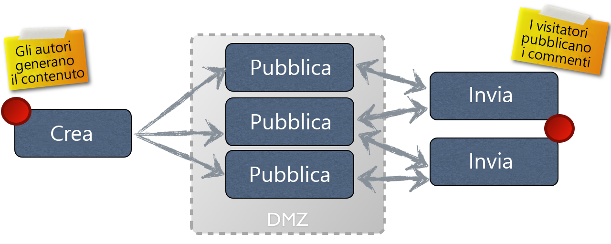

# Concetto di authoring e pubblicazione{#authoring}

>[!CAUTION]
>
>AEM 6.4 ha raggiunto la fine del supporto esteso e questa documentazione non viene più aggiornata. Per maggiori dettagli, consulta la nostra [periodi di assistenza tecnica](https://helpx.adobe.com/it/support/programs/eol-matrix.html). Trova le versioni supportate [qui](https://experienceleague.adobe.com/docs/).

AEM offre due ambienti:

* Autore
* Pubblicazione

Questi interagiscono tra di loro e consentono di rendere i contenuti disponibili sul sito web, in modo che i visitatori possano leggerli.

L’ambiente di authoring fornisce i meccanismi per creare, aggiornare e rivedere i contenuti prima di pubblicarli effettivamente:

* Un autore crea e rivede i contenuti (che possono essere di diversi tipi; ad esempio pagine, risorse, pubblicazioni, ecc.)
* che, a un certo punto, sarà pubblicato sul tuo sito web.

Nell’ambiente di authoring le funzionalità di AEM sono accessibili tramite due interfacce utente. Nell’ambiente di pubblicazione vengono invece progettati l’aspetto e il comportamento dell’interfaccia presentata agli utenti.

## Ambiente di authoring {#author-environment}

L’autore utilizza il cosiddetto **[ambiente di authoring](/help/sites-authoring/home.md)**, che fornisce un’interfaccia, grafica o normale, di facile utilizzo per la creazione dei contenuti. In genere si trova dietro un firewall aziendale per la protezione dei dati e l’autore deve effettuare l’accesso utilizzando un account a cui sono stati assegnati i diritti di accesso appropriati.

>[!NOTE]
>
>Per creare, modificare o pubblicare contenuti, il tuo account deve disporre dei diritti di accesso appropriati.

A seconda della configurazione dell’istanza e dei diritti di accesso personali, puoi eseguire molte attività sul contenuto, tra cui (tra le altre):

* generare nuovi contenuti o modificare contenuti esistenti in una pagina
* utilizzare modelli predefiniti per creare nuove pagine di contenuto
* creare, modificare e gestire le risorse e le raccolte
* Creare, modificare e gestire le pubblicazioni
* sviluppare le campagne e le relative risorse
* Sviluppare e gestire siti di comunità
* Spostare, copiare ed eliminare contenuti, pagine, ecc.
* pubblicare (o annullare la pubblicazione) pagine, risorse e così via

Sono inoltre disponibili attività amministrative per la gestione dei contenuti:

* flussi di lavoro che controllano la modalità di gestione dei cambiamenti; ad esempio. applicazione di una revisione prima della pubblicazione
* progetti che coordinano singole attività

>[!NOTE]
>
>AEM [amministrato](/help/sites-administering/home.md) (per la maggior parte delle attività) dall’ambiente di authoring.

## Ambiente di pubblicazione {#publish-environment}

Quando è pronto, il contenuto del sito AEM viene pubblicato nella **ambiente di pubblicazione**. Qui le pagine del sito web vengono rese disponibili al pubblico di destinazione in base all’aspetto dell’interfaccia progettata.

Solitamente, l’ambiente di pubblicazione si trova all’interno della zona demilitarizzata; in altre parole, disponibile su Internet, ma non più sotto la piena protezione della rete interna.

Quando il sito AEM è un [sito della community](/help/communities/overview.md)o include [Componenti per community](/help/communities/author-communities.md), i visitatori del sito che hanno effettuato l’accesso (membri) possono interagire con le funzioni di Communities. Ad esempio, possono pubblicare su un forum, pubblicare un commento o seguire altri membri. Ai membri può essere concessa l&#39;autorizzazione a eseguire attività normalmente limitate all&#39;ambiente di authoring, ad esempio creare nuove pagine (gruppi community), articoli di blog e moderare i post di altri membri.

>[!NOTE]
>
>Purtroppo a volte si verifica una sovrapposizione nella terminologia utilizzata. Questo può accadere con:
>
>* **Pubblicare/Annullare la pubblicazione**
   >  Termini principali per le azioni che consentono di rendere o meno i contenuti disponibili al pubblico nell’ambiente di pubblicazione.
>
>* **Attivare/Disattivare**
   >  Sinonimi di pubblicare/annullare la pubblicazione. Sono più comuni nell’interfaccia classica.
>
>* **Replicare/Replica**
   >  Si tratta dei termini tecnici utilizzati per indicare lo spostamento di dati (ad esempio contenuto di pagina, file, codice, commenti degli utenti) da un ambiente all’altro; ad esempio per la pubblicazione o la replica inversa dei commenti degli utenti.
>

## Dispatcher {#dispatcher}

Per ottimizzare le prestazioni dal punto di vista dei visitatori del sito web, vengono usati **[dispatcher](https://helpx.adobe.com/experience-manager/dispatcher/user-guide.html) che implementano funzioni di bilanciamento del carico e memorizzazione in cache.**
