# Utilizzo di Adobe Campaign Classic e Adobe Campaign Standard{#working-with-adobe-campaign-classic-and-adobe-campaign-standard}

>[!CAUTION]
>
>AEM 6.4 ha raggiunto la fine del supporto esteso e questa documentazione non viene più aggiornata. Per maggiori dettagli, consulta la nostra [periodi di assistenza tecnica](https://helpx.adobe.com/it/support/programs/eol-matrix.html). Trova le versioni supportate [qui](https://experienceleague.adobe.com/docs/).

Puoi creare contenuti e-mail in AEM ed elaborarli nelle e-mail di Adobe Campaign. A questo scopo, devi:

1. Crea una nuova newsletter in AEM da un modello specifico per Adobe Campaign.
1. Seleziona [un servizio Adobe Campaign](#selecting-the-adobe-campaign-cloud-service-and-template) prima di modificare il contenuto per accedere a tutte le funzionalità.
1. Modifica il contenuto.
1. Convalida il contenuto.

Il contenuto può quindi essere sincronizzato con una consegna in Adobe Campaign. Le istruzioni dettagliate sono descritte in questo documento.

Vedi anche [Creazione di Adobe Campaign Forms in AEM](/help/sites-authoring/adobe-campaign-forms.md).

>[!NOTE]
>
>Prima di poter utilizzare questa funzionalità, devi configurare AEM per l’integrazione con [Adobe Campaign](/help/sites-administering/campaignonpremise.md) o [Adobe Campaign Standard](/help/sites-administering/campaignstandard.md).

## Invio di contenuti e-mail tramite Adobe Campaign {#sending-email-content-via-adobe-campaign}

Dopo aver configurato AEM e Adobe Campaign, puoi creare il contenuto della consegna e-mail direttamente in AEM e quindi elaborarlo in Adobe Campaign.

Quando crei contenuto Adobe Campaign in AEM, devi effettuare il collegamento a un servizio Adobe Campaign prima di modificare il contenuto per accedere a tutte le funzionalità.

Esistono due casi possibili:

* Il contenuto può essere sincronizzato con una consegna da Adobe Campaign. Questo consente di utilizzare AEM contenuto in una consegna.
* (Solo per Adobe Campaign Classic) Il contenuto può essere inviato direttamente ad Adobe Campaign, che genera automaticamente una nuova consegna e-mail. Questa modalità ha delle limitazioni.

Le istruzioni dettagliate sono descritte in questo documento.

### Creazione di nuovo contenuto e-mail {#creating-new-email-content}

>[!NOTE]
>
>Quando aggiungi modelli e-mail, assicurati di aggiungerli in **/content/campagne** per renderli disponibili.

#### Creazione di nuovo contenuto e-mail {#creating-new-email-content-1}

1. In AEM seleziona **Sites** then **Campagne**, quindi individua il punto in cui vengono gestite le campagne e-mail. Nell’esempio seguente, il percorso è **Sites** > **Campagne** > **Geometrixx Outdoors** > **Campagne e-mail**.

   >[!NOTE]
   >
   >[Gli esempi e-mail sono disponibili solo in Geometrixx](/help/sites-developing/we-retail.md). Scarica il contenuto di Geometrixx di esempio da Condivisione pacchetti.

   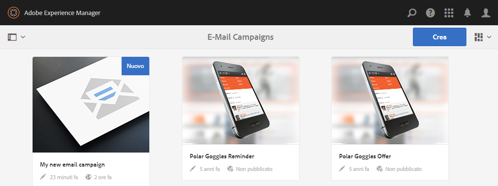

1. Seleziona **Crea** then **Crea pagina**.
1. Seleziona uno dei modelli disponibili specifico per Adobe Campaign a cui ti connetti, quindi fai clic su **Successivo**. Per impostazione predefinita sono disponibili tre modelli:

   * **E-mail Adobe Campaign Classic**: consente di aggiungere contenuto a un modello predefinito (due colonne) prima di inviarlo a Adobe Campaign Classic per la consegna.
   * **E-mail Adobe Campaign Standard**: consente di aggiungere contenuto a un modello predefinito (due colonne) prima di inviarlo ad Adobe Campaign Standard per la consegna.

1. Compila il **Titolo** e facoltativamente **Descrizione** e fai clic su **Crea**. Il titolo viene utilizzato come oggetto della newsletter/e-mail a meno che tu non lo sovrascriva durante la modifica dell’e-mail.

### Selezione del servizio cloud e del modello di Adobe Campaign {#selecting-the-adobe-campaign-cloud-service-and-template}

Per eseguire l’integrazione con Adobe Campaign, devi aggiungere alla pagina un servizio cloud Adobe Campaign. In questo modo puoi accedere alla personalizzazione e ad altre informazioni di Adobe Campaign.

Inoltre, potrebbe essere necessario selezionare il modello Adobe Campaign, modificare l’oggetto e aggiungere contenuto di testo normale per gli utenti che non visualizzano l’e-mail in HTML.

Puoi selezionare il servizio cloud da **Sites** o dall’interno dell’e-mail o newsletter dopo la creazione.

Selezione del servizio cloud dal **Sites** è l’approccio consigliato. La selezione del servizio cloud dall’e-mail o dalla newsletter richiede una soluzione alternativa.

Da **Sites** pagina:

1. In AEM seleziona la pagina e-mail e fai clic su **Visualizza proprietà**.

   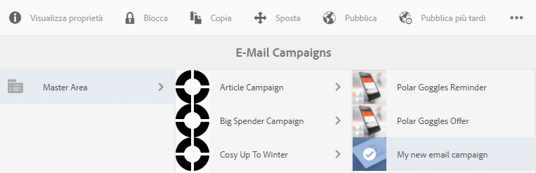

1. Seleziona **Modifica** e poi **Servizi cloud** , scorri verso il basso e fai clic sul segno + per aggiungere una configurazione, quindi seleziona **Adobe Campaign**.

   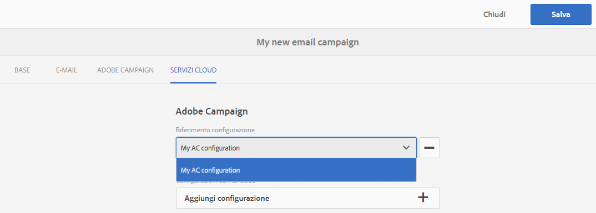

1. Seleziona dall’elenco a discesa la configurazione che corrisponde alla tua istanza di Adobe Campaign , quindi conferma facendo clic su **Salva**.
1. Puoi visualizzare il modello applicato all’e-mail facendo clic sulla scheda* Adobe Campaign**. Se desideri selezionare un altro modello, puoi accedervi dall’interno dell’e-mail durante la modifica.

   Se desideri applicare un modello di consegna e-mail specifico (da Adobe Campaign), diverso dal modello di posta predefinito, in **Proprietà**, seleziona **Adobe Campaign** scheda . Immetti il nome interno del modello di consegna e-mail nell’istanza Adobe Campaign correlata.

   Il modello selezionato determina quali campi di personalizzazione sono disponibili in Adobe Campaign.

   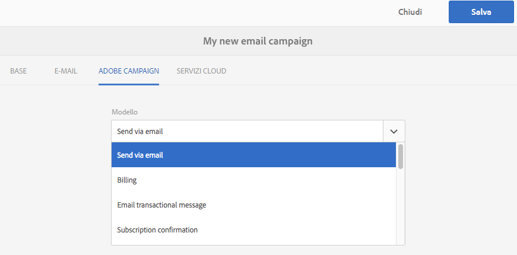

Dall’interno della newsletter/e-mail in authoring, potrebbe non essere possibile selezionare la configurazione del servizio cloud Adobe Campaign in **Proprietà pagina** a causa di un problema di layout. Puoi utilizzare la soluzione alternativa descritta qui:

1. In AEM seleziona la pagina e-mail e fai clic su **Modifica**. Fai clic su **Apri proprietà**.

   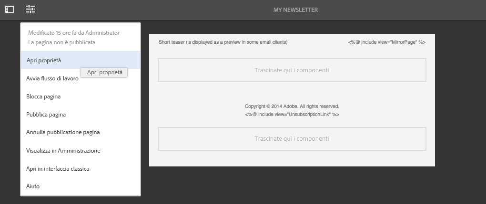

1. Seleziona **Servizi cloud** e fai clic su **+** per aggiungere una configurazione. Seleziona qualsiasi configurazione visibile (non importa quale). Tocca o fai clic su **+** accedi per aggiungere un&#39;altra configurazione e seleziona **Adobe Campaign**.

   >[!NOTE]
   >
   >In alternativa, puoi selezionare i servizi cloud selezionando **Visualizza proprietà** in **Sites** scheda .

1. Seleziona dall’elenco a discesa la configurazione che corrisponde alla tua istanza di Adobe Campaign, elimina la prima configurazione creata che non era per Adobe Campaign, quindi conferma facendo clic sul segno di spunta.
1. Procedi con il passaggio 4 della procedura precedente per selezionare i modelli e aggiungere testo normale.

### Modifica del contenuto delle e-mail {#editing-email-content}

Per modificare il contenuto dell’e-mail:

1. Apri l’e-mail e per impostazione predefinita accedi alla modalità Modifica .

   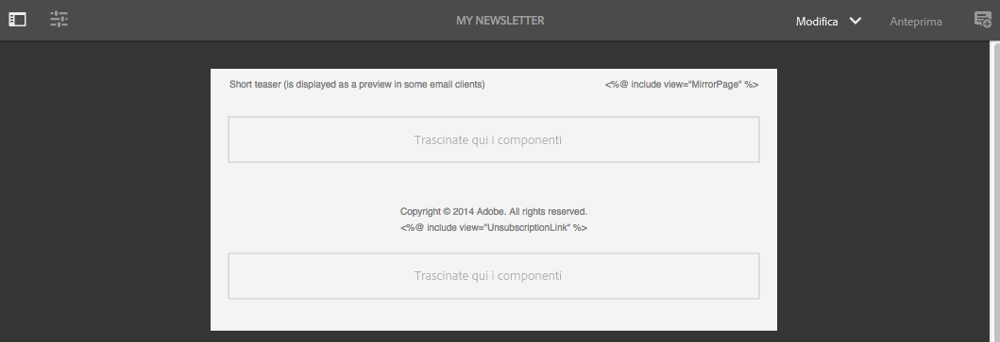

1. Se desideri modificare l’oggetto dell’e-mail o aggiungere testo normale per gli utenti che non visualizzano l’e-mail in HTML, seleziona **E-mail** e aggiungere un oggetto e un testo. Seleziona l’icona della pagina per generare automaticamente una versione di testo normale da HTML. Al termine, fai clic sul segno di spunta.

   Puoi personalizzare la newsletter utilizzando i campi di personalizzazione di Adobe Campaign. Per aggiungere un campo di personalizzazione, apri il selettore dei campi di personalizzazione facendo clic sul pulsante che mostra il logo Adobe Campaign. Puoi quindi scegliere tra tutti i campi disponibili per la newsletter.

   >[!NOTE]
   >
   >Se i campi di personalizzazione nelle proprietà dell’editor sono disattivati, controlla nuovamente la configurazione.

   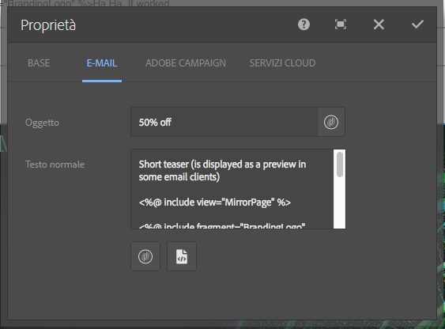

1. Apri il pannello dei componenti sul lato sinistro dello schermo e seleziona **Newsletter Adobe Campaign** dal menu a discesa per trovare tali componenti.

   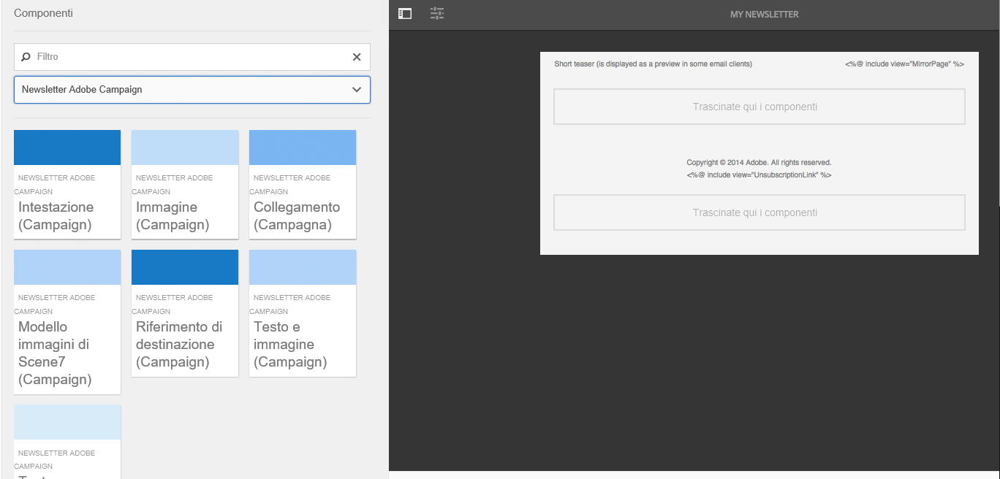

1. Trascina i componenti direttamente sulla pagina e modificali di conseguenza. Ad esempio, puoi trascinare un **Testo e personalizzazione (Campaign)** e aggiungi testo personalizzato.

   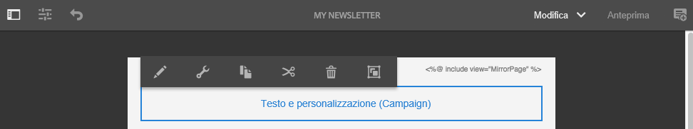

   Vedi [Componenti di Adobe Campaign](/help/sites-authoring/adobe-campaign-components.md) per una descrizione dettagliata di ciascun componente.

   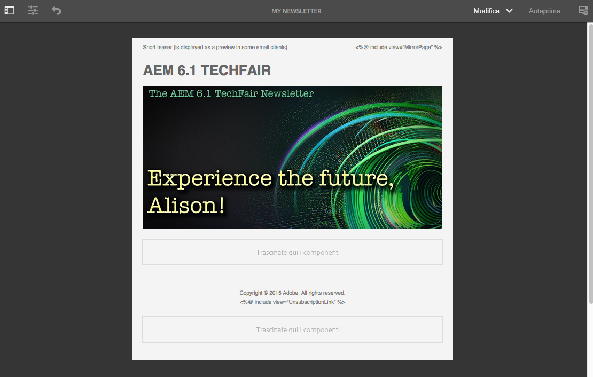

### Inserimento di personalizzazioni {#inserting-personalization}

Quando modifichi il contenuto, puoi inserire:

* Campi contestuali di Adobe Campaign. Si tratta di campi che puoi inserire all’interno del testo e che si adattano in base ai dati del destinatario (ad esempio nome, cognome o qualsiasi dato della dimensione di destinazione).
* Blocchi di personalizzazione Adobe Campaign. Si tratta di blocchi di contenuto predefinito non correlati ai dati del destinatario, ad esempio un logo del marchio, o collegati a una pagina speculare.

Vedi [Componenti di Adobe Campaign](/help/sites-authoring/adobe-campaign-components.md) per una descrizione completa dei componenti di Campaign.

>[!NOTE]
>
>* Solo i campi di Adobe Campaign **Profili** vengono prese in considerazione le dimensioni di targeting.
>* Quando visualizzi Proprietà da **Sites**, non puoi accedere ai campi di contesto di Adobe Campaign. Puoi accedere direttamente dall’e-mail durante la modifica.
>

Per inserire la personalizzazione:

1. Inserisci un nuovo **Newsletter** > **Testo e personalizzazione (Campaign)** trascinandolo sulla pagina.

   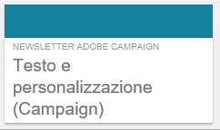

1. Apri il componente facendo clic sull’icona Matita . Viene aperto l’editor interno.

   

   >[!NOTE]
   >
   >**Per Adobe Campaign Standard:**
   >
   >* I campi di contesto disponibili corrispondono a **Profili** dimensione di targeting in Adobe Campaign.
   >* Vedi [Collegamento di una pagina AEM a un’e-mail di Adobe Campaign](#linking-an-aem-page-to-an-adobe-campaign-email-adobe-campaign-standard).

   >
   >**Per Adobe Campaign Classic:**
   >
   >* I campi di contesto disponibili vengono recuperati dinamicamente da Adobe Campaign **nms:seedMember** schema. I dati dell’estensione Target vengono recuperati dinamicamente dal flusso di lavoro che contiene la consegna sincronizzata con il contenuto. (Vedi [Sincronizzazione del contenuto creato in AEM con una consegna da Adobe Campaign](#synchronizing-content-created-in-aem-with-a-delivery-from-adobe-campaign-classic) sezione).
   >
   >* Per aggiungere o nascondere elementi di personalizzazione, consulta [Gestione di campi e blocchi di personalizzazione](/help/sites-administering/campaignonpremise.md#managing-personalization-fields-and-blocks).
   >* **Importante**: Tutti i campi della tabella seed devono trovarsi anche nella tabella dei destinatari (o nella corrispondente tabella dei contatti).

1. Inserisci il testo digitando. Inserisci campi di contesto o blocchi di personalizzazione facendo clic sui componenti di Adobe Campaign e selezionandoli. Al termine, seleziona il segno di spunta.

   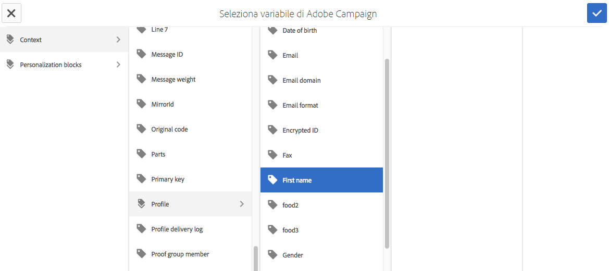

   Dopo aver inserito campi di contesto o blocchi di personalizzazione, puoi visualizzare in anteprima la newsletter e testare i campi. Vedi [Anteprima di una newsletter](#previewing-a-newsletter).

### Anteprima di una newsletter {#previewing-a-newsletter}

Puoi visualizzare in anteprima l’aspetto della newsletter e la personalizzazione.

1. Con la newsletter aperta, fai clic su **Anteprima** nell&#39;angolo superiore destro di AEM. AEM visualizza l’aspetto della newsletter quando viene ricevuta dagli utenti.

   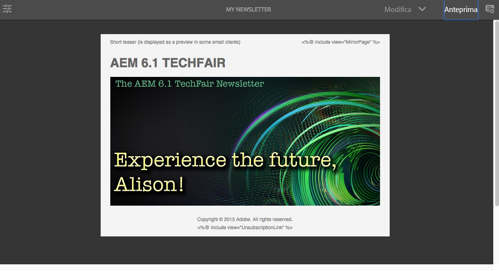

   >[!NOTE]
   >
   >Se utilizzi Adobe Campaign Standard e utilizzi il modello di esempio, due blocchi di personalizzazione che visualizzano il contenuto iniziale: **&quot;&lt;%@ include view=&quot;MirrorPage&quot; %>&quot;** e **&quot;&lt;%@ include view=&quot;UnsubscriptionLink&quot; %>&quot;** - genera errori durante l’importazione del contenuto durante la consegna. Puoi regolarli selezionando i blocchi corrispondenti utilizzando il selettore dei blocchi di personalizzazione.

1. Per visualizzare l’anteprima della personalizzazione, apri ContextHub facendo clic o toccando l’icona corrispondente nella barra degli strumenti. I tag campo di personalizzazione sono ora sostituiti dai dati seed della persona selezionata. Scopri come le variabili si adattano quando si passa a un altro utente in ContextHub.

   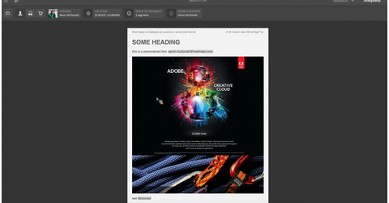

1. Puoi visualizzare i dati di seed provenienti da Adobe Campaign associati alla persona attualmente selezionata. A questo scopo, tocca o fai clic sul modulo Adobe Campaign nella barra ContextHub. Viene visualizzata una finestra di dialogo con tutti i dati iniziali del profilo corrente. Anche in questo caso, i dati si adattano quando si passa a un’altra persona.

   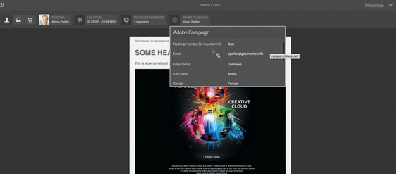

### Approvazione del contenuto in AEM {#approving-content-in-aem}

Al termine del contenuto, puoi avviare il processo di approvazione. Vai a **Flusso di lavoro** scheda della casella degli strumenti e seleziona la **Approva per Adobe Campaign** workflow.

Questo flusso di lavoro predefinito prevede due passaggi: revisione poi approvazione o revisione poi rifiuto. Tuttavia, questo flusso di lavoro può essere esteso e adattato a un processo più complesso.

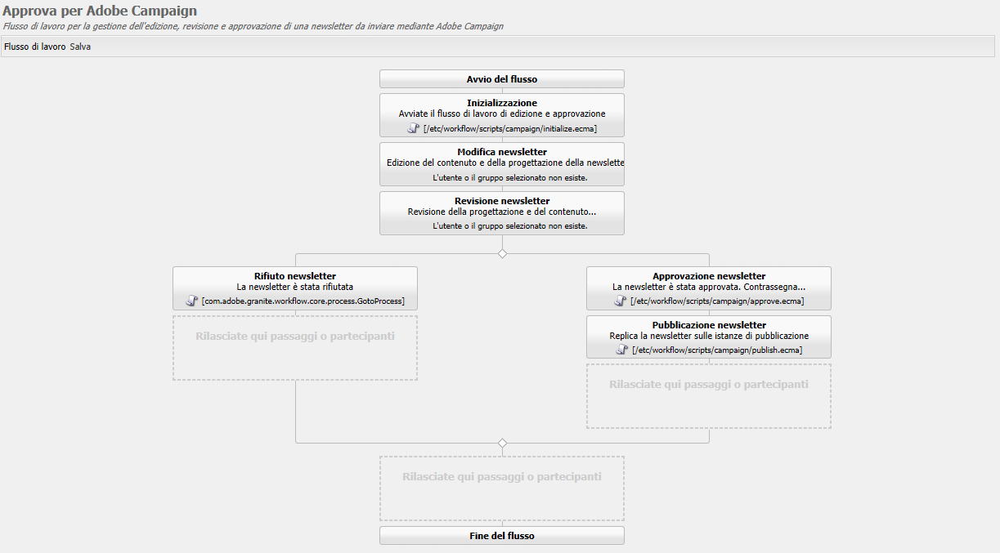

Per approvare il contenuto per Adobe Campaign, applica il flusso di lavoro selezionando **Flusso di lavoro** e selezionando **Approva per Adobe Campaign** e fai clic su **Avvia flusso di lavoro**. Segui i passaggi e approva il contenuto. È inoltre possibile rifiutare il contenuto selezionando **Rifiuta** anziché **Approva** nell’ultimo passaggio del flusso di lavoro.

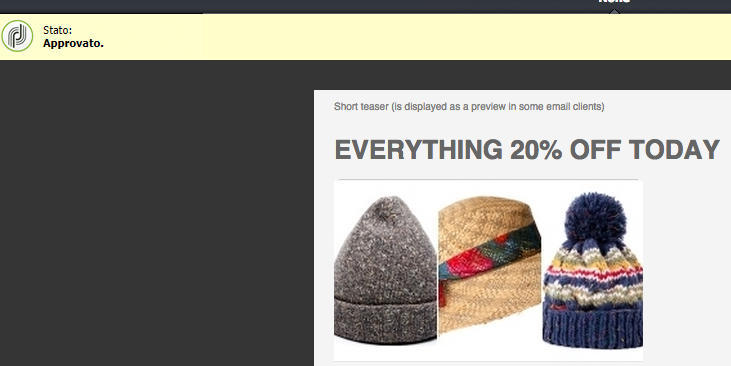

Dopo l’approvazione del contenuto, questo viene visualizzato come approvato in Adobe Campaign. L’e-mail può quindi essere inviata.

In Adobe Campaign Standard:

In Adobe Campaign Classic:

>[!NOTE]
Il contenuto non approvato può essere sincronizzato con una consegna in Adobe Campaign, ma la consegna non può essere eseguita. Solo i contenuti approvati possono essere inviati tramite le consegne di Campaign.

## Collegamento di AEM con Adobe Campaign Standard e Adobe Campaign Classic {#linking-aem-with-adobe-campaign-standard-and-adobe-campaign-classic}

La modalità di collegamento o sincronizzazione dei AEM con Adobe Campaign dipende dal fatto che si utilizzi Adobe Campaign Standard basato su abbonamento o Adobe Campaign Classic basato su locale.

Per istruzioni basate sulla soluzione Adobe Campaign, consulta le sezioni seguenti:

* [Collegamento di una pagina AEM a un’e-mail Adobe Campaign (Adobe Campaign Standard)](#linking-an-aem-page-to-an-adobe-campaign-email-adobe-campaign-standard)
* [Sincronizzazione dei contenuti creati in AEM con una consegna da Adobe Campaign Classic](#synchronizing-content-created-in-aem-with-a-delivery-from-adobe-campaign-classic)

### Collegamento di una pagina AEM a un’e-mail Adobe Campaign (Adobe Campaign Standard) {#linking-an-aem-page-to-an-adobe-campaign-email-adobe-campaign-standard}

Adobe Campaign Standard consente di recuperare e collegare i contenuti creati in AEM con:

* Un&#39;e-mail.
* Un modello e-mail.

In questo modo puoi distribuire i contenuti. Puoi verificare se una newsletter è collegata a una singola consegna dal codice visualizzato sulla pagina.

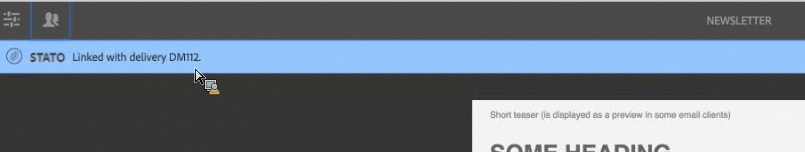

>[!NOTE]
Se una newsletter è collegata a più consegne, viene visualizzato il numero di consegne collegate (ma non tutti gli ID).

Per collegare una pagina creata in AEM con un’e-mail da Adobe Campaign:

1. Crea un nuovo messaggio e-mail basato su un modello e-mail specifico per AEM. Fai riferimento a [Creazione di e-mail in Adobe Campaign Standard](https://helpx.adobe.com/campaign/standard/channels/using/creating-an-email.html) per ulteriori informazioni.

   

1. Apri **Contenuto** blocca dal dashboard di consegna.

   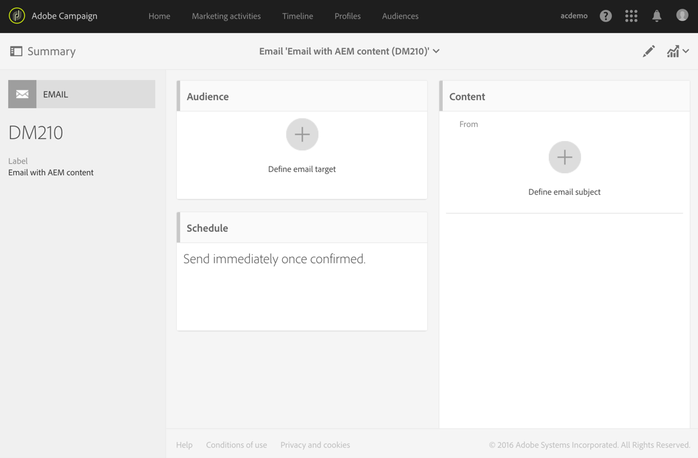

1. Seleziona **Collegamento a un contenuto Adobe Experience Manager** nella barra degli strumenti per accedere all’elenco dei contenuti disponibili in AEM.

   >[!NOTE]
   Se la **Collegamento con un Adobe Experience Manager** l&#39;opzione non viene visualizzata nella barra delle azioni, verifica che il **Modalità di modifica del contenuto** è configurato correttamente in **Adobe Experience Manager** nelle proprietà e-mail.

   

1. Seleziona il contenuto da utilizzare nell’e-mail.

   Questo elenco specifica:

   * Etichetta del contenuto in AEM.
   * Lo stato di approvazione del contenuto in AEM. Se il contenuto non è approvato, puoi sincronizzarlo, ma dovrà essere approvato prima dell’invio della consegna. Tuttavia, puoi eseguire determinate operazioni, ad esempio l’invio di una bozza o il test di anteprima.
   * Data dell’ultima modifica del contenuto.
   * Qualsiasi contenuto già collegato a una consegna.

   >[!NOTE]
   Per impostazione predefinita, il contenuto già sincronizzato con una consegna è nascosto. Tuttavia, puoi visualizzarlo e utilizzarlo. Ad esempio, se desideri utilizzare il contenuto come modello per diverse consegne.

   Quando l’e-mail è collegata a un contenuto AEM, il contenuto non può essere modificato in Adobe Campaign.

1. Specifica gli altri parametri dell’e-mail dal relativo dashboard (tipi di pubblico, pianificazione dell’esecuzione).
1. Esegui la consegna e-mail. Durante l’analisi della consegna, viene recuperata la versione più aggiornata del contenuto AEM.

   >[!NOTE]
   Se il contenuto viene aggiornato in AEM mentre è collegato a un’e-mail, viene aggiornato automaticamente in Adobe Campaign durante l’analisi. La sincronizzazione può anche essere eseguita manualmente utilizzando **Aggiornare il contenuto Adobe Experience Manager** dalla barra delle azioni del contenuto.
   Puoi annullare il collegamento tra un’e-mail e AEM contenuto utilizzando **Eliminare il collegamento con il contenuto Adobe Experience Manager** dalla barra delle azioni del contenuto. Questo pulsante è disponibile solo se un contenuto è già collegato alla consegna. Per collegare un contenuto diverso a una consegna, devi eliminare il collegamento al contenuto corrente prima di poter stabilire un nuovo collegamento.
   Quando il collegamento viene eliminato, il contenuto locale viene mantenuto e diventa modificabile in Adobe Campaign. Se colleghi nuovamente il contenuto dopo averlo modificato, tutte le modifiche andranno perse.

### Sincronizzazione del contenuto creato in AEM con una consegna da Adobe Campaign Classic {#synchronizing-content-created-in-aem-with-a-delivery-from-adobe-campaign-classic}

Adobe Campaign consente di recuperare e sincronizzare i contenuti creati in AEM con:

* Una consegna campagna
* Un’attività di consegna in un flusso di lavoro della campagna
* Una consegna ricorrente
* Una consegna continua
* Consegna al Centro messaggi
* Un modello di consegna

In AEM, se una newsletter è collegata a una singola consegna, il codice di consegna viene visualizzato sulla pagina.

>[!NOTE]
Se la newsletter è collegata a diverse consegne, viene visualizzato il numero di consegne collegate (ma non tutti gli ID).

>[!NOTE]
Passaggio del flusso di lavoro **Pubblicare su Adobe Campaign** è obsoleto in AEM 6.1. Questo passaggio faceva parte dell’integrazione di AEM 6.0 con Adobe Campaign e non è più necessario.

Per sincronizzare il contenuto creato in AEM con una consegna da Adobe Campaign:

1. Crea una consegna o aggiungi un’attività di consegna a un flusso di lavoro della campagna selezionando **Email delivery con contenuto AEM (mailAEMContent)** modello di consegna.

   

1. Seleziona **Sincronizza** nella barra degli strumenti per accedere all’elenco dei contenuti disponibili in AEM.

   >[!NOTE]
   Se la **Sincronizza** l’opzione non viene visualizzata nella barra degli strumenti della consegna, verifica che la **Modalità di modifica del contenuto** è configurato correttamente in **AEM** selezionando **Proprietà** > **Avanzate**.

   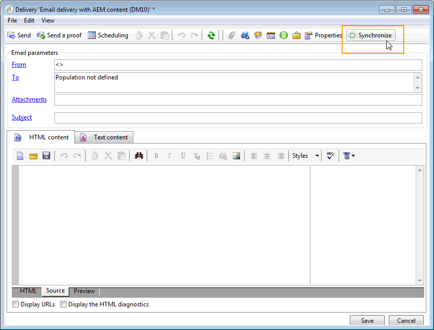

1. Seleziona il contenuto da sincronizzare con la consegna.

   Questo elenco specifica:

   * Etichetta del contenuto in AEM.
   * Lo stato di approvazione del contenuto in AEM. Se il contenuto non è approvato, puoi sincronizzarlo, ma dovrà essere approvato prima dell’invio della consegna. Tuttavia, puoi eseguire determinate operazioni, ad esempio l’invio di un BAT o il test di anteprima.
   * Data dell’ultima modifica apportata al contenuto.
   * Qualsiasi contenuto già collegato a una consegna.

   >[!NOTE]
   Per impostazione predefinita, il contenuto già sincronizzato con una consegna è nascosto. Tuttavia, puoi visualizzarlo e utilizzarlo. Ad esempio, se desideri utilizzare il contenuto come modello per diverse consegne.

   

1. Specifica gli altri parametri della consegna (target, ecc.)
1. Se necessario, avvia il processo di approvazione della consegna in Adobe Campaign. L’approvazione dei contenuti in AEM è necessaria oltre alle approvazioni configurate in Adobe Campaign (budget, target, ecc.). L’approvazione dei contenuti in Adobe Campaign è possibile solo se il contenuto è già approvato in AEM.
1. Esegui la consegna. Durante l’analisi della consegna, viene recuperata la versione più aggiornata del contenuto AEM.

   >[!NOTE]
   * Una volta sincronizzati la consegna e il contenuto, il contenuto della consegna in Adobe Campaign diventa di sola lettura. L’oggetto dell’e-mail e il relativo contenuto non possono più essere modificati.
   * Se il contenuto viene aggiornato in AEM mentre è collegato a una consegna in Adobe Campaign, viene aggiornato automaticamente nella consegna durante l’analisi della consegna. La sincronizzazione può anche essere eseguita manualmente utilizzando il **Aggiorna subito il contenuto** pulsante .
   * È possibile annullare la sincronizzazione tra una consegna e AEM contenuto utilizzando **Desincronizza** pulsante . Questa opzione è disponibile solo se un contenuto è già sincronizzato con la consegna. Per sincronizzare un contenuto diverso con una consegna, è necessario annullare la sincronizzazione del contenuto corrente prima di poter stabilire un nuovo collegamento.
   * Se desincronizzato, il contenuto locale viene mantenuto e diventa modificabile in Adobe Campaign. Se sincronizzi nuovamente il contenuto dopo averlo modificato, perderai tutte le modifiche.
   * Per consegne ricorrenti e continue, la sincronizzazione con AEM contenuto viene interrotta ogni volta che la consegna viene eseguita.

