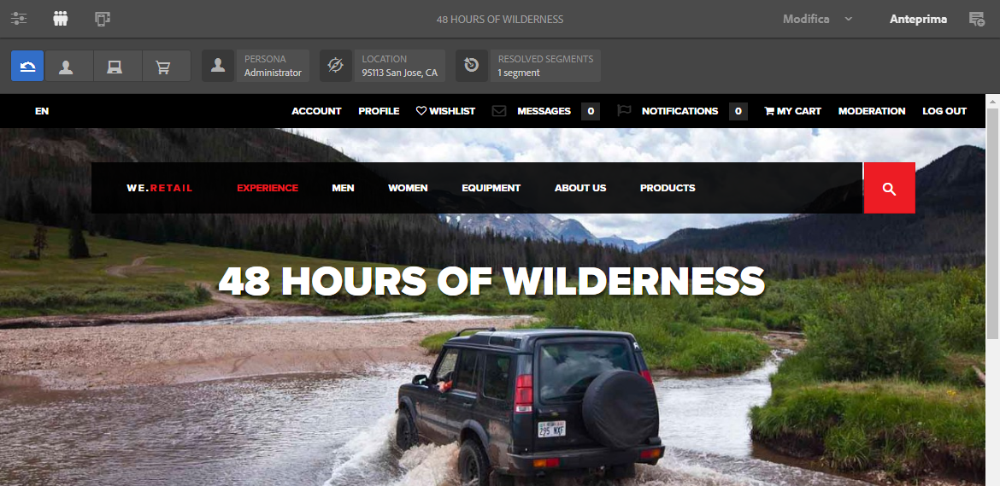
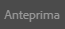

# Visualizzare l’anteprima delle pagine utilizzando i dati di ContextHub{#previewing-pages-using-contexthub-data}

>[!CAUTION]
>
>AEM 6.4 ha raggiunto la fine del supporto esteso e questa documentazione non viene più aggiornata. Per maggiori dettagli, consulta la nostra [periodi di assistenza tecnica](https://helpx.adobe.com/it/support/programs/eol-matrix.html). Trova le versioni supportate [qui](https://experienceleague.adobe.com/docs/).

La [ContextHub](/help/sites-developing/contexthub.md) barra degli strumenti visualizza i dati dagli archivi ContextHub e consente di modificare i dati archiviati. La barra degli strumenti ContextHub è utile per visualizzare in anteprima il contenuto determinato dai dati in un archivio ContextHub.

La barra degli strumenti è composta da una serie di modalità di interfaccia utente che contengono uno o più moduli di interfaccia utente.

* Le modalità di interfaccia utente sono icone che vengono visualizzate sul lato sinistro della barra degli strumenti. Quando tocchi o fai clic su un’icona, la barra degli strumenti mostra i moduli di interfaccia in essa contenuti.
* I moduli di interfaccia utente visualizzano dati da uno o più archivi ContextHub. Alcuni moduli di interfaccia utente consentono inoltre di manipolare i dati archiviati.

ContextHub installa diverse modalità di interfaccia utente e moduli di interfaccia utente. L&#39;amministratore potrebbe avere [ContextHub configurato](/help/sites-administering/contexthub-config.md) per visualizzarne di diversi.

## Visualizzazione della barra degli strumenti di ContextHub {#revealing-the-contexthub-toolbar}

La barra degli strumenti di ContextHub è disponibile in modalità Anteprima. La barra degli strumenti è disponibile solo nelle istanze dell’autore e solo se l’amministratore l’ha abilitata.

1. Con la pagina aperta per la modifica, fai clic o tocca Anteprima nella barra degli strumenti.

   

1. Per visualizzare la barra degli strumenti, fai clic o tocca l’icona di ContextHub.

   

## Funzioni del modulo dell’interfaccia utente {#ui-module-features}

Ogni modulo di interfaccia utente fornisce un set di funzioni diverso, ma i seguenti tipi di funzionalità sono comuni. Poiché i moduli di interfaccia utente sono estensibili, lo sviluppatore può implementare altre funzioni, a seconda delle necessità.

### Contenuto della barra degli strumenti {#toolbar-content}

I moduli di interfaccia utente possono visualizzare dati da uno o più archivi di ContextHub nella barra degli strumenti. I moduli di interfaccia utente utilizzano un’icona e un titolo per identificarsi. 

### Contenuto a comparsa {#popup-content}

Alcuni moduli di interfaccia utente visualizzano una finestra a comparsa quando fai clic o tocca. In genere, la finestra a comparsa contiene informazioni aggiuntive rispetto a quelle visualizzate nella barra degli strumenti.

### Popup Forms {#popup-forms}

La sovrapposizione a comparsa di un modulo può includere elementi modulo che consentono di modificare i dati nell’archivio ContextHub. Se il contenuto della pagina è determinato dai dati archiviati, è possibile utilizzare il modulo e osservare le modifiche apportate al contenuto della pagina.

### Modalità schermo intero {#fullscreen-mode}

Le sovrapposizioni a comparsa possono includere un’icona che si fa clic o si tocca per espandere il contenuto a comparsa in modo da coprire l’intera finestra o schermata del browser.

