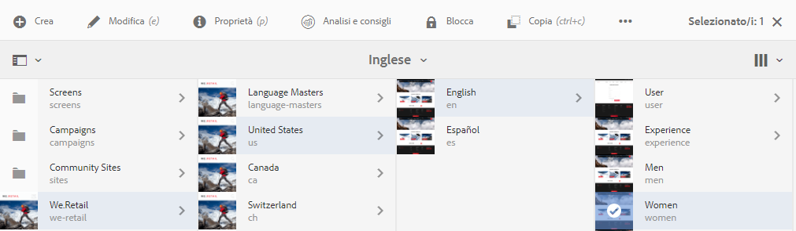
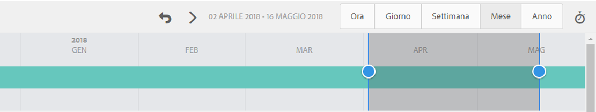
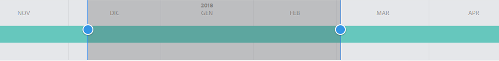
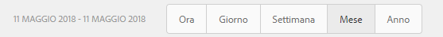
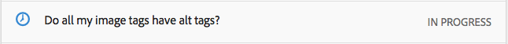

# Analisi delle prestazioni della pagina{#analyzing-page-performance}

Apri la pagina [Approfondimenti contenuto](/help/sites-authoring/content-insights.md) per analizzare le prestazioni della pagina che crei. Configura il periodo di riferimento per attivare l’analisi.

## Apertura di Analytics e Consigli di una pagina {#opening-analytics-and-recommendations-for-a-page}

Segui la procedura seguente per visualizzare Analisi e consigli di una pagina:

1. Accedi alla pagina da analizzare.
1. Nella barra degli strumenti, fai clic su **Analytics e Consigli**.

   >[!NOTE]
   >
   >Analytics e Consigli per una pagina appaiono solo se hai configurato AEM per l’[integrazione con Adobe Analytics](/help/sites-administering/adobeanalytics-connect.md).

   

## Modifica del periodo di riferimento {#changing-the-reporting-period}

Modifica i seguenti aspetti temporali per i rapporti analitici:

* Il periodo di tempo da analizzare.
* La granularità dei dati.

Gli strumenti per la modifica degli aspetti temporali dei rapporti sono visualizzati nella parte superiore della pagina Approfondimenti contenuto. 

### Modifica del periodo di riferimento {#changing-the-reporting-period-1}

Modifica il periodo di riferimento della pagina Approfondimenti contenuto per attivare l’analisi dell’attività di pagina per un periodo di tempo limitato. Quando modifichi il periodo di riferimento, i rapporti si aggiornano automaticamente. L’area di tempistica ombreggiata rappresenta il periodo di reporting. Le date della tempistica aumentano da sinistra a destra.

Per modificare il periodo di riferimento di una pagina Approfondimenti contenuto:

1. Se la tempistica non viene visualizzata nella parte superiore della pagina, fai clic o tocca l’icona Attiva/disattiva tempistica.

   

1. Per modificare la data di inizio del periodo di riferimento, trascina il cerchio visualizzato sul lato sinistro dell’area ombreggiata fino alla data di inizio desiderata.

   Se non riesci a visualizzare il lato sinistro dell’area ombreggiata, usa la barra di scorrimento.

1. Per modificare la data di fine del periodo di riferimento, trascina il cerchio che appare a destra dell’area ombreggiata fino alla data di fine desiderata.

### Modifica della granularità del periodo di riferimento {#changing-the-granularity-of-the-reporting-period}

Modifica il tempo di estensione di ogni punto dei dati nel rapporto. Ad esempio, quando selezioni la granularità Settimana, ciascun punto dati del rapporto Visualizzazioni rappresenta il numero di visualizzazioni in una settimana.

La granularità influisce sui rapporti che rappresentano i dati rispetto al tempo, come le Visualizzazioni e la Media di interesse alla pagina (in minuti). La granularità influisce anche sull’arco temporale.

1. Se il controllo di granularità non viene visualizzato, tocca o fai clic sull’icona attiva/disattiva granularità.

   

1. Fai clic o tocca sulla granularità desiderata. Una volta selezionato, il rapporto si aggiorna automaticamente in base alla granularità.

## Assegnazione delle attività per Consigli SEO {#assigning-tasks-for-seo-recommendations}

Utilizza il rapporto Consigli SEO per creare attività che migliorano la visibilità della pagina nei motori di ricerca. Per ogni consiglio nel rapporto senza un segno di spunta, puoi creare un’attività da assegnare a un utente necessario per completare il processo.

Lo stato del consiglio SEO indica quando l’attività viene creata ma non è ancora completata.

Una volta creata, l’attività viene visualizzata nell’elenco delle attività dell’utente. Per informazioni sulle attività, vedere [Uso delle attività](/help/sites-authoring/task-content.md).

Segui la procedura seguente per creare un’attività per un consiglio SEO.

1. Tocca o fai clic sull’icona delle informazioni per i consigli SEO.

   

1. Fai clic sull’icona del triangolo circoscritto visualizzata accanto all’icona delle informazioni.

   

1. Compila i campi del modulo visualizzati e premi il pulsante Crea:

   * Progetto: seleziona il progetto in cui creare l’attività.
   * Nome: il nome che identifica l’attività. Il nome predefinito è il titolo del consiglio SEO.
   * Assegna a: seleziona l’utente a cui assegnare l’attività. Comincia a digitare il nome utente per filtrare l’elenco.
   * Descrizione: una descrizione dell’attività necessaria a completare l’attività. La descrizione predefinita è l’informazione che accompagna il consiglio SEO.
   * Priorità attività: la priorità dell’attività.
   * Data di scadenza: la data entro cui l’attività deve essere completata.

1. Fai clic o tocca Fine per chiudere il messaggio Attività creata.

>[!NOTE]
>
>L&#39;attività creata include anche il percorso della pagina a cui si applica la raccomandazione SEO.