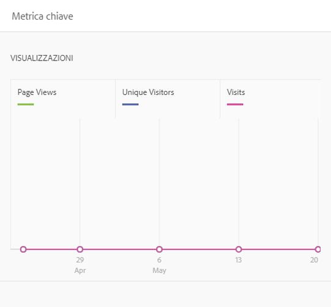
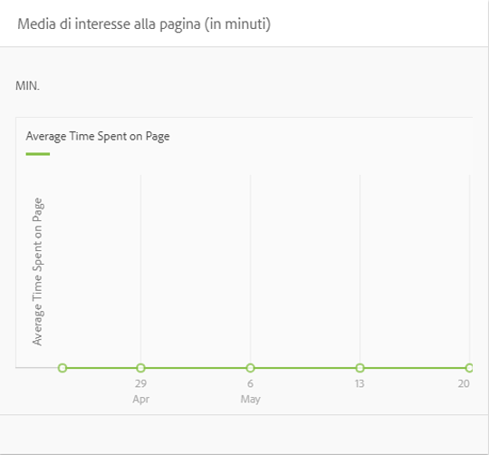
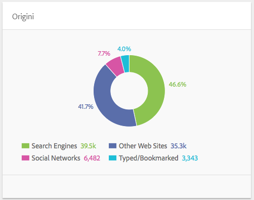
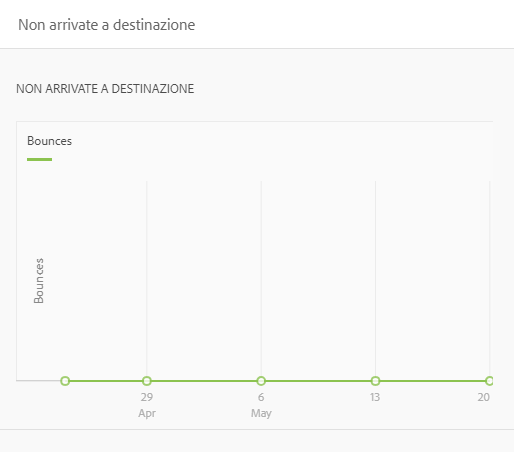

# Approfondimenti contenuto{#content-insight}

>[!CAUTION]
>
>AEM 6.4 ha raggiunto la fine del supporto esteso e questa documentazione non viene più aggiornata. Per maggiori dettagli, consulta la nostra [periodi di assistenza tecnica](https://helpx.adobe.com/it/support/programs/eol-matrix.html). Trova le versioni supportate [qui](https://experienceleague.adobe.com/docs/).

Approfondimenti contenuto fornisce informazioni sulle prestazioni della pagina utilizzando analisi web e consigli SEO. Utilizza Approfondimenti contenuto per prendere decisioni su come modificare le pagine o per scoprire come le modifiche precedenti hanno modificato le prestazioni. Per ogni pagina creata, puoi aprire Approfondimenti contenuto per analizzarla.

Il layout della pagina Approfondimenti contenuto cambia in base alle dimensioni dello schermo e all’orientamento del dispositivo in uso.

## Dati dei rapporti

La pagina Approfondimenti contenuto include rapporti che utilizzano dati Adobe SiteCatalyst, Adobe Target, Adobe Social e BrightEdge:

* SiteCatalyst: Sono disponibili rapporti per le metriche seguenti:

   * Visualizzazioni pagina
   * Tempo medio trascorso sulla pagina
   * Origini

* Target: Rapporti sull’attività della campagna per la quale la pagina include le offerte.
* BrightEdge: Rapporti sulle funzioni della pagina che migliorano la visibilità della pagina ai motori di ricerca e consiglia di implementarle.

Vedi [Apertura di Analytics e Recommendations per una pagina](/help/sites-authoring/ci-analyze.md#opening-analytics-and-recommendations-for-a-page).

## Periodo di riferimento

I rapporti mostrano i dati per un periodo di tempo controllato dall’utente. Quando regoli il periodo di reporting, i rapporti si aggiornano automaticamente con i dati per quel periodo. I segnali visivi indicano il momento in cui le versioni della pagina sono cambiate, in modo da poter confrontare le prestazioni di ogni versione.

Puoi anche specificare la granularità dei dati segnalati, ad esempio i dati giornalieri, settimanali, mensili o annuali.

Vedi [Modifica del periodo di riferimento](/help/sites-authoring/ci-analyze.md#changing-the-reporting-period).

>[!NOTE]
>
>I rapporti Approfondimenti contenuto richiedono che l’amministratore abbia integrato AEM con SiteCatalyst, Target e BrightEdge. Vedi [Integrazione con SightCatalyst](/help/sites-administering/adobeanalytics.md), [Integrazione con Adobe Target](/help/sites-administering/target.md)e [Integrazione con BrightEdge](/help/sites-administering/brightedge.md).

## Rapporto Visualizzazioni {#the-views-report}

Il rapporto Visualizzazioni include le seguenti funzionalità per la valutazione del traffico della pagina:

* Il numero totale di visualizzazioni per una pagina per il periodo di reporting.
* Un grafico del numero di visualizzazioni nel periodo di riferimento:

   * Visualizzazioni totali.
   * Visitatori unici.

## Rapporto sulla media di coinvolgimento della pagina {#the-page-average-engaged-report}

Il rapporto Media di coinvolgimento della pagina include le seguenti funzioni per valutare l’efficacia della pagina:

* Tempo medio in cui la pagina rimane aperta per l’intero periodo di reporting.
* Un grafico della lunghezza media di una visualizzazione di pagina nel periodo di riferimento.

## Rapporto Origini {#the-sources-report}

Il rapporto Origini indica il modo in cui gli utenti sono arrivati alla pagina, ad esempio dai risultati del motore di ricerca o utilizzando l’URL noto.

## Rapporto Rimbalzi {#the-bounces-report}

Il rapporto Rimbalzi include un grafico che mostra il numero di mancati recapiti che si sono verificati per una pagina nel periodo di reporting selezionato.

## Rapporto sull’attività della campagna {#the-campaign-activity-report}

Per ogni campagna per la quale la pagina è attiva, viene visualizzato un rapporto denominato *Nome campagna* Attività. Il rapporto mostra le impression della pagina e le conversioni per ogni segmento per il quale viene fornita un’offerta.

## Rapporto SEO Recommendations {#the-seo-recommendations-report}

Il rapporto SEO Recommendations contiene i risultati dell’analisi BrightEdge per la pagina. Il rapporto è una lista di controllo delle funzioni di pagina che indica quali funzioni include e non include la pagina per massimizzare la reperibilità utilizzando i motori di ricerca.

Il rapporto ti consente di creare attività in modo da apportare miglioramenti per migliorare la ricercabilità delle pagine. Recommendations indica che sono state create attività per l&#39;implementazione della raccomandazione. Vedi [Assegnazione di attività per SEO Recommendations](/help/sites-authoring/ci-analyze.md#assigning-tasks-for-seo-recommendations).

