# Creazione di contenuti di destinazione utilizzando la modalità di targeting{#authoring-targeted-content-using-targeting-mode}

>[!CAUTION]
>
>AEM 6.4 ha raggiunto la fine del supporto esteso e questa documentazione non viene più aggiornata. Per maggiori dettagli, consulta la nostra [periodi di assistenza tecnica](https://helpx.adobe.com/it/support/programs/eol-matrix.html). Trova le versioni supportate [qui](https://experienceleague.adobe.com/docs/).

Puoi creare contenuti mirati (di destinazione) utilizzando la modalità di targeting di AEM. La modalità di targeting e il componente Target forniscono strumenti per la creazione di contenuti per esperienze:

* Facile riconoscimento del contenuto di destinazione presente sulla pagina. Una linea tratteggiata forma un bordo intorno a tutto il contenuto di destinazione.
* Seleziona un marchio e un’attività per visualizzare le esperienze.
* Aggiungi esperienze a un’attività o rimuovi esperienze.
* Esegui test A/B e converti i vincitori (solo Adobe Target).
* Aggiungi le offerte a un’esperienza creando offerte o utilizzando le offerte da una libreria.
* Configura obiettivi e monitora le prestazioni.
* Simula l’esperienza utente.
* Per ulteriori personalizzazioni, configura il componente Target .

Puoi utilizzare AEM o Adobe Target come motore di destinazione (per utilizzare Adobe Target devi disporre di un account Adobe Target valido). Se utilizzi Adobe Target, devi prima configurare l’integrazione . Vedi [istruzioni per l’integrazione con Adobe Target](/help/sites-administering/target.md).

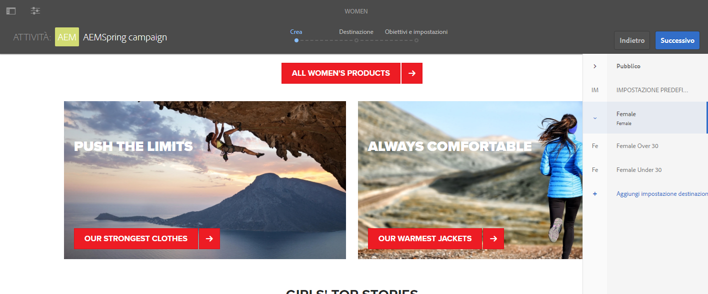

Le attività e le esperienze visualizzate in modalità Target riflettono il [Console Attività](/help/sites-authoring/activitylib.md):

* Le modifiche apportate alle attività e alle esperienze utilizzando la modalità Targeting si riflettono nella console Attività.
* Le modifiche apportate nella console Attività si riflettono nella modalità Targeting.

>[!NOTE]
>
>Quando crei una campagna in Adobe Target, questo assegna una proprietà denominata `thirdPartyId` a ogni campagna. Quando elimini la campagna in Adobe Target, thirdPartyId non viene eliminato. Non è possibile riutilizzare `thirdPartyId` per campagne di tipo diverso (AB, XT) e non può essere rimosso manualmente. Per evitare questo problema, rinomina ogni campagna con un nome univoco; i nomi delle campagne non possono quindi essere riutilizzati in diversi tipi di campagne.
>
>Se utilizzi lo stesso nome nello stesso tipo di campagna, sovrascriverai la campagna esistente.
>
>Se durante la sincronizzazione si verifica l’errore “Richiesta non riuscita. `thirdPartyId` esiste già”, modifica il nome della campagna ed esegui di nuovo la sincronizzazione.

>[!NOTE]
>
>Quando esegui il targeting, la combinazione di branding e attività viene mantenuta a livello di utente non a livello di canale.

## Passaggio alla modalità di targeting {#switching-to-targeting-mode}

Passa alla modalità Target per accedere agli strumenti per la creazione di contenuti mirati.

Per passare alla modalità Target:

1. Apri la pagina per la quale desideri creare contenuti di destinazione.
1. Nella barra degli strumenti nella parte superiore della pagina, fai clic o tocca il menu a comparsa delle modalità per visualizzare i tipi di modalità disponibili.

   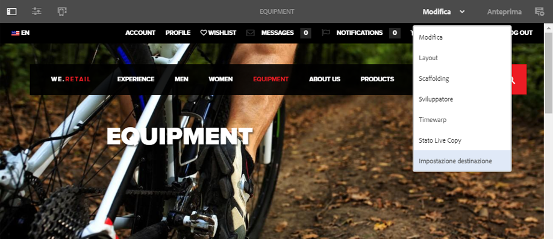

1. Tocca o fai clic su **Targeting**. Le opzioni di targeting vengono visualizzate nella parte superiore della pagina.

   

## Aggiunta di un’attività utilizzando la modalità di targeting {#adding-an-activity-using-targeting-mode}

Utilizza la modalità Targeting per aggiungere un’attività a un marchio. Quando aggiungi un’attività, questa contiene l’esperienza predefinita. Dopo aver aggiunto l’attività, avvia il processo di targeting del contenuto per l’attività.

Puoi anche creare e gestire le attività di Adobe Target da AEM con l’opzione di selezionare il motore di destinazione, AEM o Adobe Target, e il tipo di attività, Targeting esperienza o Test A/B.

Inoltre, puoi gestire obiettivi e metriche per tutte le attività di Adobe Target e gestire i tipi di pubblico di Adobe Target. È incluso anche il reporting delle attività di Adobe Target, inclusa la conversione dei vincitori per il test A/B.

Quando aggiungi un’attività, questa viene visualizzata anche nella [Console Attività](/help/sites-authoring/activitylib.md).

Per aggiungere un’attività:

1. Utilizza la **Brand** menu a discesa per selezionare il marchio per il quale desideri creare l’attività.

   >[!NOTE]
   >
   >Si consiglia di [creare marchi tramite la console attività](/help/sites-authoring/activitylib.md#creating-a-brand-using-the-activities-console).
   >
   >Se crei un marchio in un altro modo, assicurati che il nodo `/campaigns/<brand>/master` esista, per evitare errori quando tenterai di creare un’attività.

1. Tocca o fai clic su + accanto al **Attività** menu a discesa.
1. Digita un nome per l’attività.

   >[!NOTE]
   >
   >Quando crei una nuova attività e disponi di una configurazione cloud di Adobe Target associata alla pagina o a una delle pagine principali, AEM assume automaticamente Adobe Target come motore.

1. Nel menu a comparsa del motore di **targeting**, seleziona il motore di targeting.

   * Se selezioni **ContextHub AEM**, i campi rimanenti vengono oscurati e non sono disponibili. Tocca o fai clic su **Crea**.
   * Se si seleziona **Adobe Target**, puoi selezionare una configurazione (per impostazione predefinita, è quella fornita quando [configurato l&#39;account](/help/sites-administering/opt-in.md)) e Tipo di attività.
   * Se utilizzi l’integrazione AEM/Adobe Campaign e invii contenuti mirati (newsletter), seleziona **Adobe Campaign**. Vedi [Integrazione con Adobe Campaign](/help/sites-administering/campaign.md) per ulteriori informazioni.

1. Nel menu Attività, seleziona una delle seguenti opzioni: **Targeting esperienza** o **Test A/B**.

   * Targeting delle esperienze: gestisci le attività Adobe Target da AEM.
   * Test A/B: crea/gestisci attività di test A/B in Adobe Target da AEM.

## Il Processo Di Targeting: Creare, Target e obiettivi e impostazioni {#the-targeting-process-create-target-and-goals-settings}

La modalità di targeting consente di configurare diversi aspetti di un’attività. Utilizza il seguente processo in tre fasi per creare contenuti mirati per un’attività di marchio:

1. [Crea](#create-authoring-the-experiences): Aggiungi o rimuovi esperienze e aggiungi offerte per ogni esperienza.
1. [Target](#target-configuring-the-audiences): Specifica il pubblico al quale è destinata ogni esperienza. Puoi eseguire il targeting di un pubblico specifico e, se utilizzi il test A/B, determina la percentuale di traffico da indirizzare a quale esperienza.
1. [Obiettivi e impostazioni](#goals-settings-configuring-the-activity-and-setting-goals): Pianifica l’attività e imposta la priorità. Puoi anche impostare gli obiettivi della metrica di successo.

Segui la procedura seguente per avviare il processo di targeting dei contenuti per un’attività.

>[!NOTE]
>
>Per utilizzare il processo di targeting, devi essere membro del gruppo utente Autori delle attività di Target.

Per aggiungere un’attività:

1. In **Brand** dal menu a discesa, seleziona il marchio che contiene l’attività su cui stai lavorando.
1. In **Attività** dal menu a discesa , seleziona l’attività per la quale stai creando contenuti di destinazione.
1. Per visualizzare i controlli che guidano attraverso il processo di targeting, tocca o fai clic su **Avvia targeting**.

   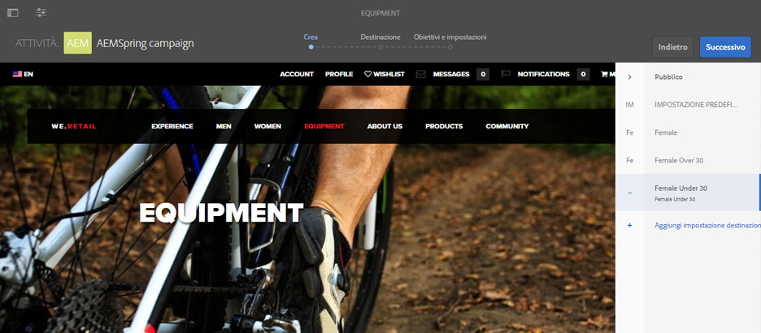

   >[!NOTE]
   >
   >Per modificare l’attività con cui stai lavorando, tocca o fai clic su **Indietro**.

## Crea: Creazione di esperienze {#create-authoring-the-experiences}

La fase Crea del targeting del contenuto comporta la creazione di esperienze. Durante questo passaggio puoi creare o eliminare le esperienze dell’attività e aggiungere offerte a ogni esperienza.

### Visualizzazione delle offerte di esperienza in modalità di targeting {#seeing-experience-offers-in-targeting-mode}

Dopo [avvia il processo di targeting](/help/sites-authoring/content-targeting-touch.md#the-targeting-process-create-target-and-goals-settings), seleziona un’esperienza per visualizzare le offerte fornite per tale esperienza. Quando selezioni un’esperienza, i componenti di destinazione nella pagina cambiano per mostrare l’offerta per tale esperienza.

>[!CAUTION]
>
>Presta attenzione quando disattivi il targeting per un componente che è già assegnato nell’istanza di authoring. La rispettiva attività verrà automaticamente eliminata anche dall’istanza di pubblicazione.

>[!NOTE]
>
>Un’offerta è il contenuto di un componente di destinazione.

Le esperienze vengono visualizzate nel riquadro Audiences. Nell’esempio seguente, le esperienze includono **Predefinita**, **Femmina**, **Femmina oltre 30** e **Femmina sotto 30**. Questo esempio mostra l’offerta Predefinita di un componente **Immagine** di destinazione.

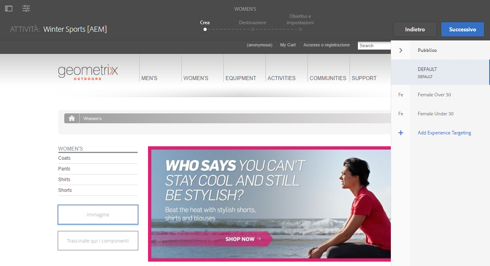

Quando è selezionata un’esperienza diversa, il componente immagine mostra l’offerta per l’esperienza.

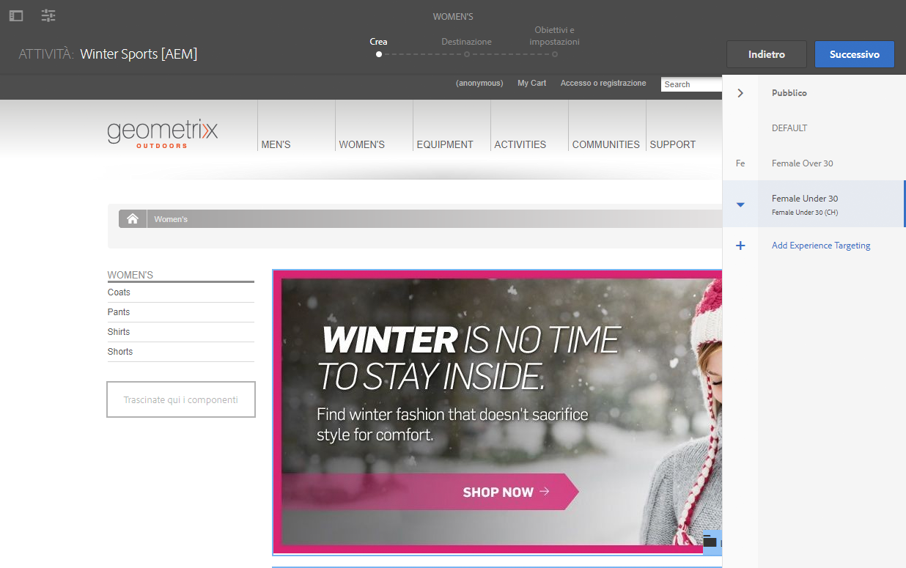

Quando un’esperienza è selezionata e il componente di destinazione non include un’offerta per tale esperienza, il componente visualizza la scritta **Aggiungi offerta** come sovrapposta all’offerta semitrasparente predefinita. Quando non è stata creata alcuna offerta per un’esperienza, l’offerta **Predefinita** viene visualizzata per il segmento mappato all’esperienza.

L’esperienza predefinita viene visualizzata anche quando le proprietà del visitatore non corrispondono a nessun segmento mappato per le esperienze. Consulta [Aggiunta di esperienze utilizzando la modalità di targeting](#adding-and-removing-experiences-using-targeting-mode).

### Offerte personalizzate e offerte dalla libreria {#custom-offers-and-library-offers}

Offerte che sono [creato sulla pagina](/help/sites-authoring/content-targeting-touch.md#adding-a-custom-offer) e utilizzati per una singola esperienza sono denominati offerte personalizzate. L’immagine seguente è sovrapposta al contenuto di un’offerta personalizzata:

Le offerte che vengono [aggiunte da una libreria di offerte](/help/sites-authoring/content-targeting-touch.md#adding-an-offer-from-an-offer-library) sono sovrapposte con l’immagine seguente:

Puoi salvare le offerte personalizzate in una libreria di offerte se decidi di riutilizzarle. Puoi anche convertire un’offerta dalla libreria in un’offerta personalizzata se desideri modificare il contenuto di un’esperienza. Dopo la modifica, puoi salvare nuovamente l’offerta nella libreria.

### Aggiunta e rimozione di esperienze utilizzando la modalità di targeting {#adding-and-removing-experiences-using-targeting-mode}

Utilizzo del passaggio Crea di [il processo di targeting](/help/sites-authoring/content-targeting-touch.md#the-targeting-process-create-target-and-goals-settings), puoi aggiungere e rimuovere esperienze. Inoltre, puoi duplicare un’esperienza e rinominarla.

#### Aggiunta di esperienze utilizzando la modalità di targeting {#adding-experiences-using-targeting-mode}

Per aggiungere un’esperienza:

1. Per aggiungere un’esperienza, tocca o fai clic su **+ Aggiungi targeting dell’esperienza** che viene visualizzato sotto le esperienze esistenti del riquadro **Pubblico**.
1. Seleziona e pubblico. Per impostazione predefinita, tale nome è il nome dell’esperienza. Se necessario, è possibile digitare un altro nome. Tocca o fai clic su **OK**.

#### Rimozione di esperienze utilizzando la modalità di targeting {#removing-experiences-using-targeting-mode}

Per eliminare un’esperienza:

1. Tocca o fai clic sulla freccia accanto al nome dell’esperienza.

   

1. Fai clic su **Elimina**.

#### Ridenominazione delle esperienze con la modalità di targeting {#renaming-experiences-using-targeting-mode}

Per rinominare le esperienze utilizzando la modalità di targeting:

1. Tocca o fai clic sulla freccia accanto al nome dell’esperienza.
1. Fai clic su **Rinomina esperienza** e digita il nuovo nome.
1. Tocca o fai clic su un punto qualsiasi sullo schermo per salvare le modifiche.

#### Modifica del pubblico utilizzando la modalità di targeting {#editing-audiences-using-targeting-mode}

Per modificare il pubblico utilizzando la modalità di targeting:

1. Tocca o fai clic sulla freccia accanto al nome dell’esperienza.
1. Fai clic su **Modifica pubblico** e seleziona un nuovo pubblico.
1. Fai clic su **OK**.

#### Duplicazione delle esperienze utilizzando la modalità di targeting {#duplicating-experiences-using-targeting-mode}

Per copiare le esperienze utilizzando la modalità di targeting:

1. Tocca o fai clic sulla freccia accanto al nome dell’esperienza.
1. Fai clic su **Duplica** e scegli il pubblico.
1. Rinomina l’esperienza, se desiderato, e fai clic su **OK**.

### Creazione di offerte tramite la modalità di targeting {#creating-offers-using-targeting-mode}

Esegui il targeting di un componente per creare offerte per esperienze. I componenti di destinazione forniscono il contenuto utilizzato come offerte per le esperienze.

* [Eseguire il targeting di un componente esistente](/help/sites-authoring/content-targeting-touch.md#creating-a-default-offer-by-targeting-an-existing-component). Il contenuto diventa l’offerta dell’esperienza predefinita.
* [Aggiungi un componente Target](/help/sites-authoring/content-targeting-touch.md#creating-an-offer-by-adding-a-target-component), quindi aggiungi il contenuto al componente.

Dopo aver eseguito il targeting di un componente, puoi aggiungere offerte per ogni esperienza:

* [Aggiungi offerte personalizzate](/help/sites-authoring/content-targeting-touch.md#adding-a-custom-offer).
* [Aggiungere offerte da una libreria](/help/sites-authoring/content-targeting-touch.md#adding-an-offer-from-an-offer-library).

Per lavorare con le offerte sono disponibili i seguenti strumenti:

* [Aggiungere un’offerta personalizzata a una libreria di offerte](/help/sites-authoring/content-targeting-touch.md#adding-a-custom-offer-to-a-library).
* [Convertire un’offerta dalla libreria in un’offerta personalizzata](/help/sites-authoring/content-targeting-touch.md#converting-a-library-offer-to-a-custom-library).
* [Apri un’offerta dalla libreria e modifica il contenuto](/help/sites-authoring/content-targeting-touch.md#editing-a-library-offer).

#### Creazione di un’offerta predefinita mediante targeting di un componente esistente {#creating-a-default-offer-by-targeting-an-existing-component}

Esegui il targeting di un componente nella pagina per utilizzarlo come offerta per l’esperienza predefinita dell’attività. Quando esegui il targeting di un componente, questo viene racchiuso in un componente Target e il relativo contenuto diventa l’offerta per l’esperienza predefinita.

Quando esegui il targeting di un componente, nell’offerta può essere utilizzato solo tale componente. Non puoi rimuovere il componente dall’offerta o aggiungere altri componenti all’offerta.

Esegui la seguente procedura dopo [avvio del processo di targeting](/help/sites-authoring/content-targeting-touch.md#the-targeting-process-create-target-and-goals-settings).

1. Tocca o fai clic sul componente di destinazione. Viene visualizzata la barra degli strumenti del componente, come nell’esempio seguente.

   

1. Tocca o fai clic sull’icona Target.

   

   Il contenuto del componente è l’offerta dell’esperienza predefinita. Quando viene eseguito il targeting di un componente, il suo nodo predefinito sarà replicato per ogni esperienza. Questo è necessario per modificare il nodo del contenuto corretto durante la creazione specifica dell’esperienza. Per tali esperienze non predefinite, [aggiungi un’offerta personalizzata](/help/sites-authoring/content-targeting-touch.md#adding-a-custom-offer) oppure [aggiungi un’offerta dalla libreria](/help/sites-authoring/content-targeting-touch.md#adding-an-offer-from-an-offer-library).

#### Creazione di un’offerta aggiungendo un componente Target {#creating-an-offer-by-adding-a-target-component}

Aggiungi un componente Target per creare l’offerta per l’esperienza predefinita. Il componente Target è un contenitore per altri componenti e viene eseguito il targeting di componenti che si trovano al suo interno. Quando utilizzi il componente Target, puoi aggiungere numerosi componenti per creare un’offerta. Inoltre, puoi usare i diversi componenti in ogni esperienza per creare le diverse offerte.

Per ulteriori informazioni su come personalizzare questo componente, consulta [Configurazione delle opzioni dei componenti Target](/help/sites-authoring/content-targeting-touch.md#configuring-target-component-options).

>[!NOTE]
>
>Le offerte create mediante la [console delle offerte](/help/sites-authoring/offerlib.md) possono anche contenere diversi componenti. Queste offerte appartengono a una libreria di offerte e possono essere utilizzate per più esperienze.

Poiché il componente Target è un contenitore, viene visualizzato come area di rilascio per altri componenti.

In modalità Target, il componente Target ha un bordo blu e il messaggio di destinazione a discesa indica la natura di destinazione.

In modalità di modifica, il componente Target dispone di un’icona a forma di centro del bersaglio.

Quando trascini componenti nel componente Target, si tratta di componenti di cui è stato eseguito il targeting.

Quando aggiungi un componente al componente Target, questo fornisce il contenuto per una specifica esperienza. Per specificare l’esperienza, seleziona l’esperienza prima di aggiungere i componenti.

Puoi aggiungere un componente Target alla pagina in modalità Modifica o in modalità Target. Puoi aggiungere componenti al componente Target solo in modalità Target. Il componente Target appartiene al gruppo di componenti Personalizzazione .

Per modificare il contenuto di destinazione, tocca o fai clic su **Avvia targeting **prima di procedere.

1. Trascina il componente Target nella pagina in cui desideri visualizzare l’offerta.
1. Per impostazione predefinita, non è impostato alcun ID posizione. Tocca o fai clic sulla ruota di configurazione per impostare la posizione.

   >[!NOTE]
   >
   >Se configurato dall’amministratore, potrebbe essere necessario impostare esplicitamente la posizione.
   >
   >Gli amministratori possono decidere se impostare questa configurazione sia necessario o meno per **https://&lt;host>:&lt;port>/system/console/configMgr/com.day.cq.personalization.impl.servlets.TargetingConfigurationServlet**
   Per richiedere agli utenti di inserire una posizione, seleziona la casella di controllo **Force location (Forza posizione)**.

1. Seleziona l’esperienza per la quale desideri creare l’offerta.
1. Crea l’offerta:

   * Per l’esperienza predefinita, trascina i componenti nell’area di rilascio desiderata e modificane le proprietà come di consueto per creare il contenuto dell’offerta.
   * Per esperienze non predefinite, [aggiungere un’offerta personalizzata](#adding-a-custom-offer) o [aggiungere un’offerta dalla libreria](/help/sites-authoring/content-targeting-touch.md#adding-an-offer-from-an-offer-library).

#### Aggiunta di un’offerta personalizzata {#adding-a-custom-offer}

Crea un’offerta creando il contenuto di un componente di destinazione in modalità di targeting. Quando crei un’offerta personalizzata, questa viene utilizzata come offerta per una singola esperienza.

Se decidi che l’offerta può essere utilizzata per altre esperienze, puoi creare un’offerta personalizzata e [aggiungerla alla libreria](/help/sites-authoring/content-targeting-touch.md#adding-a-custom-offer-to-a-library). Per ulteriori informazioni sull’uso della console delle offerte per creare un’offerta riutilizzabile, consulta [Aggiunta di un’offerta a una libreria di offerte](/help/sites-authoring/offerlib.md#add-an-offer-to-an-offer-library).

1. Seleziona l’esperienza a cui aggiungere l’offerta.
1. Per visualizzare il menu del componente, tocca o fai clic sul componente di destinazione a cui stai aggiungendo l’offerta.

   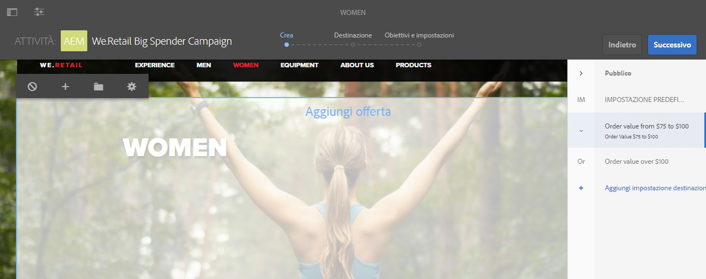

1. Tocca o fai clic sull’icona + .

   Il contenuto dell’offerta Predefinita viene utilizzato come offerta per l’esperienza corrente.

1. Tocca o fai clic sull’offerta per visualizzare il menu dell’offerta, quindi tocca o fai clic sull’icona di modifica.

   

1. Modifica il contenuto del componente.

#### Aggiunta di un’offerta da una libreria di offerte {#adding-an-offer-from-an-offer-library}

Aggiungi un’offerta dalla [libreria di offerte](/help/sites-authoring/offerlib.md) a un’esperienza. Puoi aggiungere tutte le offerte dalla libreria del marchio di cui attualmente stai eseguendo il targeting.

Non è possibile aggiungere offerte libreria all’esperienza predefinita.

1. Seleziona l’esperienza a cui aggiungere l’offerta.
1. Per visualizzare il menu del componente, tocca o fai clic sul componente di destinazione a cui stai aggiungendo l’offerta.

   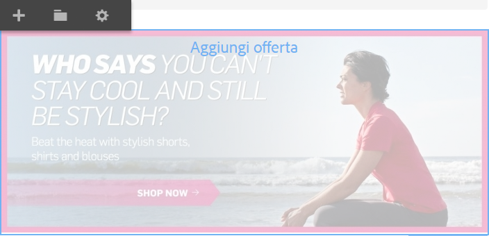

1. Tocca o fai clic sull’icona della cartella.

   

1. Seleziona l’offerta dalla libreria, quindi tocca o fai clic sull’icona a forma di segno di spunta.

   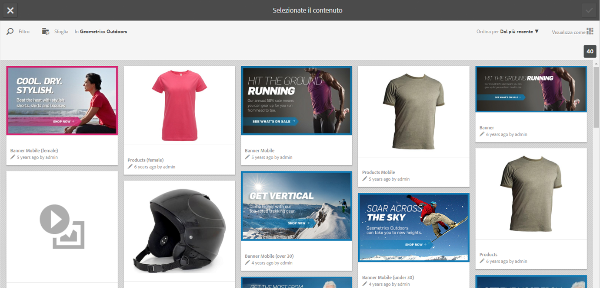

   Il selettore delle offerte consente di sfogliare o filtrare le offerte. Durante la navigazione o il filtraggio, è inoltre possibile ordinare le offerte e modificarne la modalità di visualizzazione. Il numero in alto a destra indica quante offerte sono disponibili nella libreria corrente.

   * Tocca o fai clic su **Sfoglia** per spostarti in un’altra cartella. Il pannello di navigazione si apre e puoi fare clic sulla freccia per analizzare in profondità le cartelle. Tocca o fai clic di nuovo su **Sfoglia** per chiudere il pannello di navigazione.

   

   * Tocca o fai clic su **Filtro** per filtrare le offerte in base a parole chiave o tag. Immetti le parole chiave e seleziona i tag dal menu a discesa. Tocca o fai clic su **Filtro** per chiudere nuovamente il riquadro di filtraggio.

   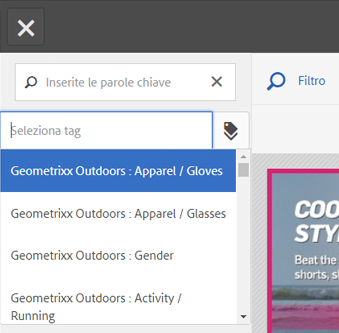

   * Puoi modificare l’ordine delle offerte toccando o facendo clic sulla freccia accanto a **Dal più recente al meno recente**. Le offerte possono essere ordinate dalla più recente alla meno recente o dalla meno recente alla più recente.

   

   Tocca o fai clic sull’icona accanto a **Visualizza** per visualizzare le offerte come miniature o come elenco.

   

#### Aggiunta di un’offerta personalizzata a una libreria {#adding-a-custom-offer-to-a-library}

Aggiungi un’offerta personalizzata al [libreria delle offerte](/help/sites-authoring/offerlib.md) quando desideri riutilizzarlo come offerta per più esperienze. Puoi aggiungere offerte alla libreria del brand corrente di cui stai eseguendo il targeting.

Per ulteriori informazioni sull’uso della console delle offerte per creare un’offerta riutilizzabile, consulta [Aggiunta di un’offerta a una libreria di offerte](/help/sites-authoring/offerlib.md#add-an-offer-to-an-offer-library).

1. Seleziona l’esperienza da visualizzare l’offerta personalizzata.
1. Tocca o fai clic sull’offerta personalizzata per visualizzare il menu dell’offerta, quindi tocca o fai clic su **Salva offerta nella libreria delle offerte** icona.

   

1. Digita un nome per l’offerta e seleziona la libreria a cui stai aggiungendo l’offerta, quindi tocca o fai clic sull’icona del segno di spunta.

#### Conversione di un’offerta dalla libreria in una libreria personalizzata {#converting-a-library-offer-to-a-custom-library}

Converti un’offerta dalla libreria in offerta personalizzata per modificare l’offerta per l’esperienza corrente e senza modificare l’offerta in altre esperienze.

1. Seleziona l’esperienza per visualizzare l’offerta dalla libreria.
1. Tocca o fai clic sull’offerta dalla libreria per visualizzare il menu dell’offerta, quindi tocca o fai clic sull’icona Converti in offerta in linea.

   

#### Modifica di un’offerta dalla libreria {#editing-a-library-offer}

Apri un’offerta dalla libreria da un’esperienza in modalità targeting per modificare l’offerta. Le modifiche apportate vengono visualizzate in tutte le esperienze che utilizzano l’offerta.

1. Seleziona l’esperienza per visualizzare l’offerta dalla libreria.
1. Converti l’offerta dalla libreria in offerta personalizzata/locale. Consulta [Convertire un’offerta dalla libreria in una libreria personalizzata](#converting-a-library-offer-to-a-custom-library).
1. Modifica il contenuto dell’offerta. 

1. Salvalo nuovamente nella libreria. Consulta [Aggiunta di un’offerta personalizzata a una libreria](#adding-a-custom-offer-to-a-library).

## Target: Configurazione dei tipi di pubblico {#target-configuring-the-audiences}

Passaggio di Target di [il processo di targeting](/help/sites-authoring/content-targeting-touch.md#the-targeting-process-create-target-and-goals-settings) prevede la mappatura dei tipi di pubblico con le esperienze con cui hai lavorato nel passaggio Crea . La pagina di targeting mostra il pubblico per ogni esperienza di cui stai eseguendo il targeting. Puoi specificare o modificare il pubblico per ogni esperienza. Se utilizzi Adobe Target, puoi anche creare test A/B che ti consentono di eseguire il targeting della percentuale di traffico di un pubblico per una particolare esperienza.

### Se utilizzi il targeting AEM o Adobe Target (targeting delle esperienze) ... {#if-you-are-using-aem-targeting-or-adobe-target-experience-targeting}

Il pubblico viene visualizzato sul lato sinistro del diagramma di mappatura, mentre le esperienze vengono visualizzate sul lato destro.

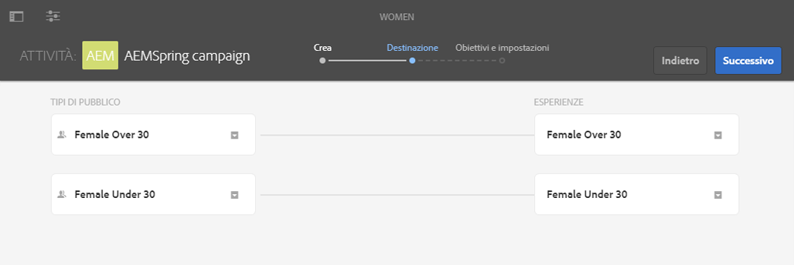

Definisci un pubblico utilizzando un segmento. La configurazione cloud per i parametri di pagina determina i segmenti a tua disposizione. Quando la pagina non è associata a una configurazione cloud di Adobe Target, per la definizione dei tipi di pubblico sono disponibili segmenti AEM. Quando la pagina è associata a una configurazione cloud di Adobe Target, puoi utilizzare i segmenti di Target.

Per informazioni sui motori di targeting, vedi [Motore di destinazione](/help/sites-authoring/personalization.md#targeting-engine).

Un pubblico non deve essere utilizzato da più di un’esperienza. Un simbolo di avviso viene visualizzato accanto a un’esperienza quando viene mappata a un pubblico mappato a un’altra esperienza.

### Associazione di esperienze con tipi di pubblico (AEM o Adobe Target) {#associating-experiences-with-audiences-aem-or-adobe-target}

Segui la procedura seguente per associare un’esperienza a un pubblico quando utilizzi AEM targeting (o targeting di esperienza Adobe Target):

1. Tocca o fai clic sulla freccia a discesa accanto nella casella del pubblico mappata all’esperienza.
1. (Facoltativo) Tocca o fai clic su **Modifica**, quindi digita una parola chiave per la ricerca del segmento desiderato.
1. Nell’elenco del pubblico, seleziona il pubblico e tocca o fai clic su **OK**.

### Se utilizzi i test A/B (Adobe Target) ... {#if-you-are-using-a-b-testing-adobe-target}

Se disponi di un’attività di test A/B, il pubblico è sulla tua sinistra, la percentuale di visualizzazione di ogni esperienza è al centro e le esperienze sono a destra.

È possibile modificare le percentuali fino al 100%. Un pubblico può essere utilizzato da più esperienze nel test A/B.

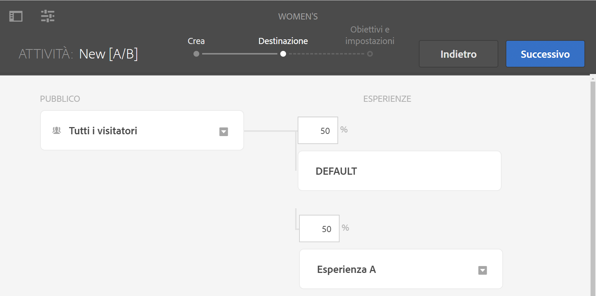

### Associazione di pubblico e percentuali di traffico con test A/B {#associating-audiences-and-traffic-percentages-with-a-b-testing}

1. Tocca o fai clic sulla casella a discesa accanto al pubblico mappato all’esperienza.
1. (Facoltativo) Fai clic su **Modifica**, quindi digita una parola chiave per cercare il segmento desiderato.
1. Tocca o fai clic su **OK.**
1. Immetti le percentuali per configurare in che modo il traffico del pubblico viene indirizzato a ciascuna esperienza. Il numero totale deve essere uguale a 100.
1. (Facoltativo) Modifica il nome dell’esperienza facendo clic sul menu a discesa accanto al nome dell’esperienza.

## Obiettivi e impostazioni: Configurazione dell’attività e definizione degli obiettivi {#goals-settings-configuring-the-activity-and-setting-goals}

La fase Obiettivi e impostazioni del [processo di targeting](/help/sites-authoring/content-targeting-touch.md#the-targeting-process-create-target-and-goals-settings) comporta la configurazione del comportamento dell’attività del marchio. Specifica quando l’attività inizia e termina, nonché la priorità dell’attività. Inoltre, puoi anche tenere traccia degli obiettivi. In particolare puoi decidere cosa desideri misurare con le attività.

Le metriche obiettivo sono disponibili solo se utilizzi Adobe Target per il motore di destinazione. È necessario definire almeno una metrica di obiettivo. Se Adobe Analytics è stato configurato e disponi di una configurazione cloud A4T Analytics, puoi scegliere se l’origine per la generazione di rapporti deve essere Adobe Target o Adobe Analytics.

Le metriche dell’obiettivo vengono misurate solo per la campagna pubblicata.

Se utilizzi AEM come motore di destinazione:

Se utilizzi Adobe Target come motore di targeting:

Se utilizzi Adobe Target come motore di targeting e disponi di A4T Analytics configurato per l’account, avrai accesso a un menu a discesa aggiuntivo **Origine per la generazione di rapporti**:

Sono disponibili le seguenti metriche di successo (utilizzate solo per la pubblicazione):

<table> 
 <tbody> 
  <tr> 
   <td><strong>Conversione</strong></td> 
   <td>
Percentuale di visitatori che hanno fatto clic su una qualsiasi parte dell’esperienza in fase di test. Una conversione può essere conteggiata una volta per ogni visitatore o ogni volta che un visitatore completa una conversione. La metrica di conversione è impostata su una delle seguenti opzioni:
 
    <ul> 
     <li><strong>Visualizzazione di una pagina</strong> - Puoi definire la pagina visualizzata dal pubblico selezionandone una <strong>L'URL è</strong> e quindi definisci l’URL o più URL, oppure selezionando <strong>L'URL contiene</strong> e quindi aggiungere un percorso o una parola chiave.</li> 
     <li><strong>Visualizzazione di una mbox</strong> - Puoi definire quale mbox ha visualizzato il tuo pubblico immettendo il nome della mbox. È possibile immettere più mbox facendo clic su <strong>Aggiungi una mbox</strong>.</li> 
    </ul> </td> 
  </tr> 
  <tr> 
   <td><strong>Ricavo</strong></td> 
   <td>
Entrate generate dalla visita. Puoi scegliere tra le seguenti metriche di ricavi:
 
    <ul> 
     <li>Ricavo per visitatore (RPV)</li> 
     <li>Valore medio dell'ordine (AOV)</li> 
     <li>Vendite totali </li> 
     <li>Ordini</li> 
    </ul> 
Per una qualsiasi di queste opzioni, se una mBox è stata visualizzata indica che l'obiettivo è stato raggiunto. Puoi definire la mbox o più mbox.
 </td> 
  </tr> 
  <tr> 
   <td><strong>Coinvolgimento</strong></td> 
   <td>
Puoi misurare tre tipi di coinvolgimento:
 
    <ul> 
     <li>Visualizzazioni pagina</li> 
     <li>Punteggio personalizzato</li> 
     <li>Tempo sul sito</li> 
    </ul> </td> 
  </tr> 
 </tbody> 
</table>

Inoltre, esistono impostazioni avanzate che ti consentono di determinare come calcolare le metriche di successo. Le opzioni includono il conteggio della metrica per impression o una volta per visitatore e la scelta se mantenere o meno l’utente nell’attività.

Utilizza le impostazioni avanzate per determinare cosa accade **dopo** un utente incontra la metrica di obiettivo. Nella tabella seguente sono illustrate le opzioni disponibili.

<table> 
 <tbody> 
  <tr> 
   <td><strong>Quando un utente si imbatte questa metrica di obiettivo...</strong></td> 
   <td><strong>Seleziona l’azione seguente...</strong></td> 
  </tr> 
  <tr> 
   <td><strong>Incrementa il conteggio e mantieni utente attivo</strong></td> 
   <td>Specifica come viene incrementato il conteggio: 
    <ul> 
     <li>Una volta per partecipante</li> 
     <li>A ogni impression, escluso l’aggiornamento della pagina</li> 
     <li>A ogni impression</li> 
    </ul> </td> 
  </tr> 
  <tr> 
   <td><strong>Incrementa il conteggio, rilascia l'utente e consenti reinserimento</strong></td> 
   <td>Seleziona l’esperienza che il visitatore vede se accede nuovamente all’attività: 
    <ul> 
     <li>Stessa esperienza</li> 
     <li>Esperienza casuale</li> 
     <li>Esperienza invisibile</li> 
    </ul> </td> 
  </tr> 
  <tr> 
   <td><strong>Incrementa il conteggio, rilascia l'utente e impedisci nuovo accesso</strong></td> 
   <td>Determina cosa vede l’utente al posto del contenuto dell’attività: 
    <ul> 
     <li>Stessa esperienza, senza tracciamento</li> 
     <li>Contenuto predefinito o altro contenuto dell’attività</li> 
    </ul> </td> 
  </tr> 
 </tbody> 
</table>

Vedi [Documentazione di Adobe Target](https://experienceleague.adobe.com/docs/target/using/activities/success-metrics/success-metrics.html?lang=it) per ulteriori informazioni sulle metriche di successo.

### Configurazione delle impostazioni (targeting AEM) {#configuring-settings-aem-targeting}

Per configurare le impostazioni utilizzando AEM targeting:

1. Per specificare quando l’attività viene avviata, utilizza la variabile **Inizio** menu a discesa per selezionare uno dei seguenti valori:

   * **Quando è attivato**: L’attività viene avviata quando la pagina contenente il contenuto con targeting viene attivata.
   * **Data e ora specificata**: un tempo specifico. Quando selezioni questa opzione, fai clic o tocca l’icona del calendario, seleziona una data e specifica l’ora in cui avviare l’attività.

1. Per specificare quando l’attività termina, utilizza la **Fine** menu a discesa per selezionare uno dei seguenti valori:

   * **Quando viene disattivato**: L’attività termina quando la pagina contenente il contenuto di destinazione viene disattivata.
   * **Data e ora specificata**: un tempo specifico. Quando selezioni questa opzione, tocca o fai clic sull’icona del calendario, seleziona una data e specifica l’ora in cui terminare l’attività.

1. Per specificare una priorità per l’attività, utilizza il cursore per selezionare uno dei due **Basso**, **Normale** oppure **Alta**.

### Configurazione di obiettivi e impostazioni (Adobe Target) {#configuring-goals-settings-adobe-target}

Per configurare obiettivi e impostazioni utilizzando Adobe Target:

1. Per specificare quando l’attività viene avviata, utilizza la variabile **Inizio** menu a discesa per selezionare uno dei seguenti valori:

   * **Quando è attivato**: L’attività viene avviata quando la pagina contenente il contenuto con targeting viene attivata.
   * **Data e ora specificata**: un tempo specifico. Quando selezioni questa opzione, fai clic o tocca l’icona del calendario, seleziona una data e specifica l’ora in cui avviare l’attività.

1. Per specificare quando l’attività termina, utilizza la **Fine** menu a discesa per selezionare uno dei seguenti valori:

   * **Quando viene disattivato**: L’attività termina quando la pagina contenente il contenuto di destinazione viene disattivata.
   * **Data e ora specificata**: un tempo specifico. Quando selezioni questa opzione, tocca o fai clic sull’icona del calendario, seleziona una data e specifica l’ora in cui terminare l’attività.

1. Per specificare una priorità per l’attività, utilizza il cursore per selezionare uno dei due **Basso**, **Normale** oppure **Alta**.
1. Se hai configurato Adobe Analytics con il tuo account Adobe Target, viene visualizzata la **Origine per i rapporti** menu a discesa. Seleziona **Adobe Target** o **Adobe Analytics** come origine.

   Se si seleziona **Adobe Analytics**, seleziona la società e la suite di rapporti. Se si seleziona **Adobe Target**, non è richiesta alcuna azione.

   

1. Da **Obiettivo principale**, vai all’area **Metrica per obiettivo** e seleziona la metrica di successo che desideri monitorare: Conversione, Entrate, Coinvolgimento. Quindi inserisci come viene misurata la metrica (o quale azione intraprende l’audience per indicare che un obiettivo è stato raggiunto). Vedi la definizione delle metriche dell’obiettivo nella tabella precedente e consulta la [documentazione di Adobe Target](https://experienceleague.adobe.com/docs/target/using/activities/success-metrics/success-metrics.html?lang=it) sulle metriche di successo.

   Per rinominare l’obiettivo, fai clic sui tre punti nell’angolo in alto a destra e seleziona **Rinomina**.

   Per cancellare tutti i campi, fai clic sui tre punti nell’angolo superiore destro e seleziona **Cancella tutti i campi**.

   Puoi definire anche tutte le metriche con impostazioni avanzate. Seleziona **Impostazioni avanzate** per accedervi. Vedi la definizione del conteggio delle metriche di successo nella tabella precedente e consulta la [documentazione di Adobe Target](https://experienceleague.adobe.com/docs/target/using/activities/success-metrics/success-metrics.html?lang=it).

   >[!NOTE]
   Devi avere almeno un obiettivo definito.

   

   >[!NOTE]
   Se mancano informazioni nella metrica, una linea rossa circonda la metrica.

1. Fai clic su **Aggiungere una nuova metrica** per configurare ulteriori metriche di successo.

   

   >[!NOTE]
   Per rimuovere obiettivi aggiuntivi, tocca o fai clic sui tre punti e tocca o fai clic su . **Elimina**. AEM necessario che sia definito almeno un obiettivo.

1. Se desideri maggiore controllo sul conteggio delle metriche di successo, tocca o fai clic su **Impostazioni avanzate** per accedere a queste impostazioni.
1. Fai clic su **Salva**.

Dopo la configurazione, puoi [visualizzare le prestazioni delle attività](/help/sites-authoring/activitylib.md#viewing-performance-and-converting-winning-experiences-a-b-test) che utilizzano Adobe Target (sia per l’esperienza che per il targeting di test A/B). Inoltre, con il targeting del test A/B, puoi [convertire i vincitori.](/help/sites-authoring/activitylib.md#viewing-performance-and-converting-winning-experiences-a-b-test)

## Simulazione di un’esperienza {#simulating-an-experience}

Simula l’esperienza di un visitatore per verificare che il contenuto della pagina appaia come previsto in base alla progettazione del contenuto di destinazione. Durante la simulazione, carica diversi profili utente e visualizza il contenuto di destinazione per quell’utente.

I seguenti criteri determinano il contenuto visualizzato durante la simulazione dell’esperienza di un visitatore:

* I dati nell’archivio delle sessioni dell’utente (tramite Context Hub).
* La [Attività in corso](/help/sites-authoring/activitylib.md).
* La [regole che definiscono i segmenti](/help/sites-administering/campaign-segmentation.md).
* Contenuto delle esperienze nei componenti di Target.
* La [configurazione del motore di targeting](/help/sites-authoring/activitylib.md).

Se sulla pagina viene visualizzato contenuto imprevisto al caricamento di un profilo, controlla la configurazione di ogni elemento dell’elenco.

>[!NOTE]
Se utilizzi il test A/B, quando si simulano le esperienze vengono visualizzate in base alla percentuale di traffico. Questa funzione è controllata da Adobe Target, che può causare risultati imprevisti per gli autori. L’attività _author viene sincronizzata con impostazioni specifiche che consentono una nuova valutazione durante la simulazione. Gli autori potrebbero dover aggiornare per visualizzare le altre esperienze in base alle impostazioni del traffico.

Per simulare l’esperienza del visitatore, utilizza i seguenti strumenti:

* Attività di simulazione in modalità Targeting: Nella pagina vengono visualizzate le offerte per l’utente attualmente selezionato in Context Hub. Puoi modificare le offerte con targeting per l’utente.
* Modalità Anteprima: Utilizza Context Hub per selezionare gli utenti e le posizioni che soddisfano i criteri dei segmenti su cui si basano le tue esperienze. Quando le selezioni di Context Hub cambiano, il contenuto di destinazione cambia di conseguenza.

1. Per passare alla modalità anteprima, sulla barra degli strumenti tocca o fai clic su **Anteprima**.
1. Nella barra degli strumenti, tocca o fai clic sull’icona centrale di Context Hub.

   

1. Utilizza Context Hub per modificare le proprietà del contesto. Ad esempio, tocca o fai clic sulla proprietà Persona per selezionare un altro utente.

   

   La pagina viene modificata per mostrare il contenuto di destinazione per il contesto corrente.

1. Per apportare modifiche alle offerte visualizzate, passa alla modalità di targeting. Con l’attività di simulazione selezionata, modifica le offerte per il contesto configurato in modalità Anteprima.

## Configurazione delle opzioni del componente Target {#configuring-target-component-options}

Puoi personalizzare il componente Target accedendo alle opzioni del componente in uno dei due modi seguenti:

1. Dopo aver eseguito il targeting del componente, nel componente Target tocca o fai clic sul componente e quindi sull’icona delle impostazioni (ingranaggio).

   

   AEM mostra la finestra delle opzioni del componente Target.

   

1. In alternativa, per accedere a queste impostazioni in modalità a schermo intero, nella finestra delle opzioni del componente Target, tocca o fai clic sull’icona a schermo intero.

   

   AEM mostra la finestra delle opzioni del componente Target a schermo intero.

   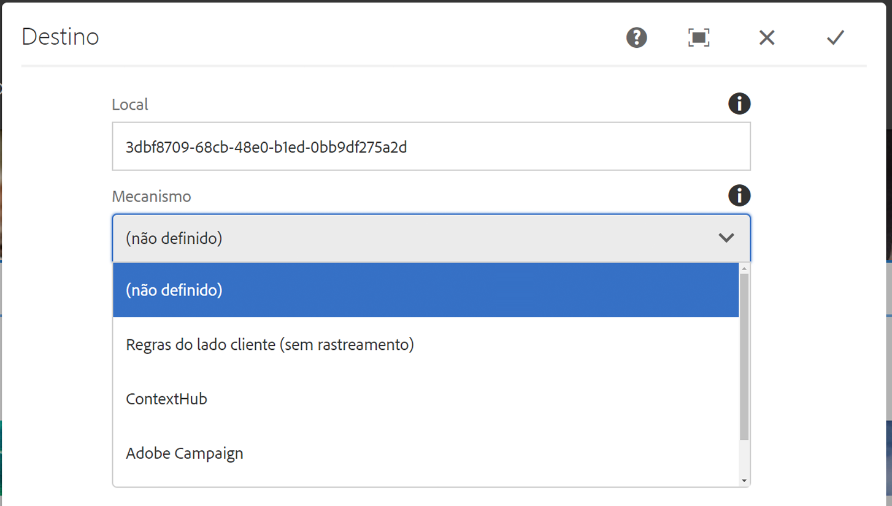

1. Configura le impostazioni del componente Target come descritto nelle tabelle seguenti.

<table> 
 <tbody> 
  <tr> 
   <td><strong>Opzione</strong></td> 
   <td><strong>Descrizione</strong></td> 
  </tr> 
  <tr> 
   <td><strong>Dove si trova</strong></td> 
   <td>
La posizione è una stringa che assegna un nome alla posizione del contenuto di destinazione e collega le offerte con i punti (o posizioni o componenti) della pagina in cui tali offerte devono essere posizionate.
 
Questo campo è un valore generico.
 
Se inserisci un’offerta in un componente, l’offerta ricorda l’ID della posizione. Quando la pagina viene eseguita, il motore valuta i segmenti dell’utente e, in base a questo, risolve le esperienze dalle campagne attive da visualizzare. Poi controlla gli ID di posizione sulla pagina e cerca di far corrispondere le offerte con gli ID di posizione a loro.
 </td> 
  </tr> 
  <tr> 
   <td><strong>Motore</strong></td> 
   <td>Seleziona tra <strong>Regole lato client (senza monitoraggio), Adobe Target, ContextHub, </strong>e<strong> Adobe Campaign </strong>a seconda del motore che si desidera utilizzare.</td> 
  </tr> 
 </tbody> 
</table>

Se hai selezionato Adobe Target come motore:

<table> 
 <tbody> 
  <tr> 
   <td><strong>Opzione</strong></td> 
   <td><strong>Descrizione</strong></td> 
  </tr> 
  <tr> 
   <td><strong>Impostazione destinazione precisa</strong></td> 
   <td>
L’abilitazione di un targeting accurato indica al componente di attendere che i dati contestuali o del context hub siano disponibili prima di inviare la richiesta ad Adobe Target. Può aumentare il tempo di caricamento. Per la creazione, il targeting accurato è sempre abilitato.
 
Se selezioni la <strong>Targeting accurato</strong> casella di controllo, la mbox esegue un <code>mboxDefine</code> primo e un <code>mboxUpdate</code> in seguito si ottiene una richiesta Ajax una volta che i dati sono disponibili.
 
Se non selezioni la <strong>Targeting accurato</strong> casella di controllo, la mbox esegue un <code>mboxCreate</code> dando luogo immediatamente a una richiesta sincrona (in questo caso, non tutti i dati contestuali potrebbero essere ancora disponibili).
 
<strong>Nota:</strong> L’abilitazione o la disabilitazione del targeting accurato su un componente specifico non influisce sulle impostazioni impostate a livello globale. Puoi sempre ignorare le impostazioni globali selezionando Targeting accurato nel componente.
 </td> 
  </tr> 
  <tr> 
   <td><strong>Includi segmenti risolti</strong></td> 
   <td>
La selezione di questa casella di controllo include tutti i segmenti risolti nella chiamata mBox e tutti i parametri configurati nella pagina e nel framework.
 
Questo funziona solo in situazioni con API XML dove stai sincronizzando i segmenti AEM. Se disponi di segmenti in AEM che non vengono gestiti da Adobe Target (come i segmenti di script), questa opzione consente di risolvere il segmento in AEM e segnalare ad Adobe Target che il segmento è attivo.
 </td> 
  </tr> 
  <tr> 
   <td><strong>Parametri di contesto ereditati</strong></td> 
   <td>Elenca i parametri di contesto ereditati dal framework Adobe Target, se presenti, associati alla pagina selezionata.</td> 
  </tr> 
  <tr> 
   <td><strong>Parametri di contesto</strong></td> 
   <td>Tocca o fai clic su <strong>Aggiungi campo</strong> per configurare parametri di contesto aggiuntivi (come quelli disponibili nel framework di Target). Si applicano i parametri di contesto aggiunti al componente <i>only</i> al componente e non a un altro componente come accadrebbe se si aggiungessero parametri di contesto direttamente al framework.</td> 
  </tr> 
  <tr> 
   <td><strong>Parametri statici</strong></td> 
   <td>Tocca o fai clic su <strong>Aggiungi campo</strong> per configurare parametri statici aggiuntivi (come quelli disponibili nel framework di Target). I parametri statici aggiunti al componente si applicano <i>only</i> al componente e non a un altro componente come accadrebbe se si aggiungessero parametri statici direttamente al framework. I parametri statici non sono contenuti nel contesto (contesto cliente del Content Hub).</td> 
  </tr> 
 </tbody> 
</table>

>[!NOTE]
Quando selezioni un componente e lo rendi idoneo per il targeting, AEM sostituisce anche il componente e inserisce un componente Adobe Target. Il componente Adobe Target non viene utilizzato solo quando lo aggiungi manualmente alla pagina, ma anche quando esegui il targeting di un componente esistente.

Se selezioni Contesto client (lato client) come motore:

<table> 
 <tbody> 
  <tr> 
   <td><strong>Opzione</strong></td> 
   <td><strong>Descrizione</strong></td> 
  </tr> 
  <tr> 
   <td><strong>Opzioni per lato client - Strategia</strong></td> 
   <td>
Seleziona una delle seguenti opzioni:
 
    <ul> 
     <li><strong>Primo</strong>: L’esperienza più in alto nell’elenco, come ordinato nella campagna.</li> 
     <li><strong>Casuale</strong>: Viene utilizzata qualsiasi esperienza.</li> 
     <li><strong>Punteggio clickstream</strong>: Vengono utilizzati i tag e gli hit tag correlati tracciati nel contesto client. Vengono confrontate le percentuali di hit per i tag definiti nella pagina teaser.</li> 
    </ul> </td> 
  </tr> 
 </tbody> 
</table>

Seleziona **Adobe Campaign** come motore se stai integrando AEM con Adobe Campaign. Vedi [Integrazione di AEM con Adobe Campaign](/help/sites-administering/campaign.md) per ulteriori informazioni.

Seleziona **ContextHub** come motore se stai utilizzando ContextHub per il targeting. Vedi [Configurazione di ContextHub.](/help/sites-administering/contexthub-config.md)
