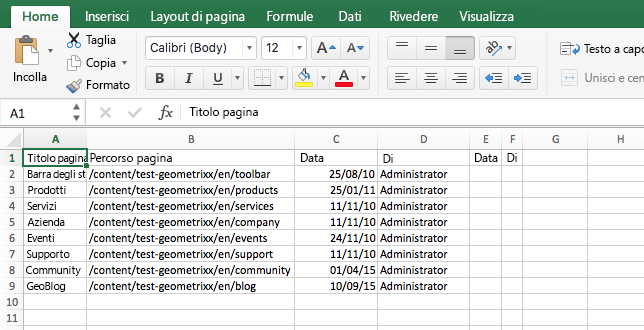
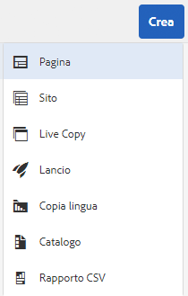
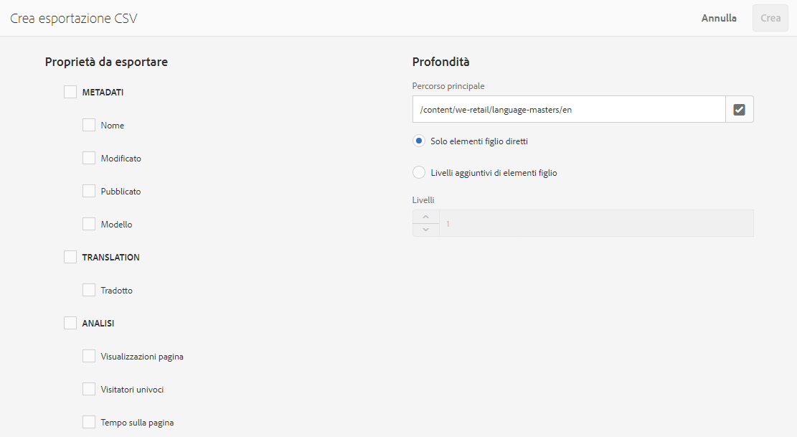

# Esportazione in formato CSV{#export-to-csv}

L’opzione **Crea esportazione CSV** consente di esportare le informazioni sulle pagine in un file CSV nel sistema locale.

* Il nome del file scaricato è `export.csv`
* Il contenuto dipende dalle proprietà che erano state selezionate.
* Puoi definire il percorso e il livello di profondità dell’esportazione.

>[!NOTE]
>
>Viene usata la funzione di download e la destinazione predefinita del browser in uso.

La procedura guidata Crea esportazione CSV consente di selezionare:

* Proprietà da esportare

   * Metadati

      * Modificato
      * Pubblicato
   * Analisi

      * Visualizzazioni pagina
      * Visitatori univoci
      * Tempo sulla pagina

* Profondità

   * Percorso principale
   * Solo elementi figlio diretti
   * Livelli aggiuntivi di elementi figlio
   * Livelli

Il file `export.csv` risultante può essere aperto in Excel o in un’altra applicazione compatibile.

The create **CSV Export** option is available when browsing the **Sites** console (in List view): it is an option of the **Create** drop down menu:

Per creare un’esportazione CSV:

1. Apri la console **Sites** e passa alla posizione desiderata, se necessario.
1. From the toolbar, select **Create** then **CSV Export** to open the wizard:

   

1. Seleziona le proprietà da esportare.
1. Seleziona **Crea**.

