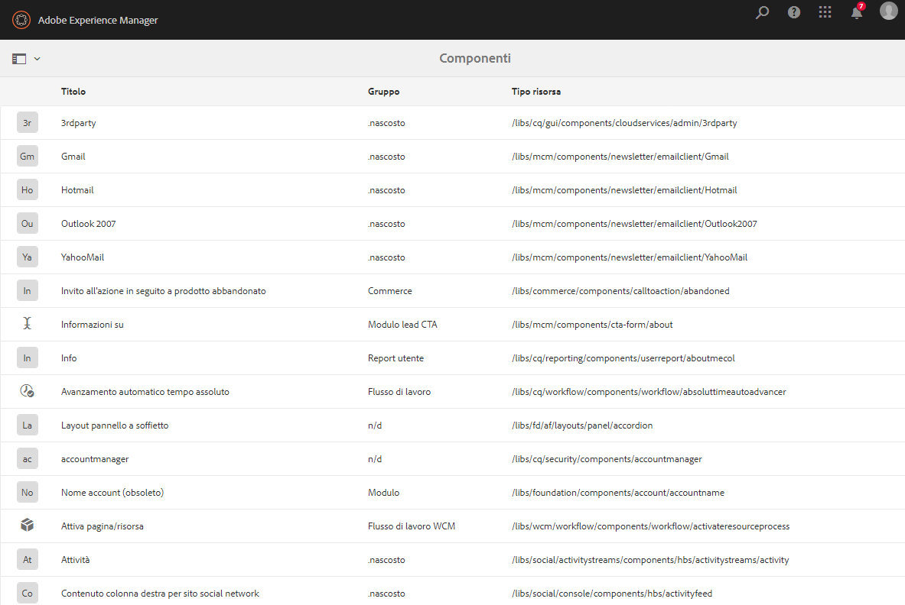
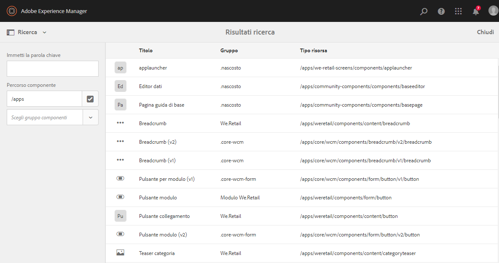
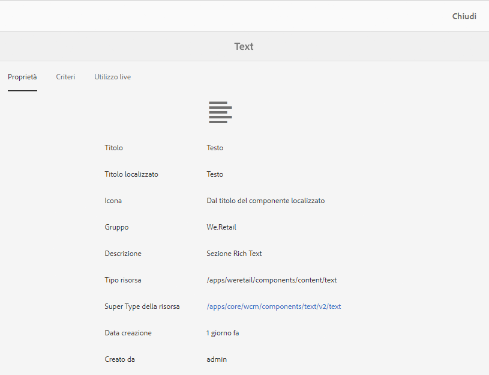
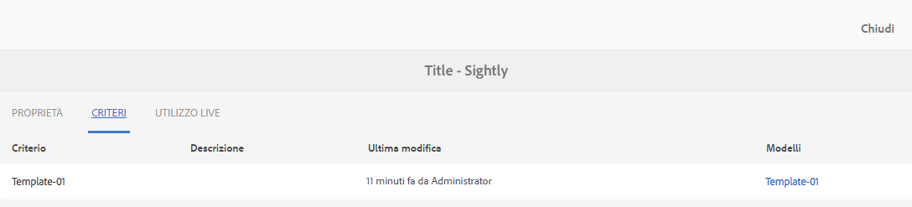
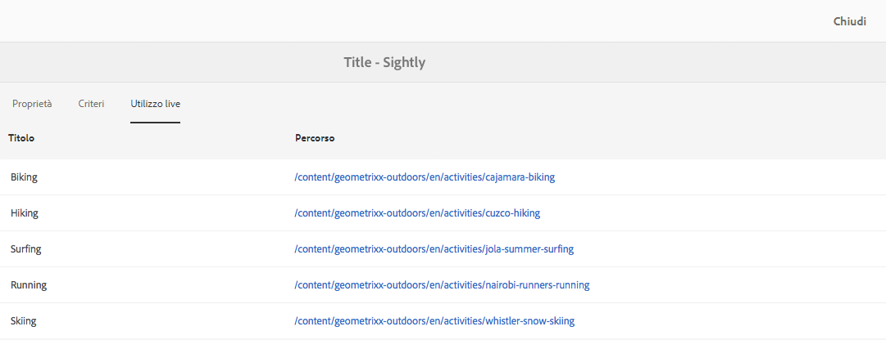
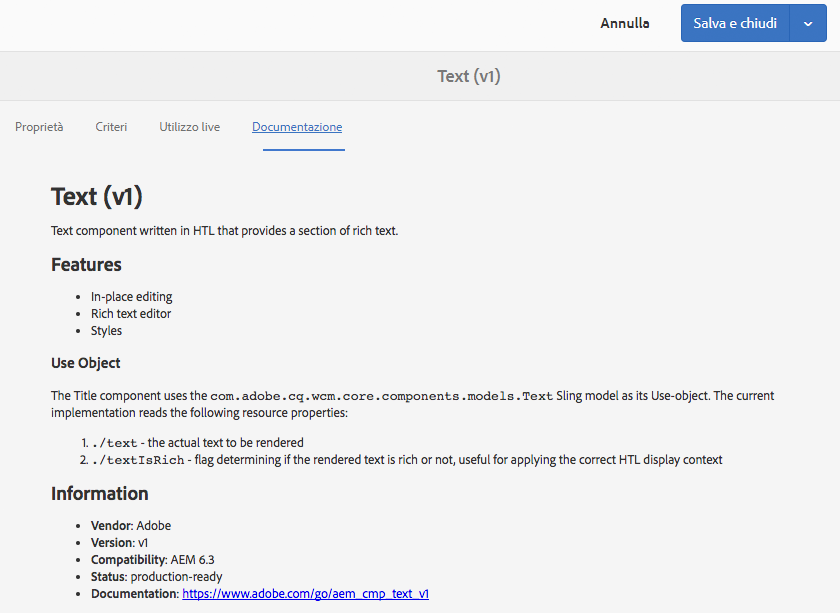

# Console Componenti{#components-console}

La console Componenti consente di consultare tutti i componenti definiti nell’istanza e di visualizzare le informazioni chiave di ciascun componente.

It can be accessed from **Tools** -> **General** -> **Components**. Nella console sono disponibili le viste a schede e a elenco. Poiché non esiste una struttura ad albero per i componenti, la vista a colonne non è disponibile.

>[!NOTE]
>
>La console dei componenti mostra tutti i componenti del sistema. Il [browser Componenti](/help/sites-authoring/author-environment-tools.md#components-browser) mostra i componenti disponibili agli autori e nasconde eventuali gruppi di componenti che iniziano con un punto ( `.`).

## Ricerca {#search-features}

Dall’icona **Solo contenuto** (in alto a sinistra) puoi aprire il pannello **Ricerca** per cercare e/o filtrare i componenti:

## Dettagli componente {#component-details}

Per visualizzare i dettagli relativi a un componente specifico, tocca/fai clic sulla risorsa desiderata. Sono disponibili tre schede:

* **Proprietà**

   

   Nella scheda Proprietà puoi:

   * Visualizzare le proprietà generali del componente.
   * Visualizzare come è stata definita [l’icona o l’abbreviazione](/help/sites-developing/components-basics.md#component-icon-in-touch-ui) per il componente.

      * Facendo clic sull’origine dell’icona passerai al relativo componente.
   * Visualizzare il **tipo di risorsa** e il **Super Type della risorsa** (se definito) per il componente.

      * Facendo clic su Super Type della risorsa passerai al relativo componente.
   >[!NOTE]
   >
   >Because `/apps` is not editable at runtime, the Components Console is read-only.

* **Criteri**

   

* **Utilizzo live**

   

   >[!CAUTION]
   >
   >A causa della natura delle informazioni raccolte, può essere necessario qualche momento per combinarle e visualizzarle.

* **Documentazione**

   Se lo sviluppatore ha fornito la [documentazione per il componente](/help/sites-developing/developing-components.md#documenting-your-component), questa viene visualizzata nella scheda **Documentazione**. Se non è presente documentazione, la scheda **Documentazione** non verrà visualizzata.

   

