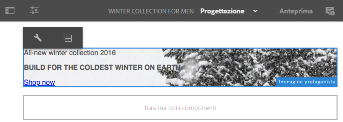
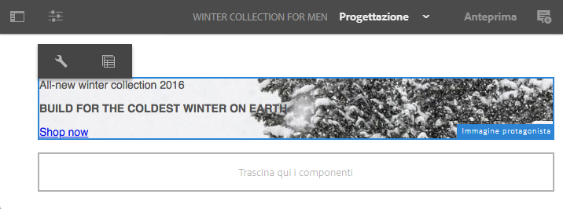
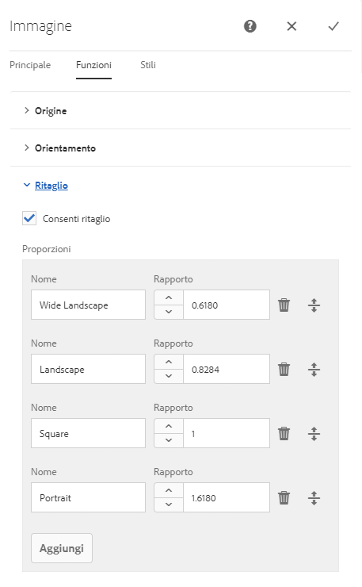

# Configurazione dei componenti in modalità Progettazione{#configuring-components-in-design-mode}

Quando si installa un’istanza di AEM out-of-the-box, nel browser Componenti è immediatamente disponibile una serie di componenti.

In addition to these, various other components are also available. You can use Design mode to [enable/disable such components](#enable-disable-components). When enabled and located on your page you can then use Design mode to [configure aspects of the component design](#configuring-the-design-of-a-component) by editing the attribute parameters.

>[!NOTE]
>
>Quando modifichi tali componenti, presta molta attenzione. Le impostazioni sono spesso una parte integrante della progettazione dell’intero sito Web e dovrebbero essere modificate solo da un utente con la necessaria esperienza e con le relative autorizzazioni, ad esempio un amministratore o sviluppatore. Per ulteriori informazioni, consulta [Sviluppo di componenti](/help/sites-developing/components.md).

>[!NOTE]
>
>La modalità Progettazione è disponibile solo per i modelli statici. I modelli creati con modelli modificabili devono essere modificati mediante l’[editor modelli](/help/sites-authoring/templates.md).

>[!NOTE]
>
>La modalità Progettazione è disponibile solo per le configurazioni del progetto memorizzate come contenuto sotto ( `/etc`).
>
>Starting in AEM 6.4, it is recommended to store designs as configuration data under `/apps` to support continuous deployment scenarios. Designs stored under `/apps` are not editable at runtime and the Design mode will not be available to non-admin users for such templates.

Questo comporta l’aggiunta o la rimozione dei componenti consentiti nel sistema di paragrafi per la pagina. Anche il sistema di paragrafi (`parsys`) stesso è un componente, che contiene gli altri componenti paragrafo. Il sistema di paragrafi consente agli autori di aggiungere a una pagina componenti di tipi diversi e contiene tutti gli altri componenti paragrafo. Ciascun tipo di paragrafo è rappresentato da un componente.

Ad esempio, il contenuto di una pagina prodotto può contenere quanto segue:

* Un’immagine del prodotto (sotto forma di immagine o paragrafo testo e immagine)
* La descrizione del prodotto (come paragrafo testo)
* Una tabella con dati tecnici (come un paragrafo tabella)
* Un modulo che può essere compilato dagli utenti (come paragrafo inizio modulo, elemento modulo e fine modulo)

>[!NOTE]
>
>Per ulteriori informazioni su , consulta [Sviluppo di componenti](/help/sites-developing/dev-guidelines-bestpractices.md#guidelines-for-using-templates-and-components) e `parsys`Linee guida per l’utilizzo di modelli e componenti.

>[!CAUTION]
>
>La modifica del design con la modalità Progettazione descritta in questo articolo rappresenta il metodo consigliato per definire i progetti dei modelli statici
>
>Ad esempio, la modifica dei progetti in CRX DE non è consigliata e l’applicazione di tali progetti può variare da un comportamento all’altro. Per ulteriori informazioni, consulta il documento per sviluppatori [Modelli di pagina - Statici](/help/sites-developing/page-templates-static.md#how-template-designs-are-applied).

## Attivare o disattivare componenti {#enable-disable-components}

Per attivare o disattivare un componente:

1. Seleziona la modalità **Progettazione**:

   

1. Tocca o fai clic su un componente. Quando è selezionato, il componente è evidenziato da un bordo blu.

   

1. Click or tap the **Parent** icon.

   

   Viene selezionato il sistema di paragrafi contenente il componente corrente.

1. Nella barra delle azioni dell’elemento padre viene visualizzata l’icona **Configura**. 

   

   Selezionala per aprire la relativa finestra di dialogo.

1. Nella finestra di dialogo, definisci i componenti disponibili nel browser dei componenti durante la modifica della pagina corrente:

   

   La finestra di dialogo contiene due schede:

   * Componenti consentiti
   * Impostazioni
   **Componenti consentiti**

   On the **Allowed Components** tab, you define which components are available for the parsys.

   * I componenti sono raggruppati in base ai gruppi di componenti, che possono essere espansi e ridotti.
   * Per selezionare tutti i componenti di un gruppo, attiva la casella del nome del gruppo; per deselezionare tutti i componenti di un gruppo, disattiva questa casella.
   * Se la casella contiene un meno (-) significa che è selezionato almeno un elemento del gruppo, ma non tutti.
   * È disponibile un sistema di ricerca per filtrare i componenti in base al nome.
   * Il numero a destra del nome di un gruppo di componenti indica quanti sono i componenti selezionati in tale gruppo, a prescindere dal filtro.
   Definisci la configurazione di ogni componente di pagina. Se le pagine figlie usano lo stesso modello e/o lo stesso componente di pagina (generalmente allineato), la stessa configurazione sarà applicata al sistema di paragrafi corrispondente.

   >[!NOTE]
   >
   >I componenti per modulo adattivo sono progettati per funzionare nel contenitore per moduli adattivo e sfruttare l’ecosistema Moduli. Di conseguenza, questi componenti devono essere utilizzati solo nell’editor di moduli adattivi e non funzionano nell’editor pagine dell’ambiente Sites.

   **Impostazioni**

   Nella scheda **Impostazioni** puoi definire opzioni aggiuntive, ad esempio per disegnare un ancoraggio per ciascun componente e definire il margine delle celle di ciascun contenitore.

1. Select **Done** to save your configuration.

## Configurare l’aspetto di un componente {#configuring-the-design-of-a-component}

1. Seleziona la modalità **Progettazione**:

   

1. Tocca o fai clic su un componente con bordo blu. In questo esempio è selezionato un componente immagine protagonista.

   

1. Utilizza l’icona **Configura** per aprire la finestra di dialogo. 

   

   Nella finestra di dialogo Progettazione, potete configurare il componente in base ai parametri di progettazione disponibili.

   

   La finestra di dialogo contiene tre schede:

   * Principale
   * Funzioni
   * Stili
   **Proprietà**

   La scheda **Proprietà** consente di configurare i parametri di progettazione principali del componente. Ad esempio, per un componente immagine puoi definire la dimensione massima e minima consentita dell’immagine.

   **Funzioni**

   La scheda **Funzioni** consente di abilitare o disabilitare funzioni aggiuntive del componente. Ad esempio, per un componente immagine puoi definire l’orientamento, le opzioni di ritaglio disponibili e se un’immagine può essere caricata.

   **Stili**

   La scheda **Stili** consente di definire le classi CSS e gli stili da utilizzare con il componente.

   

   Utilizza il pulsante **Aggiungi** per aggiungere altre voci a un elenco di più voci.

   

   Utilizzate l&#39;icona** Elimina **per rimuovere una voce da un elenco di più voci.

   

   Utilizza l’icona **Sposta** per cambiare l’ordine delle voci in un elenco di più voci.

   

1. Tocca o fai clic sull’icona **Fine** per salvare e chiudere la finestra di dialogo.

